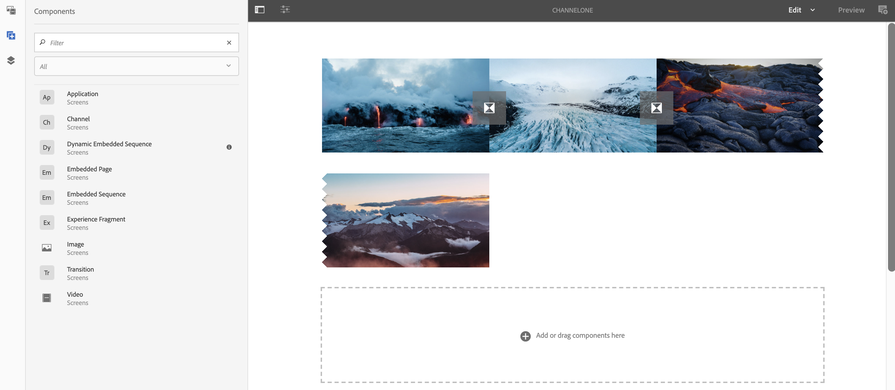

# Adición de componentes a un canal{#adding-components-to-a-channel}

AEM Los componentes son los elementos fundamentales de la experiencia de la (Adobe Experience Manager). Puede utilizar varios componentes y añadirlos al canal en un proyecto de AEM Screens.

## Componentes en AEM Screens {#components-in-aem-screens}

AEM Screens AEM proporciona diferentes componentes de la que se pueden utilizar en un proyecto de Screens.

### Visualización de componentes de AEM Screens {#viewing-aem-screens-components}

Siempre que cree un proyecto de AEM Screens, verá una lista de componentes predeterminados que se pueden agregar al proyecto.

Para ver los componentes predeterminados del proyecto de Pantallas, siga los pasos a continuación:

1. Seleccione el canal. Por ejemplo, **`We.Retail In Store`** > **Canales** > **Canal inactivo**.

1. Seleccionar **Editar** de la barra de acciones.
1. AEM En el Editor de, seleccione **+** de la barra lateral.
1. Se muestran todos los componentes que se incluyen de forma predeterminada en un proyecto de AEM Screens, como se muestra en la figura siguiente.

### Agregar un nuevo componente {#adding-a-new-component}

AEM La ofrece otros componentes. Siempre puede añadir otros componentes (no incluidos de forma predeterminada) al proyecto, ya que son compatibles con AEM Screens.

El siguiente ejemplo muestra la adición de un componente Livefyre a un proyecto de AEM Screens:

1. Seleccione el canal en el que desea añadir un componente. Por ejemplo, **`We.Retail In Store`** > **Canales** > **Canal inactivo**.

1. Seleccionar **Editar** de la barra de acciones.
1. Seleccionar **Diseño** modo.
1. Seleccione todo el editor de diseño a la derecha y seleccione el símbolo de configuración para poder abrir **Diseño de Parsys** Cuadro de diálogo.
1. Puede seleccionar los componentes que desea importar a su proyecto de AEM Screens. El siguiente ejemplo muestra la adición de **Livefyre** a un proyecto de AEM Screens.

>[!NOTE]
>
>Del mismo modo, puede agregar al proyecto cualquier otro número de componentes nuevos que sean compatibles con AEM Screens.

## AEM Explicación de los componentes de pantalla {#understanding-aem-screen-components}

En la siguiente sección se explican los componentes de AEM Screens que puede utilizar en el proyecto.

>[!NOTE]
>
>Para ver las propiedades de cualquier componente, seleccione el componente y seleccione el icono de martillo para abrir o ver las propiedades.

### Aplicación {#application}

El **Aplicación** Este componente permite añadir una aplicación al canal.

El componente de aplicación tiene las siguientes propiedades:

| **Propiedad** | **Descripción** |
|---|---|
| ***Ruta de aplicación*** | Seleccione la ruta absoluta en la que existe la aplicación. |
| ***Duración (milisegundos)*** | Seleccione la duración de la aplicación. De forma predeterminada, la duración se establece en -1, lo que significa que el elemento se ejecuta para siempre (es decir, aplicación de una sola página). Al establecer el valor de duración >0, se muestra el elemento para la duración especificada y, a continuación, se pasa al siguiente. |

El siguiente ejemplo muestra cómo incrustar un componente de aplicación junto con la vista previa de sus propiedades:

>[!NOTE]
>
>Consulte el ejemplo anterior para ver las propiedades de cada uno de los componentes siguientes.

### Canal {#channel}

El **Canal** Este componente le permite añadir un canal completo al proyecto.

El componente Canal tiene las siguientes propiedades:

<table>
 <tbody>
  <tr>
   <td><strong>Propiedad</strong></td>
   <td><strong>Descripción</strong></td>
  </tr>
  <tr>
   <td><strong><em>Ruta de canal</em></strong></td>
   <td>Seleccione esta ruta absoluta donde existe la aplicación.  </td>
  </tr>
  <tr>
   <td><strong><em>Duración (milisegundos)</em></strong></td>
   <td>Seleccione toda la duración del canal. Si establece la duración como -1, indica que el canal incrustado se ejecuta a toda su longitud en un canal concreto.</td>
  </tr>
 </tbody>
</table>

### Página integrada {#embedded-page}

Un **Página integrada** permite añadir una página incrustada al proyecto. Por ejemplo, puede ser una aplicación web o un catálogo de productos.

La página incrustada tiene las siguientes propiedades:

<table>
 <tbody>
  <tr>
   <td><strong>Propiedad</strong></td>
   <td><strong>Descripción</strong></td>
  </tr>
  <tr>
   <td><strong><em>Ruta de página  </em></strong></td>
   <td>Seleccione esta ruta absoluta donde existe el canal.  </td>
  </tr>
  <tr>
   <td><strong><em>Duración (milisegundos)</em></strong></td>
   <td>Seleccione toda la duración del canal. Si establece la duración como -1, indica que el canal incrustado se ejecuta a toda su longitud en un canal concreto.</td>
  </tr>
 </tbody>
</table>

### Secuencia integrada {#embedded-sequence}

>[!NOTE]
>
>Para obtener información detallada sobre las secuencias incrustadas, consulte [Secuencias incrustadas](embedded-sequences.md) en la sección Creación de pantallas.

Una secuencia incrustada permite agregar un canal de secuencia incrustado dentro del canal existente (con otros recursos).

La secuencia incrustada tiene las siguientes propiedades de página:

<table>
 <tbody>
  <tr>
   <td><strong>Propiedad</strong></td>
   <td><strong>Descripción</strong></td>
  </tr>
  <tr>
   <td>Ruta de canal</td>
   <td>Seleccione la ruta absoluta de la secuencia que desea incluir en el canal.  </td>
  </tr>
  <tr>
   <td><strong><em>Duración (milisegundos)</em></strong></td>
   <td>Seleccione toda la duración del canal. Si establece la duración como -1, indica que el canal incrustado se ejecuta a toda su longitud en un canal concreto.</td>
  </tr>
  <tr>
   <td><strong><em>Estrategia</em></strong></td>
   <td>Configúrelo en. <strong>original</strong> o <strong>soltero</strong>. Estableciendo el valor en <strong>original</strong> significa que la subsiguiente se ejecuta completamente en cada ciclo de la secuencia principal. El otro valor posible es <strong>soltero</strong>. Este valor solo muestra un elemento de la subsiguiente en cada ejecución. Por ejemplo, el primer elemento del primer bucle y el segundo elemento del segundo bucle.</td>
  </tr>
 </tbody>
</table>

### Secuencia integrada dinámica {#dynamic-embedded-sequence}

Una secuencia incrustada dinámica permite agregar una secuencia similar a la mencionada anteriormente, excepto por función de canal.

Para obtener más información sobre las secuencias incrustadas, consulte [Secuencias incrustadas](embedded-sequences.md) en la sección Creación de pantallas.

La secuencia incrustada dinámica tiene las siguientes propiedades:

<table>
 <tbody>
  <tr>
   <td><strong>Propiedad</strong></td>
   <td><strong>Descripción</strong></td>
  </tr>
  <tr>
   <td><strong><em>Rol de asignación de canal</em></strong>  </td>
   <td>Introduzca la función de canal.  </td>
  </tr>
  <tr>
   <td><strong><em>Duración (milisegundos)</em></strong></td>
   <td>Seleccione toda la duración del canal. Si establece la duración como -1, indica que el canal incrustado se ejecuta a toda su longitud en un canal concreto.</td>
  </tr>
  <tr>
   <td><strong><em>Estrategia</em></strong></td>
   <td>Configúrelo en. <strong>original</strong> o <strong>soltero</strong>. Estableciendo el valor en <strong>original</strong> significa que la subsiguiente se ejecuta completamente en cada ciclo de la secuencia principal. El otro valor posible es <strong>soltero</strong>. Este valor solo mostraría un elemento de la subsiguiente en cada ejecución. Por ejemplo, el primer elemento del primer bucle y el segundo elemento del segundo bucle.</td>
  </tr>
 </tbody>
</table>

### Fragmento de experiencias {#experience-fragment}

Un fragmento de experiencia le permite añadir un fragmento de experiencia (un grupo de uno o más componentes, incluido contenido y diseño, al que se puede hacer referencia dentro de las páginas) al canal de AEM Screens. AEM Arrastre y suelte el componente en el Editor de y seleccione el Fragmento de experiencia.

Para obtener más información sobre cómo crear un fragmento de experiencia y aplicarlo a un proyecto de AEM Screens, consulte [Uso de fragmentos de experiencias](experience-fragments-in-screens.md).

| **Propiedad** | **Descripción** |
|---|---|
| **Fragmento de experiencias** |
| ***Fragmento de experiencias*** | Seleccione el Fragmento de experiencia. |
| ***Duración*** | Seleccione toda la duración del fragmento de experiencia que se reproduce en el canal. |
| **Configuración sin conexión** |
| ***Bibliotecas del lado del cliente*** | Archivos JavaScript y CSS. |
| ***Archivos estáticos*** | Archivos estáticos que se pueden agregar como configuraciones sin conexión al Fragmento de experiencia. |

>[!NOTE]
>
>El **Bibliotecas del lado del cliente** y el **Archivos estáticos** que agregue desde este componente se suman a los ya configurados **Bibliotecas del lado del cliente** y los archivos estáticos que se añaden desde el **Propiedades**.

### Imagen {#image}

Una imagen permite añadir una imagen al canal.

El recurso de imagen tiene tres pestañas: **Imagen**, **Accesibilidad**, y **Secuencia**:

| **Propiedad** | **Descripción** |
|---|---|
| **Imagen** |
| ***Recurso de imagen*** | Seleccione el recurso de imagen. |
| ***Título*** | Título de la imagen. |
| ***Vincular a*** | Añada un vínculo a la imagen. |
| ***Descripción*** | Descripción breve de la imagen. |
| ***Tamaño*** | Tamaño de la imagen. |
| **Accesibilidad** |
| ***Texto alternativo*** | Texto alternativo a la imagen. |
| **Secuencia** |
| ***Duración*** | De forma predeterminada, la duración está configurada en *8000 milisegundos*. Si desea cambiar la duración de reproducción de la imagen, actualice el **Duración** field. |

### Transición {#transition}

El componente Transición permite añadir una transición al proyecto de Pantallas.

La siguiente imagen muestra el componente de transición (añadido mediante arrastrar y soltar) en el editor.

Seleccione el icono de transición y seleccione la opción **Configurar** (icono de la llave inglesa) para abrir **Transición** Cuadro de diálogo. Este cuadro de diálogo incluye tres fichas:

* **Transición**
* **Secuencia**
* **Activation**

>[!NOTE]
>
>De forma predeterminada, la secuencia se establece en 600 milisegundos. Puede actualizar la secuencia de transición a otros valores mediante el **Secuencia** pestaña.

El componente de transición tiene las siguientes propiedades:

<table>
 <tbody>
  <tr>
   <td><strong>Propiedad</strong></td>
   <td><strong>Descripción</strong></td>
  </tr>
  <tr>
   <td><strong>Transición</strong></td>
   <td></td>
  </tr>
  <tr>
   <td><strong><em>Tipo</em></strong></td>
   <td>
Tipo de transición entre el elemento anterior y el elemento posterior. La transición <strong>Tipo</strong> incluye las siguientes opciones:

    <ul>
     <li><strong>Normal</strong></li>
     <li><strong>Atenuación</strong></li>
     <li><strong>Aparecer por la derecha</strong></li>
     <li><strong>Aparecer por la izquierda</strong></li>
     <li><strong>Aparecer por la parte superior</strong></li>
     <li><strong>Aparecer por la parte inferior</strong></li>
    </ul> </td>
  </tr>
  <tr>
   <td><strong>Secuencia</strong></td>
   <td></td>
  </tr>
  <tr>
   <td><strong><em>Duración</em></strong></td>
   <td>Seleccione toda la duración de la transición. De forma predeterminada, se establece en 600 milisegundos.</td>
  </tr>
  <tr>
   <td><strong>Activación</strong></td>
   <td></td>
  </tr>
  <tr>
   <td><strong><em>Activo desde</em></strong></td>
   <td>Marca de tiempo que describe desde cuándo puede estar activa la transición.  </td>
  </tr>
  <tr>
   <td><strong><em>Activo hasta</em></strong></td>
   <td>Marca de tiempo que describe hasta cuándo puede estar activa la transición.</td>
  </tr>
  <tr>
   <td><strong><em>Programación</em></strong></td>
   <td>Añada una programación predefinida.</td>
  </tr>
 </tbody>
</table>

### Vídeo {#video}

El componente Vídeo permite agregar un vídeo al proyecto de Pantallas.

El componente de vídeo tiene las siguientes propiedades:

<table>
 <tbody>
  <tr>
   <td><strong>Propiedad</strong></td>
   <td><strong>Descripción</strong></td>
  </tr>
  <tr>
   <td><em><strong>Recurso de vídeo</strong></em></td>
   <td>Seleccione el vínculo al vídeo.</td>
  </tr>
  <tr>
   <td><em><strong>Duración</strong></em></td>
   <td>Seleccione la duración del vídeo. De forma predeterminada, la duración se establece en -1, lo que significa que el elemento se ejecuta para siempre. Al establecer el valor de duración &gt;0, se muestra el elemento para la duración especificada y, a continuación, se pasa al siguiente.  </td>
  </tr>
  <tr>
   <td><em><strong>Procesamiento</strong></em></td>
   <td>
Si la proporción de aspecto del vídeo no se ajusta a la pantalla, puede ajustar el procesamiento a <strong>contain</strong> o <strong>cubierta</strong>.
 
<em>Contiene</em> significa que se muestra el vídeo completo y que las áreas que faltan se rellenan con un borde negro.
 
<em>Cubierta</em> significa que el vídeo cubre toda la ventanilla móvil, pero algunas partes que se desbordan en los lados están ocultas.
 </td>
  </tr>
  <tr>
   <td><em><strong>Tamaño</strong></em></td>
   <td>Tamaño del vídeo.</td>
  </tr>
 </tbody>
</table>
