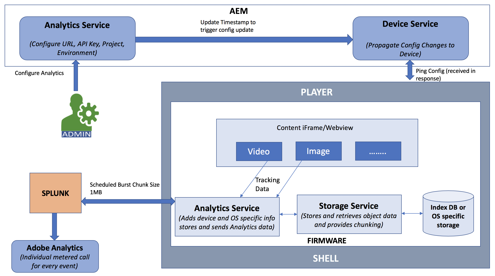
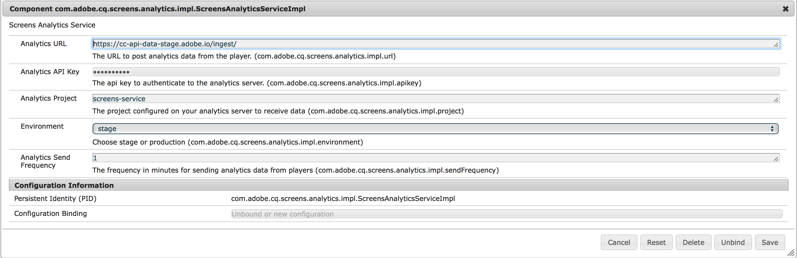

# Integración de Adobe Analytics con AEM Screens {#adobe-analytics-integration-with-aem-screens}

>[!IMPORTANT]
>Este contenido es válido para AEM on-premise/AMS (AEM 6.5LTS y AEM 6.5). Para el contenido de AEM as a Cloud Service Screens, consulte la [guía de AEM as a Cloud Service](https://experienceleague.adobe.com/es/docs/experience-manager-cloud-service/content/screens-as-cloud-service/overview/introduction).

>[!CAUTION]
>
>Esta funcionalidad de AEM Screens solo está disponible si ha instalado la versión mínima de AEM 6.4.2 Feature Pack 2 o AEM 6.3.3 Feature Pack 4. Para los clientes del servicio en la nube de AEM Screens, póngase en contacto con su administrador de relaciones con Adobe para habilitar Adobe Analytics en Screens Cloud.

>[!NOTE]
>
>Para obtener acceso a cualquiera de estos paquetes de funciones, póngase en contacto con el soporte técnico de Adobe y solicite acceso. Puede descargar el paquete de funciones más reciente para AEM Screens desde el [Portal de distribución de software](https://experience.adobe.com/#/downloads/content/software-distribution/es/aem.html) con su Adobe ID.

Esta sección trata los siguientes temas:

* **Información general**
* **Detalles arquitectónicos**
* **Configurar las propiedades**

## Información general {#overview}

***AEM Screens*** usa Adobe Analytics, y con eso puedes lograr algo único en el mercado: análisis en canales múltiples que ayuden a correlacionar el contenido que se muestra en la ubicación con otras fuentes de datos.

AEM Screens ofrece una integración predeterminada con Adobe Analytics y le ofrece una prueba de reproducción.

En esta sección se describe la siguiente funcionalidad relacionada con la conexión de un proyecto de AEM Screens con Adobe Analytics:

* Permite informes de prueba de reproducción por dispositivo
* Permite informes de prueba de reproducción por recurso
* Garantiza que todos los eventos del reproductor se capturan y se marcan con la hora
* Garantiza que todos los eventos del reproductor se almacenen localmente si la reproducción no está conectada a una red
* Se pueden crear bucles de comentarios para rastrear eventos de reproducción a lo largo del tiempo
* Permite que el sistema edite el contenido y los diseños en función de los criterios de éxito definidos por el autor del contenido

Por lo tanto, la integración de Adobe Analytics con AEM Screens exige los *objetivos* siguientes:

* Activación del ROI desde implementaciones de señalización digital
* Integre Analytics como base para la futura habilitación de la recopilación y el análisis de información de uso

## Detalles arquitectónicos {#architectural-details}

Un cliente de AEM Screens quiere comprender qué contenido se mostró a qué hora y durante cuánto tiempo (acumulado). Esta necesidad es una capacidad común de una solución de señalización. En lugar de crear una aplicación de análisis independiente, AEM Screens utiliza Adobe Analytics. La combinación nos permite lograr algo único en el mercado: análisis en canales múltiples que ayudan a correlacionar el contenido que se muestra en la ubicación con otras fuentes de datos.

En el siguiente diagrama de arquitectura se explica la integración de Adobe Analytics con AEM Screens:

## Habilitar Adobe Analytics en AEM Screens {#enabling-adobe-analytics-in-aem-screens}

La configuración de Adobe Analytics se puede configurar desde la consola OSGi.

Vaya a **Configuración de la consola web de Adobe Experience Manager** para poder configurar Adobe Analytics para AEM Screens.

## Screens Analytics: Flujo de habilitación {#screens-analytics-enablement-flow}

>[!CAUTION]
>
>Antes de configurar las propiedades, póngase en contacto con el administrador de relaciones con Adobe para crear un ticket y obtener **clave de API de Analytics** y **proyecto de Analytics** para su uso con AEM Screens.

### Configuración de las propiedades {#configuring-the-properties}

>[!CAUTION]
>
>Antes de configurar las propiedades, póngase en contacto con el administrador de relaciones con Adobe para crear un ticket y obtener **clave de API de Analytics** y **proyecto de Analytics** para su uso con AEM Screens.

En la tabla siguiente se destacan las propiedades con su descripción para la configuración de Adobe Analytics para AEM Screens:

<table>
 <tbody>
  <tr>
   <td><strong>Propiedad</strong></td>
   <td><strong>Descripción</strong></td>
  </tr>
  <tr>
   <td><strong>URL de Analytics</strong></td>
   <td>URL para publicar datos de análisis del reproductor.  
   Para desarrollo/fase</em> - https://cc-api-data-stage.adobe.io/ingest/  <em>Para producción</em> - https://cc-api-data.adobe.io/ingest/   </td>
  </tr>
  <tr>
   <td><strong>Clave de API de Analytics</strong></td>
   <td>Clave de API para autenticarse en el servidor de Adobe Analytics (proporcionada por el Administrador de cuentas).</td>
  </tr>
  <tr>
   <td><strong>Proyecto de Analytics</strong></td>
   <td>Proyecto de AEM Screens configurado en el análisis para recibir datos (proporcionados por el administrador de cuentas).</td>
  </tr>
  <tr>
   <td><strong>Entorno</strong></td>
   <td>
Entorno de fase o producción (elija Fase o Producción).
</td>
  </tr>
  <tr>
   <td><strong>Frecuencia de envío de Analytics</strong></td>
   <td>Frecuencia en minutos para enviar datos de análisis desde los reproductores. De forma predeterminada, se establece en 15 minutos.</td>
  </tr>
 </tbody>
</table>

>[!NOTE]
>
>De manera predeterminada, la **frecuencia de envío de Analytics** es de 15 minutos.

#### Uso del servicio Adobe Analytics en AEM Screens {#using-adobe-analytics-service-in-aem-screens}

Este escenario invoca la API de Analytics a través de llamadas REST desde un servicio de análisis en el firmware. También instrumenta los componentes principales de pantallas de AEM para crear y enviar eventos específicos de un caso de uso determinado. Toda esta funcionalidad, a la vez que permite la extensibilidad, donde cualquier mensaje personalizado se puede enviar a Analytics desde un canal desarrollado a medida.

Los eventos de Analytics se almacenan sin conexión en indexedDB y luego se fragmentan y se envían a la nube.

>[!NOTE]
>
>Para obtener más información sobre ***Secuenciación*** y ***Modelo de datos estándar para eventos***, consulte **[Configuración de Adobe Analytics para AEM Screens](configuring-adobe-analytics-aem-screens.md)**.
