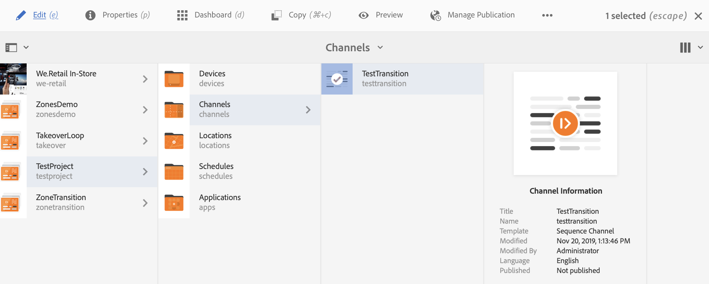

# Aplicación de transiciones {#applying-transitions}

En esta sección se describe cómo aplicar el componente **Transición** entre distintos recursos (imágenes y vídeos) y secuencias incrustadas en un canal.

>[!CAUTION]
>
>Para obtener información detallada sobre las propiedades del componente **Transición** , consulte [Transiciones](adding-components-to-a-channel.md#transition).

## Adición de un componente de transición a recursos en un canal {#adding-transition}

Siga los pasos a continuación para añadir un componente de transición a su proyecto de AEM Screens:

>[!NOTE]
>
>**Requisitos previos**
> Cree un proyecto **TestProject** de AEM Screens con un canal **TestTransition**. Además, configure una ubicación y una pantalla para ver el resultado.

1. Vaya a Channel **TestTransition** y haga clic en **Editar** en la barra de acciones.

   

   >[!NOTE]
   >
   >El canal **TestTransition** ya tiene pocos recursos (imágenes y vídeos) en él. Por ejemplo, el canal **TestTransition** incluye tres imágenes y dos vídeos, como se muestra a continuación:

   

1. Arrastre y suelte el componente **Transición** en el editor.
   >[!CAUTION]
   >
   >Antes de agregar la transición a los recursos en el canal, asegúrese de no agregar la transición antes del primer recurso en el canal secuencial. El primer elemento del canal debe ser un recurso y no una transición.

   

   > [!NOTE]
   >
   >De forma predeterminada, las propiedades del componente de transición como **Tipo** se establecen en **Normal** y la **Duración** se establece en *600 ms*.  Además, no es aconsejable establecer un tiempo de duración de transición más largo que el recurso al que se está aplicando.

1. Además, si agrega un componente Secuencia **** incrustada (que incluye un canal de secuencia) a este editor de canal, puede agregar un componente de transición al final, de modo que el contenido se reproduzca en orden, como se muestra en la figura siguiente:

   

## Adición de un componente de transición a vídeos en un canal {#adding-transition-videos}

Al aplicar un componente de transición entre vídeos, se recomienda definir el **tipo** en **Desvanecimiento** y la duración **de la** secuencia en **1600 ms**.

