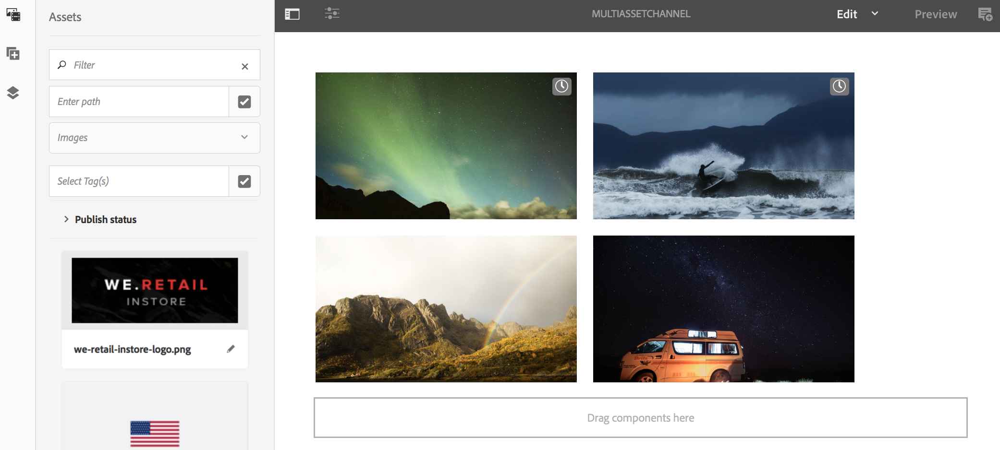

# Activación de nivel de recurso {#asset-level-scheduling}

Esta página describe la activación a nivel de recurso para los recursos utilizados en los canales.

En esta sección se tratan los siguientes temas:

* Información general
* Ventana de activación
* Reproducción de un solo evento
* Administrar la periodicidad en Assets
   * DayParting
   * WeekParting
   * MonthParting
   * Combinación de Particiones
* Activación de varios recursos
* Sustitución Global Para La Hora De Inicio Universal

<!-- REFERS TO ARCHIVED VERSIONS THAT ADOBE NO LONGER SUPPORTS>
>[!CAUTION]
>
>This AEM Screens functionality is only available if you have installed AEM 6.3 Feature Pack 3 or AEM 6.4 Screens Feature Pack 1.
>
>To get access to this Feature Pack, contact Adobe Support and request access. When you have permission, you can download it from Package Share. -->

## Información general {#overview}

***Activación de nivel de recurso*** permite activar un recurso específico en un canal durante un periodo de tiempo programado, todo ello dentro de la zona horaria local del reproductor. Esta capacidad está disponible para imágenes, vídeos, transiciones, páginas y canales incrustados (dinámicos o estáticos).

*Por ejemplo*, desea que una promoción especial se muestre solo durante la hora feliz (de 2 p. m. a 5 p. m.) los lunes y miércoles.

Con esta función, no solo se puede especificar una fecha y una hora de inicio y finalización, sino también un patrón de periodicidad.

## Ventana de activación {#single-event-playback}

La activación a nivel de recurso se realiza configurando **Activation** al acceder a las propiedades de un recurso.

Siga los pasos a continuación para realizar la programación de nivel de recurso:

1. Haga clic en cualquier canal y luego en **Editar** de la barra de acciones.

   

   >[!NOTE]
   >
   >Para obtener información detallada sobre cómo
   >
   >* Cree un proyecto. Consulte [Creación de un nuevo proyecto](creating-a-screens-project.md).
   >* Crear y añadir contenido a un canal. Consulte [Administración de canales](managing-channels.md).

1. Clic **Editar** para poder abrir el editor de canales y hacer clic en un recurso al que desee aplicar la programación.

   

1. Haga clic en el recurso y, a continuación, en arriba a la izquierda **Configurar** (icono de llave inglesa).

   Haga clic en **Activation** pestaña.

   

1. Puede especificar la fecha desde el selector de fechas utilizando **Activo desde** y **Activo hasta** campos.

   Si hace clic en **Activo desde** y **Activo hasta** fecha y hora, el recurso solo se muestra y realiza un bucle entre esa fecha/hora de inicio y la fecha/hora de finalización, respectivamente.

   

## Administrar la periodicidad en Assets {#handling-recurrence-in-assets}

Puede programar la reaparición de activos en determinados intervalos de forma diaria, semanal o mensual, según sus necesidades.

Supongamos que desea mostrar una imagen sólo los viernes de 1:00 p.m. a 10:00 p.m. Puede usar el complemento **Activation** para establecer el intervalo recurrente deseado para el recurso.

### División por día {#day-parting}

1. Haga clic en el recurso y en **Configurar** (icono de llave inglesa) para abrir el cuadro de diálogo propiedades.

1. Después de escribir la fecha/hora de inicio y la fecha/hora de finalización, puede utilizar una expresión o una versión de texto natural para especificar la programación de periodicidad.

   >[!NOTE]
   >Puede omitir o incluir el **Activo desde** y **Activo hasta** y añada la expresión al campo Schedules, según sus necesidades.

1. Introduzca la expresión en la variable **Programación** y el recurso se muestra para el intervalo particular de día y hora.

#### Expresiones de ejemplo para la partición por día {#example-one}

En la tabla siguiente se resumen algunas expresiones de ejemplo que se pueden añadir a la programación al asignar un canal a una visualización.

| **Expresión** | **Interpretación** |
|---|---|
| antes de las 8:00 a.m. | el recurso del canal se reproduce antes de las 8:00 a. m. todos los días |
| después de las 2:00 p.m. | el recurso del canal se reproduce todos los días después de las 2 de la tarde |
| después de las 12:15 y antes de las 12:45 | el recurso del canal se reproduce después de las 12:15 todos los días durante 30 minutos |
| antes de las 12:15 también después de las 12:45 | el recurso del canal se reproduce antes de las 12:15 todos los días y después de las 12:45. |

>[!NOTE]
>
>También puede utilizar _hora militar_ notación (14:00) en lugar de *A.M./P.M.* (2:00 P.M.).

### WeekParting {#week-parting}

1. Haga clic en el recurso y luego en **Configurar** (icono de llave inglesa).

1. Después de escribir la fecha/hora de inicio y la fecha/hora de finalización, puede utilizar una expresión o una versión de texto natural para especificar la programación de periodicidad.

   >[!NOTE]
   >Puede omitir o incluir el **Activo desde** y **Activo hasta** y añada la expresión al campo Schedules, según sus necesidades.

1. Introduzca la expresión en la variable **Programación** y el recurso se muestra para el intervalo particular de día y hora.

#### Expresiones de ejemplo para WeekParting {#example-two}

En la tabla siguiente se resumen algunas expresiones de ejemplo que se pueden añadir a la programación al asignar un canal a una visualización.

| **Expresión** | **Interpretación** |
|---|---|
| `Mon,Wed,Fri` | el recurso se reproduce en el canal los lunes, miércoles y viernes |
| `Mon-Thu` | el recurso se reproduce en el canal de lunes a jueves |

>[!NOTE]
>
>También puede utilizar _completo_ notación (`Monday,Wednesday,Friday`) en lugar de _de mano corta_ (`Mon,Wed,Fri`).

### MonthParting {#month-parting}

1. Haga clic en el recurso y luego en **Configurar** (icono de llave inglesa).

1. Después de escribir la fecha/hora de inicio y la fecha/hora de finalización, puede utilizar una expresión o una versión de texto natural para especificar la programación de periodicidad.

   >[!NOTE]
   >Puede omitir o incluir el **Activo desde** y **Activo hasta** y añada la expresión al campo Schedules, según sus necesidades.

1. Introduzca la expresión en la variable **Programación** y el recurso se muestra para el intervalo particular de día y hora.

#### Expresiones de ejemplo para MonthParting {#example-three}

En la tabla siguiente se resumen algunas expresiones de ejemplo que se pueden añadir a la programación al asignar un canal a una visualización.

| **Expresión** | **Interpretación** |
|---|---|
| `on February,May,August,November` | el recurso se reproduce en el canal en febrero, mayo, agosto y noviembre |
| `on February-July` | el recurso se reproduce en el canal de febrero a finales de julio |

>[!NOTE]
>Al definir los días de la semana y los meses, puede utilizar las notaciones de nombre completo y abreviado, como Lunes/Lunes y Enero/Enero.

### Combinación de Particiones {#combined-parting}

1. Haga clic en el recurso y luego en **Configurar** (icono de llave inglesa).

1. Después de escribir la fecha/hora de inicio y la fecha/hora de finalización, puede utilizar una expresión o una versión de texto natural para especificar la programación de periodicidad.

   >[!NOTE]
   >Puede omitir o incluir el **Activo desde** y **Activo hasta** y añada la expresión al campo Schedules, según sus necesidades.

1. Introduzca la expresión en la variable **Programación** y el recurso se muestra para el intervalo particular de día y hora.

#### Expresiones de ejemplo para combinación de particiones {#example-four}

En la tabla siguiente se resumen algunas expresiones de ejemplo que se pueden añadir a la programación al asignar un canal a una visualización.

| **Expresión** | **Interpretación** |
|---|---|
| `after 6:00 and before 18:00 on Mon,Wed of Jan-Mar` | el recurso se reproduce en el canal entre las 6 a. m. y las 6 p. m. los lunes y miércoles de enero a finales de marzo |
| `on the 1st day of January after 2:00 P.M. also on the 2nd day of January also on the 3rd day of January before 3:00 A.M.` | el recurso del canal comienza a reproducirse después de las 2 de la tarde del 1 de enero y continúa reproduciendo durante todo el día del 2 de enero hasta las 3 de la madrugada del 3 de enero |
| `on the 1-2 days of January after 2:00 P.M. also on the 2-3 days of January before 3:00 A.M.` | el recurso del canal inicia el reproductor después de las 2:00 p. m. del 1 de enero, continúa reproduciendo hasta las 3:00 a. m. del 2 de enero, luego comienza nuevamente el 2 de enero a las 2:00 p. m. y continúa reproduciendo hasta las 3:00 a. m. del 3 de enero |

>[!NOTE]
>Al definir los días de la semana y los meses, puede utilizar las notaciones de nombre completo y abreviado, como Lunes/Lunes y Enero/Enero. Además, también puede utilizar _hora militar_ notación (14:00) en lugar de *A.M./P.M.*(2:00 P.M.).

## Activación de varios recursos {#multi-asset-scheduling}

<!--
>[!CAUTION]
>
>The **Multi-asset Activation** feature is only available if you have installed AEM 6.3 Feature Pack 5 or AEM 6.4 Feature Pack 3. -->

***Activación de varios recursos*** permite al usuario hacer clic en varios recursos y aplicar una programación de reproducción a todos los recursos seleccionados.

### Requisitos previos {#prerequisites}

Para utilizar la activación a nivel de varios recursos para sus recursos, cree un proyecto de AEM Screens con un canal de secuencia. Por ejemplo, el siguiente caso de uso muestra la implementación de la función:

* Cree un proyecto de AEM Screens titulado como **MultiAssetDemo**.
* Cree un canal con el título **MultiAssetChannel** y añada contenido al canal, como se muestra en la figura siguiente.

Siga los pasos a continuación para hacer clic en varios recursos y programar su visualización en un proyecto de AEM Screens:

1. Clic **MultiAssetChannel**, luego haga clic en **Editar** de la barra de acciones.

   

1. Haga clic en varios recursos desde el editor y, a continuación, haga clic en **Editar activación** (icono superior izquierda).

   

1. Haga clic en la fecha y la hora en **Activo desde** y **Activo hasta** desde el **Activación de componentes** Cuadro de diálogo. Haga clic en el icono de la marca de verificación cuando haya terminado de seleccionar las programaciones.

   

1. Haga clic en Actualizar para comprobar los recursos a los que se aplica la programación de varios recursos.

   >[!NOTE]
   >
   >El icono de programación se puede ver en la esquina superior derecha de aquellos recursos que tienen activación de varios recursos.

   

## Sustitución Global Para La Hora De Inicio Universal {#global-override-scheduling}

***Sustitución global para la hora de inicio universal***, es una configuración que permite al autor del contenido definir la reproducción de una imagen o un recurso de vídeo en función de un tiempo específico. No se utiliza el ajuste de hora/zona horaria de ningún reproductor individual.

Normalmente, la hora local de un reproductor determinado determina la reproducción. Sin embargo, con la anulación global, se puede utilizar una hora de inicio universal específica para iniciar la reproducción del recurso.

Como tal, el autor del contenido puede designar la reproducción de un recurso específico. Pueden hacer que se produzca en una fecha/hora específica, independientemente del reloj local, en cualquier reproductor que tenga el contenido asignado.

***Sustitución global para la hora de inicio universal*** se lleva a cabo configurando el **Activation** al acceder a las propiedades de un recurso. Siga los pasos a continuación para realizar una anulación global de la programación de recursos:

1. Haga clic en cualquier canal y luego en **Editar** en la barra de acciones, para poder agregar o editar contenido en el canal.

   

1. Clic **Editar**.
1. En el editor de canales, haga clic en un recurso cuya programación desee aplicarle.

   

1. Para una anulación global, introduzca la hora de activación en **Anulación de zona horaria** para el recurso. Si no introduce nada en esta área, la zona horaria aplicada es la del reproductor.

