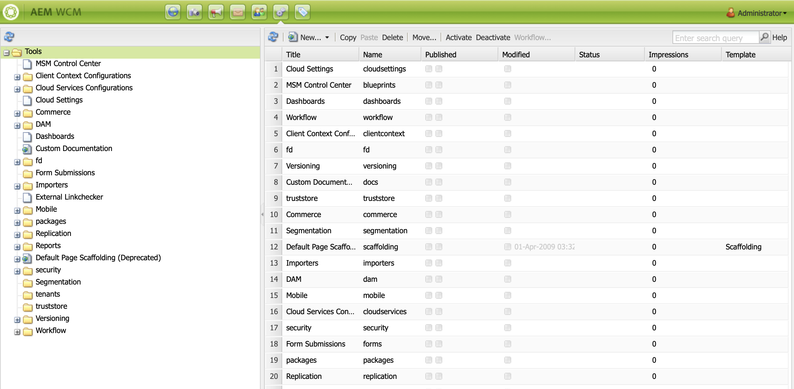
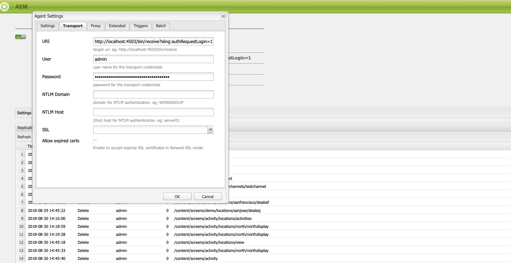

# Configuración de las instancias de autor y publicación en AEM Screens {#configuring-author-and-publish-in-aem-screens}

En esta página se destacan los siguientes temas:

* **Configuración de instancias de autor y publicación**
* **Configuración de la topología de publicación**
* **Administración de publicaciones: entrega de actualizaciones de contenido del autor para su publicación en el dispositivo**

## Requisitos previos {#prerequisites}

Antes de empezar a usar los servidores de creación y publicación, debe tener conocimientos previos de lo siguiente:

* **AEM Topología de**
* **Creación y administración de un proyecto de AEM Screens**
* **Proceso de registro de dispositivos**

>[!NOTE]
>
>Esta funcionalidad de AEM Screens AEM solo está disponible si ha instalado el paquete de funciones 2 de Screens de 6.4. Para obtener acceso a este paquete de funciones, póngase en contacto con el Soporte técnico de Adobe y solicite acceso. Una vez que tenga permiso, puede descargarlo desde Package Share.

>[!IMPORTANT]
>
>Si desea utilizar más de una instancia de publicación con Dispatcher, actualice Dispatcher. Consulte [Activar sesiones fijas](dispatcher-configurations-aem-screens.md#enable-sticky-session).

## Configuración de instancias de autor y publicación {#configuring-author-and-publish-instances}

>[!NOTE]
>
>AEM Para obtener más información sobre la descripción general de la arquitectura de Autor y Publicación y cómo se crea el contenido en una instancia de Autor y, a continuación, se replica mediante reenvío en varias instancias de Publicación, consulte [Información general sobre la arquitectura de creación y publicación](author-publish-architecture-overview.md).

En la siguiente sección se explica cómo configurar agentes de replicación en la topología Autor y Publicación.

Puede configurar un ejemplo sencillo, en el que aloje una instancia de autor y dos instancias de publicación:

* Autor > localhost:4502
* Publicar 1 (pub1) > localhost:4503
* Publicar 2 (pub2) > localhost:4504

## Configuración de agentes de replicación en Autor {#setting-replication-agents}

Para crear agentes de replicación, aprenda a crear un agente de replicación estándar.

Hay tres agentes de replicación necesarios para Screens:

1. **Agente de replicación predeterminado ***(especificado como*** Agente de replicación estándar**)
1. **Agente de replicación de Screens**
1. **Agente de replicación inversa**

### Paso 1: Creación de un Agente de Replicación por Defecto {#step-creating-a-default-replication-agent}

Siga los pasos a continuación para crear un agente de replicación predeterminado:

1. AEM Vaya a la instancia de la > icono de martillo > **Operaciones** > **Configuración**.

   

1. Haga clic en **Replicación** en el árbol de navegación izquierdo.

   

1. Haga clic en **Agentes en Autor** desde el **Replicación** y haga clic en **Nuevo** para crear un nuevo agente de replicación estándar.

   

1. Introduzca el **Título** y **Nombre** para crear el agente de replicación y haga clic en **Crear**.

   

1. Haga clic con el botón derecho en el agente de replicación y seleccione **Abrir** para editar la configuración.

   

1. Clic **Editar**.

1. En el **Configuración de agente** , introduzca los detalles.

   >[!NOTE]
   >
   >El usuario debe comprobar **Habilitado** para habilitar el agente de replicación. Marque esta opción en Predeterminado, Pantallas y Agentes de replicación inversa.

   

1. Vaya a **Transporte** e introduzca la pestaña **URI**, **Usuario**, y **Contraseña**.

   

   >[!NOTE]
   >
   >También puede copiar y cambiar el nombre de un agente de replicación predeterminado existente.

#### Creación de agentes de replicación estándar  {#creating-standard-replication-agents}

1. Cree un agente de replicación estándar para pub1 (el agente predeterminado predeterminado incorporado ya debe estar configurado). Por ejemplo, *`https://<hostname>:4503/bin/receive?sling:authRequestLogin=1`*
1. Cree un agente de replicación estándar para pub2. Puede copiar como agente de replicación para pub1 y actualizar el transporte que se utilizará para pub2 cambiando el puerto en la configuración de transporte. Por ejemplo, *`https://<hostname>:4504/bin/receive?sling:authRequestLogin=1`*.

#### Creación de agentes de replicación de Screens {#creating-screens-replication-agents}

1. Cree un agente de replicación de AEM Screens para pub1. De forma predeterminada, hay un agente de replicación de Screens que señala al puerto 4503. Actívelo.
1. Cree un agente de replicación de AEM Screens para pub2. Copie el Agente de replicación de pantallas para pub1 y cambie el puerto a 4504 para pub2.

   >[!NOTE]
   >Para obtener información sobre cómo configurar agentes de replicación de Screens, consulte [Configuración del agente de replicación de Screens](https://experienceleague.adobe.com/en/docs/experience-manager-screens/user-guide/administering/configure-screens-replication).

#### Creación de agentes de replicación inversa de Screens {#creating-screens-reverse-replication-agents}

1. Cree un agente de replicación inversa para pub1.
1. Cree un agente de replicación inversa para pub2. Puede copiar el agente de replicación inversa para pub1 y actualizar el transporte que se utilizará para pub2 cambiando el puerto en la configuración de transporte.

## Configuración de la topología de publicación {#setting-up-publish-topology}

### Paso 1: Configurar el descubrimiento basado en Apache Sling Oak {#step-configure-apache-sling-oak-based-discovery}

Configure el descubrimiento basado en Apache Sling Oak para todas las instancias de publicación de la topología

Para cada instancia de publicación:

1. Navegue hasta `https://<host>:<port>/system/console/configMgr`
1. Clic **Servicio de descubrimiento basado en Apache Sling Oak** Configuración.
1. Actualizar URL del conector de topología: añada las URL de todas las instancias de publicación participantes que sean:
   * `https://publish:4503/libs/sling/topology/connector`
   * `https://publish:4504/libs/sling/topology/connector`
1. **Conector de topología `Whitelist` Lista**: se adapta a las direcciones IP o subredes que abarcan todas las instancias de publicación. Asegúrese de que `whitelist` el nombre de host/IP de todas las instancias de publicación sin el número de puerto.

1. Activar **Auto-Stop Local-Loops**

La configuración debe ser idéntica para cada instancia de publicación y el bucle local de parada automática evita un bucle infinito.

#### Paso 2: Verificar La Topología De Publicación {#step-verify-publish-topology}

Para cualquiera de las instancias de publicación, vaya a `https://:/system/console/topology`. Debe ver cada instancia de publicación representada en la topología en **Conectores de topología salientes**.

#### Paso 3: Configuración del clúster de ActiveMQ Artemis {#step-setup-activemq-artemis-cluster}

Este paso le permite crear una contraseña cifrada para el clúster de ActiveMQ Artemis.
El usuario y la contraseña de clúster de todas las instancias de publicación de la topología deben ser idénticos. La contraseña de la configuración de ActiveMQ Artemis debe estar cifrada. Dado que cada instancia tiene su propia clave de cifrado, es necesario utilizar la compatibilidad con cifrado para crear una cadena de contraseña cifrada. A continuación, la contraseña cifrada se puede utilizar en la configuración OSGi para ActiveMQ.

En cada instancia de publicación:

1. En la consola OSGi, navegue hasta **PRINCIPAL** > **Compatibilidad con cifrado** (`https://<host>:<port>/system/console/crypto`).
1. Escriba la contraseña de texto sin formato deseada (la misma para todas las instancias) en **Texto sin formato**
1. Clic **Protect**.
1. Copie el valor **Texto protegido** al bloc de notas o al editor de texto. Este valor se puede utilizar en la configuración OSGi para ActiveMQ.

Dado que cada instancia de publicación, de forma predeterminada, tiene claves criptográficas únicas, realice este paso en cada instancia de publicación y guarde la clave única para la siguiente configuración.

>[!NOTE]
>
>La contraseña debe comenzar y finalizar con llaves. Por ejemplo:
>`{1ec346330f1c26b5c48255084c3b7272a5e85260322edd59119828d1fa0a610e}`

#### Paso 4: Activar el clúster de ActiveMQ Artemis {#step-activate-activemq-artemis-cluster}

En cada instancia de publicación:

1. Vaya al Administrador de configuración OSGi `https://<host>:<port>/system/console/configMgr`
1. Clic **Proveedor de Apache ActiveMQ Artemis JMS** Configuración
1. Actualice lo siguiente:

   * ***Contraseña de clúster***: utilice el valor cifrado del paso anterior por cada instancia respectiva
   * ***Temas***: `{name: 'commands', address: 'com.adobe.cq.screens.commands', maxConsumers: 50}`

#### Comprobar clúster de elementos ActiveMQ {#verify-activemq-artemis-cluster}

Siga los pasos a continuación en cada instancia de publicación:

1. Vaya a la consola OSGi > Principal > Elementos de ActiveMQ `https://localhost:4505/system/console/mq`.
1. Compruebe y marque para ver los puertos de otras instancias en Información de clúster > Topología > nodes=2, members=2.
1. Enviar un mensaje de prueba (parte superior de la pantalla en Información de Broker)
1. Introduzca los siguientes cambios en los campos:

   1. **Destino**: /com.adobe.cq.screens/devTestTopic
   1. **Texto**: Hello World
   1. Ver el `error.log` de cada instancia para poder ver que el mensaje se envió y recibió en todo el clúster.

>[!NOTE]
>
>La navegación a la consola OSGi puede tardar unos segundos después de guardar la configuración en el paso anterior. También puede comprobar el error.log para obtener más detalles.

Por ejemplo, la siguiente imagen se muestra si la configuración de ActiveMQ Artemis Server se ha realizado correctamente.

Si no ve la siguiente configuración en */system/console/mq* y, a continuación, vaya a */system/console/mq* y haga clic en **Restart** para reiniciar el agente.

#### Quitar requisito de encabezado de referente {#remove-referrer-header-requirement}

Siga los pasos de cada instancia de publicación:

1. Vaya a **Consola OSGi** > **Administrador de configuración**
1. Clic **Filtro de referente de Apache Sling**
1. Actualizar la configuración y **check Permitir vacío**

### Configuración de la instancia de autor y publicación {#configuring-author-and-publish-instance}

Una vez configurada la topología de publicación, configure las instancias de autor y publicación para ver los resultados prácticos de la implementación:

>[!NOTE]
>
>**Requisitos previos**
>
>Para empezar con este ejemplo, cree un proyecto de AEM Screens seguido de la creación de una ubicación, una visualización y un canal en el proyecto. Añada contenido al canal y asigne el canal a una pantalla.

#### Paso 1: Inicio de un reproductor de AEM Screens (dispositivo)

1. Inicie una ventana independiente del explorador.
1. Vaya al reproductor de Screens con el *explorador web*, es decir,`https://localhost:4502/content/mobileapps/cq-screens-player/firmware.html` o inicie la aplicación de AEM Screens. Cuando abra el dispositivo, observe que su estado no está registrado.

>[!NOTE]
>
>Puede abrir un Reproductor de AEM Screens con la aplicación de AEM Screens que descargó o con el explorador web.

#### Paso 2: Registro de un dispositivo en Autor {#step-registering-a-device-on-author}

1. Ir a `https://localhost:4502/screens.html/content/screens/we-retail` o haga clic en el proyecto y vaya a Dispositivos > Administrador de dispositivos.
1. Clic **Registrar dispositivo**.
1. Clic **Registro de dispositivos**.
1. Haga clic en el dispositivo que desea registrar y, a continuación, haga clic en **Registrar dispositivo**.
1. Compruebe el código de registro y haga clic en **Validate**.
1. Escriba un título para el dispositivo y haga clic en **Registrar**.

#### Paso 3: Asignar el dispositivo a mostrar {#step-assigning-the-device-to-display}

1. Clic **Asignar visualización** del cuadro de diálogo del paso anterior.
1. Haga clic en la ruta de visualización del canal desde el **Ubicaciones** carpeta.
1. Clic **Asignar**.
1. Clic **Finalizar** para completar el proceso, y ahora se asigna el dispositivo.

Compruebe el reproductor y observe el contenido que ha agregado en el canal.

#### Paso 4: Publicar la configuración del dispositivo en instancias de publicación {#step-publishing-device-configuration-to-publish-instances}

**Verificación del dispositivo**

Siga los pasos a continuación para replicar el usuario del dispositivo:

1. Navegue hasta la página de administración de usuarios. Por ejemplo, `https://localhost:4502/useradmin`.
1. Busque la variable **`screens-devices-master`** grupo.
1. Haga clic con el botón derecho en el grupo y seleccione **Activar**.

>[!CAUTION]
>
>No active author-publish-screens-service porque es un usuario del sistema utilizado por el trabajo de autor.

También puede activar el dispositivo desde la Consola de administración de dispositivos. Complete los siguientes pasos:

1. Vaya al proyecto de Screens > **Dispositivos**.
1. Clic **Administrador de dispositivos** de la barra de acciones.
1. Haga clic en el dispositivo y en **Activar** de la barra de acciones, como se muestra en la figura siguiente.

>[!NOTE]
>
>Como alternativa, una vez activado el dispositivo, también puede editar o actualizar la URL del servidor. Clic **Editar URL del servidor** en la barra de acciones, como se muestra en la figura siguiente, los cambios se propagarán al reproductor de AEM Screens.

### Publicando lista de comprobación {#publishing-check-list}

Los siguientes puntos resumen la lista de comprobación de publicación:

* *Usuario de dispositivo de Screens* AEM - Esto se almacena como usuario de la aplicación y se activa desde **Herramientas** > **Seguridad** > **Usuarios**. Al usuario se le agrega el prefijo &quot;screens&quot; con una cadena serializada larga.

* *Proyecto* - El proyecto AEM Screens.
* *Ubicación* - Ubicación a la que está conectado el dispositivo.
* *Canales* - uno o más canales que se muestran en la ubicación
* *Programación* - si utiliza una programación, asegúrese de que se publique
* *Ubicación, horarios y carpeta del canal* : si los recursos correspondientes están dentro de una carpeta.

Siga los pasos a continuación para verificar el comportamiento de creación y publicación:

1. Actualizar parte del contenido del canal en la instancia de autor.
1. Realizar **Administrar publicación** para publicar nuevos cambios en todas las instancias de publicación.
1. Prensa **Activar** para activar el dispositivo desde **Administrador de dispositivos**.
1. **Editar URL** de la URL de instancia de autor a una de las URL de instancias de publicación.
1. Compruebe que el contenido actualizado del canal se muestra en el reproductor de AEM Screens.
1. Repita estos pasos con una instancia de publicación diferente.

#### Paso 5: Apuntar el dispositivo a la instancia de publicación en el Panel de administración {#step-pointing-the-device-to-publish-instance-in-the-admin-panel}

1. Vea la IU de administración desde el reproductor de Screens; mantenga pulsada la esquina superior izquierda para poder abrir el menú Administración, en el reproductor de AEM Screens táctil o con un ratón.
1. Haga clic en **Configuración** del panel lateral.
1. Cambie la instancia de autor a Instancia de publicación en **Servidor**.

Vea los cambios en el Reproductor de AEM Screens.

También puede actualizar o editar la URL del servidor desde la consola de administración de dispositivos, para hacerlo, siga estos pasos:

1. Vaya al proyecto de AEM Screens y haga clic en **Dispositivos** carpeta.
1. Clic **Administrador de dispositivos** de la barra de acciones.
1. Haga clic en el dispositivo y en **Editar URL del servidor** de la barra de acciones, como se muestra en la figura siguiente, y los cambios se propagarán al reproductor de AEM Screens.

El **Administrar publicación** Esta función permite enviar actualizaciones de contenido de Autor a Publish en el dispositivo. Puede publicar/cancelar la publicación del contenido de todo el proyecto de AEM Screens o solo de uno de los canales, la ubicación, el dispositivo, la aplicación o una programación. Para obtener más información acerca de esta función, consulte [Actualización de contenido bajo demanda](on-demand-content.md).

## Sugerencias de resolución de problemas {#troubleshoot-tips}

Siga esta sección para obtener respuestas a las preguntas frecuentes relacionadas con la configuración de Autor/Publicación.

### Cómo añadir un Redireccionamiento de https a http después del registro inicial y la asignación? {#add-redirect}

**Solución**
Establecer como habilitado `Proxy/Load Balancer Connection in the Jetty configuration` hasta `true`.

### Actualización de contenido sin conexión y problemas de descarga del reproductor con recursos externos `/content/dam/projects/<project>`? {#update-offline-content}

**Solución**
Conceder permisos de lectura para el usuario de servicio de pantallas de actualización sin conexión masiva y `screens-devices-master` grupo para todos `/content/dam` o los recursos específicos que desea utilizar, si desea ser más restrictivo.

### ¿Cómo se resuelven los errores del agente de replicación de Screens? {#replication-agent}

**Solución**
Asegúrese de que no ha marcado la opción Usar para replicación inversa en la configuración del agente. El agente de replicación de Screens no se puede usar como agente de replicación inversa y el ámbito de esta función es reenviar comandos de dispositivo de Autor a Publicar.