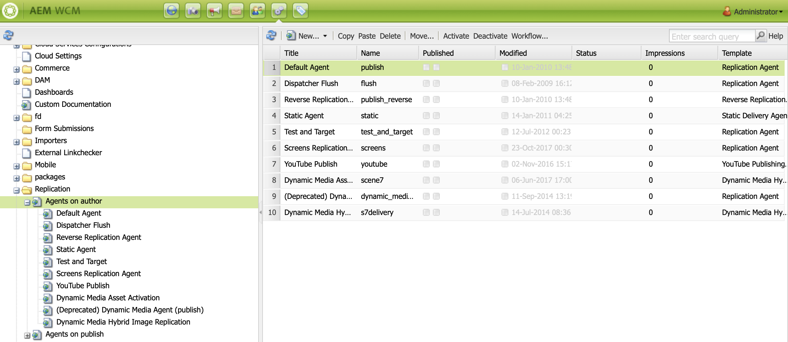

# Configuración de autor y publicación en AEM Screens {#configuring-author-and-publish-in-aem-screens}

Esta página destaca los siguientes temas:

* **Configuración de instancias de autor y publicación**
* **Configuración de la topología de publicación**
* **Administración de publicación: Envío de actualizaciones de contenido desde el autor a la publicación en el dispositivo**

## Requisitos previos {#prerequisites}

Antes de comenzar con los servidores de creación y publicación, debe tener conocimientos previos de:

* **Topología AEM**
* **Creación y administración de proyectos de AEM Screens**
* **Proceso de registro de dispositivos**

>[!NOTE]
>
>Esta funcionalidad de AEM Screens solo está disponible si ha instalado AEM 6.4 Screens Feature Pack 2. Para obtener acceso a este Feature Pack, debe ponerse en contacto con la Asistencia de Adobe y solicitar acceso. Cuando disponga de los permisos necesarios, puede descargarlo desde Uso compartido de paquetes.

>[!IMPORTANT]
>
>Si desea utilizar más de una instancia de publicación con Dispatcher, debe actualizar el archivo dispatcher.any en su Dispatcher. Consulte [Habilitar sesiones adhesivas](dispatcher-configurations-aem-screens.md#enable-sticky-session) para obtener más información.

## Configuración de instancias de Autor y Publicación {#configuring-author-and-publish-instances}

>[!NOTE]
>
>Para obtener más información sobre el autor y la descripción general de la arquitectura de publicación, y cómo se crea el contenido en una instancia de autor AEM y luego se rereplica en varias instancias de publicación, consulte [Información general sobre la arquitectura de creación y publicación](author-publish-architecture-overview.md).

En la siguiente sección se explica cómo configurar los agentes de replicación en la topología de autor y publicación.

Puede configurar un ejemplo sencillo en el que aloje un autor y dos instancias de publicación:

* Autor —> localhost:4502
* Publicar 1 (pub1) —> localhost:4503
* Publicar 2 (pub2) —> localhost:4504

## Configuración de agentes de replicación en Author {#setting-replication-agents}

Para crear agentes de replicación, debe aprender a crear un agente de replicación estándar.

Hay 3 agentes de replicación necesarios para Screens:

1. **Agente de replicación predeterminado ***(especificado como*** Agente de replicación estándar**)
1. **Agente de replicación de Screens**
1. **Agente de replicación inversa**

### Paso 1: Creación de un agente de replicación predeterminado {#step-creating-a-default-replication-agent}

Siga los pasos a continuación para crear un agente de replicación predeterminado:

1. Vaya a su instancia de AEM —> icono de martillo —> **Operaciones** —> **Configuración**.

   

1. Seleccione el **Replicación** del árbol de navegación izquierdo.

   

1. Seleccione el **Agentes en autor** de la variable **Replicación** carpeta y haga clic en **Nuevo** para crear un nuevo agente de replicación estándar.

   

1. Introduzca la variable **Título** y **Nombre** para crear el agente de replicación y haga clic en **Crear**.

   

1. Haga clic con el botón derecho en el agente de replicación y haga clic en **Apertura** para editar la configuración.

   

1. Haga clic en **Editar** para abrir el **Configuración del agente** para introducir los detalles.

   >[!NOTE]
   >
   >El usuario debe comprobar **Habilitado** para habilitar el agente de replicación. Debe marcar esta opción en Predeterminado, Screens y Reverse Replication Agents.

   

1. Vaya a la **Transporte** y escriba la **URI**, **Usuario** y **Contraseña**.

   

   >[!NOTE]
   >
   >También puede copiar y cambiar el nombre de un agente de replicación predeterminado existente.

#### Creación de agentes de replicación estándar  {#creating-standard-replication-agents}

1. Crear un agente de replicación estándar para pub1 (el agente predeterminado listo para usar ya debería estar configurado) (por ejemplo, *https://&lt;hostname>:4503/bin/receive?sling:authRequestLogin=1*)
1. Cree un agente de replicación estándar para pub2. Puede copiar como agente de replicación para pub1 y actualizar el transporte que se utilizará para pub2 cambiando el puerto en la configuración de transporte. (por ejemplo, *https://&lt;hostname>:4504/bin/receive?sling:authRequestLogin=1*)

#### Creación de agentes de replicación de Screens {#creating-screens-replication-agents}

1. Cree un agente de replicación de pantallas para pub1. De serie, hay un agente de replicación Screens llamado Screens que apunta al puerto 4503. Debe habilitarse.
1. Cree un agente de replicación de pantallas para pub2. Copie el agente de replicación de Screens para pub1 y cambie el puerto para que apunte a 4504 para pub2.

   >[!NOTE]
   >Para obtener información sobre cómo configurar los agentes de replicación de Screens, consulte [Configuración del agente de replicación de Screens](https://experienceleague.adobe.com/docs/experience-manager-screens/user-guide/administering/configure-screens-replication.html?lang=en).

#### Creación de agentes de replicación inversa de Screens {#creating-screens-reverse-replication-agents}

1. Cree un agente de replicación inversa para pub1.
1. Cree un agente de replicación inversa para pub2. Puede copiar el agente de replicación inversa para pub1 y actualizar el transporte que se utilizará para pub2 cambiando el puerto en la configuración de transporte.

## Configuración de la topología de publicación {#setting-up-publish-topology}

### Paso 1: Configuración de Apache Sling Oak Based Discovery {#step-configure-apache-sling-oak-based-discovery}

Configurar el descubrimiento basado en Apache Sling Oak para todas las instancias de publicación en la topología

Para cada instancia de publicación:

1. Vaya a `https://<host>:<port>/system/console/configMgr`
1. Select **Servicio de descubrimiento basado en Apache Sling Oak** Configuración.
1. Actualizar URL del conector de topología: agregue direcciones URL de todas las instancias de publicación de participación que sean:
   * `https://publish:4503/libs/sling/topology/connector`
   * `https://publish:4504/libs/sling/topology/connector`
1. **Lista de lista blanca del conector de topología**: Adaptarse a las direcciones IP o subredes que abarcan todas las instancias de publicación. Asegúrese de incluir en la lista blanca la IP/el nombre de host de todas las instancias de publicación sin el número de puerto.

1. Habilitar **Bucles locales de parada automática**

La configuración debe ser idéntica para cada instancia de publicación y el bucle local de parada automática evita un bucle infinito.

#### Paso 2: Verificar topología de publicación {#step-verify-publish-topology}

Para cualquiera de las instancias de publicación, vaya a `https://:/system/console/topology`. Debería ver cada instancia de publicación representada en la topología debajo de **Conectores de topología salientes**.

#### Paso 3: Configuración del clúster de artemis de ActiveMQ {#step-setup-activemq-artemis-cluster}

Este paso le permite crear una contraseña cifrada para el clúster de ActiveMQ Artemis.
El usuario y la contraseña del clúster de todas las instancias de publicación de la topología deben ser idénticos. La contraseña de la configuración de ActiveMQ Artemis debe cifrarse. Dado que cada instancia tiene su propia clave de cifrado, es necesario utilizar el soporte técnico de Crypto para crear una cadena de contraseña cifrada. A continuación, la contraseña cifrada se utilizará en la configuración OSGi para ActiveMQ.

En cada instancia de publicación:

1. En la consola OSGi, vaya a **PRINCIPAL** —> **Compatibilidad con Crypto** (`https://&lt;host&gt;:&lt;port&gt;/system/console/crypto`).
1. Escriba la contraseña de texto sin formato que desee (igual para todas las instancias) en **Texto sin formato**
1. Haga clic en **Protect**.
1. Copiar el valor **Texto protegido** para el editor de notas o texto. Este valor se utilizará en la configuración OSGi para ActiveMQ.

Dado que cada instancia de publicación tiene de forma predeterminada claves criptográficas únicas, debe realizar este paso en cada instancia de pub y guardar la clave única para la siguiente configuración.

>[!NOTE]
>
>La contraseña debe comenzar y terminar con llaves. Por ejemplo:
>`{1ec346330f1c26b5c48255084c3b7272a5e85260322edd59119828d1fa0a610e}`

#### Paso 4: Activar el clúster de artemis de ActiveMQ {#step-activate-activemq-artemis-cluster}

En cada instancia de publicación:

1. Vaya al administrador de configuración de OSGi `https://&lt;host&gt;:&lt;port&gt;/system/console/configMgr`
1. Select **Proveedor JMS de Apache ActiveMQ Artemis** Configuración
1. Actualice lo siguiente:

   * ***Contraseña del clúster***: usar valor cifrado del paso anterior por cada instancia respectiva
   * ***Temas***: `{name: 'commands', address: 'com.adobe.cq.screens.commands', maxConsumers: 50}`

#### Comprobar clúster de artemis ActiveMQ {#verify-activemq-artemis-cluster}

Siga los pasos a continuación en cada instancia de publicación:

1. Vaya a la consola OSGi -> Principal > Artemis ActiveMQ `https://localhost:4505/system/console/mq`.
1. Compruebe y compruebe para ver los puertos de otras instancias en Información del clúster > Topología > nodos=2, miembros=2.
1. Enviar un mensaje de prueba (parte superior de la pantalla en Información del agente)
1. Introduzca los siguientes cambios en los campos:

   1. **Destino**: /com.adobe.cq.screens/devTestTopic
   1. **Texto**: Hello World
   1. Vea el archivo error.log de cada instancia para ver que el mensaje se envió y recibió en el clúster

>[!NOTE]
>
>La navegación a la consola OSGi puede tardar unos segundos después de guardar la configuración en el paso anterior. También puede consultar el archivo error.log para obtener más información.

Por ejemplo, la siguiente imagen aparece en una configuración correcta de ActiveMQ Artemis Server.

Si no ve la siguiente configuración desde */system/console/mq* y, a continuación, vaya a */system/console/mq* y haga clic en **Restart** para reiniciar el agente.

#### Eliminar el requisito de encabezado del referente {#remove-referrer-header-requirement}

Siga los pasos de cada instancia de publicación:

1. Vaya a la **Consola OSGi** > **Administrador de configuración**
1. Select **Filtro de referente de Apache Sling**
1. Actualizar configuración y **marcar Permitir vacío**

### Configuración de la instancia de autor y publicación {#configuring-author-and-publish-instance}

Una vez configurada la topología de publicación, debe configurar las instancias de autor y publicación para ver los resultados prácticos de la implementación:

>[!NOTE]
>
>**Requisitos previos**
>
>Para comenzar con este ejemplo, cree un nuevo proyecto de AEM Screens seguido de la creación de una ubicación, visualización y canal en el proyecto. Añada contenido al canal y asigne el canal a una pantalla.

#### Paso 1: Inicio de un reproductor AEM Screens (dispositivo) {#step-starting-an-aem-screens-player-device}

1. Abra una nueva ventana del navegador.
1. Vaya al reproductor Screens utilizando la función *explorador web*, es decir,`https://localhost:4502/content/mobileapps/cq-screens-player/firmware.html` o inicie la aplicación de AEM Screens. Cuando abra el dispositivo, verá el estado de este como no registrado.

>[!NOTE]
>
>Puede abrir un reproductor de AEM Screens con la aplicación de AEM Screens que descargó o con el explorador web.

#### Paso 2: Registro de un dispositivo en el autor {#step-registering-a-device-on-author}

1. Vaya a `https://localhost:4502/screens.html/content/screens/we-retail` o seleccione el proyecto y vaya a Dispositivos > Administrador de dispositivos.
1. Select **Registrar dispositivo**.
1. Haga clic en **Registro de dispositivos** para ver el dispositivo.
1. Seleccione el dispositivo que desea registrar y haga clic en **Registrar dispositivo**.
1. Compruebe el código de registro y haga clic en **Validar**.
1. Introduzca un título para el dispositivo y haga clic en **Registro**.

#### Paso 3: Asignación del dispositivo a la visualización {#step-assigning-the-device-to-display}

1. Haga clic en **Asignar visualización** del cuadro de diálogo del paso anterior.
1. Seleccione la ruta de acceso de visualización del canal en el **Ubicaciones** carpeta.
1. Haga clic en **Asignar**.
1. Haga clic en **Finalizar** para completar el proceso, y ahora el dispositivo está asignado.

Compruebe el reproductor y verá el contenido que agregó en el canal.

#### Paso 4: Configuración del dispositivo de publicación para publicar instancias {#step-publishing-device-configuration-to-publish-instances}

**Verificación del dispositivo**

Siga los pasos a continuación para replicar el usuario del dispositivo:

1. Vaya a la página de administración del usuario (p. ej.: `https://localhost:4502/useradmin`
1. Busque la variable **screens-device-master** grupo
1. Haga clic con el botón derecho en el grupo y haga clic en **Activar**

>[!CAUTION]
>
>No active author-publish-screens-service porque es un usuario del sistema, utilizado por el trabajo de autor.

También puede activar el dispositivo desde la consola de administración de dispositivos. Complete los siguientes pasos:

1. Vaya al proyecto de Screens —> **Dispositivos**.
1. Haga clic en **Administrador de dispositivos** de la barra de acciones.
1. Seleccione el dispositivo y haga clic en **Activar** de la barra de acciones, como se muestra en la figura siguiente.

>[!NOTE]
>
>Como alternativa, una vez que haya activado el dispositivo también puede editar o actualizar la URL del servidor haciendo clic en **Editar URL del servidor** en la barra de acciones, como se muestra en la figura siguiente, y los cambios se propagarán al reproductor AEM Screens.

### Lista de comprobación de publicaciones {#publishing-check-list}

Los siguientes puntos resumen la lista de comprobación de publicaciones:

* *Usuario del dispositivo Screens* - Se almacena como usuario AEM y se activa desde **Herramientas** > **Seguridad** > **Usuarios**. Al usuario se le añadirá el prefijo &quot;screens&quot; con una cadena serializada larga.

* *Proyecto* - El proyecto de AEM Screens.
* *Ubicación* - Ubicación a la que está conectado el dispositivo.
* *Canal(s)* - uno o más canales que se muestran en la ubicación
* *Programación* - si utiliza una programación, asegúrese de que se publica
* *Ubicación, programaciones y carpeta de canales* : si los recursos correspondientes están dentro de una carpeta.

Siga los pasos a continuación para comprobar el comportamiento de autor/publicación:

1. Actualizar contenido de canal en la instancia de autor
1. Realizar **Administrar publicación** para publicar nuevos cambios en todas las instancias de publicación
1. Press **Activar** para activar el dispositivo desde **Administrador de dispositivos**
1. **Editar URL** desde la URL de instancia de autor a una de las URL de instancias de publicación
1. Compruebe que el contenido del canal actualizado se muestra en el reproductor AEM Screens
1. Repita estos pasos con una instancia de publicación diferente

#### Paso 5: Indicar el dispositivo para publicar una instancia en el panel de administración {#step-pointing-the-device-to-publish-instance-in-the-admin-panel}

1. Vea la IU de administración desde el reproductor Screens, pulse durante mucho tiempo en la esquina superior izquierda para abrir el menú Administración, en el reproductor AEM Screens táctil o con un ratón.
1. Haga clic en el **Configuración** del panel lateral.
1. Cambie la instancia de autor para publicar la instancia en **Servidor**.

Vea los cambios en el reproductor de AEM Screens.

También puede actualizar o editar la URL del servidor desde la consola de administración de dispositivos siguiendo los pasos siguientes:

1. Vaya al proyecto de AEM Screens y seleccione la **Dispositivos** carpeta.
1. Haga clic en **Administrador de dispositivos** de la barra de acciones.
1. Seleccione el dispositivo y haga clic en **Editar URL del servidor** en la barra de acciones, como se muestra en la figura siguiente, y los cambios se propagarán al reproductor AEM Screens.

La variable **Administrar publicación** permite enviar actualizaciones de contenido desde el autor hasta su publicación en el dispositivo. Puede publicar/cancelar la publicación de contenido para todo el proyecto de AEM Screens o solo para uno de sus canales, ubicación, dispositivo, aplicación o programación. Para obtener más información sobre esta función, consulte [Actualización de contenido bajo demanda](on-demand-content.md).

## Consejos para la resolución de problemas {#troubleshoot-tips}

Siga la sección siguiente para obtener respuestas a las preguntas más frecuentes relacionadas con la configuración de autor/publicación.

### ¿Cómo añadir un Redireccionamiento de https a http después del registro y la asignación iniciales? {#add-redirect}

**Solución**
Establezca Habilitar `Proxy/Load Balancer Connection in the Jetty configuration` a `true`.

### Actualizar los problemas de descarga de contenido sin conexión y del reproductor con recursos externos `/content/dam/projects/<project>`? {#update-offline-content}

**Solución**
Asigne permisos de lectura al usuario de servicios de actualización de pantallas y al grupo maestro de dispositivos de pantallas para todo `/content/dam` o los recursos específicos que desea utilizar, si desea ser más restrictivo.

### ¿Cómo resolver los errores del agente de replicación de Screens? {#replication-agent}

**Solución**
Asegúrese de no haber marcado la opción Use for reverse replication en la configuración del agente. El agente de replicación de Screens no se puede usar como agente de replicación inversa y el ámbito de esta función es reenviar comandos de dispositivo de autor a publicación.