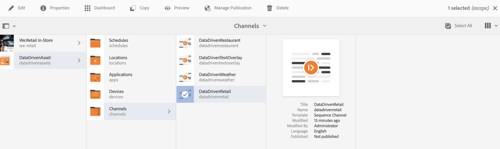
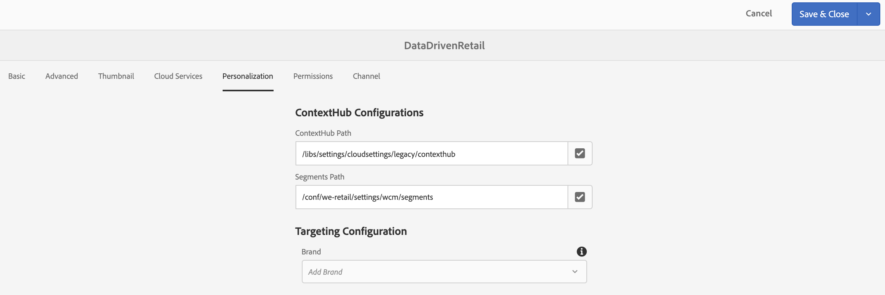
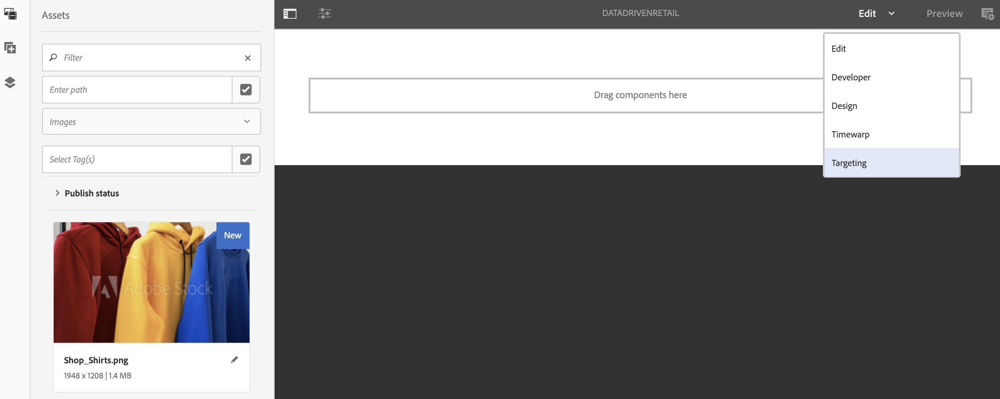

# Creación con Déclencheur de datos {#authoring-with-data-triggers}

>[!IMPORTANT]
>Este contenido es válido para AEM on-premise/AMS (AEM 6.5LTS y AEM 6.5). Para el contenido de AEM as a Cloud Service Screens, consulte la [guía de AEM as a Cloud Service](https://experienceleague.adobe.com/en/docs/experience-manager-cloud-service/content/screens-as-cloud-service/overview/introduction).

En esta sección se explica cómo habilitar el direccionamiento en los canales.

>[!IMPORTANT]
>
>La versión mínima que admite déclencheur de datos en un canal de AEM Screens es AEM 6.5.3 Feature Pack 3.

## Requisitos previos {#prereqs}

Antes de seguir los pasos siguientes para habilitar el direccionamiento en los canales, aprenda los [términos clave en Configuración en AEM Screens](configuring-context-hub.md) necesarios para comprender ContextHub y el direccionamiento en AEM Screens.

>[!IMPORTANT]
>
>Se recomienda comprender y configurar las configuraciones de ContextHub antes de habilitar el direccionamiento en un canal de AEM Screens.

Siga los vínculos a continuación para obtener más información:

1. **[Configurando almacén de datos](configuring-context-hub.md)**
1. **[Configurando la segmentación de audiencia](configuring-context-hub.md)**

Cuando haya completado los pasos anteriores, estará listo para habilitar el direccionamiento en sus canales.

## Información general sobre la creación con Déclencheur de datos {#author-targeting}

>[!VIDEO](https://video.tv.adobe.com/v/31921)

## Habilitar la segmentación en un canal de AEM Screens {#enabling-targeting}

Siga los pasos a continuación para habilitar el direccionamiento en sus canales.

1. Vaya a uno de los canales de AEM Screens. Los siguientes pasos muestran cómo habilitar el direccionamiento mediante **DataDrivenRetail** *(canal de secuencia)* creado en un canal de AEM Screens.

1. Haga clic en el canal **DataDrivenRetail** y, a continuación, haga clic en **Propiedades** en la barra de acciones.

   

1. Haga clic en la ficha **Personalization** para configurar las configuraciones de ContextHub y hacer clic en la ruta de acceso de ContextHub y segmentos.

   1. Haga clic en la ruta de acceso de **ContextHub** como **libs** > **settings** > **cloudsettings** > **default** > **Configuraciones de ContextHub** y haga clic en **Click**.

   1. Haga clic en la ruta de acceso de **segmentos** como **conf** > **`We.Retail`** > **settings** > **wcm** > **segments** y haga clic en **Click**.

   1. Haga clic en **Guardar y cerrar**.

   >[!NOTE]
   >
   >Utilice ContextHub y la ruta de segmentos, donde guardó inicialmente las configuraciones y segmentos de Context Hub.

   

1. Navegue y haga clic en **DataDrivenRetail** desde **DataDrivenAssets** > **Canales** y haga clic en **Editar** en la barra de acciones. Arrastre y suelte los recursos en el editor de canales.

   >[!NOTE]
   >
   >Si ha configurado todo correctamente, verá la opción **Segmentación** en la lista desplegable del editor, como se muestra en la figura siguiente.

   

1. Haga clic en **Segmentación**.

1. Haga clic en **Marca** y en la **Actividad** del menú desplegable y luego haga clic en **Iniciar segmentación**.

### Más información: Casos de uso de ejemplo {#learn-more-example-use-cases}

Después de configurar ContextHub para el proyecto de AEM Screens, puede seguir los diferentes casos de uso para comprender cómo los recursos activados por datos desempeñan un papel vital en diferentes industrias:

1. **[Activación objetivo de inventario comercial](retail-inventory-activation.md)**
1. **[Activación de temperatura en el centro de viajes](local-temperature-activation.md)**
1. **[Activación de reserva de hospitalidad](hospitality-reservation-activation.md)**

