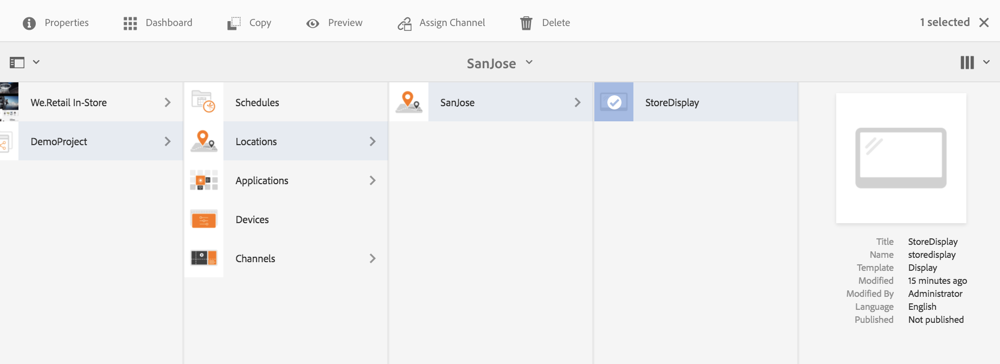

# Asignación de canales {#channel-assignment}

>[!IMPORTANT]
>En esta sección se destaca la asignación de canales y la programación de canales para paquetes de funciones anteriores a la versión de AEM 6.5.5 de Screens.

Cuando haya configurado una pantalla, asigne un canal a una pantalla para ver el contenido.

Esta página muestra la asignación de un canal a la visualización.

Este contenido es válido para AEM on-premise/AMS (AEM 6.5LTS y AEM 6.5). Para el contenido de AEM as a Cloud Service Screens, consulte la [guía de AEM as a Cloud Service](https://experienceleague.adobe.com/en/docs/experience-manager-cloud-service/content/screens-as-cloud-service/overview/introduction).

>[!NOTE]
>Puede asignar varios canales a una visualización.

## Asignación de un canal {#assign-a-channel}

Siga los pasos a continuación para asignar un canal a una visualización:

1. Vaya a la pantalla requerida, por ejemplo, **DemoProject** > **Ubicaciones** > **SanJose** > **StoreDisplay**.

   

1. Haga clic en **Asignar canal** en la barra de acciones.

   o,

   Haga clic en **Panel** y luego en **+Asignar canal** en el panel **CANALES ASIGNADOS** para poder abrir el cuadro de diálogo **Asignación de canal**.

   

   Puede configurar las propiedades desde el cuadro de diálogo **Asignación de canal** en la sección siguiente. Consulte la sección [Propiedades del canal](#channel-properties) para obtener más información sobre las propiedades del canal.

## Explicación de las propiedades de canal de la asignación de canal {#channel-properties}

### Canal de referencia {#ref-channel}

Un canal de referencia permite proporcionar una referencia al canal deseado, ya sea por nombre de canal o por ruta de canal.

* **por ruta de acceso**: se proporciona una referencia explícita mediante la ruta de acceso absoluta del canal.

* **por nombre**: escribe el nombre del canal que se resuelve en un canal real por contexto. Esta función permite crear una versión local de un canal para poder resolver de forma dinámica contenido específico de la ubicación. Por ejemplo, un canal con el nombre *ofertas del día*, donde el contenido real sería diferente en dos ciudades, pero aún tiene el rol de canal simulado en todas las pantallas.

### Función del canal {#role-channel}

La función Canal define el contexto de la visualización. La función se dirige a varias acciones y es independiente del canal real que cumple la función.

### Prioridad {#priority-channel}

La prioridad se usa para ordenar las asignaciones en caso de que varias coincidan con los criterios de reproducción. El que tiene el valor más alto siempre tiene prioridad sobre los valores más bajos. Por ejemplo, si hay dos canales, A y B. A tiene una prioridad de 1 y B tiene una prioridad de 2. A continuación, se muestra el canal B, ya que tiene una prioridad mayor que A.

>[!NOTE]
>La prioridad de un canal se establece como un número (1 como mínimo) en el cuadro de diálogo **Asignación de canal**, como se mencionó anteriormente. Además, los canales asignados se ordenan según la prioridad descendente.

### Eventos admitidos {#supported-events-channel}

* **Carga inicial**: carga el canal cuando se inicia el reproductor. Se puede asignar a varios canales con una programación.
* **Pantalla inactiva**: se carga cuando la pantalla está inactiva. Se puede asignar a varios canales con una programación.
* **Temporizador**: debe establecerse cuando se proporcione una programación.
* **Interacción de usuario**: el reproductor cambia al canal especificado si hay una interacción de usuario en la pantalla (táctil) en un canal inactivo y se carga cuando se toca la pantalla.

### Método de interrupción {#interruption-method-channel}

>[!IMPORTANT]
>
> Esta opción solo está disponible con <!--AEM 6.4 Feature Pack 8 or -->AEM 6.5 Feature Pack 4.

Como autor de contenido, especifique cuándo se interrumpe un canal. Al hacerlo, puede cortar el contenido no crítico si lo desea, pero también puede permitir que el contenido importante se reproduzca antes de cortar su reproducción debido a la programación.

Haga clic en una de las siguientes opciones disponibles para establecer el método de interrupción desde el cuadro de diálogo **Asignación de canal**:

* **Inmediatamente**: cada vez que se active la programación o se reciba una actualización, puede interrumpir la reproducción y actualizar o reproducir inmediatamente el nuevo contenido.
* **Al final del elemento actual**: cuando se active una nueva programación o se reciba una actualización, puede esperar opcionalmente a que el elemento actual de la secuencia termine de reproducirse. Solo después de eso puede actualizar o reproducir el nuevo contenido.

  >[!NOTE]
  >Esta opción está seleccionada de forma predeterminada.
* **Al final de la secuencia**: cuando se activa una nueva programación o se recibe una actualización, puede esperar opcionalmente a que toda la secuencia llegue a su final. A continuación, justo antes de la secuencia deseada, puede volver al primer elemento, actualizar o reproducir el nuevo contenido.

  >[!NOTE]
  >El uso de la segunda o tercera opción puede hacer que los tiempos de programación definidos en la asignación se difieran ligeramente. El motivo es que el reproductor espera el final del elemento o la secuencia (después del tiempo especificado) antes de actualizar. El retraso depende de la duración de reproducción del elemento.

### Programación {#schedule-channel}

Programar permite proporcionar una descripción en texto cuando el canal debe aparecer. También le permite definir una fecha de inicio (**activa desde**) y una fecha de finalización (**activa hasta**) para que se muestre el canal.

**Mostrar información sobre atracciones**

Mostrar información de objeto de atracción define si la información de objeto de atracción (&quot;*Pulsar en cualquier lugar para comenzar*&quot;) debe mostrarse o no mientras se ejecuta el canal.

### DayParting {#dayparting}

Programaciones, cuando se combina con **DayParting**, le permite establecer una programación global con varios canales que se ejecutan a horas específicas del día y reutilizar esa configuración para todas las pantallas a la vez.

DayParting se denomina dividir un día en espacios de tiempo y especificar qué contenido se reproduce a la hora deseada. AEM Screens permite programar canales en términos de Partición del día en un día, una semana o un mes según sea necesario.

Los siguientes ejemplos explican la partición de día en canales de tres escenarios diferentes:

#### Reproducción de contenido en un solo día dividido en varias franjas horarias {#playing-content-on-a-single-day-divided-into-multiple-time-slots}

Este ejemplo muestra cómo un restaurante utiliza DayParting para mostrar su menú de desayuno, almuerzo y cena.

En este caso, se divide cada día en tres franjas horarias diferentes para que el contenido del canal se reproduzca a la hora especificada del día:

| **Canal** | **Función** | **Prioridad** | **Programación** |
|---|---|---|---|
| Menú_A | Desayuno |  | Después de 6:00 y antes de 11:00 |
| Menu_B | Almuerzo |  | Después de 11:00 y antes de 15:00 |
| Menu_C | Cena |  | Después de 15:00 y antes de 20:00 |

#### Reproducción de contenido en un día de la semana concreto {#playing-content-on-a-particular-day-of-the-week}

Este ejemplo muestra el dayParting logrado en un casino donde el evento en vivo ocurre todos los fines de semana desde las 8:00 p.m. hasta las 10:00 p.m. y los especiales están disponibles para el menú de cena después de las 10:00 p.m. hasta las 1:00 a.m.

<table>
 <tbody>
  <tr>
   <td><strong>Canal</strong></td>
   <td><strong>Función</strong></td>
   <td><strong>Prioridad</strong></td>
   <td><strong>Programación</strong></td>
  </tr>
  <tr>
   <td>LiveConcert</td>
   <td>Weekend</td>
   <td> </td>
   <td>Del 21 de octubre de 2017 al 22 de octubre de 2017   después de las 20:00 antes de las 22:00</td>
  </tr>
  <tr>
   <td>SpecialsDinner</td>
   <td>Weekend</td>
   <td> </td>
   <td>Del 21 de octubre de 2017 al 22 de octubre de 2017   después de las 22:00 antes de la 1:00</td>
  </tr>
 </tbody>
</table>

#### Reproducción de contenido durante un mes o meses determinados {#playing-content-for-a-particular-month-months}

En este ejemplo se muestra el DayParting de una tienda que muestra su colección de verano de los meses de junio a agosto y la colección de otoño de septiembre a finales de octubre.

Aquí puede crear DayParting por mes, de modo que el contenido del canal se reproduzca según los meses del año especificados.

| **Canal** | **Función** | **Prioridad** | **Programación** |
|---|---|---|---|
| SummerCollection | Verano |  | 1 de junio de 2017 - 31 de agosto de 2017 |
| FallCollection | Otoño |  | 1 de septiembre de 2017: 30 de octubre de 2017 |

>[!NOTE]
>
>Además, puede definir ***Prioridad*** para cada uno de los canales. Por ejemplo, si se establecen dos canales para el mismo día y hora o para el mismo mes, el canal con mayor prioridad se reproduce primero. El valor mínimo de prioridad puede establecerse como 0.

#### Reproducción de contenido para canales con la misma prioridad {#playing-content-for-channels-with-same-priority}

En este ejemplo se muestra el DayParting de una tienda que muestra su colección de invierno con la misma programación en el mes de diciembre. Pero dado que el canal B tiene la prioridad establecida como 2, durante esa semana; el canal B reproduce su contenido en lugar de canal A.

| **Canal** | **Función** | **Prioridad** | **Programación** |
|---|---|---|---|
| A | Invierno | 1 | Del 1 de diciembre de 2017 al 31 de diciembre de 2017 |
| B | Navidad | 2 | Del 24 de diciembre de 2017 al 31 de diciembre de 2017 |

>[!NOTE]
>
> Para obtener más información sobre DayParting, consulte las secciones siguientes:
>
>* [Administrar la periodicidad en Assets](https://experienceleague.adobe.com/en/docs/experience-manager-screens/user-guide/authoring/product-features/asset-level-scheduling)
>* [Administrar la periodicidad para Assets en un canal](https://experienceleague.adobe.com/en/docs/experience-manager-screens/user-guide/authoring/product-features/channel-level-activation)

