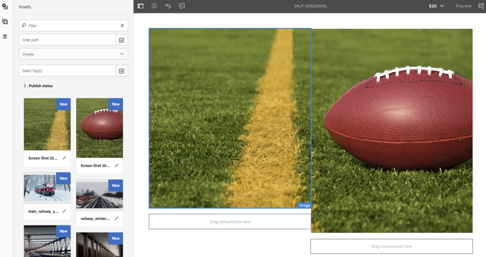

# Editor de diseño de canal {#channel-layout-editor}

***El Editor de diseño de canal*** permite crear contenido de varias zonas y usar una variedad de recursos tales como vídeos, imágenes y texto que se pueden combinar en una sola pantalla de manera contextual. Puede insertar imágenes, vídeos y texto, así como permitir que todo esto se combine para crear una experiencia digital intuitiva e interactiva.

Según los requisitos del proyecto, a veces se necesitan varias zonas en un canal, así como poder editarlas como una sola unidad completa. Por ejemplo, una secuencia de productos con una fuente de medios sociales relacionada que se ejecuta en tres zonas distintas en un solo canal.

## Información general {#overview}

Al crear un canal, puede utilizar plantillas diferentes para crear zonas en el canal. Puede añadir una imagen, un vídeo o un canal integrado para usar el contenido según los requisitos del proyecto.

### Descripción de caso de uso {#use-case-description}

En el siguiente caso de uso se describe la creación de zonas en un canal.

1. ***Crear un proyecto de Screens***

   1. Seleccione el vínculo de Adobe Experience Manager (superior izquierda) y, a continuación, **Screens**. Alternatively, you can go directly to: `http://localhost:4502/screens.html/content/screens`.
   1. Click **Create** to create a new Screens project.
   1. Select **Screens** from the **Create Screens Project** wizard and click **Next**.
   1. Enter the title as **Channel Layout Project** and click **Create**.
   

1. ***Crear un canal***

   1. Navigate to **Channel Layout Project**.
   1. Haga clic en **Crear** en la barra de acciones. Se abrirá un asistente.
   1. Choose the **1x2 Split Screen Channel** and click **Next**.
   1. Enter the **Title** as **Split horizontal** and click **Create**.
   

1. ***Adición de contenido al canal***

   1. Navigate to the **Channel Layout Project** you created and select the channel (**Split Channel**).
   1. Click **Edit** from the action bar and the editor for the **Split Channel** opens.
   1. Haga clic en el icono que alterna el panel lateral del lado izquierdo de la barra de acciones para abrir los recursos y componentes. Arrastre los componentes que quiera añadir y colóquelos en el canal.
   

   >[!NOTE]
   >
   >Por ejemplo, se añaden las siguientes dos imágenes al canal en el editor.

   

1. ***Creación de una ubicación***

   1. Navigate to the Locations folder where you want to create your display (**Channel Layout Project**--&gt; **Locations**).
   1. Haga clic en **Crear** en la barra de acciones.
   1. Select **Location** from the **Create** wizard and click **Next**.
   1. Enter **Title** for your location as **San Jose**.
   1. Haga clic en **Crear**.
   

1. ***Creación de una nueva muestra***

   1. Navigate to the location where you want to create your display (**Acme** --&gt; **Locations** --&gt; **San Jose**) and select **San Jose**.
   1. Haga clic en **Crear** en la barra de acciones. Select **Display** from the **Create** wizard and click **Next**.
   1. Enter **Title** for your display location (enter the title as **Split Display)**.
   1. Under the **Display** tab, choose the details of the Layout. Choose the **Resolution** as **Full HD**. Choose the **Number of Devices Horizontally** as 1 and the **Number of Devices Vertically** as **1**.
   1. Haga clic en **Crear**.
   

1. ***Asignación de un canal***

   1. Navigate to the display from **Channel Layout Project** --&gt; **Locations** --&gt; **San Jose** --&gt; **Split Display**.
   1. Select **Split Display** and tap/click **Assign Channel** from the action bar, Or,
   1. Click **Dashboard** and select **+Assign Channel** at the top right from **ASSIGNED CHANNELS &amp; SCHEDULES** panel. **Se abre el cuadro de diálogo Asignación** de canal.
   1. Enter the **Channel Role** as **Split**.
   1. Select **Reference Channel** by path. Select the channel folder path (**Channel Layout Project** --&gt; **Channels** --&gt; **Split horizontal**) in the Channel.
   1. Select the **Priority** for this channel as **1**.
   1. Choose the **Supported Events** as **Initial Load** and **Idle Screen**.
   1. Haga clic en **Guardar**.
   

1. ***Registro y asignación del dispositivo***

   1. Abra una nueva ventana del navegador. Vaya al reproductor de pantallas con el navegador web o inicie la aplicación AEM Screens.
   1. Cuando abra el dispositivo, verá el estado de este como no registrado. From the AEM dashboard, navigate to **Channel Layout Project** --&gt; **Devices**.
   1. Click **Device Manager** from the action bar.
   1. Click **Device Registration** and you will see the pending devices. Select the device you want to register and click **Register Device**.
   1. Tendrá que validar el código con la verificación de código del explorador web o el reproductor AEM Screens. Click **Validate** to navigate to **Device Registration** screen.
   1. Enter Title as **NewD** and click **Register** and the device will be registered.
   1. Click **Assign Display** to move on to the next step where you assign the device to a display.
   1. Haga clic en Asignar dispositivo y seleccione la ruta de visualización del canal () como /content/screen/Test_Project/Locations/TestLocation/TestDisplay. Click **Assign**.
   1. Click **Finish** to complete the process, and now the device is assigned.
   

#### Visualización de contenido en el reproductor de AEM Screens {#viewing-content-in-aem-screens-player}

Cargue el reproductor de AEM Screens o utilice el navegador web. Verá el contenido del canal que se muestra en el reproductor Screens. El contenido se muestra como una plantilla de canal en la pantalla dividida 1x2.

### Inferencia {#inference}

El uso de las plantillas disponibles al crear un canal permite aprovechar y visualizar el contenido en distintas zonas. En el ejemplo anterior se muestra el caso de uso de la plantilla 2x2.

En las siguientes imágenes se muestra el diseño que se puede lograr mediante distintas plantillas.
