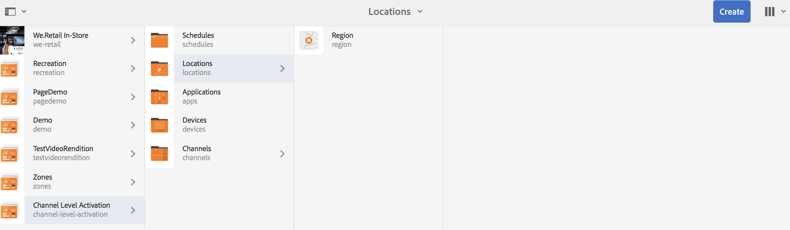
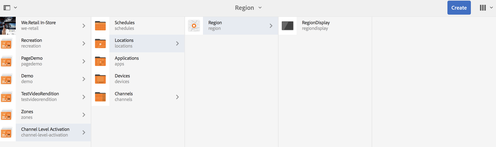
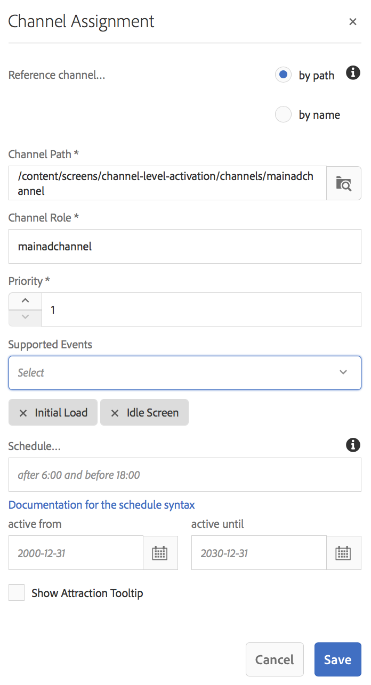

# Activación de nivel de canal {#channel-level-activation-single-event-playback}

>[!IMPORTANT]
>Este contenido es válido para AEM on-premise/AMS (AEM 6.5LTS y AEM 6.5). Para el contenido de AEM as a Cloud Service Screens, consulte la [guía de AEM as a Cloud Service](https://experienceleague.adobe.com/es/docs/experience-manager-cloud-service/content/screens-as-cloud-service/overview/introduction).

Esta página describe la activación a nivel de canal para los recursos utilizados en Canales.

En esta sección se tratan los siguientes temas:

* Información general
* Ventana de activación
* Uso de la activación a nivel de canal como reproducción de evento único
* Administrar la periodicidad para Assets en un canal
   * DayParting
   * WeekParting
   * MonthParting
   * Combinación de Particiones
* Uso de la activación a nivel de canal como reproducción de evento único

## Información general {#overview}

***Activación a nivel de canal*** permite que los canales cambien después de una programación establecida en particular. El canal de evento único reemplaza al canal principal después de una programación establecida y se reproduce durante un tiempo determinado, hasta que el canal principal vuelva a reproducir su contenido.

En el ejemplo siguiente se proporciona una solución centrándose en los términos clave siguientes:

* un ***canal de secuencia principal*** para la secuencia global
* un ***canal de evento único*** que se ejecuta solo una vez a la hora establecida
* ***establecer programación y prioridad*** para el único evento de reproducción que se produce dentro del canal de secuencia principal

## Ventana de activación {#using-channel-level-activation}

En la siguiente sección se explica la creación de una única reproducción de evento dentro de un canal para un proyecto de AEM Screens.

### Requisitos previos {#prerequisites}

Antes de comenzar a implementar esta funcionalidad, asegúrese de que tiene los siguientes requisitos previos listos para comenzar a implementar la activación a nivel de canal:

* Cree un proyecto de AEM Screens, en este ejemplo, **Activación a nivel de canal**.

* Cree un canal como **MainAdChannel** en la carpeta **Canales**.

* Cree otro canal como **TargetedSinglePlay** en la carpeta **Canales**.

* Agregue los recursos relevantes a ambos canales.

La siguiente imagen muestra el proyecto **Activación a nivel de canal** con los canales **MainAdChannel** y **TargetedSinglePlay** en la carpeta **Channels**.

>[!NOTE]
>
>Para obtener información adicional sobre cómo crear un proyecto y cómo crear un canal de secuencia, consulte los siguientes recursos:
>
>* [Creación y administración de proyectos](creating-a-screens-project.md)
>
>* [Administrar un canal](managing-channels.md)
>

### Implementación {#implementation}

La implementación de la activación a nivel de canal en un proyecto de AEM Screens implica tres tareas principales:

1. **Configurando taxonomía de proyecto que incluye canales, ubicaciones y pantallas**
1. **Asignando canales a la pantalla**
1. **Configurar un horario y una prioridad**

Siga los pasos a continuación para implementar la funcionalidad:

1. **Crear una ubicación**

   Vaya a la carpeta **Ubicaciones** de su proyecto de AEM Screens y cree una ubicación como **Región**.

   

   >[!NOTE]
   >
   >Para obtener información sobre cómo crear una ubicación, vea **[Crear y administrar ubicaciones](managing-locations.md)**.

1. **Crear pantalla en la ubicación**

   1. Vaya a **Activación a nivel de canal** > **Ubicaciones** > **Región**.
   1. Haga clic en **Región** y luego en **+ Crear** en la barra de acciones.
   1. Haga clic en **Mostrar** en el asistente y cree una pantalla con el título **RegiónMostrar.**

   

1. **Asignar canales a la pantalla**

   Para **MainAdChannel:**

   1. Vaya a **Activación a nivel de canal** > **Ubicaciones** > **Región** > **Visualización de región** y haga clic en **Asignar canal** en la barra de acciones.
   1. En el cuadro de diálogo **Asignación de canal**, haga clic en **Canal de referencia** por ruta.
   1. Haga clic en la **Ruta del canal** y luego haga clic en **Activación a nivel de canal** > ***Canales*** > ***MainAdChannel***.
   1. El **Rol de canal** se ha rellenado como **mainadchannel**.
   1. Haga clic en la **prioridad** y establézcala en **1**.
   1. Haga clic en **Eventos admitidos**, como **Carga inicial** y **Pantalla inactiva**.
   1. Haga clic en **Guardar**.

   

   >[!NOTE]
   >
   >También puede asignar el canal desde el panel de visualización. Vaya a **Activación a nivel de canal** > **Ubicaciones** > **Región** > **Visualización de región**. En la barra de acciones, seleccione **Panel**. En el panel **CANALES Y PROGRAMACIONES ASIGNADOS**, haga clic en **+ Asignar canal**.

   Del mismo modo, asigne el canal **TargetedSinglePlay** para su visualización**:

   1. Vaya a **Activación a nivel de canal** > **Ubicaciones** > **Región** > **Visualización de región** y haga clic en **Asignar canal** en la barra de acciones.
   1. En el cuadro de diálogo **Asignación de canal**, haga clic en **Canal de referencia** por ruta.
   1. Haga clic en la **Ruta del canal** y, a continuación, haga clic en **Activación a nivel de canal** > ***Canales*** > ***TargetedSinglePlay***.
   1. La **función de canal** se ha completado como **targetedsingleplay**.
   1. Establezca la **Prioridad** en **2**.
   1. Haga clic en **Eventos admitidos** y establezca **Carga inicial**, **Pantalla inactiva** y **Temporizador**, como se muestra en la figura siguiente.
   1. En **activo desde**, establecido como el 27 de noviembre de 2018 a las 11:59 p.m., y en **activo hasta**, establecido como el 28 de noviembre de 2018 a las 12:05 a.m.
   1. Haga clic en **Guardar**.

   >[!CAUTION]
   >
   >Establece la prioridad del canal **TargetedSinglePlay** más alta que el canal **MainAdSegment**.

   

   >[!NOTE]
   >
   >Para elegir el mismo día, haga clic en el siguiente día y, a continuación, edite manualmente la fecha en el mismo día, pero para una hora posterior. Al hacerlo, se restringe al usuario de la selección de una fecha pasada. Consulte el siguiente ejemplo:

   

## Visualización de los resultados {#viewing-the-results}

Cuando haya completado la configuración de los canales y la visualización, inicie el Reproductor de AEM Screens para ver el contenido.

El reproductor muestra el contenido de **MainAdChannel** y exactamente a las 11:59 p.m. (como se establece en la programación), el canal **TargetedSinglePlay** muestra su contenido hasta las 12:05 a.m. y luego **MainAdChannel** reanuda la reproducción de su contenido.

>[!NOTE]
>
>Para obtener información acerca del Reproductor de pantalla de AEM, consulte los siguientes recursos:>[Descargas del Reproductor de AEM Screens](https://download.macromedia.com/screens/)
>[Trabajar con el reproductor AEM Screens](working-with-screens-player.md)

## Administrar la periodicidad para Assets en un canal {#handling-recurrence-in-assets}

Puede programar los recursos de un canal para que se repitan a intervalos específicos diariamente, semanalmente o mensualmente, según sus necesidades.

Supongamos que desea mostrar el contenido de un canal solamente los viernes de 1:00 p.m. a 10:00 p.m. Puede usar la pestaña **Activación** para establecer el intervalo recurrente deseado para su recurso.

### División por día {#day-parting}

1. Haga clic en el canal y luego en **Tablero** en la barra de acciones.

1. Después de escribir la fecha/hora de inicio y la fecha/hora de finalización desde el cuadro de diálogo **Asignación de canal**, puede usar una expresión o una versión de texto natural para especificar la programación de periodicidad.

   >[!NOTE]
   >
   >Puede omitir o incluir los campos **Activo desde** y **Activo hasta** y agregar la expresión al campo Programaciones, según sus requisitos.

1. Escriba la expresión en **Schedule** y el recurso se mostrará durante el intervalo particular de día y hora.

#### Expresiones de ejemplo para la partición por día {#example-one}

En la tabla siguiente se resumen algunas expresiones de ejemplo que se pueden añadir a la programación al asignar un canal a una visualización.

| **Expresión** | **Interpretación** |
|---|---|
| antes de las 8:00 a.m. | el recurso del canal se reproduce antes de las 8:00 a.m. todos los días |
| después de las 2:00 p.m. | el recurso del canal se reproduce después de las 2:00 de la tarde todos los días |
| después de 12:15 y antes de 12:45 | el recurso del canal se reproduce después de las 12:15 p. m. todos los días durante 30 minutos |
| antes de 12:15 también después de 12:45 | el recurso del canal se reproduce antes de las 12:15 p.m. todos los días y después de las 12:45 p.m. |
| Lun, Mar, Mié o Lun-Mié | el recurso se reproduce en el recurso del canal de lunes a miércoles |
| el primer día de enero después de las 2:00 p.m., también el segundo día de enero y también el tercer día de enero antes de las 3:00 a.m. | el recurso del canal comienza a reproducirse después de las 2:00 de la tarde del 1 de enero y continúa reproduciéndose durante todo el día del 2 de enero hasta las 3:00 de la mañana del 3 de enero |
| el 1-2 días de enero después de las 2:00 p.m. también el 2-3 días de enero antes de las 3:00 a.m. | el recurso del canal inicia el reproductor después de las 2:00 p.m. del 1 de enero, continúa reproduciendo hasta las 3:00 a.m. del 2 de enero, luego comienza nuevamente el 2 de enero a las 2:00 p.m. y continúa reproduciendo hasta las 3:00 a.m. del 3 de enero |

>[!NOTE]
>
>También puede usar la notación _tiempo militar_ (14:00) en lugar de *A.M./P.M.* (2:00 P.M.).

### WeekParting {#week-parting}

1. Haga clic en el canal y luego en **Tablero** en la barra de acciones.

1. Después de escribir la fecha/hora de inicio y la fecha/hora de finalización desde el cuadro de diálogo **Asignación de canal**, puede usar una expresión o una versión de texto natural para especificar la programación de periodicidad.

   >[!NOTE]
   >
   >Puede omitir o incluir los campos **Activo desde** y **Activo hasta** y agregar la expresión al campo Programaciones, según sus requisitos.

1. Escriba la expresión en **Schedule** y el recurso se mostrará durante el intervalo particular de día y hora.

#### Expresiones de ejemplo para WeekParting {#example-two}

En la tabla siguiente se resumen algunas expresiones de ejemplo que se pueden añadir a la programación al asignar un canal a una visualización.

| **Expresión** | **Interpretación** |
|---|---|
| Lun, Mar, Mié o Lun-Mié | el recurso se reproduce en el recurso del canal de lunes a miércoles |
| antes de las 8:00 a.m. | el recurso del canal se reproduce antes de las 8:00 a.m. todos los días |
| después de las 2:00 p.m. | el recurso del canal se reproduce después de las 2:00 de la tarde todos los días |
| después de 12:15 y antes de 12:45 | el recurso del canal se reproduce después de las 12:15 p. m. todos los días durante 30 minutos |
| antes de 12:15 también después de 12:45 | el canal se reproduce antes de las 12:15 p.m. todos los días y después de las 12:45 p.m. |

>[!NOTE]
>
>También puede usar la notación _tiempo militar_ (14:00) en lugar de *A.M./P.M.* (2:00 P.M.).

### MonthParting {#month-parting}

1. Haga clic en el canal y luego en **Tablero** en la barra de acciones.

1. Después de escribir la fecha/hora de inicio y la fecha/hora de finalización desde el cuadro de diálogo **Asignación de canal**, puede usar una expresión o una versión de texto natural para especificar la programación de periodicidad.

   >[!NOTE]
   >
   >Puede omitir o incluir los campos **Activo desde** y **Activo hasta** y agregar la expresión al campo Programaciones, según sus requisitos.

1. Escriba la expresión en **Schedule** y el recurso se mostrará durante el intervalo particular de día y hora.

#### Expresiones de ejemplo para MonthParting {#example-three}

En la tabla siguiente se resumen algunas expresiones de ejemplo que se pueden añadir a la programación al asignar un canal a una visualización.

| **Expresión** | **Interpretación** |
|---|---|
| de `February,May,August,November` | el recurso se reproduce en el canal en febrero, mayo, agosto y noviembre |

>[!NOTE]
>
>Al definir los días de la semana y los meses, puede utilizar las anotaciones de nombre corto y completo, como Lunes/Lunes y Enero/Enero.

>[!NOTE]
>
>También puede usar la notación _tiempo militar_ (14:00) en lugar de *A.M./P.M.* (2:00 P.M.).

### Combinación de Particiones {#combined-parting}

1. Haga clic en el canal y luego en **Tablero** en la barra de acciones.

1. Después de escribir la fecha/hora de inicio y la fecha/hora de finalización desde el cuadro de diálogo **Asignación de canal**, puede usar una expresión o una versión de texto natural para especificar la programación de periodicidad.

   >[!NOTE]
   >
   >Puede omitir o incluir los campos **Activo desde** y **Activo hasta** y agregar la expresión al campo Programaciones, según sus requisitos.

1. Escriba la expresión en **Schedule** y el recurso se mostrará durante el intervalo particular de día y hora.

#### Expresiones de ejemplo para combinación de particiones {#example-four}

En la tabla siguiente se resumen algunas expresiones de ejemplo que se pueden añadir a la programación al asignar un canal a una visualización.

| **Expresión** | **Interpretación** |
|---|---|
| después del 6:00 y antes del 18:00 el lunes, miércoles de enero a marzo | el recurso se reproduce en el canal entre las 6 a. m. y las 6 p. m. los lunes y miércoles de enero a finales de marzo |
| el primer día de enero después de las 2:00 p.m., también el segundo día de enero y también el tercer día de enero antes de las 3:00 a.m. | el recurso del canal comienza a reproducirse después de las 2:00 de la tarde del 1 de enero y continúa reproduciéndose durante todo el día del 2 de enero hasta las 3:00 de la mañana del 3 de enero |
| el 1-2 días de enero después de las 2:00 p.m. también el 2-3 días de enero antes de las 3:00 a.m. | el recurso del canal inicia el reproductor después de las 2:00 p.m. del 1 de enero, continúa reproduciendo hasta las 3:00 a.m. del 2 de enero, luego comienza nuevamente el 2 de enero a las 2:00 p.m. y continúa reproduciendo hasta las 3:00 a.m. del 3 de enero |

>[!NOTE]
>
>Al definir los días de la semana y los meses, puede utilizar las notaciones de nombre completo y abreviado, como Lunes/Lunes y Enero/Enero. También puede usar la notación _tiempo militar_ (14:00) en lugar de *A.M./P.M.* (2:00 P.M.).
