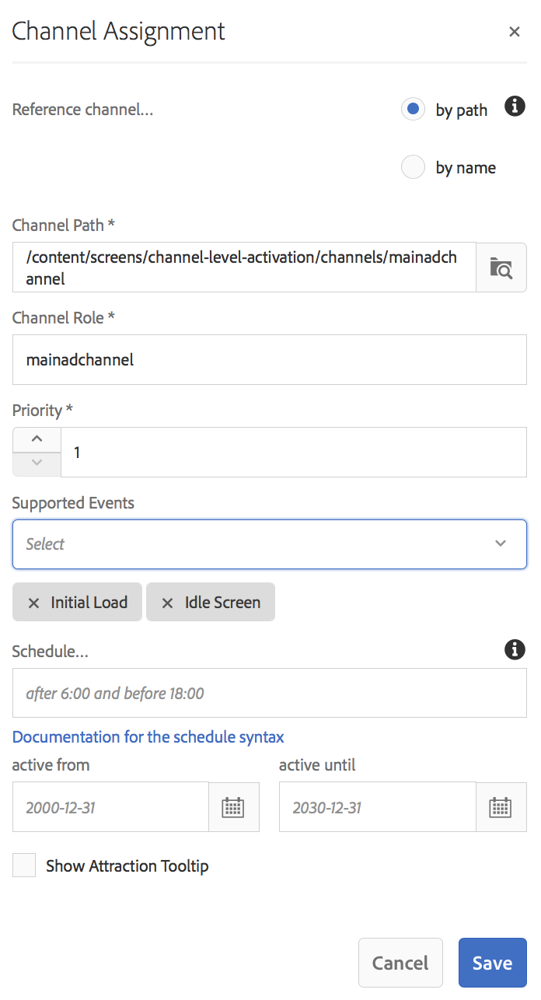

# Activación de nivel de canal {#channel-level-activation-single-event-playback}

El uso de la activación de nivel de canal cubre los siguientes temas:

* Información general
* Uso de la activación de nivel de canal como una reproducción de evento única

## Información general {#overview}

***La activación*** de nivel de canal permite que los canales cambien después de una programación de conjunto concreta. El canal de evento único reemplaza al canal principal después de una programación establecida y se reproduce durante un tiempo determinado, hasta que el canal principal vuelve a reproducir su contenido.

El siguiente ejemplo proporciona una solución centrándose en los siguientes términos clave:

* un canal ***de secuencia*** principal para la secuencia global
* un canal ***de evento*** único que se ejecuta una sola vez a la hora establecida
* una programación ***establecida y una prioridad*** para el evento de una sola reproducción que se produce dentro del canal de la secuencia principal

## Uso de la activación de nivel de canal {#using-channel-level-activation}

En la sección siguiente se explica la creación de una sola reproducción de evento dentro de un canal para un proyecto de AEM Screens.

### Requisitos previos {#prerequisites}

Antes de empezar a implementar esta funcionalidad, asegúrese de que dispone de los siguientes requisitos previos para empezar a implementar la activación a nivel de canal:

* Creación de un proyecto de AEM Screens, en este ejemplo Activación a nivel **de canal**

* Crear un canal como **MainAdChannel** en la carpeta **Canales**

* Crear otro canal como **TargetedSinglePlay** en la carpeta **Canales**

* Agregar recursos relevantes a ambos canales

La siguiente imagen muestra el proyecto de activación **a nivel de** canal con los canales **MainAdChannel** y **TargetedSinglePlay** en la carpeta **Canales** .

>[!NOTE]
>
>Para obtener información adicional sobre cómo crear un proyecto y cómo crear un canal de secuencia, consulte los recursos siguientes:
>
>* [Creación y administración de proyectos](creating-a-screens-project.md)
   >
   >
* [Administración de un canal](managing-channels.md)
>

### Implementación {#implementation}

La implementación de la activación de nivel de canal en un proyecto de AEM Screens implica tres tareas principales:

1. **Configuración de la taxonomía del proyecto, incluidos los canales, las ubicaciones y las pantallas**
1. **Asignación de canales para mostrar**
1. **Configuración de una programación y una prioridad**

Siga los pasos a continuación para implementar la funcionalidad:

1. **Crear una ubicación**

   Vaya a la carpeta **Ubicaciones** del proyecto de AEM Screens y cree una ubicación como **Región**.

   

   >[!NOTE]
   >
   >Para obtener información sobre cómo crear una ubicación, consulte **[Creación y administración de ubicaciones](managing-locations.md)**.

1. **Crear visualización en Ubicación**

   1. Vaya a Activación **a nivel** de canal > **Ubicaciones** > **Región**.
   1. Seleccione **Región** y haga clic en **+ Crear** en la barra de acciones.
   1. Seleccione **Mostrar** en el asistente y cree una pantalla con el título **RegiónMostrar.**
   

1. **Asignar canales para mostrar**

   Para **MainAdChannel:**

   1. Vaya a Activación **a nivel de** canal > **Ubicaciones** > **Región** > **RegiónVisualización** y haga clic en **Asignar canal** en la barra de acciones.
   1. **Se abre el cuadro de diálogo Asignación** de canal.
   1. Select **Reference Channel**.. by path.
   1. Seleccione la ruta **de** canal como activación **de nivel de** canal —> ***Canales*** —> ***MainAdChannel***.
   1. La función **** de canal se rellena como **mainadchannel**.
   1. Seleccione la **prioridad** como **1**.
   1. Select the **Supported Events** as **Initial Load** and **Idle Screen**.
   1. Haga clic en **Guardar**.
   

   >[!NOTE]
   >
   >También puede asignar canal desde el tablero de visualización navegando a Activación **a nivel de** canal —> **Ubicaciones** —> **Región** —> **RegiónMostrar** y haciendo clic en **Tablero** en la barra de acciones. Haga clic en **+ Asignar canal** desde el panel CANALES y PROGRAMAS **ASIGNADOS** .

   Del mismo modo, asigne channel **TargetedSinglePlay** para la visualización**:

   1. Vaya a Activación **a nivel de** canal —> **Ubicaciones** —> **Región** —> **RegiónVisualización** y haga clic en **Asignar canal** en la barra de acciones.
   1. **Se abre el cuadro de diálogo Asignación** de canal.
   1. Select **Reference Channel**.. by path.
   1. Seleccione la ruta **de** canal como activación **a nivel** de canal* —> ***Canales*** —> ***TargetedSinglePlay***.
   1. La función **de canal** se rellena como **target singleplay**.
   1. Establezca la **prioridad** como **2**.
   1. Seleccione los eventos **** admitidos como carga **** inicial, **pantalla** inactiva y **temporizador**, *como se muestra en la figura siguiente.
   1. Elija la fecha en **activo desde** el 27 de noviembre de 2018 a las 11:59 y en **activo hasta** el 28 de noviembre de 2018 a las 12:05.
   1. Haga clic en **Guardar**.
   >[!CAUTION]
   Debe establecer la prioridad para el canal **TargetedSinglePlay** más alta que el canal **MainAdSegment** .

   

   >[!NOTE]
   Para elegir el mismo día, debe seleccionar el día siguiente y editar la fecha manualmente hasta el mismo día, pero para más tarde. Esto impide que el usuario seleccione una fecha pasada. Consulte el ejemplo siguiente:

   

## Visualización de los resultados {#viewing-the-results}

Una vez que haya configurado los canales y se haya completado la visualización, inicie el reproductor de AEM Screens para ver el contenido.

El reproductor muestra el contenido de **MainAdChannel** y exactamente a las 11:59 (según lo establecido en la programación), el canal **TargetedSinglePlay** mostrará su contenido hasta las 12:05 a.m. y luego **MainAdChannel** reanudará la reproducción de su contenido.

>[!NOTE]
Para obtener más información sobre AEM Screen Player, consulte los siguientes recursos:
* [Descargas de AEM Screens Player](https://download.macromedia.com/screens/)
* [Uso de AEM Screens Player](working-with-screens-player.md)

