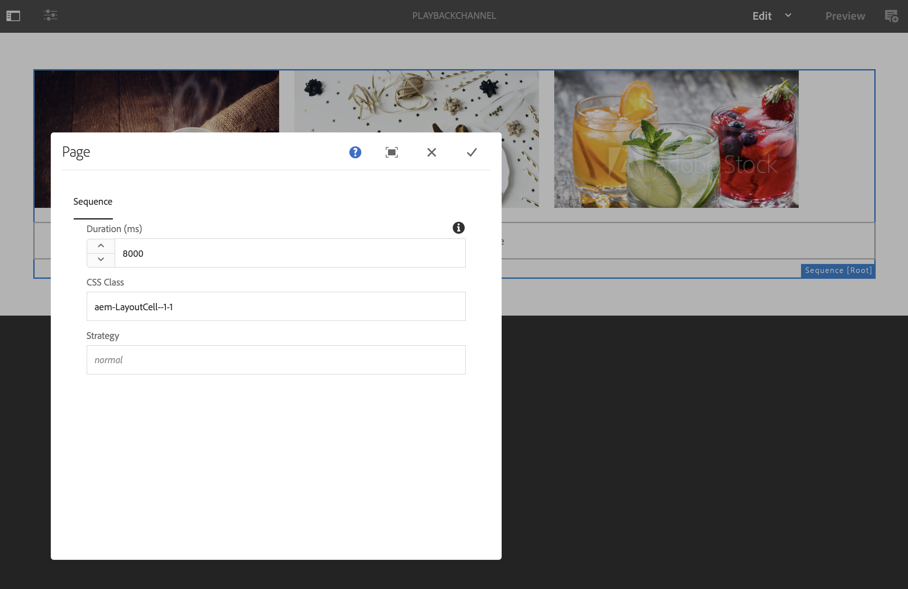

# Duración de reproducción masiva de imágenes a nivel de canal {#channel-level-bulk-image-playback-duration}

## Información general {#overview}

Al crear un canal de secuencia y agregarle imágenes, de forma predeterminada, todas las imágenes asumen la duración de reproducción definida en la configuración de nivel de canal. Cualquier imagen individual puede seguir anulando el valor predeterminado y tener una duración de reproducción diferente. Esta capacidad se logra editando la duración de reproducción del componente de imagen específico.

### Requisitos previos {#prerequisites}

Antes de comenzar a implementar esta funcionalidad, asegúrese de haber configurado un proyecto como requisito previo para comenzar a implementarlo. Por ejemplo,

1. Cree un ejemplo de proyecto de AEM Screens, **ChannelLevelPlayback**.

1. Crear un canal de secuencia como **CanalDeReproducción** en el **Canales** carpeta.

1. Añadir contenido a **CanalDeReproducción**.

## Edición de asignación de duración de reproducción de imagen a nivel de canal {#editing-channel-level-image-playback-duration-assignment}

En la sección siguiente se explica cómo editar la duración de reproducción del contenido en un canal de AEM Screens.

### Actualización de la duración de reproducción de las imágenes de un canal {#updating-the-playback-duration-for-images-in-a-channel}

Siga los pasos a continuación para aprender a actualizar la asignación de duración de reproducción de imagen a nivel de canal:

1. Vaya al canal de secuencia **CanalDeReproducción**.

   

1. Clic **Editar** de la barra de acciones.

   

1. Añada dos o más imágenes en el editor de canales, como se muestra en la figura siguiente.

   

1. Haga clic en todas las imágenes del canal y haga clic en el icono de la llave inglesa en la parte superior izquierda (como se muestra en la figura siguiente) para abrir el cuadro de diálogo Configurar nivel de canal.

   

1. El **Página** se abre el cuadro de diálogo.

   >[!NOTE]
   >De forma predeterminada, las imágenes de un canal se establecen en una duración de reproducción de 8 segundos.

   

   Edite el **Duración** de 8000 (milisegundos) a 3000 (milisegundos), es decir, 3 segundos. Haga clic en la marca de verificación situada en la parte superior derecha del **Página** para que pueda guardar los cambios.

   

### Visualización del resultado {#viewing-the-result}

Después de actualizar la duración de reproducción del canal (en este ejemplo, las tres imágenes), observe que las imágenes ahora se reproducen durante 3 segundos en lugar de 8 segundos (el valor predeterminado).

