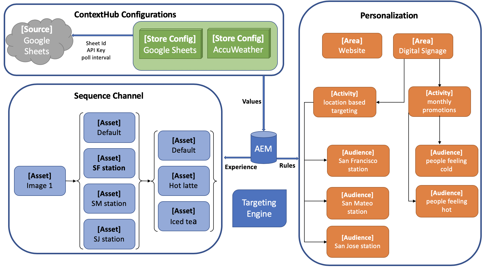

# Configuración de ContextHub en AEM Screens {#configuring-contexthub-in-aem-screens}

Esta sección hace hincapié en la creación y administración de cambios de recursos impulsados por datos mediante un almacén de datos.

## Términos clave {#key-terms}

Antes de entrar en los detalles de la creación y administración de canales impulsados por el inventario en su proyecto de AEM Screens, conozca algunos de los términos clave para los diferentes escenarios.

**Marca** - Su descripción de alto nivel del proyecto.

**Área**: el nombre de su proyecto de AEM Screens, como señalización de publicidad digital

**Actividad**: define las reglas de categoría como Gobernado por inventario, Gobernado por tiempo o Gobernado por disponibilidad del departamento.

**Audiencia**: define la regla.

**Segmento**: versión de un recurso que se reproducirá para la regla determinada. Por ejemplo, si la temperatura es inferior a 50 grados Fahrenheit, la pantalla muestra una imagen de una bebida caliente; de lo contrario, una bebida fría.

El diagrama siguiente proporciona una representación visual de cómo las configuraciones de ContextHub coinciden con la actividad, la audiencia y los canales.



## Condiciones previas {#preconditions}

Antes de empezar a configurar las configuraciones de ContextHub para un proyecto de AEM Screens, configure las hojas de Google (con fines de demostración).

>[!IMPORTANT]
>
>En el ejemplo siguiente, se utilizan las Hojas de cálculo de Google como sistema de base de datos de ejemplo desde el que se recuperan los valores y que es únicamente con fines educativos. Adobe no recomienda el uso de Hojas de cálculo de Google para entornos de producción.
>
>Para obtener más información, consulte [Obtener clave API](https://developers.google.com/maps/documentation/javascript/get-api-key) en la documentación de Google.

## Paso 1: Configuración de un almacén de datos {#step-setting-up-a-data-store}

Puede configurar el almacén de datos como un evento de E/S local o como un evento de base de datos local.

El siguiente ejemplo de déclencheur de datos de nivel de recurso muestra un evento de base de datos local. El evento configura un almacén de datos, como una hoja de Excel, que permite utilizar las configuraciones de ContextHub y las rutas de segmentos al canal de AEM Screens.

Después de configurar la hoja `google` correctamente, como se muestra en el ejemplo siguiente:


La siguiente validación es lo que ve al comprobar la conexión al escribir los dos valores, `*google sheet ID*` y `*API key*` en el formato siguiente:

`https://sheets.googleapis.com/v4/spreadsheets/<your sheet id>/values/Sheet1?key=<your API key>`


>[!NOTE]
>
>El ejemplo específico siguiente muestra las Hojas de cálculo de Google como un almacén de datos que almacena un déclencheur de cambio de recursos si el valor es superior a 100 o inferior a 50.

## Paso 2: Configuración de tiendas {#step-setting-store-configurations}

1. **Navegando a ContextHub**

   Vaya a la instancia de AEM y haga clic en el icono de herramientas en la barra lateral izquierda. Haga clic en **Sitios** > **ContextHub**, como se muestra en la figura siguiente.

   

1. **Creando una configuración de tienda de ContextHub**

   1. Vaya al contenedor de configuración titulado **screens**.

   1. Haga clic en **Crear** > **Crear contenedor de configuración** e introduzca el título como **ContextHubDemo**.

      

   1. **Vaya** a **ContextHubDemo** > **Crear** **configuración de ContentHub** y haga clic en **Guardar**.

      >[!NOTE]
      > Después de hacer clic en **Guardar**, se encuentra en la pantalla **Configuración de ContextHub**.

   1. En la pantalla **Configuración de ContextHub**, haga clic en **Crear** > **Configuración de tienda de ContentHub**

   

   >[!CAUTION]
   >
   >Como parte del paquete de funciones 4 de AEM 6.5 o del paquete de funciones 8 de AEM 6.4, los clientes deben actualizar `/conf/screens/settings/cloudsettings` a `sling:Folder`.
   >
   >Complete los siguientes pasos:
   >
   >1. Vaya a CRXDE Lite y luego a `/conf/screens/settings/cloudsettings`.
   >1. Comprobar si `cloudsettings jcr:primaryType` está en `sling:Folder`. Si `jcr:primaryType` no está en `sling:folder`, continúe con los pasos siguientes.
   >1. Haga clic con el botón secundario en `/conf/screens/settings`, cree un nodo con *nombre* como **`cloudsettings1`** y *Tipo* como **`sling:Folder`**, y guarde los cambios.
   >1. Mueva todos los nodos bajo `/conf/screens/settings/cloudsettings` a `cloudsettings1`.
   >1. Elimine `cloudsettings` y guarde los cambios.
   >1. Cambie el nombre de `cloudsettings1` a `cloudsettings` y guárdelo.
   >1. Observe que `/conf/screens/settings/cloudsettings` tiene `jcr:primaryType` como `sling:Folder`.
   >
   >Siga estos pasos en Creación y publicación antes o después de la actualización.

   1. Escriba **Title** como **Google Sheets**, **Store Name** como **`googlesheets`** y **Store Type** como **c`ontexthub.generic-jsonp`** y haga clic en **Siguiente**.

      >[!CAUTION]
      >Si usa Adobe Experience Manager (AEM) 6.4, escriba **Configuration Title** como **`googlesheets`** y **Store Type** como **c`ontexthub.generic-jsonp`**.

      

   1. Introduzca la configuración json específica. Por ejemplo, puede usar el siguiente json con fines de demostración y hacer clic en **Guardar**. Verá la configuración de la tienda titulada **Hojas de cálculo de Google** en la configuración de ContextHub.

      >[!IMPORTANT]
      >Asegúrese de reemplazar el código con sus `*<Sheet ID>*` y `*<API Key>*`, que recuperó al configurar las hojas de Google.

      ```
       {
        "service": {
        "host": "sheets.googleapis.com",
        "port": 80,
        "path": "/v4/spreadsheets/<your google sheets id>/values/Sheet1",
        "jsonp": false,
        "secure": true,
        "params": {
        "key": "<your Google API key>"
       }
      },
      "pollInterval": 10000
      }
      ```

      >[!NOTE]
      >
      >En el código de ejemplo anterior, **pollInterval** define la frecuencia con la que se actualizan los valores (en milisegundos).
      >
      >Reemplace el código por sus `*<Sheet ID>*` y `*<API Key>*`, que recuperó al configurar las hojas de Google.

      >[!CAUTION]
      >
      >Si crea las Hojas de cálculo de Google para almacenar configuraciones fuera de la carpeta global (por ejemplo, en su propia carpeta de proyecto), el direccionamiento no funciona de forma predeterminada.

1. **Configurando la segmentación de tienda**

   1. Vaya a **Configuración de tienda de ContentHub**, cree otra configuración de tienda en el contenedor de configuración de AEM Screens y establezca **Título** como **segmentation-contexthub**, **Nombre de tienda** como **segmentation** y **Tipo de tienda** como **aem.segmentation**.

      

   1. Haz clic en **Siguiente** y luego en **Guardar**.

      >[!NOTE]
      >Omita el proceso de definición del json y déjelo en blanco.


## Paso 3: Configuración de segmentos en Audience Manager {#setting-up-audience}

1. **Creando segmentos en las audiencias**

   1. Vaya de su instancia de AEM a **Personalization** > **Audiencias** > **pantallas**.

   1. Haga clic en **Crear** > **Crear segmento de ContextHub.** Se abre el **nuevo segmento de ContextHub**.

   1. Escriba **Title** como `**Higherthan50**` y haga clic en **Crear**. Del mismo modo, cree otro segmento con el título `**Lowerthan50**`.

      

   1. Haga clic en el segmento `**Higherthan50**` y luego en **Propiedades** en la barra de acciones.
      

   1. Haga clic en la ficha **Personalization** en **Propiedades del segmento**. Establezca la **Ruta de ContextHub** en `/conf/screens/settings/cloudsettings/ContextHubDemo/contexthub configurations` y la **Ruta de segmentos** en `/conf/screens/settings/wcm/segments`, y haga clic en **Guardar**, como se muestra en la figura siguiente.

   

   1. Del mismo modo, establezca también la **Ruta de ContextHub** y la **Ruta de segmentos** para el segmento `**Lowerthan50**`.

## Paso 4: Configuración de marca y área {#setting-brand-area}

Siga los pasos a continuación para crear una marca en sus actividades y áreas bajo la marca:

1. **Creando una marca en actividades**

   1. Vaya de su instancia de AEM a **Personalization** > **Actividades**.

   1. Haga clic en **Crear** > **Crear marca**.

   1. Haga clic en **Marca** en el asistente para **Crear página** y luego en **Siguiente**.

   1. Escriba **Title** como **ScreensBrand** y haga clic en **Crear**. Su marca se creará como se muestra a continuación.

      


      >[!CAUTION]
      >
      >Problema conocido:
      >Para añadir un área, elimine la principal de la dirección URL, como
      >`http://localhost:4502/libs/cq/personalization/touch-ui/content/v2/activities.html/content/campaigns/screensbrand/master`.

1. **Creando un área en su marca**

   Siga los pasos a continuación para crear un área en la marca:

   1. Haga clic en **Crear** y luego en **Crear área**.

      

   1. Haga clic en **Área** del asistente para **Crear página** y luego haga clic en **Siguiente**.

   1. Escriba **Title** como **ScreensValue** y haga clic en **Crear**.
Se crea un área en su marca.

## Paso 5: Creación de los segmentos en una actividad {#step-setting-up-audience-segmentation}

Después de configurar un almacén de datos y definir la actividad (marca y área), siga los pasos a continuación para crear segmentos en la actividad.

1. **Creando segmentos en actividades**

   1. Vaya de su instancia de AEM a **Personalization** > **Actividades** > **ScreensBrand** >**ScreensValue**.

   1. Haga clic en **Crear** > **Crear actividad.** Se abre **Asistente para configurar actividad**.

   1. Escriba **Title** como **ValueCheck50** y **Name** como **valuecheck50**. Haga clic en **Motor de segmentación** como **ContextHub (AEM)** en la lista desplegable y haga clic en **Siguiente**.

      

   1. Haga clic en **Agregar experiencia** en el asistente de `**Configure Activity**`.

   1. En **Audiencias**, haga clic en `**Higherthan50**`, luego en **Agregar experiencia** y escriba **Título** como `**higherthan50**` **Nombre** como `**higherthan50**`. Haga clic en **Aceptar**.

   1. En **Audiencias**, haga clic en `**Lowerthan50**`, luego en **Agregar experiencia** y escriba **Título** como `**lowerthan50**` **Nombre** como `**lowerthan50**`. Haga clic en **Aceptar**.

   

   1. Haz clic en **Siguiente** y luego en **Guardar**. La actividad `**ValueCheck50**` se ha creado y configurado.

      

## Paso 5: Edición de segmentos en audiencias{#editing-audience-segmentation}

1. **Editando los segmentos**

   1. Vaya de su instancia de AEM a **Personalization** > **Audiencias** > **pantallas**.

   1. Haga clic en el segmento `**Higherthan50**` y, a continuación, haga clic en **Editar** en la barra de acciones.

   1. Arrastre y suelte el componente **Comparison: Property - Value** en el editor.

   1. Haga clic en el icono de llave inglesa para abrir el cuadro de diálogo **Comparando una propiedad con el valor**.

   1. Haga clic en **googlesheets/value/1/0** en la lista desplegable de **Nombre de propiedad**.

      >[!NOTE]
      > **googlesheets/value/1/0** hace referencia a la fila 2 y a la columna tal como se rellenan en `google` hojas en la figura siguiente:

      

   1. Haga clic en el **Operador** como **mayor que** en el menú desplegable.

   1. Escriba **Value** como **70**.

      >[!NOTE]
      >
      >AEM valida los datos de la Google Sheet mostrando el segmento como verde.

      

   Del mismo modo, edite los valores de propiedad en `**Lowerthan50**`.

   1. Arrastre y suelte el componente **Comparison: Property - Value** en el editor.

   1. Haga clic en el icono de llave inglesa.

   1. En el cuadro de diálogo **Comparando una propiedad con el valor**, haga clic en **hojas de cálculo/valor/1/0** en la lista desplegable de **Nombre de propiedad**.

   1. Haga clic en el **Operador** como **menor que** en el menú desplegable.

   1. Escriba **Value** como **50**.


## Habilitar la segmentación en canales {#step-enabling-targeting-in-channels}

Siga los pasos a continuación para habilitar el direccionamiento en sus canales.

1. Vaya a uno de los canales de AEM Screens. Los siguientes pasos muestran cómo habilitar el direccionamiento mediante **DataDrivenChannel** creado en un canal de AEM Screens.

1. Haga clic en el canal **TargetChannel** y luego en **Properties** en la barra de acciones.

   

1. Haga clic en la ficha **Personalization** para configurar las configuraciones de ContextHub.

   1. Establezca la **Ruta de ContextHub** en `/conf/screens/settings/wcm/segments` y la **Ruta de segmentos** en `/conf/screens/settings/wcm/segments`.
   1. Establezca la marca en **ScreensBrand** desde el menú desplegable y **establezca la referencia de área** en **ScreensValue**.

   1. Haga clic en **Guardar y cerrar**.

      >[!NOTE]
      >
      >Utilice ContextHub y la ruta de segmentos, donde guardó inicialmente las configuraciones y segmentos de ContextHub.

      

   1. Navegue y haga clic en el canal **TargetChannel** y luego haga clic en **Editar** en la barra de acciones.

      >[!NOTE]
      >
      >Si ha configurado todo correctamente, verá la opción **Segmentación** en la lista desplegable del editor, como se muestra en la figura siguiente.

      

## Más información: Casos de uso de ejemplo {#learn-more-example-use-cases}

Después de configurar ContextHub para el proyecto de AEM Screens, puede seguir los diferentes casos de uso para comprender cómo los recursos activados por datos desempeñan un papel vital en diferentes industrias:

1. **[Activación objetivo de inventario comercial](retail-inventory-activation.md)**
1. **[Activación de temperatura en el centro de viajes](local-temperature-activation.md)**
1. **[Activación de reserva de hospitalidad](hospitality-reservation-activation.md)**
