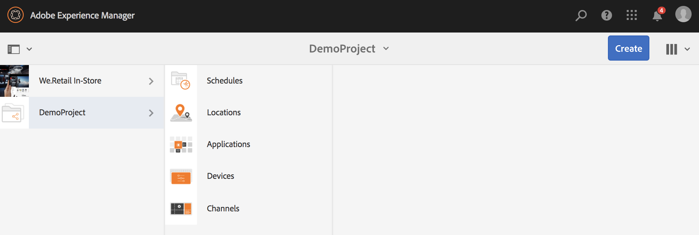

# Creating and Managing Projects {#creating-and-managing-projects}

Puede usar AEM Screens si selecciona el enlace de Adobe Experience Manager (en la parte superior izquierda) y, a continuación, la opción Screens.

También puede ir directamente a: `http://localhost:4502/screens.html/content/screens`

Diferentes proyectos podrían ser marcas, implementaciones, clientes, etc. diferentes.

>[!NOTE]
>
>**Sugerencia de navegación:**
>
>También puede utilizar las teclas de dirección para desplazarse por carpetas diferentes en AEM. Además, una vez seleccionada una entidad concreta, pulse en la barra espaciadora para editar o vista las propiedades de esa carpeta específica.

## Crear un nuevo proyecto de Screens{#creating-a-new-screens-project} 

Siga los pasos a continuación para crear un nuevo proyecto de Screens:

1. Seleccione **Screens** del panel de AEM.
1. Click **Create** --> **Create Project** and **Create Screens Project** wizard will open.

1. Select the **Screens** template and click **Next**.

1. Enter the properties (**Title** and **Name**) as required and click **Create**.

>[!NOTE]
>
>By default, the initial structure will contain the **Schedules**, **Locations**, **Applications**, **Channels**, and **Devices** master pages, but this can be manually adjusted if needed. Puede eliminar las opciones si las disponibles no son relevantes para el proyecto.

Se crea el proyecto y le lleva de nuevo a la consola del proyecto de Screens. Puede seleccionar el proyecto.

En un proyecto, hay cuatro tipo de carpetas, tal y como se muestra en la figura siguiente:

* **Programas**
* **Ubicaciones**
* **Aplicaciones**
* **Canales**
* **Dispositivos**

### Visualizar propiedades {#viewing-properties}

Once you create the Screens project, click **Properties** on the action bar to edit properties of an exiting AEM Screens project.

The following options allow you to edit/change properties of your *DemoProject*.

### Crear una carpeta personalizada {#creating-a-custom-folder}

También puede crear su propia carpeta personalizada en **las páginas de formato Programaciones**, **Ubicaciones**, **Aplicaciones**, **Canales** y **Dispositivos** disponibles en el proyecto.

Para crear una carpeta personalizada:

1. Select your project and click on **Create** next to plus icon in the action bar.
1. Cuando se abra el asistente **de creación**, seleccione la opción adecuada.
1. Haga clic en **Siguiente**. 
1. Especifique las propiedades y haga clic en **Crear**.

Los siguientes pasos muestran la creación de una carpeta de aplicaciones en la página de formato de **Aplicaciones** en *DemoProject*.

### Pasos siguientes {#the-next-steps}

Once you have created your own project, see [Channel Management](managing-channels.md) to create and manage content in your channel.

Además, puede crear su propia programación, aplicación, ubicación o dispositivo.
