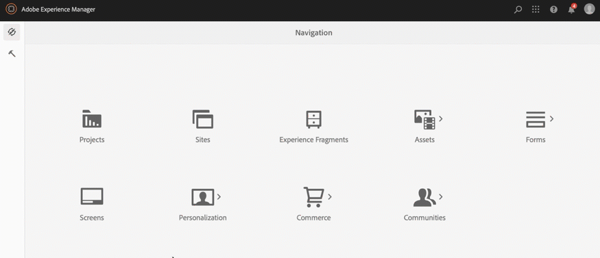

# Creación y administración de proyectos {#creating-and-managing-projects}

>[!IMPORTANT]
>Este contenido es válido para AEM on-premise/AMS (AEM 6.5LTS y AEM 6.5). Para el contenido de AEM as a Cloud Service Screens, consulte la [guía de AEM as a Cloud Service](https://experienceleague.adobe.com/en/docs/experience-manager-cloud-service/content/screens-as-cloud-service/overview/introduction).

AEM Screens está disponible seleccionando el vínculo Adobe Experience Manager (parte superior izquierda) y, a continuación, Screens.

También puede navegar directamente a: `http://localhost:4502/screens.html/content/screens`

>[!NOTE]
>**Sugerencia de navegación:**
>También puede usar las teclas de cursor para desplazarse por diferentes carpetas de AEM. Además, después de hacer clic en una entidad concreta, presione la barra espaciadora para editar o ver las propiedades de esa carpeta específica.

## Creación de un nuevo proyecto de Screens

1. Haz clic en **Screens** desde tu instancia de AEM.
1. Haga clic en **Crear proyecto de Screens**.
1. Escriba el título como **TestScreens** y haga clic en **Guardar**.

El proyecto se crea y le lleva de nuevo a la consola Proyecto de Screens. Ahora puede hacer clic en el proyecto.

En un proyecto hay cinco tipos de carpetas, como se muestra en la figura siguiente:

* **Horarios**
* **Ubicaciones**
* **Aplicaciones**
* **Dispositivos**
* **Canales**

>[!NOTE]
>
>De manera predeterminada, la estructura inicial contiene las páginas principales **Programaciones**, **Ubicaciones**, **Aplicaciones**, **Canales** y **Dispositivos**, pero esta estructura se puede ajustar manualmente si es necesario. Puede eliminar las opciones si las disponibles no son relevantes para el proyecto.

## Visualización de propiedades {#viewing-properties}

Después de crear el proyecto de Screens, haga clic en el proyecto y, a continuación, haga clic en **Propiedades** en la barra de acciones para poder editar las propiedades del proyecto.

Las siguientes opciones le permiten editar o cambiar las propiedades de **TestScreens**.

## Crear una carpeta personalizada {#creating-a-custom-folder}

También puede crear su propia carpeta personalizada en las páginas principales de **Programas**, **Ubicaciones**, **Aplicaciones**, **Canales** y **Dispositivos** que están disponibles en su proyecto.

Para crear una carpeta personalizada:

1. Haga clic en el proyecto y luego en **Crear** junto al icono de signo más en la barra de acciones.
1. Se abre el asistente **Crear** y haga clic en la opción correspondiente.
1. Haga clic en **Siguiente**.
1. Escriba las propiedades y haga clic en **Crear**.

Los siguientes pasos muestran la creación de una carpeta de aplicaciones en la página principal de **Aplicaciones** en **TestScreens**.

### Pasos siguientes {#the-next-steps}

Cuando haya creado su propio proyecto, consulte [Administración de canales](managing-channels.md) para crear y administrar contenido en su canal.
