# Creación de un flujo de trabajo de relleno de vídeo {#creating-a-video-padding-workflow}

>[!IMPORTANT]
>Este contenido es válido para AEM on-premise/AMS (AEM 6.5LTS y AEM 6.5). Para el contenido de AEM as a Cloud Service Screens, consulte la [guía de AEM as a Cloud Service](https://experienceleague.adobe.com/en/docs/experience-manager-cloud-service/content/screens-as-cloud-service/overview/introduction).

Esta sección trata los siguientes temas:

* **Información general**
* **Requisitos previos**
* **Creando un flujo de trabajo de relleno de vídeo**
   * **Creando un flujo de trabajo**
   * **Uso del flujo de trabajo en el proyecto de AEM Screens**

* **Validando la salida del flujo de trabajo**

## Información general {#overview}

El siguiente caso de uso implica colocar un vídeo (por ejemplo: 1280 x 720) en un canal en el que la visualización es de 1920 x 1080 y colocar el vídeo en 0x0 (parte superior izquierda). El vídeo no se debe estirar ni modificar de ninguna manera y no uses **Cover** en el componente de vídeo.

El vídeo se muestra como un objeto desde el píxel 1 al píxel 1280 de ancho y desde el píxel 1 al píxel 720 de abajo. El resto del canal es el color predeterminado.

## Requisitos previos {#prerequisites}

Antes de crear un flujo de trabajo para vídeo, complete los siguientes requisitos previos:

1. Cargue un vídeo en la carpeta **Assets** de su instancia de AEM
1. Cree un proyecto de AEM Screens (por ejemplo, **TestVideoRendition**) y un canal denominado (**VideoRendering**), como se muestra en la figura siguiente:

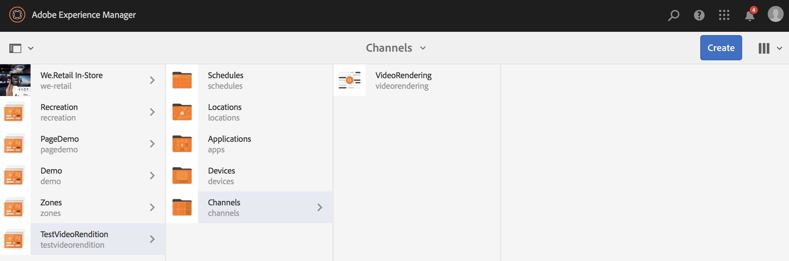

## Creación de un flujo de trabajo de relleno de vídeo {#creating-a-video-padding-workflow-1}

Para crear un flujo de trabajo de relleno de vídeo, cree un flujo de trabajo para el vídeo y, a continuación, utilice el mismo en el canal del proyecto de AEM Screens.

Siga los pasos a continuación para crear y utilizar el flujo de trabajo:

1. Creación de un flujo de trabajo
1. Uso del flujo de trabajo en un proyecto de AEM Screens

### Creación de un flujo de trabajo {#creating-a-workflow}

Siga los pasos a continuación para crear un flujo de trabajo para el vídeo:

1. Vaya a la instancia de AEM.
1. Haga clic en las herramientas desde el carril lateral.
1. Haga clic en **Flujo de trabajo** > **Modelos** para poder crear un modelo.

   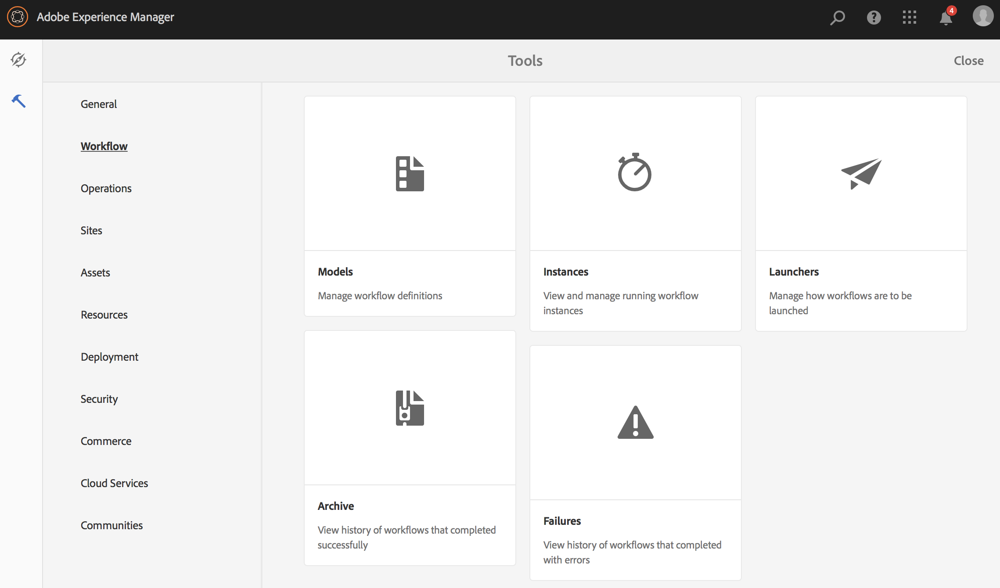

1. Haga clic en **Modelos** > **Crear** > **Crear modelo**. Escriba **Title** (como **VideoRendition**) y **Name** en **Agregar modelo de flujo de trabajo**. Haga clic en **Listo** para agregar el modelo de flujo de trabajo.

   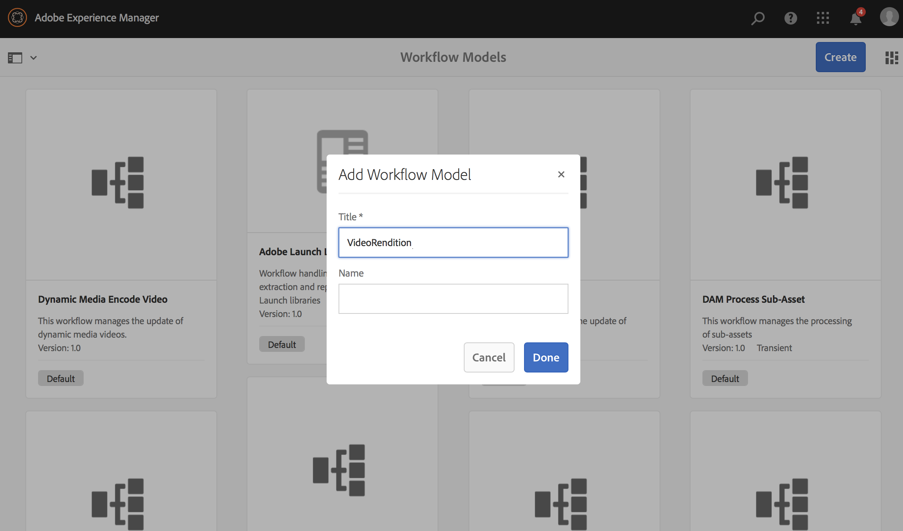

1. Después de crear el modelo de flujo de trabajo, haga clic en el modelo (**VideoRendition**) y, a continuación, haga clic en **Editar** en la barra de acciones.

   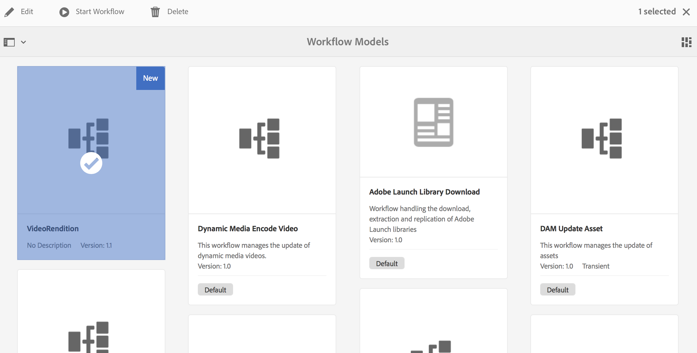

1. Arrastre y suelte el componente **`Command Line`** en el flujo de trabajo.

   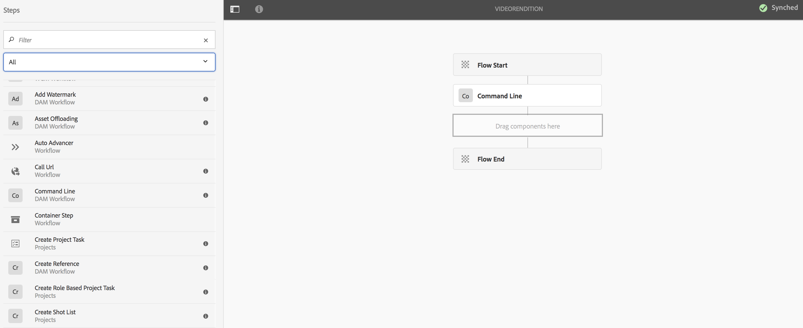

1. Haga clic en el componente **`Command Line`** y abra el cuadro de diálogo de propiedades.

   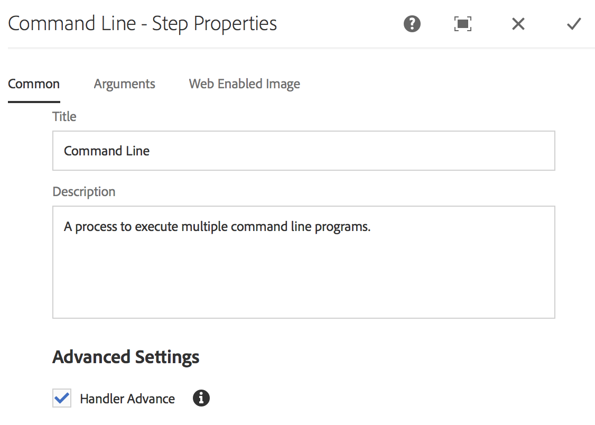

1. Haga clic en la ficha **Argumentos**.
1. En el cuadro de diálogo **Línea de comandos - Propiedades del paso**, escriba el formato en los **tipos MIME** (como ***video/mp4***) y el comando como (***`/usr/local/Cellar/ffmpeg -i ${filename} -vf "pad=1920:height=1080:x=0:y=0:color=black" cq5dam.video.fullhd-hp.mp4`***). Este comando inicia el flujo de trabajo en el campo **Commands**.

   Vea los detalles de **Tipos MIME** y **Comandos** en la nota siguiente.

   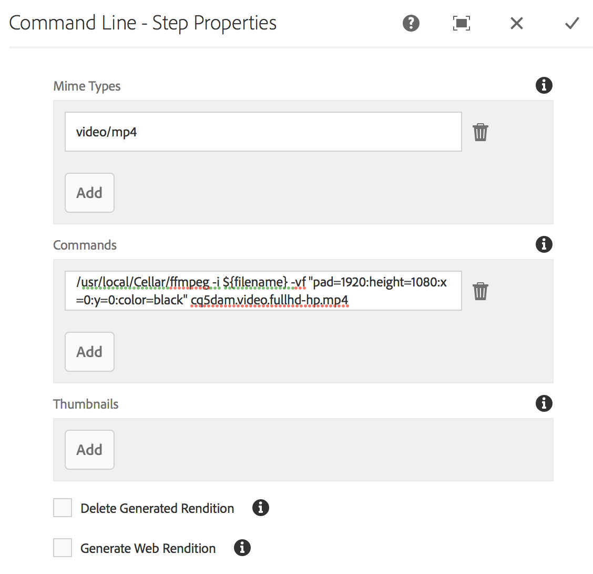

1. Haga clic en el flujo de trabajo (**VideoRenditions**).
1. Haga clic en **Iniciar flujo de trabajo** en la barra de acciones.

   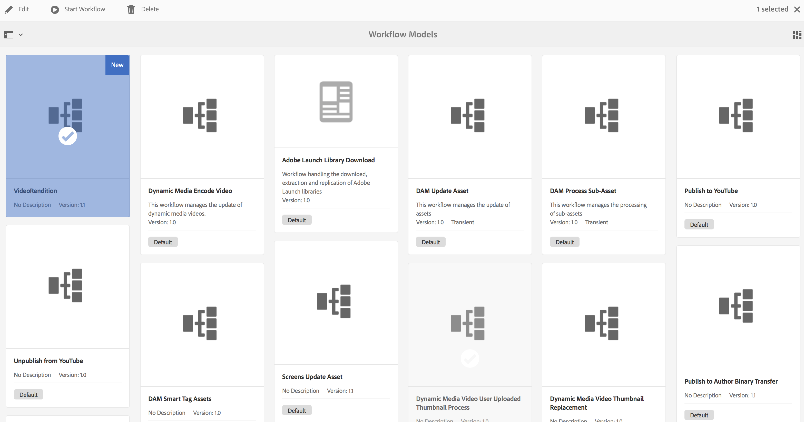

1. En el cuadro de diálogo **Ejecutar flujo de trabajo**, haga clic en la ruta del recurso en la **carga útil** (como ***/content/dam/huseinpeyda-cross01_512kb 2.mp4***), escriba el **Título** como ***RunVideo*** y haga clic en **Ejecutar**.

   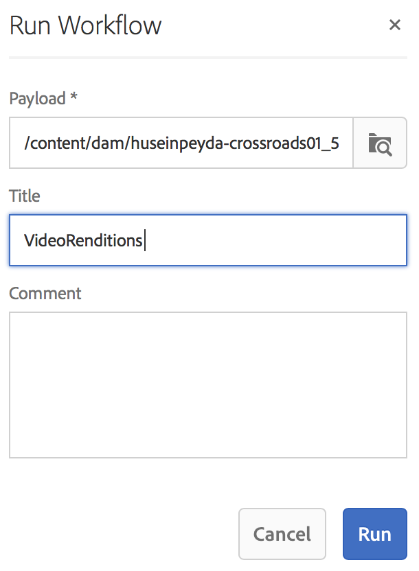

### Uso del flujo de trabajo en un proyecto de AEM Screens {#using-the-workflow-in-an-aem-screens-project}

Siga los pasos a continuación para utilizar el flujo de trabajo en su proyecto de AEM Screens:

1. Vaya a un proyecto de AEM Screens (**TestVideoRendition** > **Canales** >**VideoRendition**).

   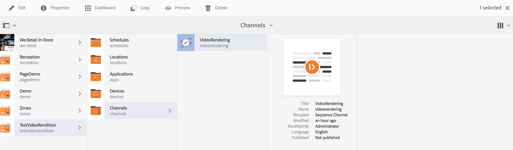

1. Haga clic en **Editar** en la barra de acciones. Arrastre y suelte el vídeo que subió inicialmente a **Assets**.

   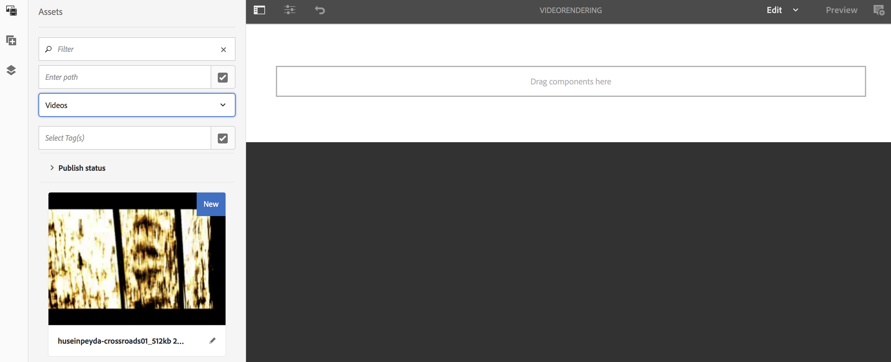

1. Cuando haya subido el vídeo, haga clic en **Vista previa** para ver el resultado.

   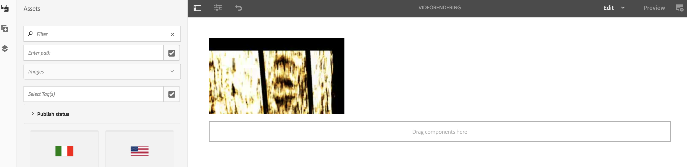

## Validación de la salida para el flujo de trabajo {#validating-the-output-for-the-workflow}

Para validar el resultado, haga lo siguiente:

* Compruebe una previsualización del vídeo en el canal
* Vaya a ***/content/dam/testvideo.mp4/jcr:content/renditions/cq5dam.video.fullhd-hp.mp4*** en CRXDE Lite, como se muestra en la figura siguiente:

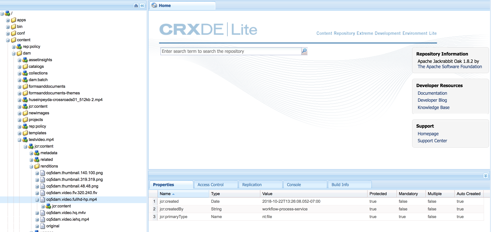
