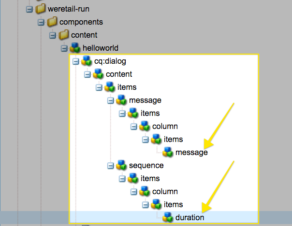
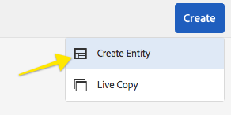

# Desarrollo de un componente personalizado para AEM Screens {#developing-a-custom-component-for-aem-screens}

En el siguiente tutorial se explican los pasos para crear un componente personalizado para AEM Screens. AEM Screens reutiliza muchos patrones de diseño y tecnologías existentes de otros productos de AEM. El tutorial resalta las diferencias y las consideraciones especiales al desarrollar para AEM Screens.

## Información general {#overview}

Este tutorial está dirigido a desarrolladores que no conocen AEM Screens. En este tutorial, se ha incorporado un sencillo componente &quot;Hello World&quot; para un canal de secuencia en AEM Screens. Un cuadro de diálogo permite a los autores actualizar el texto mostrado.


## Requisitos previos {#prerequisites}

Para completar este tutorial, es necesario lo siguiente:

1. [AEM 6.5](https://helpx.adobe.com/es/experience-manager/6-4/release-notes.html) o [AEM 6.3](https://helpx.adobe.com/es/experience-manager/6-3/release-notes.html) + paquete de funciones de las últimas pantallas

1. [Reproductor de AEM Screens](https://helpx.adobe.com/experience-manager/6-4/sites/deploying/using/configuring-screens-introduction.html)
1. Entorno de desarrollo local

Los pasos del tutorial y las capturas de pantalla se realizan con **CRXDE-Lite**. También se pueden utilizar IDE para completar el tutorial. Puede encontrar más información sobre el uso de un IDE para desarrollar [con AEM aquí.](https://helpx.adobe.com/experience-manager/kt/sites/using/getting-started-wknd-tutorial-develop/part1.html#eclipse-ide)


## Configuración del proyecto {#project-setup}

El código fuente de un proyecto de Screens suele gestionarse como un proyecto Maven de varios módulos. Para agilizar el tutorial, se generó un proyecto previamente mediante el [programa Archetype 13](https://github.com/Adobe-Marketing-Cloud/aem-project-archetype)de AEM Project. Puede encontrar más detalles sobre la [creación de un proyecto con el arquetipo del proyecto AEM de Maven aquí](https://helpx.adobe.com/experience-manager/kt/sites/using/getting-started-wknd-tutorial-develop/part1.html#maven-multimodule).

1. Descargue e instale los siguientes paquetes con el administrador [de paquetes](http://localhost:4502/crx/packmgr/index.jsp)CRX:

   [Obtener archivo](assets/base-screens-weretail-runuiapps-001-snapshot.zip)

   [Obtener archivo](assets/base-screens-weretail-runuicontent-001-snapshot.zip)
   **Opcionalmente** , si trabaja con Eclipse u otro IDE, descargue el siguiente paquete de origen. Implemente el proyecto en una instancia local de AEM mediante el comando Maven:

   **`mvn -PautoInstallPackage clean install`**

   Inicio HelloWorld SRC Screens We.Retail Run Project

   [Obtener archivo](assets/src-screens-weretail-run.zip)

1. En el Administrador [de paquetes](http://localhost:4502/crx/packmgr/index.jsp) CRX, verifique que se hayan instalado los dos paquetes siguientes:

   1. **screens-weretail-run.ui.content-0.0.1-SNAPSHOT.zip**
   1. **screens-weretail-run.ui.apps-0.0.1-SNAPSHOT.zip**
   

   Screens We.Retail Ejecute los paquetes Ui.Apps y Ui.Content instalados mediante el administrador de paquetes CRX

1. El paquete **screens-weretail-run.ui.apps** instala código debajo `/apps/weretail-run`.

   Este paquete contiene el código responsable de procesar los componentes personalizados del proyecto. Este paquete incluye código de componente y cualquier JavaScript o CSS necesario. Este paquete también incluye **screen-weretail-run.core-0.0.1-SNAPSHOT.jar** , que contiene cualquier código Java que necesite el proyecto.

   >[!NOTE]
   >
   >En este tutorial no se escribe ningún código Java. Si se necesita una lógica empresarial más compleja, se puede crear e implementar Java back-end mediante el paquete Core Java.

   

   Representación del código ui.apps en CRXDE Lite

   El componente **helloworld** actualmente es sólo un marcador de posición. Durante el tutorial, se agregará la funcionalidad que permite a un autor actualizar el mensaje que muestra el componente.

1. El paquete **screens-weretail-run.ui.content** instala código debajo de:

   * `/conf/we-retail-run`
   * `/content/dam/we-retail-run`
   * `/content/screens/we-retail-run`
   Este paquete contiene el contenido inicial y la estructura de configuración necesarias para el proyecto. **`/conf/we-retail-run`** contiene todas las configuraciones para el proyecto de ejecución We.Retail. **`/content/dam/we-retail-run`** incluye el inicio de recursos digitales para el proyecto. **`/content/screens/we-retail-run`** contiene la estructura de contenido Pantallas. El contenido debajo de todas estas rutas se actualiza principalmente en AEM. Para fomentar la coherencia entre entornos (local, Dev, Stage, Prod), a menudo se guarda una estructura de contenido base en el control de código fuente.

1. **Vaya al proyecto de ejecución de AEM Screens > We.Retail:**

   En el menú Inicio de AEM > Haga clic en el icono Pantallas. Verifique que se pueda ver el proyecto de ejecución We.Retail.

   

## Creación del componente Hello World {#hello-world-cmp}

El componente Hello World es un componente sencillo que permite al usuario introducir un mensaje para que se muestre en la pantalla. El componente se basa en la plantilla de componentes de pantallas de [AEM: https://github.com/Adobe-Marketing-Cloud/aem-screens-component-template](https://github.com/Adobe-Marketing-Cloud/aem-screens-component-template).

AEM Screens tiene algunas restricciones interesantes que no son necesariamente ciertas para los componentes de sitios WCM tradicionales.

* La mayoría de los componentes de Pantallas necesitan ejecutarse en pantalla completa en los dispositivos de señalización digital destinatario
* La mayoría de los componentes de Pantallas deben poder incrustarse en los canales de secuencias para generar proyecciones de diapositivas
* La creación debe permitir la edición de componentes individuales en un canal de secuencia, de modo que la representación en pantalla completa no está en cuestión

1. En **CRXDE-Lite** `http://localhost:4502/crx/de/index.jsp` (o IDE de su elección) navegue hasta `/apps/weretail-run/components/content/helloworld.`

   Añada las siguientes propiedades en el `helloworld` componente:

   ```
       jcr:title="Hello World"
       sling:resourceSuperType="foundation/components/parbase"
       componentGroup="We.Retail Run - Content"
   ```

   

   Propiedades para /apps/weretail-run/components/content/helloworld

   El componente **helloworld** extiende el componente **foundation/components/parbase** para que se pueda utilizar correctamente dentro de un canal de secuencia.

1. Crear un archivo con el `/apps/weretail-run/components/content/helloworld` nombre `helloworld.html.`

   Rellene el archivo con lo siguiente:

   ```xml
   <!--/*
   
    /apps/weretail-run/components/content/helloworld/helloworld.html
   
   */-->
   
   <!--/* production: preview authoring mode + unspecified mode (i.e. on publish) */-->
   <sly data-sly-test.production="${wcmmode.preview || wcmmode.disabled}" data-sly-include="production.html" />
   
   <!--/* edit: any other authoring mode, i.e. edit, design, scaffolding, etc. */-->
   <sly data-sly-test="${!production}" data-sly-include="edit.html" />
   ```

   Los componentes de pantalla requieren dos representaciones diferentes según el modo [de](https://helpx.adobe.com/experience-manager/6-4/sites/authoring/using/author-environment-tools.html#PageModes) creación que se utilice:

   1. **Producción**: Previsualización o modo de publicación (wcmmode=disabled)
   1. **Editar**: se utiliza para todos los demás modos de creación, es decir, edición, diseño, andamiaje, desarrollador...
   `helloworld.html`actúa como conmutador, comprobando qué modo de creación está activo actualmente y redirigiéndose a otro script HTL. Una convención común que utilizan los componentes de pantalla es tener un `edit.html` script para el modo de edición y un `production.html` script para el modo de producción.

1. Crear un archivo con el `/apps/weretail-run/components/content/helloworld` nombre `production.html.`

   Rellene el archivo con lo siguiente:

   ```xml
   <!--/*
    /apps/weretail-run/components/content/helloworld/production.html
   
   */-->
   
   <div data-duration="${properties.duration}" class="cmp-hello-world">
    <h1 class="cmp-hello-world__message">${properties.message}</h1>
   </div>
   ```

   Arriba está el marcado de producción para el componente Hello World. Se incluye un `data-duration` atributo, ya que el componente se utiliza en un canal de secuencia. El canal de la secuencia utiliza el `data-duration` atributo para saber durante cuánto tiempo se va a mostrar un elemento de secuencia.

   El componente procesa una `div` y una `h1` etiqueta con texto. `${properties.message}` es una parte de la secuencia de comandos HTML que mostrará el contenido de una propiedad JCR denominada `message`. Posteriormente se crea un cuadro de diálogo que permite al usuario introducir un valor para el texto de la `message` propiedad.

   Tenga en cuenta también que la notación BEM (Modificador de elemento de bloque) se utiliza con el componente. BEM es una convención de codificación CSS que facilita la creación de componentes reutilizables. BEM es la notación utilizada por los componentes [principales de](https://github.com/Adobe-Marketing-Cloud/aem-core-wcm-components/wiki/CSS-coding-conventions)AEM. Puede encontrar más información en: [https://getbem.com/](https://getbem.com/)

1. Crear un archivo con el `/apps/weretail-run/components/content/helloworld` nombre `edit.html.`

   Rellene el archivo con lo siguiente:

   ```xml
   <!--/*
   
    /apps/weretail-run/components/content/helloworld/edit.html
   
   */-->
   
   <!--/* if message populated */-->
   <div
    data-sly-test.message="${properties.message}"
    class="aem-Screens-editWrapper cmp-hello-world">
    <p class="cmp-hello-world__message">${message}</p>
   </div>
   
   <!--/* empty place holder */-->
   <div data-sly-test="${!message}"
        class="aem-Screens-editWrapper cq-placeholder cmp-hello-world"
        data-emptytext="${'Hello World' @ i18n, locale=request.locale}">
   </div>
   ```

   Arriba está el marcador de edición para el componente Hello World. El primer bloque muestra una versión de edición del componente si se ha rellenado el mensaje de diálogo.

   El segundo bloque se procesa si no se ha introducido ningún mensaje de cuadro de diálogo. El `cq-placeholder` y `data-emptytext` representa la etiqueta ***Hello World*** como un marcador de posición en ese caso. La cadena de la etiqueta se puede internacionalizar con i18n para admitir la creación en varias configuraciones regionales.

1. **Copiar cuadro de diálogo de imagen de pantalla que se usará para el componente Hola a todos.**

   Es más fácil inicio desde un cuadro de diálogo existente y luego realizar modificaciones.

   1. Copie el cuadro de diálogo de: `/libs/screens/core/components/content/image/cq:dialog`
   1. Pegar el cuadro de diálogo debajo `/apps/weretail-run/components/content/helloworld`
   

1. **Actualice el cuadro de diálogo Hola mundo para incluir una ficha para el mensaje.**

   Actualice el cuadro de diálogo para que coincida con lo siguiente. La estructura de nodos JCR del cuadro de diálogo final se presenta a continuación en XML:

   ```xml
   <?xml version="1.0" encoding="UTF-8"?>
   <jcr:root xmlns:sling="https://sling.apache.org/jcr/sling/1.0" xmlns:cq="https://www.day.com/jcr/cq/1.0" xmlns:jcr="https://www.jcp.org/jcr/1.0" xmlns:nt="https://www.jcp.org/jcr/nt/1.0"
       jcr:primaryType="nt:unstructured"
       jcr:title="Hello World"
       sling:resourceType="cq/gui/components/authoring/dialog">
       <content
           jcr:primaryType="nt:unstructured"
           sling:resourceType="granite/ui/components/coral/foundation/tabs"
           size="L">
           <items jcr:primaryType="nt:unstructured">
               <message
                   jcr:primaryType="nt:unstructured"
                   jcr:title="Message"
                   sling:resourceType="granite/ui/components/coral/foundation/fixedcolumns">
                   <items jcr:primaryType="nt:unstructured">
                       <column
                           jcr:primaryType="nt:unstructured"
                           sling:resourceType="granite/ui/components/coral/foundation/container">
                           <items jcr:primaryType="nt:unstructured">
                               <message
                                   jcr:primaryType="nt:unstructured"
                                   sling:resourceType="granite/ui/components/coral/foundation/form/textfield"
                                   fieldDescription="Message for component to display"
                                   fieldLabel="Message"
                                   name="./message"/>
                           </items>
                       </column>
                   </items>
               </message>
               <sequence
                   jcr:primaryType="nt:unstructured"
                   jcr:title="Sequence"
                   sling:resourceType="granite/ui/components/coral/foundation/fixedcolumns">
                   <items jcr:primaryType="nt:unstructured">
                       <column
                           jcr:primaryType="nt:unstructured"
                           sling:resourceType="granite/ui/components/coral/foundation/container">
                           <items jcr:primaryType="nt:unstructured">
                               <duration
                                   jcr:primaryType="nt:unstructured"
                                   sling:resourceType="granite/ui/components/coral/foundation/form/numberfield"
                                   defaultValue=""
                                   fieldDescription="Amount of time the image will be shown in the sequence, in milliseconds"
                                   fieldLabel="Duration (ms)"
                                   min="0"
                                   name="./duration"/>
                           </items>
                       </column>
                   </items>
               </sequence>
           </items>
       </content>
   </jcr:root>
   ```

   El campo de texto del mensaje se guardará en una propiedad con el nombre `message` y que el campo de número de la duración se guardará en una propiedad con el nombre `duration`. HTL hace referencia a estas dos propiedades `/apps/weretail-run/components/content/helloworld/production.html` como `${properties.message}` y `${properties.duration}`.

   

   Hola Mundo: cuadro de diálogo completado

## Crear bibliotecas del lado del cliente {#clientlibs}

Las bibliotecas del lado del cliente proporcionan un mecanismo para organizar y administrar los archivos CSS y JavaScript necesarios para una implementación de AEM.

Los componentes de AEM Screens se procesan de forma distinta en el modo de edición y en el modo de Previsualización/producción. Se crearán dos bibliotecas cliente, una para el modo de edición y otra para la Previsualización/producción.

1. Cree una carpeta para las bibliotecas del lado del cliente para el componente Hello World.

   Debajo de `/apps/weretail-run/components/content/helloworld`crear una nueva carpeta con el nombre `clientlibs`.

   

1. Debajo de la `clientlibs` carpeta, cree un nuevo nodo denominado `shared` de tipo `cq:ClientLibraryFolder.`

   

1. Añada las siguientes propiedades en la biblioteca de cliente compartida:

   * `allowProxy` | Booleano | `true`

   * `categories`| Cadena[] | `cq.screens.components`
   

   Propiedades para /apps/weretail-run/components/content/helloworld/clientlibs/shared

   La propiedad categorías es una cadena que identifica la biblioteca del cliente. La categoría cq.screen.components se utiliza tanto en el modo de edición como en el modo de Previsualización/producción. Por lo tanto, cualquier CSS/JS definido en la clientlib compartida se carga en todos los modos.

   Se recomienda no exponer nunca ninguna ruta directamente a /apps en un entorno de producción. La propiedad allowProxy garantiza que se haga referencia a CSS de la biblioteca del cliente y a JS mediante un prefijo of/etc.clientlibs.

1. Cree un archivo con el nombre `css.txt` debajo de la carpeta compartida.

   Rellene el archivo con lo siguiente:

   ```
   #base=css
   
   styles.less
   ```

1. Cree una carpeta con el nombre `css` debajo de la `shared` carpeta. Añada un archivo denominado `style.less` debajo de la `css` carpeta. La estructura de las bibliotecas cliente ahora debería tener este aspecto:

   

   En lugar de escribir CSS directamente, este tutorial utiliza MENOS. [LESS](https://lesscss.org/) es un precompilador de CSS popular que admite variables, mezclas y funciones de CSS. Las bibliotecas de cliente de AEM admiten de forma nativa la compilación LESS. Se pueden utilizar los compiladores de serie u otros precompiladores, pero es necesario compilarlos fuera de AEM.

1. Rellene `/apps/weretail-run/components/content/helloworld/clientlibs/shared/css/styles.less` con lo siguiente:

   ```css
   /**
       Shared Styles
      /apps/weretail-run/components/content/helloworld/clientlibs/shared/css/styles.less
   
   **/
   
   .cmp-hello-world {
       background-color: #fff;
   
    &__message {
     color: #000;
     font-family: Helvetica;
     text-align:center;
    }
   }
   ```

1. Copie y pegue la carpeta de la biblioteca del `shared` cliente para crear una nueva biblioteca de cliente denominada `production`.

   

   Copiar la biblioteca del cliente compartido para crear una nueva biblioteca del cliente de producción

1. Actualice la `categories` propiedad de la biblioteca de clientes de producción para que sea `cq.screens.components.production.`

   Esto garantiza que los estilos solo se carguen en el modo Previsualización/Producción.

   

   Propiedades para /apps/weretail-run/components/content/helloworld/clientlibs/production

1. Rellene `/apps/weretail-run/components/content/helloworld/clientlibs/production/css/styles.less` con lo siguiente:

   ```css
   /**
       Production Styles
      /apps/weretail-run/components/content/helloworld/clientlibs/production/css/styles.less
   
   **/
   .cmp-hello-world {
   
       height: 100%;
       width: 100%;
       position: fixed;
   
    &__message {
   
     position: relative;
     font-size: 5rem;
     top:25%;
    }
   }
   ```

   Los estilos anteriores mostrarán el mensaje centrado en medio de la pantalla, pero solo en modo de producción.

Una tercera categoría clientlibrary: `cq.screens.components.edit` se puede utilizar para agregar estilos específicos de solo edición al componente.

| Categoría de Clientlib | Uso |
|---|---|
| `cq.screens.components` | Estilos y secuencias de comandos que se comparten entre los modos de edición y producción |
| `cq.screens.components.edit` | Estilos y secuencias de comandos que solo se utilizan en el modo de edición |
| `cq.screens.components.production` | Estilos y secuencias de comandos que solo se utilizan en el modo de producción |

## Crear una página de diseño {#design-page}

AEM Screens utiliza plantillas [de página](https://helpx.adobe.com/experience-manager/6-5/sites/developing/using/page-templates-static.html) estáticas y configuraciones [de](https://helpx.adobe.com/experience-manager/6-4/sites/authoring/using/default-components-designmode.html) diseño para los cambios globales. Las configuraciones de diseño se utilizan frecuentemente para configurar los componentes permitidos para Parsys en un canal. Se recomienda almacenar estas configuraciones de una forma específica para la aplicación.

Debajo se crea una página de diseño de ejecución We.Retail que almacenará todas las configuraciones específicas del proyecto de ejecución We.Retail.

1. En **CRXDE-Lite** `http://localhost:4502/crx/de/index.jsp#/apps/settings/wcm/designs` navegue hasta `/apps/settings/wcm/designs`
1. Cree un nuevo nodo debajo de la carpeta de diseños, denominado `we-retail-run` con un tipo de `cq:Page`.
1. Debajo de la `we-retail-run` página, agregue otro nodo llamado `jcr:content` de tipo `nt:unstructured`. Añada las siguientes propiedades en el `jcr:content` nodo:

   | Nombre | Tipo | Value |
   |---|---|---|
   | jcr:title | Cadena | Ejecución de We.Retail |
   | sling:resourceType | Cadena | wcm/core/components/designer |
   | cq:doctype | Cadena | html_5 |

   

   Página de diseño en /apps/settings/wcm/designs/we-retail-run

## Crear un Canal de secuencia {#create-sequence-channel}

El componente Hello World está pensado para utilizarse en un Canal de secuencia. Para probar el componente, se crea un nuevo Canal de secuencia.

1. En el menú Inicio de AEM, vaya a **Pantallas** > **We.Retail** Run > y seleccione **Canales**.

1. Haga clic en el botón **Crear**

   1. Elija **Crear entidad**
   

1. En el asistente Crear:

1. Paso de plantilla: elija Canal **de secuencia**

   1. Paso de propiedades
   * Ficha básica > Título = Canal **inactivo**
   * Ficha Canal > marcar **Convertir canal en línea**
   

1. Abra las propiedades de página del Canal Inactivo. Actualice el campo Diseño para que señale a `/apps/settings/wcm/designs/we-retail-run,`la página de diseño creada en la sección anterior.

   

   Configuración de diseño que apunta a /apps/settings/wcm/designs/we-retail-run

1. Edite el Canal de inactividad recién creado para abrirlo.

1. Cambiar el modo de página al modo **Diseño**

   1. Haga clic en el icono de **llave inglesa** en Parsys para configurar los componentes permitidos

   1. Seleccione el grupo **Pantallas** y el grupo **We.Retail Run - Content** .
   

1. Cambie el modo de página a **Editar**. El componente Hello World ahora se puede agregar a la página y combinarse con otros componentes de canal de secuencia.

   

1. En **CRXDE-Lite** `http://localhost:4502/crx/de/index.jsp#/apps/settings/wcm/designs/we-retail-run/jcr%3Acontent/sequencechannel/par` vaya a `/apps/settings/wcm/designs/we-retail-run/jcr:content/sequencechannel/par`. Observe que la `components` propiedad ahora incluye `group:Screens`, `group:We.Retail Run - Content`.

   

   Configuración de diseño en /apps/settings/wcm/designs/we-retail-run

## Plantilla para controladores personalizados {#custom-handlers}

Si el componente personalizado utiliza recursos externos como recursos (imágenes, vídeos, fuentes, iconos, etc.), representaciones de recursos específicas o bibliotecas del lado del cliente (css, js, etc.), estos recursos no se agregan automáticamente a la configuración sin conexión, ya que solo empaquetamos el código HTML de forma predeterminada.

Con el fin de permitirle personalizar y optimizar los recursos exactos que se descargan en el reproductor, se oferta un mecanismo de extensión para los componentes personalizados para exponer sus dependencias a la lógica de almacenamiento en caché sin conexión en Pantallas.

La sección siguiente muestra la plantilla para los controladores de recursos sin conexión personalizados y los requisitos mínimos en la `pom.xml` para ese proyecto específico.

```java
package …;

import javax.annotation.Nonnull;

import org.apache.felix.scr.annotations.Component;
import org.apache.felix.scr.annotations.Reference;
import org.apache.felix.scr.annotations.Service;
import org.apache.sling.api.resource.Resource;
import org.apache.sling.api.resource.ResourceUtil;
import org.apache.sling.api.resource.ValueMap;

import com.adobe.cq.screens.visitor.OfflineResourceHandler;

@Service(value = OfflineResourceHandler.class)
@Component(immediate = true)
public class MyCustomHandler extends AbstractResourceHandler {

 @Reference
 private …; // OSGi services injection

 /**
  * The resource types that are handled by the handler.
  * @return the handled resource types
  */
 @Nonnull
 @Override
 public String[] getSupportedResourceTypes() {
     return new String[] { … };
 }

 /**
  * Accept the provided resource, visit and traverse it as needed.
  * @param resource The resource to accept
  */
 @Override
 public void accept(@Nonnull Resource resource) {
     ValueMap properties = ResourceUtil.getValueMap(resource);
     
     /* You can directly add explicit paths for offline caching using the `visit`
        method of the visitor. */
     
     // retrieve a custom property from the component
     String myCustomRenditionUrl = properties.get("myCustomRenditionUrl", String.class);
     // adding that exact asset/rendition/path to the offline manifest
     this.visitor.visit(myCustomRenditionUrl);
     
     
     /* You can delegate handling for dependent resources so they are also added to
        the offline cache using the `accept` method of the visitor. */
     
     // retrieve a referenced dependent resource
     String referencedResourcePath = properties.get("myOtherResource", String.class);
     ResourceResolver resolver = resource.getResourceResolver();
     Resource referencedResource = resolver.getResource(referencedResourcePath);
     // let the handler for that resource handle it
     if (referencedResource != null) {
         this.visitor.accept(referencedResource);
     }
   }
}
```

El siguiente código proporciona los requisitos mínimos en el `pom.xml` para ese proyecto específico:

```css
   <dependencies>
        …
        <!-- Felix annotations -->
        <dependency>
            <groupId>org.apache.felix</groupId>
            <artifactId>org.apache.felix.scr.annotations</artifactId>
            <version>1.9.0</version>
            <scope>provided</scope>
        </dependency>

        <!-- Screens core bundle with OfflineResourceHandler/AbstractResourceHandler -->
        <dependency>
            <groupId>com.adobe.cq.screens</groupId>
            <artifactId>com.adobe.cq.screens</artifactId>
            <version>1.5.90</version>
            <scope>provided</scope>
        </dependency>
        …
      </dependencies>
```

## Colocando todo juntos {#putting-it-all-together}

El siguiente vídeo muestra el componente terminado y cómo se puede agregar a un canal de secuencia. A continuación, el Canal se agrega a la pantalla Ubicación y, finalmente, se asigna a un reproductor de Pantallas.

>[!VIDEO](https://video.tv.adobe.com/v/22385?quaity=9)

## Código finalizado {#finished-code}

A continuación se muestra el código terminado del tutorial. Los **screens-weretail-run.ui.apps-0.0.1-SNAPSHOT.zip** y **screens-weretail-run.ui.content-0.0.1-SNAPSHOT.zip** son los paquetes compilados de AEM. El **SRC-screen-weretail-run-0.0.1.zip **es el código fuente no compilado que se puede implementar con Maven.

[Obtener archivo](assets/screens-weretail-runuiapps-001-snapshot.zip)

[Obtener archivo](assets/screens-weretail-runuicontent-001-snapshot.zip)

[Obtener archivo](assets/screens-weretail-run.zip)
