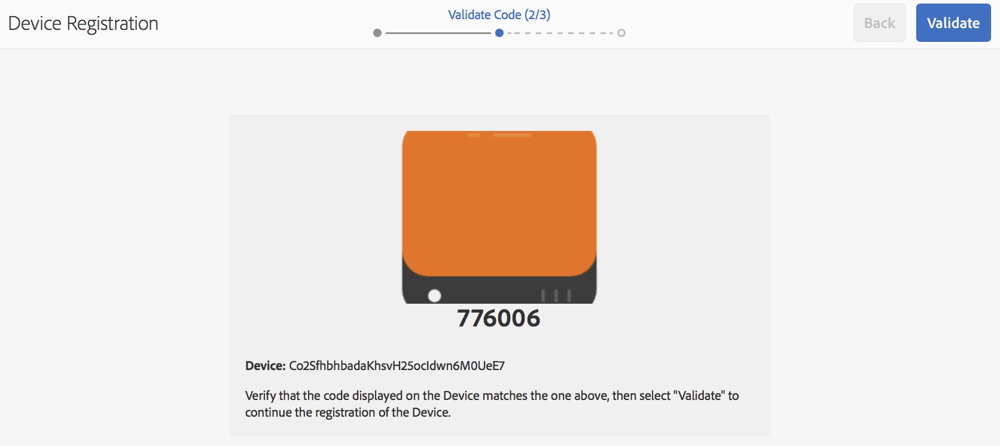

# Registro de dispositivos {#device-registration}

En la siguiente página se describe el proceso de registro de dispositivos en un proyecto de AEM Screens.

## Registro de un dispositivo {#registering-a-device}

El proceso de registro del dispositivo se realiza en dos equipos independientes:

* El dispositivo real que se va a registrar, por ejemplo, la pantalla de señalización
* AEM El servidor de utilizado para registrar el dispositivo

>[!NOTE]
>
>Después de descargar el último Reproductor de Windows (*.exe*), desde [AEM Descargas del reproductor de 6.4 en](https://download.macromedia.com/screens/) , siga los pasos en el reproductor para completar la instalación ad-hoc:
>
>1. Pulse durante mucho tiempo en la esquina superior izquierda para abrir el panel de administración.
>1. Vaya a **Configuración** AEM en el menú de acción de la izquierda e introduzca la dirección de ubicación de la instancia de en **Servidor** y haga clic en **Guardar**.
>1. Haga clic en **Registro** desde el menú de acción de la izquierda y los pasos a continuación para completar el proceso de registro del dispositivo.
>


1. En el dispositivo, inicie AEM Screens Player. Se muestra la interfaz de usuario de registro.

   

1. AEM En, navegue hasta la sección **Dispositivos** de su proyecto.

   >[!NOTE]
   >
   >AEM Para obtener más información sobre la creación de un proyecto para Pantallas en el panel de la, consulte [Crear y administrar un proyecto de Screens](creating-a-screens-project.md).

1. Haga clic en **Administrador de dispositivos** en la barra de acciones.

   

1. Haga clic en **Registro de dispositivos** botón en la parte superior derecha.

   

1. Haga clic en el dispositivo requerido (igual que el paso 1) y haga clic en **Registrar dispositivo**.

   

1. AEM En, espere a que el dispositivo envíe su código de registro.

   

1. En el dispositivo, compruebe lo siguiente **Código de registro**.

   

1. Si la variable **Código de registro** es el mismo en ambos equipos, haga clic en **Validate** AEM botón en la, como se muestra en el paso (6).
1. Configure el nombre que desee para el dispositivo y haga clic en **Registrar**.

   

1. Clic **Finalizar** para completar el proceso de registro.

   

   >[!NOTE]
   >
   >El **Registrar nuevo** permite registrar un dispositivo nuevo.
   >
   >El **Asignar visualización** permite añadir directamente el dispositivo a una pantalla.

   Si hace clic **Finalizar**, asigne el dispositivo a una pantalla.

   

   >[!NOTE]
   >
   >Para obtener más información sobre la creación y administración de una visualización para su proyecto de Pantallas, consulte [Creación y administración de pantallas](managing-displays.md).

### Asignación de dispositivos a una pantalla {#assigning-device-to-a-display}

Si no ha asignado el dispositivo a una pantalla, siga los pasos a continuación para asignar el dispositivo a una pantalla del proyecto de AEM Screens:

1. Haga clic en el dispositivo y en **Asignar dispositivo** de la barra de acciones.

   

1. Haga clic en la ruta de la visualización en **Ruta de configuración de visualización/dispositivo**.

   

1. Clic **Asignar** al hacer clic en la ruta.

   

1. Clic **Finalizar** una vez que el dispositivo se asigna correctamente, como se muestra en la figura siguiente.

   

   Además, puede ver el panel de visualización al seleccionar **Finalizar**.

   

## Búsqueda de un dispositivo desde el Administrador de dispositivos {#search-device}

Cuando haya registrado dispositivos en el reproductor, puede ver todos los dispositivos desde la interfaz de usuario del Administrador de dispositivos.

1. Vaya a la interfaz de usuario del administrador de dispositivos desde el proyecto de AEM Screens, por ejemplo, **Demostraciones** > **Dispositivos**.

1. Haga clic en **Dispositivos** y haga clic en **Administrador de dispositivos** de la barra de acciones.

   

1. Se muestra la lista de dispositivos registrados.

1. Si tiene una larga lista de dispositivos registrados, ahora puede buscar mediante el icono de búsqueda de la barra de acciones

   

   O bien,

   Seleccionar `/` (barra diagonal) para invocar la funcionalidad de búsqueda.

   


### Limitaciones en la funcionalidad de búsqueda {#limitations}

* El usuario puede buscar cualquier palabra existente en la *ID de dispositivo* o *Nombre del dispositivo*.

  >[!NOTE]
  >Se recomienda crear los nombres de los dispositivos con varias palabras, como *Boston Store Lobby* en lugar de uno solo *BostonStoreLobby*.

* Si crea nombres de dispositivo como *Boston Store Lobby*, busca cualquier palabra *Boston*, *almacenar*, o *cabildear*. Sin embargo, si el nombre del dispositivo es *BostonStoreLobby* y, a continuación, buscando *Boston* no muestra ningún resultado.

* Comodín, `*` es compatible con la búsqueda. Si desea buscar todos los dispositivos con nombres que empiecen por *Boston*, puede utilizar *Boston**.

* Si el nombre del dispositivo es *BostonStoreLobby* y buscando *Boston* no devuelve el resultado y, a continuación, utiliza *Boston** en los criterios de búsqueda devuelve el resultado.

## Limitaciones en el registro de dispositivos {#limitations-on-device-registration}

Las restricciones de contraseña de usuario en todo el sistema pueden provocar errores en el registro de dispositivos. El registro del dispositivo utiliza una contraseña generada aleatoriamente para crear el usuario del dispositivo.

Si la contraseña está restringida por el *AuthorizableActionProvider* , podría producirse un error al crear el usuario del dispositivo.

>[!NOTE]
>
>La contraseña aleatoria generada actualmente está compuesta por 36 caracteres ASCII, que van del 33 al 122 (incluye casi todos los caracteres especiales).

```java
25.09.2016 16:54:03.140 *ERROR* [59.100.121.82 [1474844043109] POST /content/screens/svc/registration HTTP/1.1] com.adobe.cq.screens.device.registration.impl.RegistrationServlet Error during device registration
javax.jcr.nodetype.ConstraintViolationException: Password violates password constraint (^(?=.*\d).{7,9}$).
        at org.apache.jackrabbit.oak.spi.security.user.action.PasswordValidationAction.validatePassword(PasswordValidationAction.java:105)
        at org.apache.jackrabbit.oak.spi.security.user.action.PasswordValidationAction.onPasswordChange(PasswordValidationAction.java:76)
        at org.apache.jackrabbit.oak.security.user.UserManagerImpl.onPasswordChange(UserManagerImpl.java:308)
```

### Otros recursos {#additional-resources}

Para obtener más información acerca del Reproductor de AEM Screens, consulte [Reproductor de AEM Screens](working-with-screens-player.md).
