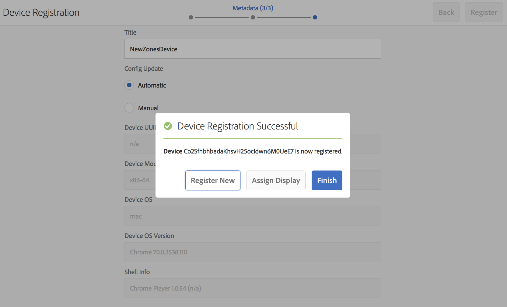

# Registro de dispositivos {#device-registration}

En la página siguiente se describe el proceso de registro del dispositivo en un proyecto de AEM Screens.

## Registro de un dispositivo {#registering-a-device}

El proceso de registro del dispositivo se realiza en dos equipos distintos:

* El dispositivo real que se va a registrar, por ejemplo, la visualización de señales
* El servidor AEM que se utiliza para registrar el dispositivo

>[!NOTE]
>
>Una vez que descargue el último Reproductor de Windows (*.exe*), desde la página [Descargas del Reproductor de AEM 6.4](https://download.macromedia.com/screens/), siga los pasos del reproductor para completar la instalación ad-hoc:
>
>1. Presione largo tiempo en la esquina superior izquierda para abrir el panel de administración.
>1. Vaya a **Configuration** desde el menú de acción de la izquierda e introduzca la dirección de ubicación de la instancia de AEM en **Server** y haga clic en **Save**.
>1. Haga clic en el vínculo **Registro** desde el menú de acción de la izquierda y en los pasos siguientes para completar el proceso de registro del dispositivo.

>


1. En el dispositivo, inicio AEM Screens Player. Se muestra la interfaz de usuario de registro.

   

1. En AEM, vaya a la carpeta **Devices** del proyecto.

   >[!NOTE]
   >
   >Para obtener más información sobre la creación de un nuevo proyecto para Pantallas en el panel de AEM, consulte [Crear y administrar proyecto de pantallas](creating-a-screens-project.md).

1. Toque o haga clic en el botón **Administrador de dispositivos** de la barra de acciones.

   

1. Toque o haga clic en el botón **Registro del dispositivo** en la parte superior derecha.

   

1. Seleccione el dispositivo requerido (igual que el paso 1) y toque/haga clic **Registrar dispositivo**.

   

1. En AEM, espere a que el dispositivo envíe su código de registro.

   

1. En el dispositivo, compruebe el **Código de registro**.

   

1. Si el **Código de registro** es el mismo en ambos equipos, toque o haga clic en el botón **Validar** en AEM, como se muestra en el paso (6).
1. Defina el nombre que desee para el dispositivo y haga clic en **Registrar**.

   

1. Toque o haga clic **Finalizar** para completar el proceso de registro.

   

   >[!NOTE]
   >
   >El **Registro nuevo** le permite registrar un nuevo dispositivo.
   >
   >El **Asignar visualización** permite agregar directamente el dispositivo a una pantalla.

   Si hace clic en **Finalizar**, deberá asignar el dispositivo a una pantalla.

   

   >[!NOTE]
   >
   >Para obtener más información sobre la creación y administración de una pantalla para su proyecto de Pantallas, consulte [Creación y administración de pantallas](managing-displays.md).

### Asignación del dispositivo a una pantalla {#assigning-device-to-a-display}

Si no ha asignado el dispositivo a una pantalla, siga los pasos a continuación para asignar el dispositivo a una pantalla del proyecto de AEM Screens:

1. Seleccione el dispositivo y haga clic en **Asignar dispositivo** en la barra de acciones.

   

1. Seleccione la ruta de acceso de la pantalla en **Ruta de visualización/configuración del dispositivo**.

   

1. Haga clic en **Asignar** cuando seleccione la ruta.

   

1. Haga clic en **Finalizar** una vez que el dispositivo se haya asignado correctamente, como se muestra en la figura siguiente.

   

   Además, puede realizar la vista del panel de visualización al hacer clic en **Finalizar**.

   

## Búsqueda de un dispositivo desde el Administrador de dispositivos {#search-device}

Una vez que haya registrado los dispositivos en su reproductor, puede realizar la vista desde la interfaz de usuario del Administrador de dispositivos.

1. Vaya a la interfaz de usuario del Administrador de dispositivos desde su proyecto de AEM Screens, por ejemplo, **DemoScreens** —> **Devices**.

1. Seleccione la carpeta **Dispositivos** y haga clic en **Administrador de dispositivos** en la barra de acciones.

   

1. Se muestra la lista de los dispositivos registrados.

1. Si tiene una larga lista de dispositivos registrados, ahora puede buscar mediante el icono de búsqueda de la barra de acciones

   

   O bien,

   Haga clic en `/` (barra diagonal) para invocar la funcionalidad de búsqueda.

   


### Limitaciones en la funcionalidad de búsqueda {#limitations}

* El usuario podrá buscar cualquier palabra existente en el *ID del dispositivo* o *Nombre del dispositivo*.

   >[!NOTE]
   >Se recomienda crear los nombres de los dispositivos con varias palabras, como *Punto de encuentro de la Tienda Boston* en lugar de un solo *Punto de encuentro de la TiendaBoston*.

* Si crea nombres de dispositivos como *Lobby de la Tienda Boston*, permite buscar cualquier palabra *boston*, *store* o *lobby* pero si el nombre del dispositivo se conoce como *BostonStoreLobby* búsqueda *>boston* no mostrará los resultados.

* Comodín, `*` se admite para la búsqueda. Si desea buscar todos los dispositivos con nombres que empiecen por *boston*, puede utilizar *boston**.

* Si el nombre del dispositivo es *BostonStoreLobby* y la búsqueda de *boston* no devolverá el resultado en lugar de utilizar *boston** en los criterios de búsqueda devolverá el resultado.

## Limitaciones en el registro del dispositivo {#limitations-on-device-registration}

Las restricciones de contraseña de usuario para todo el sistema podrían provocar un error en el registro del dispositivo. El registro del dispositivo utiliza una contraseña generada al azar para crear el usuario del dispositivo.

Si la contraseña está restringida por la configuración *AuthorizableActionProvider*, la creación del usuario del dispositivo podría fallar.

>[!NOTE]
>
>La contraseña aleatoria actual se compone de 36 caracteres ASCII, que oscilan entre 33 y 122 (incluye casi todos los caracteres especiales).

```java
25.09.2016 16:54:03.140 *ERROR* [59.100.121.82 [1474844043109] POST /content/screens/svc/registration HTTP/1.1] com.adobe.cq.screens.device.registration.impl.RegistrationServlet Error during device registration
javax.jcr.nodetype.ConstraintViolationException: Password violates password constraint (^(?=.*\d).{7,9}$).
        at org.apache.jackrabbit.oak.spi.security.user.action.PasswordValidationAction.validatePassword(PasswordValidationAction.java:105)
        at org.apache.jackrabbit.oak.spi.security.user.action.PasswordValidationAction.onPasswordChange(PasswordValidationAction.java:76)
        at org.apache.jackrabbit.oak.security.user.UserManagerImpl.onPasswordChange(UserManagerImpl.java:308)
```

### Recursos adicionales {#additional-resources}

Para obtener más información sobre AEM Screens Player, consulte [AEM Screens Player](working-with-screens-player.md).
