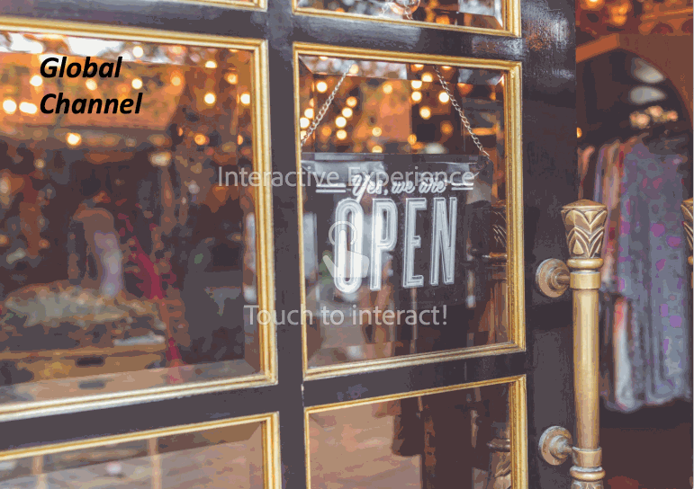
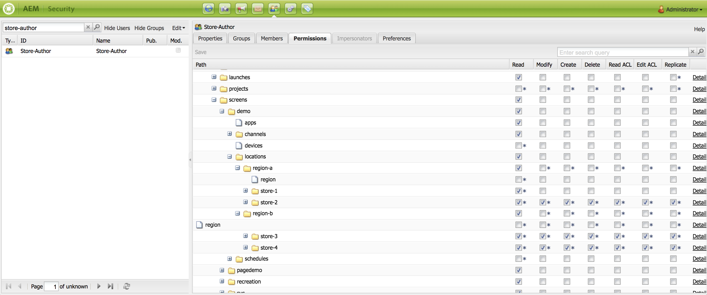

# Uso de la secuencia incrustada dinámica {#using-dynamic-embedded-sequence}

El uso de secuencias incrustadas dinámicas abarca los siguientes temas:

* **Información general**
* **Uso de la experiencia integrada dinámica en AEM Screens**
* **Visualización de los resultados**
* **Restricción de usuarios y modificación de las ACL**

## Información general {#overview}

***Secuencias incrustadas dinámicas*** se crean para proyectos grandes que siguen la jerarquía secundaria principal, donde se hace referencia a la secundaria dentro de una carpeta de ubicación y no en una carpeta de canal. Permite al usuario incrustar una secuencia dentro de un canal mediante ***Función del canal***. Permite al usuario definir marcadores de posición específicos de la ubicación para diferentes oficinas mediante una secuencia incrustada dentro de un canal principal.

Al asignar un canal a una visualización, tiene la opción de especificar la ruta de la visualización o la función del canal que se resolverá en un canal real por contexto.

Para utilizar la secuencia incrustada dinámica, asigne un canal de acuerdo con lo siguiente ***Función del canal***. La función del canal define el contexto de la visualización. La función está dirigida por varias acciones y es independiente del canal real que cumple la función. En esta sección se describe un caso de uso que define los canales por función y cómo puede aprovechar ese contenido para un canal global. También puede considerar la función como un identificador para la asignación o como un alias para el canal en el contexto de.

### Ventajas de utilizar secuencias incrustadas dinámicas {#benefits-of-using-dynamic-embedded-sequences}

La principal ventaja de colocar un canal de secuencia en una ubicación en lugar de la carpeta de canales es permitir que los autores locales o regionales editen el contenido relevante para ellos, mientras que se restringe de la edición de canales en la parte superior de la jerarquía.

Referencia a *Canal por rol*, le permite crear la versión local de un canal para resolver de forma dinámica el contenido específico de la ubicación y también le permite crear un canal global que aproveche el contenido para los canales específicos de la ubicación.

>[!NOTE]
>
>**Secuencias incrustadas en comparación con Secuencias incrustadas dinámicas**
>
>Una secuencia incrustada dinámica es similar a una secuencia incrustada, pero permite al usuario seguir una jerarquía en la que los cambios/actualizaciones realizados en un canal se propagan a otro en relación. Rastrea la jerarquía principal-secundaria e incluye recursos como imágenes o vídeos.
>
>***Secuencias incrustadas dinámicas*** permite mostrar contenido específico de la ubicación, mientras que ***Secuencias incrustadas*** mostrar únicamente la presentación general del contenido. Además, al configurar Secuencias incrustadas dinámicas, debe configurar el canal mediante la función y el nombre del canal. Consulte los pasos siguientes para una implementación práctica.
>
>Para obtener más información sobre la implementación de secuencias incrustadas, consulte [Secuencias incrustadas](embedded-sequences.md) en AEM Screens.

En el ejemplo siguiente se proporciona una solución centrándose en los términos clave siguientes:

* a ***canal de secuencia principal*** para la secuencia global
* ***secuencia incrustada dinámica*** componentes para cada parte personalizable localmente de la secuencia
* ***canales de secuencia individual*** en las ubicaciones respectivas con un *función* en la pantalla que coincida con el **componente de secuencia integrada dinámica *función*.**

>[!NOTE]
>
>Para obtener más información sobre la asignación de canales, consulte **[Asignación de canales](channel-assignment.md)** en la sección Creación de la documentación de AEM Screens.

## Uso de la secuencia incrustada dinámica {#using-dynamic-embedded-sequence-2}

En la siguiente sección se explica la creación de una secuencia incrustada dinámica en un canal de AEM Screens.

### Requisitos previos {#prerequisites}

Antes de comenzar a implementar esta funcionalidad, asegúrese de que tiene los siguientes requisitos previos listos para comenzar a implementar secuencias incrustadas dinámicas:

* Cree un proyecto de AEM Screens (en este ejemplo, **Demostración**)

* Crear un canal como **Global** bajo **Canales** carpeta

* Añada contenido a su **Global** Canal (*Compruebe **Resources.zip**para los activos relevantes*)

La siguiente imagen muestra el **Demostración** proyecto con **Global** entrada de canal **Canales** carpeta.

### Recursos {#resources}

Puede descargar los siguientes recursos (imágenes y añadirlos a los recursos) y utilizarlos más como contenido de canal para fines de demostración.

[Obtener archivo](assets/resources.zip)

>[!NOTE]
>
>Para obtener información adicional sobre cómo crear un proyecto y cómo crear un canal de secuencia, consulte los recursos a continuación:
>
>* **[Creación y administración de proyectos](creating-a-screens-project.md)**
>* **[Administración de un canal](managing-channels.md)**
>

La implementación de la secuencia incrustada dinámica en un proyecto de AEM Screens implica tres tareas principales:

1. **Configuración de la taxonomía de proyecto, incluidos canales, ubicaciones y pantallas**
1. **Creación de una programación**
1. **Asignación de un programa a cada visualización**

Siga los pasos a continuación para implementar la funcionalidad:

>[!CAUTION]
>
>Al implementar secuencias incrustadas dinámicas, tenga cuidado con las **Nombre** y **Título** al crear canales en cada ubicación. Siga atentamente las instrucciones de la nomenclatura.

1. **Cree dos carpetas de ubicaciones.**

   Navegue hasta su **Ubicaciones** en el proyecto de AEM Screens y cree dos carpetas de ubicación como **Región A** y **Región B**.

   >[!NOTE]
   >
   >Al crear el **Región A** carpeta de ubicación, asegúrese de introducir la variable **Título** as **Región A** y puede dejar el **Nombre** campo vacío, de forma automática **region-a** el nombre se recoge.
   >
   >De forma similar, es el caso de la creación de una carpeta de ubicación **Región B**, como se muestra a continuación:

   

   >[!NOTE]
   >Para aprender a crear una ubicación, consulte **[Creación y administración de ubicaciones](managing-locations.md)**.

1. **Cree dos ubicaciones y un canal en cada carpeta de ubicación.**

   1. Vaya a **Demostración** > **Ubicaciones** > **Región A**.
   1. Seleccionar **Región A** y haga clic en **+ Crear** de la barra de acciones.
   1. Seleccionar **Ubicación** del asistente con **Título** as **Almacén 1**. Del mismo modo, cree otra ubicación desde el asistente con el título **Almacén 2** con **Título** as **Almacén 2**. Puede dejar el **Nombre** campo vacío al crear **Almacén 1** y **Almacén 2**.
   1. Repita el paso (b) y ahora seleccione **Canal de secuencia** en el asistente. Introduzca el **Título** as **Región A** y **Nombre** as **región** para este canal.

   >[!CAUTION]
   >
   >Asegúrese de que al crear el canal **Región A**, introduzca la variable **Título** as **Región A** y el **Nombre** as **región**.

   

   Del mismo modo, cree dos ubicaciones en **Región B** con título **Tienda 3** y **Tienda 4**. Además, cree un **Canal de secuencia** con **Título** as **Región B** y **Nombre** as **región**.

   >[!CAUTION]
   >
   >Asegúrese de que puede utilizar el mismo nombre para los canales creados en **Región A** y **Región B** as **región**.

   

1. **Cree Pantalla y Canal en cada Ubicación.**

   1. Vaya a **Demostración** > **Ubicaciones** > **Región A** > **Almacén 1**.
   1. Seleccionar **Almacén 1** y haga clic en **+ Crear** de la barra de acciones.
   1. Seleccionar **Mostrar** en el asistente y cree **Almacenar 1Pantalla.**
   1. Repita el paso (b) y esta vez seleccione **Canal de secuencia** en el asistente. Introduzca el **Título** as **Store1Channel** y el **Nombre** as **almacenar**.

   >[!CAUTION]
   >
   >Es importante que, al crear un canal de secuencia, **Título** del canal puede ser como su requisito, pero la variable **Nombre** debe ser el mismo en todos los canales locales.
   >En este ejemplo, los canales bajo **Región A** y **Región B** compartir lo mismo **Nombre** as **región** y canales en **Almacén 1**, **Almacén 2**, **Tienda 3**, y **Tienda 4** compartir lo mismo **Nombre** as **almacenar**.

   

   Del mismo modo, cree una pantalla como **Store2Display** y un canal **Store2Channel** bajo **Almacén 2** (con nombre como **almacenar**).

   >[!NOTE]
   >Asegúrese de que puede utilizar el mismo nombre para los canales creados en **Almacén 1** y **Almacén 2** as **almacenar**.

   

   Siga los pasos anteriores para crear un canal y mostrarlo en **Tienda 3** y **Tienda 4** bajo **Región B**. De nuevo, asegúrese de utilizar el mismo **Nombre** as **almacenar** al crear el canal **Store3Channel** y **Store4Channel** respectivamente.

   La siguiente imagen muestra la visualización y el canal en **Tienda 3**.

   

   La siguiente imagen muestra la visualización y el canal en **Tienda 4**.

   

1. **Añada contenido a los canales en sus respectivas ubicaciones.**

   Vaya a **Demostración** > **Ubicaciones** > **Región A** > **Región A** y haga clic en **Editar** de la barra de acciones. Arrastre y suelte los recursos que desee añadir a su canal.

   >[!NOTE]
   >Puede usar el complemento ***Resources.zip*** desde el **Recursos** , más arriba, para usar las imágenes como recursos para el contenido del canal.

   

   Del mismo modo, vaya a **Demostración** > **Ubicaciones** > **Región B** > **Región B** y haga clic en **Editar** en la barra de acciones, para arrastrar y soltar los recursos en el canal, como se muestra a continuación:

   

   Siga los pasos anteriores y los recursos para agregar contenido a los siguientes canales:

   * **Store1Channel**
   * **Store2Channel**
   * **Store3Channel**
   * **Store4Channel**

1. **Crear un horario**

   Navegar y seleccionar **Horarios** en el proyecto de AEM Screens y haga clic en **Crear** en la barra de acciones para crear una nueva programación.

   La siguiente imagen muestra el **AdSchedule** creado en **Demostración** proyecto.

   

1. **Asignar canales a una programación**

   1. Vaya a **Demostración** > **Horarios** > **AdSchedule** y haga clic en **Tablero** de la barra de acciones.
   1. Clic **+ Asignar canal** de **CANALES ASIGNADOS** panel para abrir **Asignación de canales** Cuadro de diálogo.
   1. Seleccionar **Canal de referencia**.. por ruta.
   1. Seleccione el **Ruta de canal** as **Demostración** > ***Canales*** > ***Global***.
   1. Introduzca el **Función del canal** as **GlobalAdSegment**.
   1. Seleccione el **Eventos admitidos** as **Carga inicial**, **Pantalla inactiva**, y **Interacción del usuario**.
   1. Haga clic en **Guardar**.

   **Asignar canal por función para la región:**

   1. Clic **+ Asignar canal** de **CANALES ASIGNADOS** panel para abrir **Asignación de canales** Cuadro de diálogo.
   1. Seleccionar **Canal de referencia**.. por nombre.
   1. Introduzca el **Nombre del canal** as **región***.
   1. Introduzca el **Función del canal** as **RegionAdSegment**.
   1. Haga clic en **Guardar**.

   **Asignar canal por rol para tienda:**

   1. Clic **+ Asignar canal** de **CANALES ASIGNADOS** panel para abrir **Asignación de canales** Cuadro de diálogo.
   1. Seleccionar **Canal de referencia**.. por nombre.
   1. Introduzca el **Nombre del canal** as **almacenar**.
   1. Introduzca el **Función del canal** as **StoreAdSegment**.
   1. Haga clic en **Guardar**.

   La siguiente imagen muestra los canales asignados por ruta y por función.

   

1. **Configuración de la secuencia incrustada dinámica en el canal global.**

   Vaya a **Global** Canal que creó inicialmente en **Demostración** proyecto.

   Clic **Editar** en la acción para abrir el editor.

   

   Arrastrar y soltar dos **Secuencia integrada dinámica** componentes en el editor de canales.

   Abra las propiedades de uno de los componentes e introduzca la variable **Rol de asignación de canal** as **RegionAdSegment**.

   Del mismo modo, seleccione el otro componente y abra las propiedades para introducir el **Rol de asignación de canal** as **StoreAdSegment**.

   

1. **Asignación de programación a cada visualización**

   1. Navegue hasta la pantalla correspondiente, por ejemplo, **Demostración** > **Ubicaciones** > **Región A** >**Almacén 1** >**Store1Display**.
   1. Clic **Tablero** en la acción para abrir el panel de visualización.
   1. Clic **...** desde el **CANALES Y PROGRAMACIONES ASIGNADOS** y haga clic en **+Asignar horario**.
   1. Seleccione la ruta al Horario (por ejemplo, aquí, **Demostración** > **Horarios** >**AdSchedule**).
   1. Haga clic en **Guardar**.

## Visualización de los resultados {#viewing-the-results}

Una vez que haya completado la configuración de los canales y la visualización, inicie el reproductor de AEM Screens para ver el contenido.

>[!NOTE]
>
>AEM Para obtener más información sobre el Reproductor de pantalla de la pantalla de la aplicación, consulte los siguientes recursos:
>
>* [Descargas del reproductor AEM Screens](https://download.macromedia.com/screens/)
>* [Uso del Reproductor de AEM Screens](working-with-screens-player.md)

La siguiente salida confirma el contenido del canal en el reproductor de AEM Screens, según la ruta de visualización.

**Escenario 1**:

Si asigna la ruta de visualización como **Demostración** > **Ubicaciones** > **Región A** > **Almacén 1** > **Store1Display**, el siguiente contenido se mostrará en el reproductor de AEM Screens.

**Escenario 1**:

Si asigna la ruta de visualización como **Demostración** > **Ubicaciones** > **Región B** > **Tienda 3** > **Store3Display**, el siguiente contenido se mostrará en el reproductor de AEM Screens.

## Restricción de usuarios y modificación de las ACL {#restricting-users-and-modifying-the-acls}

Puede crear autores globales, regionales o locales para editar el contenido relevante para ellos mientras se restringe la edición de canales superiores en la jerarquía.

Debe modificar las ACL para restringir el acceso de los usuarios al contenido en función de su ubicación.

### Ejemplo de caso de uso {#example-use-case}

El siguiente ejemplo le permite crear tres usuarios para el proyecto de demostración anterior.

Los privilegios asignados a cada grupo son los siguientes:

**Grupos**:

* **Global-Author**: consta de usuarios que tienen acceso a todas las ubicaciones y canales del **Demostración** proyecto y tienen todos los permisos de lectura, escritura y edición.

* **Region-Author**: consta de usuarios que tienen permisos de lectura, escritura y edición para **Región A** y **Región B**.

* **Store-Author**: consta de usuarios que solo tienen permisos de lectura, escritura y edición para **Almacén 1**, **Almacén 2**, **Tienda 3**, y **Tienda 4**.

#### Pasos para crear grupos de usuarios, usuarios y configurar ACL {#steps-for-creating-user-groups-users-and-setting-up-acls}

>[!NOTE]
>
>Para obtener información detallada sobre cómo separar proyectos mediante ACL para que cada individuo o equipo gestione su propio proyecto, consulte **Configuración de ACL**.

Siga los pasos a continuación para crear grupos y usuarios, y modificar las ACL según los permisos:

1. **Crear grupos**

   1. Vaya a **Adobe Experience Manager**.
   1. Clic **Herramientas** > **Seguridad** > **Grupos**.
   1. Clic **Crear grupo** y escriba **Global-Author** in **ID**.
   1. Haga clic en **Guardar y cerrar**.

   Del mismo modo, cree otros dos grupos como **Region-Author** y **Store-Author**.

   

1. **Crear usuarios y agregar usuarios a grupos**

   1. Vaya a **Adobe Experience Manager**.
   1. Haga clic en **Herramientas** > **Seguridad** > **Usuarios**.
   1. Clic **Crear usuario** y escriba **Global-User** in **ID**.
   1. Entrar **Contraseña** y confirme la contraseña de este usuario.
   1. Haga clic en **Grupos** e introduzca el nombre del grupo en **Seleccionar grupo**, por ejemplo, escriba **Global-Author** para agregar **Global-User** a ese grupo específico.
   1. Haga clic en **Guardar y cerrar**.

   Del mismo modo, cree otros dos usuarios como **Región-Usuario** y **Store-User** y agréguelas a **Region-Author** y **Store-Author** respectivamente.

   >[!NOTE]
   >Se recomienda agregar usuarios en un grupo y luego asignar permisos a cada grupo de usuarios en particular.

   

1. **Añadir todos los grupos a los colaboradores**

   1. Vaya a **Adobe Experience Manager**.
   1. Clic **Herramientas** > **Seguridad** > **Grupos**.
   1. Seleccionar **Colaboradores** en la lista y seleccione **Miembros** pestaña.
   1. Seleccione el **Grupo** como **Global-Author**, **Region-Author,** y **Store-Author** a los colaboradores.
   1. Haga clic en **Guardar y cerrar**.

1. **Acceso a los permisos para cada grupo**

   1. Vaya a *Useradmin* y utilice esta interfaz de usuario para modificar los permisos para diferentes grupos.
   1. Buscar por **Global-Author** y haga clic en **Permisos** , como se muestra en la figura siguiente.
   1. Del mismo modo, puede acceder a los permisos de para **Region-Author** y **Store-Author**.

   

1. **Modificación de permisos para cada grupo**

   **Para Global-Author:**

   1. Vaya a **Permisos** pestaña
   1. Vaya a ***/content/screens/demo*** y compruebe todos los permisos
   1. Vaya a ***/content/screens/demo/locations*** y compruebe todos los permisos
   1. Vaya a ***/content/screens/demo/locations/region-a*** y compruebe todos los permisos. Del mismo modo, compruebe los permisos de **region-b**.

   Consulte la figura siguiente para comprender los pasos:
   

   La siguiente imagen muestra que ahora la variable **Global-User** tiene acceso a la **Canal global** y tanto el **Región A** y **Región B** con las cuatro tiendas, a saber **Almacén 1**, **Almacén 2**, **Tienda 3**, y **Tienda 4**.

   

   **Para Region-Author:**

   1. Vaya a **Permisos** pestaña.
   1. Vaya a ***/content/screens/demo*** y compruebe solo la **Leer** permisos.
   1. Vaya a ***/content/screens/demo/locations*** y compruebe solo la **Leer** permisos.
   1. Vaya a ***/content/screens/demo/channels*** y desmarque los permisos de **Global** canal.
   1. Vaya a ***/content/screens/demo/locations***/***region-a*** y compruebe todos los permisos. Del mismo modo, compruebe los permisos de **region-b**.

   Consulte la figura siguiente para comprender los pasos:

   

   La siguiente imagen muestra que ahora el usuario de la región tiene acceso a ambos **Región A** y **Región B** con las cuatro tiendas, a saber **Almacén 1**, **Almacén 2**, **Tienda 3**, y **Tienda 4** pero no tiene acceso al **Global** Canal.

   

   **Para Store-Author:**

   1. Vaya a **Permisos** pestaña.
   1. Vaya a ***/content/screens/demo*** y compruebe solo la **Leer** permisos.
   1. Vaya a ***/content/screens/demo/locations*** y compruebe solo la **Leer** permisos.
   1. Vaya a ***/content/screens/demo/channels*** y desmarque los permisos de **Global** canal.
   1. Vaya a ***/content/screens/demo/locations/region-a*** y compruebe solo la **Leer** permisos. Del mismo modo, compruebe solo la **Leer** permisos para **region-b**.
   1. Vaya a ***/content/screens/demo/locations***/***region-a /store-1*** y compruebe todos los permisos. Del mismo modo, compruebe los permisos de **store-2, store-3,** y **store-4**.

   Consulte la figura siguiente para comprender los pasos:

   

   La siguiente imagen muestra que ahora la variable **Store-User** solo tiene acceso a las cuatro tiendas, a saber **Almacén 1**, **Almacén 2**, **Tienda 3**, y **Tienda 4** pero no tiene permisos para acceder a **Global** o la región (**Región A** y **Región B**) canales.

   

>[!NOTE]
>
>Para obtener más información sobre la configuración de permisos, consulte [Configuración de ACL](setting-up-acls.md).
