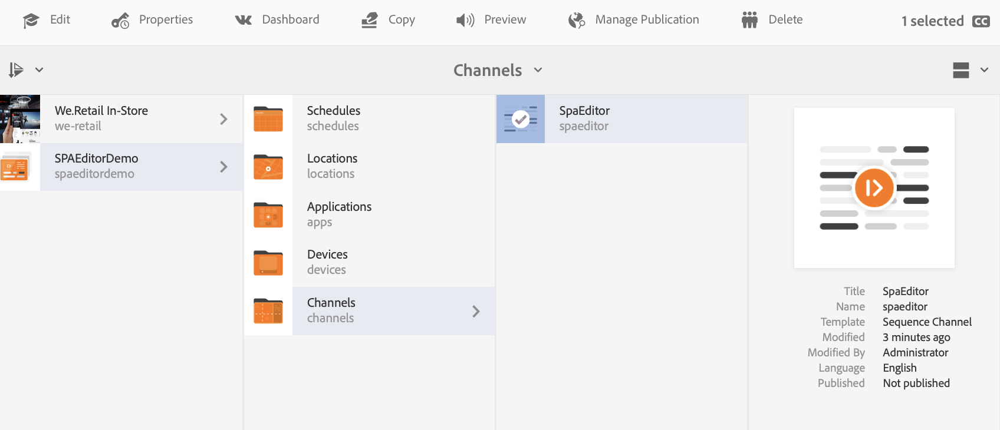

# AEM SPA Incrustación de una aplicación REACT mediante el Editor de e Integración con AEM Screens Analytics {#embedding-a-react-application-using-the-aem-spa-editor-and-integrating-with-aem-screens-analytics}

Puede incrustar una aplicación interactiva de una sola página mediante REACT (o Angular). AEM SPA AEM Para ello, utilice el editor de que configuran los profesionales de la empresa en la configuración de la. También puede aprender a integrar su aplicación interactiva con Adobe Analytics sin conexión.

## AEM SPA Uso del Editor de {#using-the-aem-spa-editor}

AEM SPA Siga los pasos a continuación para utilizar el Editor de:

1. AEM SPA Clonar el repositorio del Editor de la en [https://github.com/adobe/aem-spa-project-archetype.](https://github.com/adobe/aem-spa-project-archetype)

   >[!NOTE]
   >
   >Este tipo de archivo crea un proyecto de Adobe Experience Manager SPA mínimo como punto de partida para sus propios proyectos de. Las propiedades que se deben proporcionar al utilizar este tipo de archivo le permiten nombrar como desee todas las partes de este proyecto.

1. AEM SPA Para crear un proyecto de tipo de archivo del editor de, siga las instrucciones readme:

   ```
   mvn clean install archetype:update-local-catalog
   mvn archetype:crawl
   
   mvn archetype:generate \
   -DarchetypeCatalog=internal \
   -DarchetypeGroupId=com.adobe.cq.spa.archetypes \
   -DarchetypeArtifactId=aem-spa-project-archetype \
   -DarchetypeVersion=1.0.3-SNAPSHOT \
   ```

   >[!NOTE]
   >
   >Esta documentación utiliza el **GroupId** as ***com.adobe.aem.screens*** y el **ArtifactId** as ***SPA Mi ejemplo*** (que son los valores predeterminados). Puede elegir el suyo propio según sea necesario.

1. Una vez creado el proyecto, utilice un IDE o un editor de su elección e importe el proyecto Maven generado.
1. AEM Implemente en la instancia de la instancia local de mediante el comando ***instalación limpia de mvn: PautoInstallPackage***.

### Edición de contenido en la aplicación REACT {#editing-content-in-the-react-app}

Para editar el contenido en la aplicación REACT:

1. Vaya a `https://localhost:4502/editor.html/content/mysamplespa/en/home.html` (reemplace el nombre de host, el puerto y el nombre del proyecto según corresponda).
1. Poder editar el texto mostrado en la aplicación Hello World.

### Adición de la aplicación interactiva REACT a AEM Screens {#adding-the-interactive-react-app-to-aem-screens}

Siga los pasos a continuación para agregar la aplicación REACT interactiva a AEM Screens:

1. Cree un proyecto de AEM Screens. Consulte [Creación y administración de proyectos](creating-a-screens-project.md) para obtener más información.
1. Crear un **Canal de aplicaciones** (preferiblemente) (o plantilla 1x1 o canal de varias zonas) en el **Canales** del proyecto de AEM Screens.

   >[!NOTE]
   >**Canales de secuencia** se desaconsejan para este caso de uso porque vienen inherentemente con una lógica de presentación de diapositivas que entra en conflicto con la naturaleza interactiva de la experiencia.
   >Consulte [Creación y administración de canales](managing-channels.md) para obtener más información.

1. Edite cualquier canal de secuencia y arrastre y suelte un componente de página incrustado.

   Consulte [Adición de componentes a un canal](adding-components-to-a-channel.md) para obtener más información.

   >[!NOTE]
   >
   >Asegúrese de añadir el evento de interacción del usuario al asignar el canal a la visualización.

1. Clic **Editar** en la barra de acciones para poder editar las propiedades del canal.

   

1. Arrastre y suelte el **Página integrada** o reutilice el componente existente en un canal de aplicaciones y haga clic en la página principal de la aplicación mysamplespa, por ejemplo, ***/content/mysamplespa/en/home***.

   

1. Asigne el canal a una pantalla.

   >[!NOTE]
   >Asegúrese de añadir el evento de interacción del usuario al asignar el canal a la visualización.

1. Registre un reproductor en este proyecto y asígnelo a la pantalla. Ahora puede ver la aplicación interactiva en ejecución en AEM Screens.

   Consulte [Registro de dispositivos](device-registration.md) para obtener más información sobre cómo registrar un dispositivo.

## SPA Integración de la con Adobe Analytics con la funcionalidad sin conexión a través de AEM Screens {#integrating-the-spa-with-adobe-analytics-with-offline-capability-through-aem-screens}

SPA Siga los pasos a continuación para integrar la con Adobe Analytics con la capacidad sin conexión a través de AEM Screens:

1. Configure Adobe Analytics en AEM Screens.

   Consulte [Configuración de Adobe Analytics con AEM Screens](configuring-adobe-analytics-aem-screens.md) para obtener más información sobre cómo realizar la secuenciación en Adobe Analytics con AEM Screens y enviar eventos personalizados con Adobe Analytics sin conexión.

1. Edite la aplicación react en el IDE/editor que elija (especialmente el componente de texto u otro componente que desee que emita eventos).
1. En el evento de clic u otro evento que desee capturar para el componente, agregue la información de análisis mediante el modelo de datos estándar.

   Consulte [Configuración de Adobe Analytics con AEM Screens](configuring-adobe-analytics-aem-screens.md) para obtener más información.

1. Llame a la API de AEM Screens Analytics para poder guardar el evento sin conexión y enviarlo en ráfagas a Adobe Analytics.

   Por ejemplo,

   ```
   handleClick() {
       if ((window.parent) && (window.parent.CQ) && (window.parent.CQ.screens) && (window.parent.CQ.screens.analytics))
       {
           var analyticsEvent = {};
           analyticsEvent['event.type'] = 'play'; // Type of event
    analyticsEvent['event.coll_dts'] = new Date().toISOString(); // Start of collecting the event
    analyticsEvent['event.dts_start'] = new Date().toISOString(); // Event start
    analyticsEvent['content.type'] = 'Washing machine'; // Mime Type or product category
    analyticsEvent['content.action'] = 'Path to the washing machine asset in AEM'; // Path in AEM to relevant asset
    analyticsEvent['trn.product'] = 'Washing machine Model number'; // Product being explored
    analyticsEvent['trn.amount'] = 1000; // Product pricing or other numeric value or weight
    analyticsEvent['event.dts_end'] = new Date().toISOString(); // Event end
    analyticsEvent['event.count'] = 100; // Numeric value that may count a number of clicks or keystrokes or wait time in seconds for example
    analyticsEvent['event.value'] = 'My favorite analytics event';
           analyticsEvent['trn.quantity'] = 10; // Quantity of product selection
    analyticsEvent['event.subtype'] = 'end'; // Event subtype if applicable
    window.parent.CQ.screens.analytics.sendTrackingEvent(analyticsEvent);
       }
   }
   ```

   >[!NOTE]
   >
   >El firmware del reproductor añade automáticamente más detalles acerca del reproductor y su entorno de tiempo de ejecución a los datos de análisis personalizados que envía. Por lo tanto, es posible que tenga que capturar los detalles de bajo nivel del sistema operativo/dispositivo a menos que sea necesario. Céntrese en los datos de análisis empresarial.
