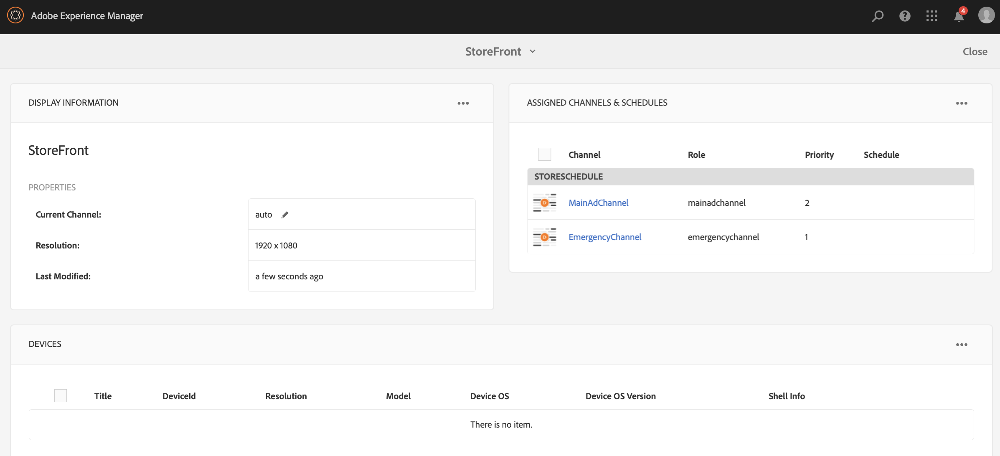

# Canal de emergencia {#emergency-channel}

## Descripción de caso de uso {#use-case-description}

En esta sección se describe un ejemplo de caso de uso que hace hincapié en la creación y administración de un canal de emergencia que el autor del contenido puede cambiar de un canal de secuencia en caso de una condición previa.

### Condiciones previas {#preconditions}

Antes de inicio de este caso de uso, asegúrese de comprender cómo:

* **[Crear y administrar Canales](managing-channels.md)**
* **[Crear y administrar ubicaciones](managing-locations.md)**
* **[Crear y administrar programaciones](managing-schedules.md)**
* **[Registro de dispositivos](device-registration.md)**

### Actores principales {#primary-actors}

Autores de contenido

## Flujo básico: Configuración del proyecto {#basic-flow-setting-up-the-project}

Siga los pasos a continuación para configurar un canal de emergencia:

1. Cree un proyecto de AEM Screens denominado **EmergencyChannel**, como se muestra a continuación.

   >[!NOTE]
   >Para obtener más información sobre la creación y administración de proyectos en AEM Screens, consulte Creación de un proyecto.

   

1. **Creación de un Canal de secuencia**

   1. Seleccione la carpeta **Canales** y haga clic en **Crear** para abrir el asistente y crear un canal.

   1. Seleccione **Canal** de secuencia en el asistente y cree el canal titulado **MainAdChannel**.

   

1. **Añadir contenido a Canal de secuencia**

   1. Seleccione el canal (**MainAdChannel**).
   1. Haga clic en **Editar** en la barra de acciones para abrir el editor. Arrastre y suelte algunos recursos en el canal.

   

1. **Creación de un Canal de emergencia**

   1. Seleccione la carpeta **Canales** .
   1. Haga clic en **Crear** para abrir el asistente y crear un canal.
   1. Seleccione **Canal** de secuencia en el asistente y cree el canal denominado **CanalDeEmergencia**.

   >[!NOTE]
   >
   >Normalmente, el canal de emergencia se agrega al proyecto de producción preexistente.

   

1. **Añadir contenido a Canal de emergencia**

   1. Seleccione el canal (Canal **de emergencia)**.
   1. Haga clic en **Editar** en la barra de acciones para abrir el editor. Arrastre y suelte el recurso que desee ejecutar durante una emergencia en el canal.

   

1. **Creación de una ubicación** 

   1. Vaya a la carpeta **Ubicaciones** .
   1. Haga clic en **Crear** desde la barra de acciones y cree una ubicación titulada **Almacenar** desde el asistente.

   

1. **Creación de pantallas en la ubicación**

   Vaya a su ubicación (**Tienda**) y haga clic en **Crear** en la barra de acciones. Siga el asistente para crear dos **pantallas** con el título **StoreFront** y **StoreBack**.

   

1. **Creación de un programa**

   1. Vaya a la carpeta **Programaciones** .
   1. Haga clic en **Crear** en la barra de acciones. Siga el asistente para crear una programación titulada **StoreSchedule**.

   

1. Asigne ambas pantallas a la programación y defina las prioridades

   1. Seleccione la programación **(StoreSchedule)** y haga clic en **Panel** en la barra de acciones.

   1. Haga clic en **+ Asignar Canal** desde el panel CANALES **** ASIGNADOS.

   1. En el cuadro de diálogo Asignación de **Canal** :

      1. Select the path to the **MainAdChannel**
      1. Establecer la **prioridad** como 2
      1. Set the Supported Events as **Initial Load** and **Idle Screen**.
      1. Haga clic en **Guardar**

      Del mismo modo, tendrá que seguir los mismos pasos de nuevo para asignar **EmergencyChannel** y establecer su **prioridad**.
   >[!NOTE]
   >
   >La prioridad se utiliza para solicitar las asignaciones en caso de que varias de ellas coincidan con los criterios de reproducción. Aquel elemento que tenga el valor más alto siempre tendrá prioridad sobre otros valores más bajos.

   

1. Haga clic en **+ Asignar Canal** desde el panel CANALES **** ASIGNADOS.

1. En el cuadro de diálogo Asignación de **Canal** :

   1. Select the path to the **EmergencyChannel**
   1. Definir la **prioridad** como 1

   1. Configure los Eventos admitidos como carga **** inicial, **pantalla** inactiva e interacción **del usuario**

   1. Haga clic en **Guardar**

   

   Puede vista de los canales asignados desde el panel **StoreSchedule** .

   

1. **Asignación de programación a cada visualización**

   1. Vaya a cada pantalla, como **EmergencyChannel** —> **Ubicaciones** —> **Tienda** —>**TiendaPrimera**.

   1. Click **Dashboard** from the action to open the display dashboard.
   1. Haga clic en **...** en el panel CANALES y PROGRAMAS **ASIGNADOS y haga clic en** +Asignar programación ****.

   1. Seleccione la ruta de la programación (por ejemplo, aquí, **EmergencyChannel** —> **Programaciones** —>**StoreSchedule**).

   1. Haga clic en **Guardar**.

   Puede vista de la programación asignada a la visualización desde el panel **StoreSchedule** .
   

1. **Registro de dispositivos**

   Complete el proceso de registro del dispositivo y una vez que se haya registrado, vista el siguiente resultado en su reproductor de AEM Screens.

   

## Cambio al Canal de emergencia {#switching-to-emergency-channel}

En el evento de una emergencia, realice los siguientes pasos:

1. Vaya a **EmergencyChannel** —> **Programaciones** —> **StoreSchedule** y seleccione **Panel** en la barra de acciones.

   

1. Seleccione **EmergencyChannel** en el panel **StoreSchedule** y haga clic en **Editar asignación**.

   

1. Actualice la **prioridad** del **canal** de emergencia a **3** desde el cuadro de diálogo Asignación **de** Canal y haga clic en **Guardar**.

   

1. Tan pronto como se actualice la prioridad del canal, todo el reproductor de AEM Screens mostrará el contenido de **EmergencyChannel** , como se muestra a continuación.

   

### Conclusión {#conclusion}

El **EmergencyChannel** seguirá mostrando su contenido hasta que el autor del contenido restablezca el valor de prioridad en 1.

Una vez que el autor del contenido recibe las instrucciones de que se ha borrado la emergencia, debe actualizar la prioridad de **MainAdChannel** , lo que provocará que se reanude la reproducción normal.
