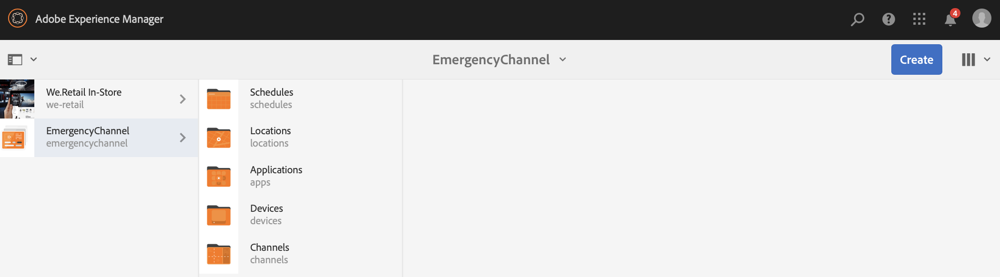
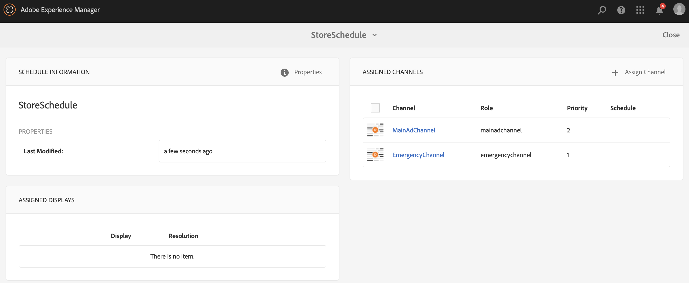
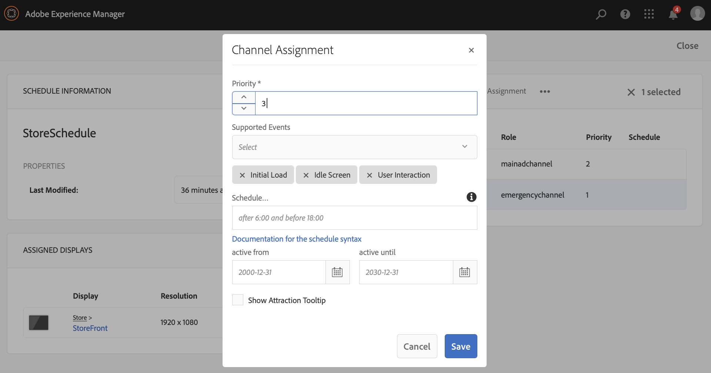

# Canal de emergencia {#emergency-channel}

## Descripción de caso de uso {#use-case-description}

En esta sección se describe un ejemplo de caso de uso que hace hincapié en la creación y administración de un canal de emergencia que el autor de contenido puede cambiar desde un canal de secuencia en caso de una condición previa.

### Condiciones previas {#preconditions}

Antes de comenzar este caso de uso, asegúrese de comprender cómo:

* **[Crear y administrar canales](managing-channels.md)**
* **[Crear y administrar ubicaciones](managing-locations.md)**
* **[Crear y administrar programaciones](managing-schedules.md)**
* **[Registro de dispositivos](device-registration.md)**

### Actores principales {#primary-actors}

Autores de contenido

## Flujo básico: Configuración del proyecto {#basic-flow-setting-up-the-project}

Siga los pasos a continuación para configurar un canal de emergencia:

1. Cree un proyecto de AEM Screens con el nombre **EmergencyChannel**, como se muestra a continuación.

   >[!NOTE]
   >Para obtener más información sobre la creación y administración de proyectos en AEM Screens, consulte Creación de un proyecto.

   

1. **Creación de un canal de secuencia**

   1. Seleccione la carpeta **Channels** y haga clic en **Create** para abrir el asistente y crear un canal.

   1. Seleccione **Canal de secuencia** en el asistente y cree el canal denominado **MainAdChannel**.

   

1. **Adición de contenido al canal de secuencia**

   1. Seleccione el canal (**MainAdChannel**).
   1. Haga clic en **Editar** en la barra de acciones para abrir el editor. Arrastre y suelte algunos recursos en el canal.

   

1. **Creación de un canal de emergencia**

   1. Seleccione la carpeta **Channels**.
   1. Haga clic en **Create** para abrir el asistente y crear un canal.
   1. Seleccione **Canal de secuencia** del asistente y cree el canal denominado **Canal de emergencia**.

   >[!NOTE]
   >
   >Normalmente, el canal de emergencia se agrega al proyecto de producción preexistente.

   

1. **Adición de contenido al canal de emergencia**

   1. Seleccione el canal (**Canal de emergencia)**.
   1. Haga clic en **Editar** en la barra de acciones para abrir el editor. Arrastre y suelte el recurso que desea ejecutar durante una emergencia en el canal.

   

1. **Creación de una ubicación** 

   1. Vaya a la carpeta **Ubicaciones**.
   1. Haga clic en **Crear** en la barra de acciones y cree una ubicación titulada **Almacenar** desde el asistente.

   

1. **Creación de visualizaciones en la ubicación**

   Vaya a su ubicación (**Store**) y haga clic en **Create** en la barra de acciones. Siga el asistente para crear dos **Muestra** titulada como **StoreFront** y **StoreBack**.

   

1. **Creación de un programa**

   1. Vaya a la carpeta **Schedules**.
   1. Haga clic en **Crear** en la barra de acciones. Siga el asistente para crear una programación titulada como **StoreSchedule**.

   

1. Asigne ambas visualizaciones a la programación y defina las prioridades

   1. Seleccione la programación **(StoreSchedule)** y haga clic en **Panel** en la barra de acciones.

   1. Haga clic en **+ Asignar canal** en el panel **CANALES ASIGNADOS**.

   1. Desde el cuadro de diálogo **Asignación de canales**:

      1. Seleccione la ruta de acceso a **MainAdChannel**
      1. Establezca la **Prioridad** como 2
      1. Configure los eventos admitidos como **Initial Load** y **Idle Screen**.
      1. Haga clic en **Guardar**

      Del mismo modo, tendrá que seguir los mismos pasos de nuevo para asignar el **EmergencyChannel** y establecer su **Prioridad**.
   >[!NOTE]
   >
   >La prioridad se utiliza para solicitar las asignaciones en caso de que varias de ellas coincidan con los criterios de reproducción. Aquel elemento que tenga el valor más alto siempre tendrá prioridad sobre otros valores más bajos.

   

1. Haga clic en **+ Asignar canal** en el panel **CANALES ASIGNADOS**.

1. Desde el cuadro de diálogo **Asignación de canales**:

   1. Seleccione la ruta a **EmergencyChannel**
   1. Establezca la **Prioridad** como 1

   1. Configure los eventos admitidos como **Carga inicial**, **Pantalla inactiva** e **Interacción del usuario**

   1. Haga clic en **Guardar**

   

   Puede ver los canales asignados desde el panel **StoreSchedule**.

   

1. **Asignación de la programación a cada visualización**

   1. Vaya a cada pantalla, como **EmergencyChannel** —> **Ubicaciones** —> **Store** —>**StoreFront**.

   1. Haga clic en **Dashboard** desde la acción para abrir el tablero de visualización.
   1. Haga clic en **...** del panel **CANALES Y PROGRAMAS ASIGNADOS** y haga clic en **+Asignar programación**.

   1. Seleccione la ruta de acceso a la programación (por ejemplo, aquí, **EmergencyChannel** —> **Programas** —>**StoreSchedule**).

   1. Haga clic en **Guardar**.

   Puede ver la programación asignada a la visualización desde el panel **StoreSchedule**.
   

1. **Registro de dispositivos**

   Complete el proceso de registro del dispositivo y una vez que se haya registrado, verá la siguiente salida en su reproductor AEM Screens.

   

## Cambio al canal de emergencia {#switching-to-emergency-channel}

En caso de una emergencia, realice los siguientes pasos:

1. Vaya a **EmergencyChannel** —> **Programas** —> **StoreSchedule** y seleccione **Panel** en la barra de acciones.

   

1. Seleccione **EmergencyChannel** en el panel **StoreSchedule** y haga clic en **Editar asignación**.

   

1. Actualice **Priority** del **EmergencyChannel** a **3** desde el cuadro de diálogo **Asignación de canales** y haga clic en **Guardar**.

   

1. Tan pronto como se actualice la prioridad del canal, todo el reproductor de AEM Screens mostrará el contenido **EmergencyChannel**, como se muestra a continuación.

   

### Conclusión {#conclusion}

El **EmergencyChannel** seguirá mostrando su contenido hasta que el autor del contenido restablezca el valor de prioridad en 1.

Una vez que el autor del contenido recibe las instrucciones de que se ha borrado la emergencia, debe actualizar la prioridad del **MainAdChannel** que hará que se reanude la reproducción normal.
