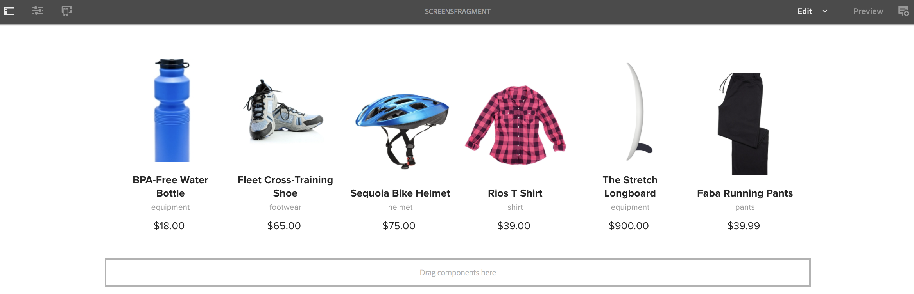

# Uso de fragmentos de experiencias {#using-experience-fragments}

Esta página cubre los siguientes temas:

* **Información general**
* **Uso de fragmentos de experiencias en AEM Screens**
* **Propagación de cambios en la página**

## Información general {#overview}

Un ***Fragmento de experiencia*** es un grupo de uno o más componentes, incluido el contenido y el diseño, al que se puede hacer referencia en las páginas. Los fragmentos de experiencia pueden contener cualquier componente, como uno o varios componentes que pueden contener cualquier cosa dentro de un sistema de párrafos al que se hace referencia en la experiencia completa o que solicita un tercer punto final.

## Uso de fragmentos de experiencias en AEM Screens {#using-experience-fragments-in-aem-screens}

>[!NOTE]
>El siguiente ejemplo utiliza **`We.Retail`** como proyecto de demostración desde el que se aplica el fragmento de experiencia de una **Sites** a un proyecto de AEM Screens.

Por ejemplo, el siguiente flujo de trabajo muestra el uso de fragmentos de experiencia de `We.Retail` en Sitios. Puede elegir una página web y utilizar ese contenido en su canal de AEM Screens en uno de sus proyectos.

### Requisitos previos {#pre-requisites}

**Creación de un proyecto de demostración con un canal**

***Creación de un proyecto***

1. Para crear un proyecto, seleccione **Crear proyecto de Screens**.
1. Escriba el título como **DemoProject**.
1. Seleccione **Guardar**.

A **DemoProject** se añade a su AEM Screens.

***Creación de un canal***

1. Vaya a **DemoProject** ha creado y seleccionado el **Canales** carpeta.

1. Seleccionar **Crear** en la barra de acciones para poder abrir el asistente.
1. Elija la **Canal de secuencia** en el asistente y seleccione. **Siguiente**.

1. Introduzca el **Título** as **TestChannel** y seleccione **Crear**.

A **TestChannel** se añade a su **DemoProject**.\

### Creación de un fragmento de experiencia {#creating-an-experience-fragment}

Siga los pasos a continuación para aplicar el contenido de **`We.Retail`** a su **TestChannel** in **DemoProject**.

1. **Vaya a una página de Sites en We.Retail**

   1. Vaya a Sitios y seleccione **`We.Retail`** > **Estados Unidos** > **Inglés** > **Equipamiento** y seleccione esta página para poder utilizarla como fragmento de experiencia para su canal de Screens.

   1. Seleccionar **Editar** en la barra de acciones, para poder abrir la página que desee utilizar como fragmento de experiencia para el canal de Screens.

1. **Reutilización del contenido**

   1. Seleccione el fragmento que desea incluir en el canal.
   1. Seleccione el último icono de la derecha para poder abrir el **Convertir a fragmento de experiencia** Cuadro de diálogo.

   

1. **Creación de un fragmento de experiencia**

   1. Elija la **Acción** as **Crear un nuevo fragmento de experiencia**.

   1. Seleccione el **Ruta principal**.
   1. Seleccione el **Plantilla**. Elija la **Fragmento de experiencias: variación de pantallas** plantilla aquí (valor del campo ) `/libs/settings/screens/experience-fragments/templates/experience-fragment-template-screens`).

   1. Introduzca el **Título del fragmento** as **ScreensFragment**.

   1. Para completar la creación de un nuevo fragmento de experiencia, seleccione la marca de verificación.

   

   Nota: Para seleccionar una opción más sencilla, active la marca de verificación situada a la derecha del campo para abrir el cuadro de diálogo de selección.

1. **Creación de la Live Copy del fragmento de experiencia**

   1. AEM Vaya a la página de inicio de la.
   1. Seleccionar **Fragmentos de experiencias** y resalte el **ScreensFragment** y haga clic en **Variación como Live Copy**, como se muestra en la figura siguiente:

   

   c. Seleccione la **ScreensFragment** de **Crear Live Copy** y haga clic en **Siguiente**.

   d. Introduzca la **Título** y **Nombre** as **Screens**.

   e. Seleccione **Crear** para poder crear la Live Copy.

   f. Seleccione **Listo** para poder volver a **ScreensFragment** página.

   

   >[!NOTE]
   >
   >Después de crear un fragmento de AEM Screens, puede editar las propiedades del fragmento. Seleccione el fragmento y haga clic en **Propiedades** de la barra de acciones.

   **Edición de propiedades de un fragmento de Screens**

   1. Vaya a **ScreensFragment** (creada en los pasos anteriores) y haga clic en **Propiedades** de la barra de acciones.

   1. Seleccione el **Configuración sin conexión** , como se muestra en la figura siguiente.

   Puede añadir la variable **Bibliotecas del lado del cliente** (Java™ y css) y **Archivos estáticos** a su Fragmento de experiencia.

   El siguiente ejemplo muestra la adición de bibliotecas del lado del cliente y las fuentes como parte de archivos estáticos al Fragmento de experiencia.  

1. **Uso del fragmento de experiencia como componente en el canal de Pantallas**

   1. Vaya al canal de Pantallas donde desee utilizar la variable **Screens** fragmento.
   1. Seleccione el **TestChannel** y haga clic en **Editar** de la barra de acciones.

   1. Haga clic en el icono de componentes de la pestaña lateral.
   1. Arrastre y suelte el **Fragmento de experiencia** a su canal.

   

   e. Seleccione la **Fragmento de experiencia** y seleccione el icono superior izquierdo (llave inglesa) para poder abrir el **Fragmento de experiencia** Cuadro de diálogo.

   f. Seleccione la **Screens** Live Copy del fragmento creado en *Paso 3* in **Ruta**.

   

   f. Seleccione la **Screens** Live Copy del fragmento creado en *Paso 3* en el **Fragmento de experiencia**.

   

   h. Introduzca los milisegundos en **Duración**.

   i. Seleccione la opción **Configuración sin conexión** desde el **Fragmentos de experiencias** para definir las bibliotecas del lado del cliente y los archivos estáticos.

   >[!NOTE]
   >
   >Para agregar bibliotecas del lado del cliente o archivos estáticos además de lo que configuró en el paso (4), puede agregar desde el **Configuración sin conexión** en la pestaña **Fragmento de experiencia** Cuadro de diálogo.

   

   j. Seleccione la marca de verificación para poder completar el proceso.

### Validación del resultado {#validating-the-result}

Después de completar los pasos anteriores, puede validar el fragmento de experiencia en **ChannelOne** por:

1. Navegación al **TestChannel**.
1. Selección de la **Previsualizar** de la barra de acciones.

Ver el contenido desde **Sites** (Live Copy del fragmento de experiencia) en su canal, como se muestra en la figura siguiente:\

## Propagación de cambios en la página {#propagating-changes-from-the-master-page}

***Live Copy*** hace referencia a la copia (del origen), mantenida mediante acciones de sincronización definidas según las configuraciones de despliegue.

Dado que el fragmento de experiencia que ha creado es una Live Copy del **Sites** Si cambia ese fragmento concreto de la página principal, verá los cambios en el canal. O bien, vea el destino en el que ha utilizado el fragmento de experiencia.

>[!NOTE]
>
>Para obtener más información sobre Live Copy, consulte Reutilización del contenido: administrador de varios sitios y Live Copy.

Siga los pasos a continuación para propagar los cambios del canal principal al canal de destino:

1. Seleccione el fragmento de experiencia de la lista **Sites** (principal) y haga clic en el icono de lápiz para editar los elementos en el Fragmento de experiencia.

   

1. Seleccione el fragmento de experiencia y haga clic en el icono de la llave inglesa para abrir el cuadro de diálogo y editar las imágenes.

   

1. El **Cuadrícula de producto** se abre el cuadro de diálogo.

   

1. Puede editar cualquiera de las imágenes. Por ejemplo, aquí la primera imagen se reemplaza en este fragmento.

   

1. Seleccione el Fragmento de experiencia y haga clic en el icono Despliegue para poder propagar los cambios al fragmento que se utiliza en el canal.

   

1. Seleccione Despliegue.

   Observe que los cambios se despliegan.

   

### Validación de los cambios {#validating-the-changes}

Siga los pasos a continuación para confirmar los cambios en el canal:

1. Vaya a **Screens** > **Canales** > **TestChannel**.

1. Clic **Previsualizar** de la barra de acciones.

La siguiente imagen ilustra los cambios en su **TestChannel**:\

