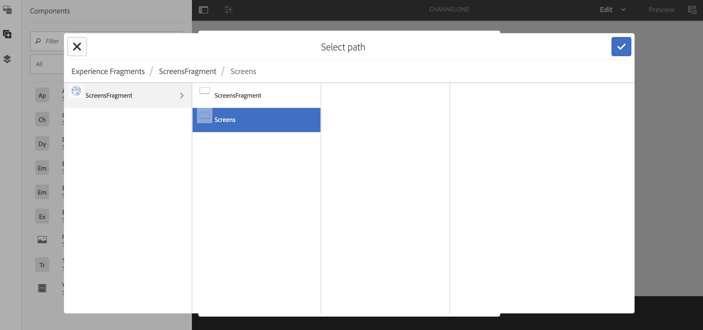

# Uso de fragmentos de experiencias {#using-experience-fragments}

Esta página cubre los siguientes temas:

* **Información general**
* **Uso de fragmentos de experiencias en AEM Screens**
* **Propagación de cambios en la página**

## Información general {#overview}

Un ***fragmento de experiencias*** es un grupo de uno o varios componentes que incluye contenido y diseño que se puede consultar dentro de las páginas. Los fragmentos de experiencias pueden contener cualquier componente, como por ejemplo uno o varios componentes que pueden contener cualquier cosa dentro de un sistema de párrafos, al que se hará referencia en toda la experiencia o que solicitará un punto final tercero.

## Uso de fragmentos de experiencias en AEM Screens {#using-experience-fragments-in-aem-screens}

>[!NOTE]
>El ejemplo siguiente utiliza **We.Retail** como proyecto de demostración desde el que se aprovecha el fragmento de experiencias de una página de **sitios** a un proyecto de AEM Screens.

Por ejemplo, el siguiente flujo de trabajo muestra el uso de fragmentos de experiencia de We.Retail en Sitios. Puede elegir una página web y aprovechar ese contenido en su canal de AEM Screens en uno de sus proyectos.

### Requisitos previos {#pre-requisites}

**Creación de un proyecto de demostración con un Canal**

***Creación de un proyecto***

1. Haga clic en **Crear proyecto** de pantallas para crear un nuevo proyecto.
1. Introduzca **DemoProject** como título.
1. Haga clic en **Guardar**.

Se agregará un **DemoProject** a su AEM Screens.

***Crear un canal*** 

1. Navigate to the **DemoProject** you created and select the **Channels** folder.

1. Click **Create** from the action bar to open the wizard.
1. Elija la plantilla **Canal** de secuencia en el asistente y haga clic en **Siguiente**.

1. Enter the **Title** as **TestChannel** and click **Create**.

Se agregará **TestChannel** a **DemoProject**.\

### Creación de un fragmento de experiencia {#creating-an-experience-fragment}

Siga los pasos a continuación para aprovechar el contenido de **We.Retail** a su **TestChannel** en **DemoProject**.

1. **Navegue a la página Sitios en We.Retail**

   1. Vaya a Sitios y seleccione **We.Retail In-Store** -> **Canales** ->Canales **inactivos - Noche** y seleccione esta página para utilizarla como fragmento de experiencia en el canal Pantallas.

   1. Haga clic en **Editar** en la barra de acciones para abrir la página que desee utilizar como fragmento de experiencia para el canal Pantallas.

1. **Reutilización del contenido**

   1. Seleccione el fragmento que desee incluir en el canal.
   1. Haga clic en el último icono de la derecha para abrir el cuadro de diálogo **Convertir en fragmento** de experiencia.

   

1. **Creación del fragmento de experiencia**

   1. Elija la **acción** como **Crear un nuevo fragmento** de experiencias.

   1. Seleccione la ruta **principal**.
   1. Select the **Template**. Seleccione la plantilla Fragmento de **experiencia - Variación** de pantalla aquí.

   1. Enter the **Fragment Title** as **ScreensFragment**.

   1. Haga clic en la marca de verificación para completar la creación de un nuevo fragmento de experiencia.

   

1. **Creación de Live Copy del fragmento de experiencias**

   1. Vaya a la página de inicio AEM.
   1. Seleccione Fragmentos **de** experiencia, resalte el **fragmento** Pantallas y haga clic en **Variación como Live Copy**, como se muestra en la figura siguiente:

   

   c. Seleccione **ScreensFragment** en el asistente **Crear Live Copy** y haga clic en **Siguiente**.

   d. Introduzca el **Título** y el **Nombre** como **Pantallas**.

   e. Haga clic en **Crear** para crear la Live Copy.

   f. Haga clic en **Listo** para volver a la página **Fragmento** de pantallas.

   

   >[!NOTE]
   >
   >Una vez creado el fragmento Pantallas, puede editar las propiedades del fragmento. Seleccione el fragmento y haga clic en **Propiedades** en la barra de acciones.

   **Edición de propiedades de un fragmento de pantallas**

   1. Vaya a **ScreensFragment** (creado en los pasos anteriores) y haga clic en **Propiedades** en la barra de acciones.

   1. Seleccione la ficha Configuración **** sin conexión, como se muestra en la figura siguiente.

   Puede agregar las bibliotecas **del lado del** cliente (java y css) y los archivos **estáticos** al fragmento de experiencia.

   En el siguiente ejemplo se muestra la adición de bibliotecas de cliente y fuentes como parte de archivos estáticos al fragmento de experiencia.  

1. **Uso del fragmento de experiencia como componente en el Canal Pantallas**

   1. Vaya al canal Pantallas en el que desea utilizar el fragmento **Pantallas** .
   1. Seleccione **TestChannel** y haga clic en **Editar** en la barra de acciones.

   1. Haga clic en el icono de componentes en la ficha lateral.
   1. Arrastre y suelte el fragmento de **experiencias** en el canal.

   

   e. Seleccione el componente Fragmento **de** experiencia y seleccione el icono superior izquierdo (llave inglesa) para abrir el cuadro de diálogo Fragmento de **experiencia** .

   f. Seleccione la **Live Copy de Pantallas** del fragmento creado en el *paso 3* en **Ruta**.

   

   f. Seleccione la **Live Copy de Pantallas** del fragmento creado en el *paso 3* del fragmento **Experiencia**.

   

   h. Introduzca los milisegundos en **Duración**.

   i. Seleccione la configuración **** sin conexión en el cuadro de diálogo Fragmentos **de** experiencia para definir las bibliotecas del lado del cliente y los archivos estáticos.

   >[!NOTE]
   >
   >Si desea agregar bibliotecas del lado del cliente o archivos estáticos además de lo que configuró en el paso (4), puede agregar desde la ficha Configuración **sin conexión del cuadro de diálogo Fragmento** de **** experiencia.

   

   j. Haga clic en la marca de verificación para completar el proceso.

### Validación del resultado {#validating-the-result}

Tras completar los pasos anteriores, puede validar el fragmento de experiencia en **ChannelOne** mediante:

1. Navegación hasta **TestChannel**.
1. Selección de la **Previsualización** en la barra de acciones.

Vista del contenido desde la página **Sitios** (Live Copy del fragmento de experiencia) en el canal, como se muestra en la figura siguiente:\

## Propagación de cambios en la página {#propagating-changes-from-the-master-page}

***Live Copy*** se refiere a la copia (del origen), mantenida mediante acciones de sincronización tal como se define en las configuraciones de despliegue.

Desde el fragmento de experiencias, hemos creado una Live Copy desde las páginas **Sitios** , por lo que si realiza cambios en ese fragmento concreto desde la página de formato, vista los cambios en el canal o en el destino donde ha utilizado el fragmento de experiencias.

>[!NOTE]
>
>Para obtener más información sobre Live Copy, consulte Reutilización del contenido: Multi Site Manager y Live Copy.

Siga los pasos a continuación para propagar los cambios del canal maestro al canal de destino:

1. Seleccione el fragmento de experiencias en la página **Sitios** (maestro) y haga clic en el icono del lápiz para editar los elementos en el fragmento de experiencias.

   

1. Seleccione el fragmento de experiencias y haga clic en el icono de la llave inglesa para abrir el cuadro de diálogo y editar las imágenes.

   

1. Se abre el cuadro **de diálogo Cuadrícula** de producto.

   

1. Puede editar cualquiera de las imágenes. Por ejemplo, aquí la primera imagen se sustituye en este fragmento.

   

1. Seleccione el fragmento de experiencias y haga clic en el icono de despliegue para propagar los cambios en el fragmento que se utiliza en el canal.

   

1. Haga clic en Despliegue para confirmar los cambios.

   Verá que los cambios se implementan.

   

### Validación de los cambios {#validating-the-changes}

Siga los pasos a continuación para confirmar los cambios en el canal:

1. Vaya a **Pantallas** -> **Canales** -> **TestChannel**.

1. Haga clic en **Previsualización** en la barra de acciones para confirmar los cambios.

La siguiente imagen ilustra los cambios realizados en **TestChannel**:\

