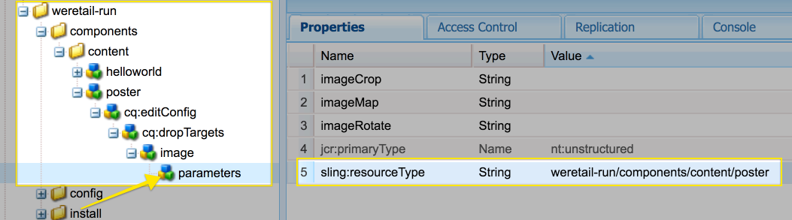
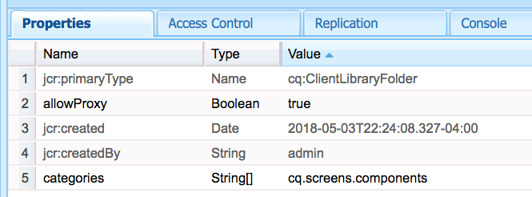

# Ampliación de un componente de AEM Screens

El siguiente tutorial muestra los pasos y las prácticas recomendadas para ampliar los componentes de AEM Screens predeterminados. El componente Imagen se amplía para agregar una superposición de texto legible.

## Información general {#overview}

Este tutorial está diseñado para desarrolladores que son nuevos en AEM Screens. En este tutorial, el componente Imagen de Screens se amplía para crear un componente Póster. Sobre una imagen se superponen un título, una descripción y un logotipo para crear una experiencia atractiva en un canal de secuencias.

>[!NOTE]
>
>Antes de comenzar este tutorial, se recomienda completar el tutorial: [Desarrollo de un componente personalizado para AEM Screens](developing-custom-component-tutorial-develop.md).


Se crea un componente `Custom Poster` ampliando el componente de imagen.

## Requisitos previos {#prerequisites}

Para completar este tutorial, necesita lo siguiente:

1. AEM 6.5 y el último paquete de funciones de Screens
1. [Reproductor de AEM Screens](/help/user-guide/aem-screens-introduction.md)
1. Entorno de desarrollo local

Los pasos y las capturas de pantalla del tutorial se realizan con CRXDE-Lite. Los IDE [Eclipse](https://experienceleague.adobe.com/en/docs/experience-manager-65/content/implementing/developing/devtools/aem-eclipse) o [IntelliJ](https://experienceleague.adobe.com/en/docs/experience-manager-65/content/implementing/developing/devtools/ht-intellij) también se pueden usar para completar el tutorial. Encontrará más información sobre el uso de un IDE para [desarrollar con AEM aquí](https://experienceleague.adobe.com/en/docs/experience-manager-learn/getting-started-wknd-tutorial-develop/project-archetype/project-setup).

## Configuración del proyecto {#project-setup}

El código fuente de un proyecto de Screens se administra normalmente como un proyecto Maven de varios módulos. Para adelantar el tutorial, se generó previamente un proyecto usando el [Arquetipo de proyecto de AEM 13](https://github.com/adobe/aem-project-archetype). Se pueden encontrar más detalles sobre [la creación de un proyecto con el tipo de archivo del proyecto Maven AEM aquí](https://experienceleague.adobe.com/en/docs/experience-manager-learn/getting-started-wknd-tutorial-develop/project-archetype/project-setup).

1. Descargue e instale los siguientes paquetes usando **CRX package manage** `http://localhost:4502/crx/packmgr/index.jsp)r:`

[Obtener archivo](assets/start-poster-screens-weretail-runuiapps-001-snapshot.zip)

   [Obtener archivo](assets/start-poster-screens-weretail-runuicontent-001-snapshot.zip)
   **Opcionalmente,** si trabaja con Eclipse u otro IDE, descargue el siguiente paquete de origen. Implemente el proyecto en una instancia local de AEM mediante el comando Maven:

   **`mvn -PautoInstallPackage clean install`**

   SRC Iniciar Screens `We.Retail` Ejecutar proyecto

[Obtener archivo](assets/start-poster-screens-weretail-run.zip)

1. En **Administrador de paquetes de CRX** `http://localhost:4502/crx/packmgr/index.jsp` están instalados los dos paquetes siguientes:

   1. **`screens-weretail-run.ui.content-0.0.1-SNAPSHOT.zip`**
   1. **`screens-weretail-run.ui.apps-0.0.1-SNAPSHOT.zip`**

   

   Paquetes de AEM Screens `We.Retail Run Ui.Apps` y `Ui.Content` instalados mediante el Administrador de paquetes de CRX

## Crear el componente Póster {#poster-cmp}

El componente Póster amplía el componente Imagen de AEM Screens listo para usar. Se utiliza un mecanismo de Sling, `sling:resourceSuperType`, para heredar la funcionalidad principal del componente de imagen sin tener que copiar y pegar. Encontrará más información sobre los conceptos básicos del procesamiento de solicitudes de [Sling aquí.](https://experienceleague.adobe.com/es/docs/experience-manager-65/content/implementing/developing/introduction/the-basics)

El componente Póster se representa en pantalla completa en el modo de previsualización/producción. En el modo de edición, es importante procesar el componente de forma diferente para facilitar la creación del canal de secuencia.

1. En **CRXDE-Lite** `http://localhost:4502/crx/de/index.jsp` (o IDE de su elección) debajo de para `/apps/weretail-run/components/content`crear un `cq:Component` con el nombre `poster`.

   Agregue las siguientes propiedades al componente `poster`:

   ```xml
   <?xml version="1.0" encoding="UTF-8"?>
   <jcr:root xmlns:sling="https://sling.apache.org/jcr/sling/1.0" xmlns:cq="https://www.day.com/jcr/cq/1.0" xmlns:jcr="https://www.jcp.org/jcr/1.0"
       jcr:primaryType="cq:Component"
       jcr:title="Poster"
       sling:resourceSuperType="screens/core/components/content/image"
       componentGroup="We.Retail Run - Content"/>
   ```

   

   Propiedades de /apps/weretail-run/components/content/poster

   Al establecer la propiedad `sling:resourceSuperType` en `screens/core/components/content/image`, el componente Póster hereda de forma efectiva toda la funcionalidad del componente Imagen. Los nodos y archivos equivalentes encontrados debajo de `screens/core/components/content/image` se pueden agregar debajo del componente `poster` para anular y ampliar la funcionalidad.

1. Copie el nodo `cq:editConfig` debajo de `/libs/screens/core/components/content/image`. Pegue `cq:editConfig` debajo del componente `/apps/weretail-run/components/content/poster`.

   En el nodo `cq:editConfig/cq:dropTargets/image/parameters`, actualice la propiedad `sling:resourceType` para que sea igual a `weretail-run/components/content/poster`.

   

   Representación XML de `cq:editConfig` representada a continuación:

   ```xml
   <?xml version="1.0" encoding="UTF-8"?>
   <jcr:root xmlns:sling="https://sling.apache.org/jcr/sling/1.0" xmlns:cq="https://www.day.com/jcr/cq/1.0" xmlns:jcr="https://www.jcp.org/jcr/1.0" xmlns:nt="https://www.jcp.org/jcr/nt/1.0"
       jcr:primaryType="cq:EditConfig">
       <cq:dropTargets jcr:primaryType="nt:unstructured">
           <image
               jcr:primaryType="cq:DropTargetConfig"
               accept="[image/.*]"
               groups="[media]"
               propertyName="./fileReference">
               <parameters
                   jcr:primaryType="nt:unstructured"
                   sling:resourceType="weretail-run/components/content/poster"
                   imageCrop=""
                   imageMap=""
                   imageRotate=""/>
           </image>
       </cq:dropTargets>
   </jcr:root>
   ```

1. Copie el cuadro de diálogo `image` de WCM Foundation que se utilizará para el componente `poster`.

   Es más fácil comenzar desde un cuadro de diálogo existente y luego realizar modificaciones.

   1. Copiar el cuadro de diálogo de: `/libs/wcm/foundation/components/image/cq:dialog`
   1. Pegar el cuadro de diálogo debajo de `/apps/weretail-run/components/content/poster`

   

   Cuadro de diálogo copiado de `/libs/wcm/foundation/components/image/cq:dialog` a `/apps/weretail-run/components/content/poster`

   El componente de AEM Screens `image` se superescribe en el componente de WCM Foundation `image`. Por lo tanto, el componente `poster` hereda la funcionalidad de ambos. El cuadro de diálogo del componente de póster se compone de una combinación de los cuadros de diálogo Screens y Foundation. Las características de **`Sling Resource Merger`** se utilizan para ocultar campos de diálogo y fichas irrelevantes que se heredan de los componentes con supertipo.

1. Actualice `cq:dialog` debajo de `/apps/weretail-run/components/content/poster` con los siguientes cambios representados en XML:

   ```xml
   <?xml version="1.0" encoding="UTF-8"?>
   <jcr:root xmlns:sling="https://sling.apache.org/jcr/sling/1.0" xmlns:cq="https://www.day.com/jcr/cq/1.0" xmlns:jcr="https://www.jcp.org/jcr/1.0" xmlns:nt="https://www.jcp.org/jcr/nt/1.0"
       jcr:primaryType="nt:unstructured"
       jcr:title="Poster"
       sling:resourceType="cq/gui/components/authoring/dialog">
       <content
           jcr:primaryType="nt:unstructured"
           sling:resourceType="granite/ui/components/foundation/container">
           <layout
               jcr:primaryType="nt:unstructured"
               sling:resourceType="granite/ui/components/foundation/layouts/tabs"
               type="nav"/>
           <items jcr:primaryType="nt:unstructured">
               <image
                   jcr:primaryType="nt:unstructured"
                   jcr:title="Elements"
                   sling:resourceType="granite/ui/components/foundation/section">
                   <layout
                       jcr:primaryType="nt:unstructured"
                       sling:resourceType="granite/ui/components/foundation/layouts/fixedcolumns"
                       margin="{Boolean}false"/>
                   <items jcr:primaryType="nt:unstructured">
                       <column
                           jcr:primaryType="nt:unstructured"
                           sling:resourceType="granite/ui/components/foundation/container">
                           <items
                               jcr:primaryType="nt:unstructured"
                               sling:hideChildren="[linkURL,size]">
                               <file
                                   jcr:primaryType="nt:unstructured"
                                   sling:resourceType="cq/gui/components/authoring/dialog/fileupload"
                                   autoStart="{Boolean}false"
                                   class="cq-droptarget"
                                   fieldLabel="Image asset"
                                   fileNameParameter="./fileName"
                                   fileReferenceParameter="./fileReference"
                                   mimeTypes="[image]"
                                   multiple="{Boolean}false"
                                   name="./file"
                                   title="Upload Image Asset"
                                   uploadUrl="${suffix.path}"
                                   useHTML5="{Boolean}true"/>
                               <title
                                   jcr:primaryType="nt:unstructured"
                                   sling:resourceType="granite/ui/components/foundation/form/textfield"
                                   fieldLabel="Title"
                                   name="./jcr:title"/>
                               <description
                                   jcr:primaryType="nt:unstructured"
                                   sling:resourceType="granite/ui/components/foundation/form/textarea"
                                   fieldLabel="Description"
                                   name="./jcr:description"/>
                               <position
                                   jcr:primaryType="nt:unstructured"
                                   sling:resourceType="granite/ui/components/coral/foundation/form/click"
                                   fieldLabel="Text Position"
                                   name="./textPosition">
                                   <items jcr:primaryType="nt:unstructured">
                                       <left
                                           jcr:primaryType="nt:unstructured"
                                           text="Left"
                                           value="left"/>
                                       <center
                                           jcr:primaryType="nt:unstructured"
                                           text="Center"
                                           value="center"/>
                                       <right
                                           jcr:primaryType="nt:unstructured"
                                           text="Right"
                                           value="right"/>
                                   </items>
                               </position>
                               <color
                                   jcr:primaryType="nt:unstructured"
                                   sling:resourceType="granite/ui/components/coral/foundation/form/click"
                                   fieldLabel="Text Color"
                                   name="./textColor">
                                   <items jcr:primaryType="nt:unstructured">
                                       <light
                                           jcr:primaryType="nt:unstructured"
                                           text="Light"
                                           value="light"/>
                                       <dark
                                           jcr:primaryType="nt:unstructured"
                                           text="Dark"
                                           value="dark"/>
                                   </items>
                               </color>
                           </items>
                       </column>
                   </items>
               </image>
               <accessibility
                   jcr:primaryType="nt:unstructured"
                   sling:hideResource="{Boolean}true"/>
           </items>
       </content>
   </jcr:root>
   ```

   La propiedad `sling:hideChildren`= `"[linkURL,size]`&quot; se usa en el nodo `items` para garantizar que los campos **linkURL** y **size** estén ocultos en el cuadro de diálogo. No basta con quitar estos nodos del cuadro de diálogo del póster. La propiedad `sling:hideResource="{Boolean}true"` de la ficha de accesibilidad se usa para ocultar toda la ficha.

   Se agregan dos campos de clic al cuadro de diálogo, Posición del texto y Color del texto, para dar a los autores control sobre la posición del texto y el color del Título y la Descripción.

   

   Póster - Estructura final del diálogo

   En este punto, se puede agregar una instancia del componente `poster` a la página **Canal inactivo** en el proyecto de ejecución `We.Retail`: `http://localhost:4502/editor.html/content/screens/we-retail-run/channels/idle-channel.edit.html`.

   

   Campos del cuadro de diálogo Póster

1. Crear un archivo debajo de `/apps/weretail-run/components/content/poster` con el nombre `production.html.`

   Rellene el archivo con lo siguiente:

   ```xml
   <!--/*
   
       /apps/weretail-run/components/content/poster/production.html
   
   */-->
   <div data-sly-use.image="image.js"
        data-duration="${properties.duration}"
        class="cmp-poster"
        style="background-image: url(${request.contextPath @ context='uri'}${image.src @ context='uri'});">
       <div class="cmp-poster__text
                   cmp-poster__text--${properties.textPosition @ context='attribute'}
                   cmp-poster__text--${properties.textColor @ context='attribute'}">
           <h1 class="cmp-poster__title">${properties.jcr:title}</h1>
            <h2 class="cmp-poster__description">${properties.jcr:description}</h2>
       </div>
    
   </div>
   ```

   El marcado de producción para el componente Póster se ve directamente arriba. El script HTL anula `screens/core/components/content/image/production.html`. `image.js` es un script del lado del servidor que crea un objeto Image de tipo POJO. Se puede llamar al objeto Image para procesar `src` como una imagen de fondo de estilo en línea.

   Se han agregado las etiquetas `The h1` y h2 para mostrar el Título y la Descripción según las propiedades del componente: `${properties.jcr:title}` y `${properties.jcr:description}`.

   Alrededor de las etiquetas `h1` y `h2` hay un contenedor div con tres clases CSS con variaciones de &quot;`cmp-poster__text`&quot;. El valor de las propiedades `textPosition` y `textColor` se utiliza para cambiar la clase CSS representada en función de la selección del cuadro de diálogo del autor. En la siguiente sección, se escribe CSS desde las bibliotecas de cliente para habilitar estos cambios en la visualización.

   También se incluye un logotipo como superposición en el componente. En este ejemplo, la ruta al logotipo ` We.Retail` está codificada en DAM. Según el caso de uso, puede tener más sentido crear un campo de diálogo para que la ruta del logotipo sea un valor rellenado dinámicamente.

   Tenga en cuenta también que la notación BEM (Modificador de elementos de bloque) se utiliza con el componente. BEM es una convención de codificación CSS que facilita la creación de componentes reutilizables. BEM es la notación utilizada por [los componentes principales de AEM](https://github.com/adobe/aem-core-wcm-components/wiki/CSS-coding-conventions). <!-- DEAD LINK More info can be found at: [https://getbem.com/](https://getbem.com/) -->

1. Crear un archivo debajo de `/apps/weretail-run/components/content/poster` con el nombre `edit.html.`

   Rellene el archivo con lo siguiente:

   ```xml
   <!--/*
   
       /apps/weretail-run/components/content/poster/edit.html
   
   */-->
   
   <div class="aem-Screens-editWrapper ${image.cssClass} cmp-poster" data-sly-use.image="image.js" data-emptytext="${'Poster' @ i18n, locale=request.locale}">
       
       <div class="cmp-poster__text
              cmp-poster__text--${properties.textPosition @ context='attribute'}
          cmp-poster__text--${properties.textColor @ context='attribute'}">
         <p class="cmp-poster__title">${properties.jcr:title}</p>
         <p class="cmp-poster__description">${properties.jcr:description}</p>
       </div>
   </div>
   ```

   El marcado **edited** para el componente Poster se ve directamente arriba. El script HTL anula `/libs/screens/core/components/content/image/edit.html`. El marcado es similar al marcado `production.html` y muestra el título y la descripción encima de la imagen.

   Se agrega `aem-Screens-editWrapper` para que el componente no se represente a pantalla completa en el editor. El atributo `data-emptytext` garantiza que se muestre un marcador de posición cuando no se haya rellenado ninguna imagen o contenido.

## Creación de bibliotecas del lado del cliente {#clientlibs}

Las bibliotecas del lado del cliente proporcionan un mecanismo para organizar y administrar los archivos CSS y JavaScript necesarios para una implementación de AEM. Encontrará más información sobre el uso de [Bibliotecas del lado del cliente aquí.](https://experienceleague.adobe.com/en/docs/experience-manager-65/content/implementing/developing/introduction/clientlibs)

Los componentes de AEM Screens se representan de forma diferente en el modo de edición frente al modo de previsualización/producción. Se crean dos conjuntos de bibliotecas de cliente, una para el modo de edición y otra para la vista previa/producción.

1. Cree una carpeta para las bibliotecas del lado del cliente para el componente Póster.

   Debajo de `/apps/weretail-run/components/content/poster`, cree una carpeta denominada `clientlibs`.

   

1. Bajo la carpeta `clientlibs`, cree un nodo denominado `shared` de tipo `cq:ClientLibraryFolder.`

   

1. Agregue las siguientes propiedades a la biblioteca de cliente compartida:

   * `allowProxy` | Booleano | `true`
   * `categories` | Cadena[] | `cq.screens.components`

   

   Propiedades de /apps/weretail-run/components/content/poster/clientlibs/shared

   La propiedad `categories` es una cadena que identifica la biblioteca de cliente. La categoría `cq.screens.components` se utiliza en los modos Editar y Vista previa/Producción. Por lo tanto, cualquier CSS/JS definido en `shared` clientlib se carga en todos los modos.

   Como práctica recomendada, no exponga nunca ninguna ruta de acceso directamente a `/apps` en un entorno de producción. La propiedad `allowProxy` garantiza que se haga referencia a la biblioteca de cliente CSS y JS a través del prefijo `/etc.clientlibs`. Encontrará más información sobre la propiedad [allowProxy aquí.](https://experienceleague.adobe.com/en/docs/experience-manager-65/content/implementing/developing/introduction/clientlibs)

1. Cree un archivo con el nombre `css.txt` debajo de la carpeta compartida.

   Rellene el archivo con lo siguiente:

   ```
   #base=css
   
   styles.less
   ```

1. Cree una carpeta denominada `css` debajo de la carpeta `shared`. Agregue un archivo de nombre `style.less` debajo de la carpeta `css`. La estructura de las bibliotecas de cliente debería tener este aspecto:

   

   En lugar de escribir CSS directamente, este tutorial utiliza LESS. [LESS](https://lesscss.org/) es un precompilador de CSS popular que admite variables, mezclas y funciones CSS. Las bibliotecas de cliente de AEM admiten de forma nativa la compilación LESS. Puede utilizar Sass u otros precompiladores, pero debe compilarlos fuera de AEM.

1. Rellene `/apps/weretail-run/components/content/poster/clientlibs/shared/css/styles.less` con lo siguiente:

   ```css
   /*
    /apps/weretail-run/components/content/poster/clientlibs/shared/css/styles.less
    Poster component - Shared Style
   */
   
   @import url('https://fonts.googleapis.com/css?family=Fjalla+One|Open+Sans:400i');
   
   @text-light-color: #fff;
   @text-dark-color: #000;
   @title-font-family: 'Fjalla One', sans-serif;
   @description-font-family: 'Open Sans', sans-serif;
   
   .cmp-poster {
   
         &__text {
         position: absolute;
         color: @text-light-color;
         top: 0;
         text-align:center;
         width: 100%;
   
         &--left {
          text-align: left;
                margin-left: 1em;
         }
   
         &--right {
          text-align: right;
                margin-right: 1em;
         }
   
         &--dark {
          color: @text-dark-color;
         }
       }
   
       &__title {
         font-weight: bold;
            font-family: @title-font-family;
            font-size: 1.2em;
       }
   
       &__description {
     font-style: italic;
           font-family: @description-font-family;
    }
   
   }
   ```

   >[!NOTE]
   >
   >Google Web Fonts se utiliza para las familias de fuentes. Web Fonts requiere conectividad a Internet y no todas las implementaciones de AEM Screens tienen una conexión confiable. La planificación del modo sin conexión es una consideración importante para las implementaciones de AEM Screens.

1. Copie la carpeta de la biblioteca de cliente `shared`. Péguelo como secundario y cambie su nombre a `production`.

   

1. Actualizar la propiedad `categories` de la biblioteca de cliente de producción a `cq.screens.components.production.`

   La categoría `cq.screens.components.production` garantiza que los estilos solo se carguen en el modo de Previsualización/Producción.

   

   Propiedades de /apps/weretail-run/components/content/poster/clientlibs/production

1. Rellene `/apps/weretail-run/components/content/poster/clientlibs/production/css/styles.less` con lo siguiente:

   ```css
   /*
    /apps/weretail-run/components/content/poster/clientlibs/production/css/styles.less
    Poster component - Production Style
   */
   
   .cmp-poster {
   
       background-size: cover;
    height: 100%;
    width: 100%;
    position:absolute;
   
        &__text {
   
           top: 2em;
   
           &--left {
               width: 40%;
               top: 5em;
           }
   
           &--right {
               width: 40%;
               right: 1em;
           }
       }
   
       &__title {
     font-size: 5rem;
     font-weight: 900;
     margin: 0.1rem;
    }
   
    &__description {
     font-size: 2rem;
     margin: 0.1rem;
     font-weight: 400;
   
    }
   
       &__logo {
     position: absolute;
     max-width: 200px;
     top: 1em;
     left: 0;
    }
   
   }
   ```

   Los estilos anteriores muestran el Título y la Descripción en una posición absoluta en la pantalla. El título se muestra más grande que la descripción. La notación BEM del componente facilita la definición cuidadosa de los estilos dentro de la clase cmp-poster.

Se puede usar una tercera categoría de biblioteca de cliente: `cq.screens.components.edit` para agregar Editar solo estilos específicos al componente.

| Categoría de Clientlib | Uso |
|---|---|
| `cq.screens.components` | Estilos y scripts compartidos entre los modos de edición y producción |
| `cq.screens.components.edit` | Estilos y scripts que solo se utilizan en el modo de edición |
| `cq.screens.components.production` | Estilos y scripts que solo se utilizan en el modo de producción |

## Agregar el componente Póster a un canal de secuencia {#add-sequence-channel}

El componente Póster se utiliza en un canal de secuencia. El paquete de inicio de este tutorial incluye un canal inactivo. El canal inactivo está preconfigurado para permitir componentes del grupo **`We.Retail Run - Content`**. El grupo del componente Póster está establecido en `We.Retail Run - Content` y está disponible para agregarse al canal.

1. Abrir el canal inactivo desde el proyecto de ejecución de `We.Retail`: **`http://localhost:4502/editor.html/content/screens/we-retail-run/channels/idle-channel.edit.html`**
1. Arrastre y suelte una nueva instancia del componente **Póster** desde la barra lateral de la página.

   

1. Edite el cuadro de diálogo del componente Póster para poder agregar una imagen, un título o una descripción. Utilice las opciones Posición del texto y Color del texto para asegurarse de que el Título/Descripción sea legible sobre la imagen.

   

1. Para agregar algunos componentes de póster, repita los pasos anteriores. Añada transiciones entre los componentes.

   

## En resumen {#putting-it-all-together}

El siguiente vídeo muestra el componente terminado y cómo se puede añadir a un canal de secuencia. A continuación, el canal se añade a una pantalla de ubicación y, finalmente, se asigna a un reproductor de Screens.

>[!VIDEO](https://video.tv.adobe.com/v/22414?quaity=9)

## Código finalizado {#finished-code}

A continuación se muestra el código terminado del tutorial. **screens-weretail-run.ui.apps-0.0.1-SNAPSHOT.zip** y **screens-weretail-run.ui.content-0.0.1-SNAPSHOT.zip** son los paquetes compilados de AEM. **SRC-screens-weretail-run-0.0.1.zip** es el código fuente no compilado que se puede implementar mediante Maven.

[Obtener archivo](assets/final-poster-screens-weretail-runuiapps-001-snapshot.zip)

[Obtener archivo](assets/final-poster-screens-weretail-runuicontent-001-snapshot.zip)

SRC Final AEM Screens `We.Retail` Ejecutar proyecto

[Obtener archivo](assets/src-screens-weretail-run-001.zip)
