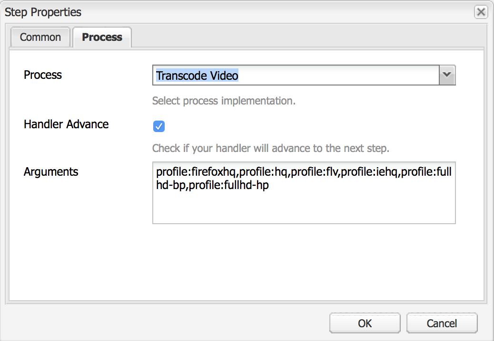
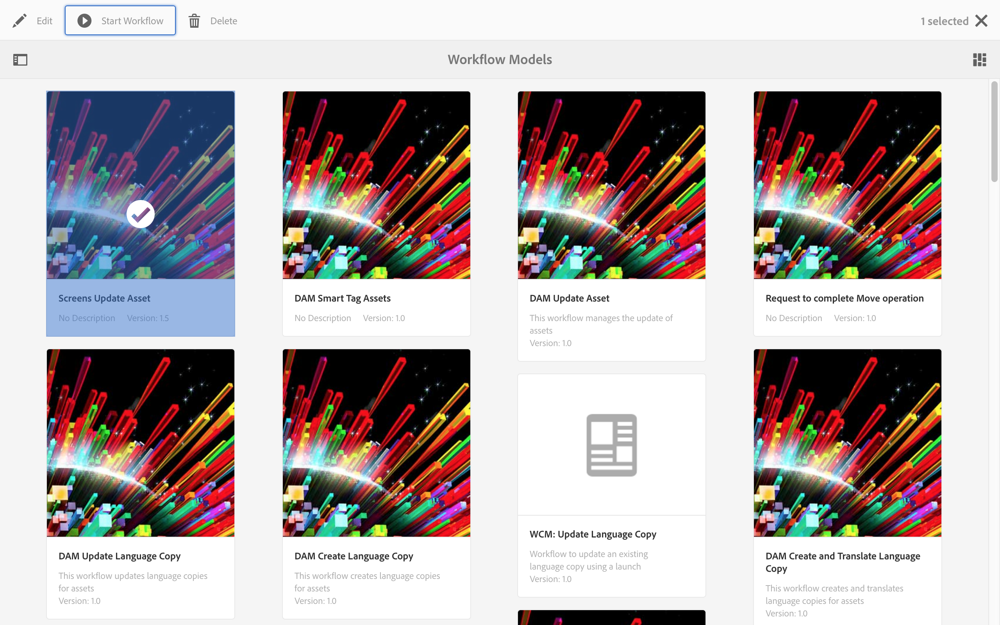
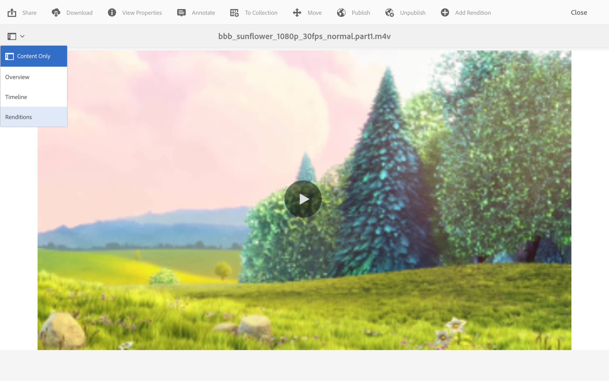

# Representaciones de vídeo {#video-renditions}

>[!IMPORTANT]
>Este contenido es válido para AEM on-premise/AMS (AEM 6.5LTS y AEM 6.5). Para el contenido de AEM as a Cloud Service Screens, consulte la [guía de AEM as a Cloud Service](https://experienceleague.adobe.com/es/docs/experience-manager-cloud-service/content/screens-as-cloud-service/overview/introduction).

Puede generar representaciones full HD manuales y automáticas. En la siguiente sección se describe el flujo de trabajo para agregar representaciones a los recursos.

## Generar automáticamente representaciones Full HD {#automatically-generating-full-hd-renditions}

>[!NOTE]
>
>Si las representaciones de vídeo de AEM Screens no se reproducen de forma óptima en el dispositivo, póngase en contacto con el proveedor de hardware para obtener las especificaciones del vídeo. Al hacerlo, obtendrá el mejor rendimiento en el dispositivo. Le ayuda a crear su propio perfil de vídeo personalizado donde proporciona los parámetros adecuados para que FFMPEG genere su representación. A continuación, siga los pasos a continuación para agregar su perfil de vídeo personalizado a la lista de perfiles.
>
>Vea también [Vídeos de resolución de problemas](troubleshoot-videos.md) para depurar y solucionar problemas de reproducción de vídeo en su canal.

Siga los pasos a continuación para generar representaciones en HD completas automáticamente:

1. Haga clic en el vínculo Adobe Experience Manager (parte superior izquierda) y luego en el icono de martillo para poder hacer clic en **Flujo de trabajo**.

   Haga clic en **Modelos**.

   

1. En la administración del modelo de flujo de trabajo, haga clic en el modelo **DAM Update Asset** y luego haga clic en **Editar** en la barra de acciones.

   

1. En la ventana **Recurso de actualización DAM**, haga doble clic en el paso **Transcodificación FFmpeg**.

   

1. Haga clic en la ficha **Proceso**.
1. Escriba los perfiles HD completos en la lista de **Argumentos** de la siguiente manera:
   ***`,profile:fullhd-bp,profile:fullhd-hp`***
1. Haga clic en **OK**.

   

1. Haga clic en **Guardar** en la parte superior izquierda de la pantalla de **Recurso de actualización DAM**.

   

1. Vaya a **Assets** y cargue un nuevo vídeo. Haga clic en el vídeo y abra el carril lateral Representaciones. Observe los dos vídeos en HD completa.

   

1. Abra **representaciones** desde el carril lateral.

   

1. Observe dos nuevas representaciones en HD completa.

   

## Generación manual de representaciones Full HD {#manually-generating-full-hd-renditions}

Siga los pasos a continuación para generar representaciones en HD completas manualmente:

1. Haga clic en el vínculo Adobe Experience Manager (parte superior izquierda) y luego en el icono de martillo para poder hacer clic en las herramientas y en **Flujo de trabajo**.

   Haga clic en **Modelos**.

   

1. En la administración del modelo de flujo de trabajo, haga clic en el modelo **Screens Update Asset** y luego en **Iniciar flujo de trabajo** para abrir el cuadro de diálogo **Ejecutar flujo de trabajo**.

   

1. Haga clic en el vídeo que quiera en **Carga útil** y luego en **Ejecutar**.

   

1. Vaya a **Assets**, explore en profundidad el recurso y haga clic en él.

   

1. Abra el carril lateral **Representaciones**. Observe las nuevas representaciones en HD completa.

   

