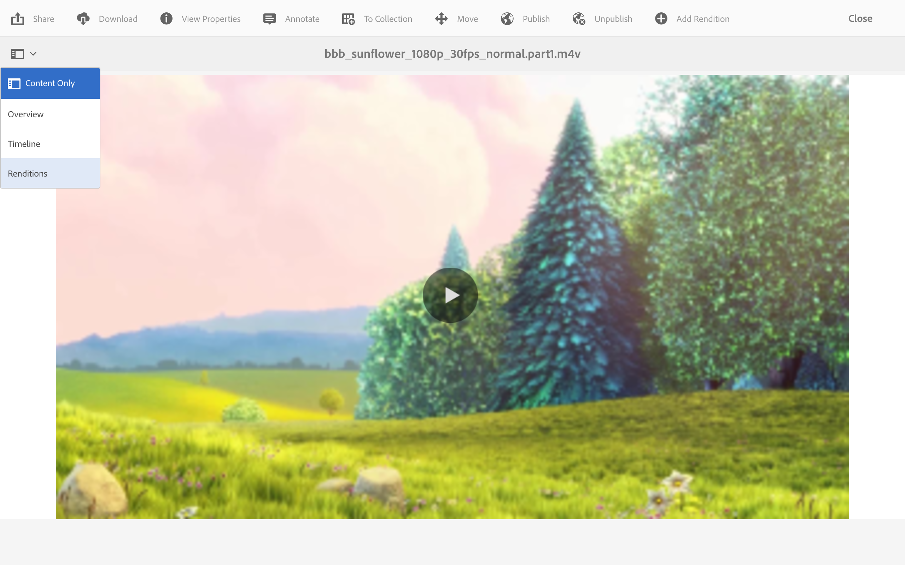

# Representaciones de vídeo {#video-renditions}

Puede generar representaciones Full HD manuales y automáticas. En la siguiente sección se describe el flujo de trabajo para agregar representaciones a los recursos.

## Generar automáticamente representaciones Full HD  {#automatically-generating-full-hd-renditions}

>[!NOTE]
>
>Si las representaciones de vídeo de AEM Screens no se reproducen de forma óptima en el dispositivo, póngase en contacto con el proveedor de hardware para obtener las especificaciones del vídeo. Esto ayuda a obtener el mejor rendimiento en el dispositivo y, por lo tanto, crea su propio perfil de vídeo personalizado donde proporciona los parámetros adecuados para que FFMPEG genere su representación. A continuación, siga los pasos a continuación para agregar su perfil de vídeo personalizado a la lista de perfiles.
>
>Consulte también [Vídeos de resolución de problemas](troubleshoot-videos.md) para depurar y solucionar problemas de reproducción de vídeo en el canal.

Siga los pasos a continuación para generar automáticamente representaciones en HD completas:

1. Seleccione el vínculo Adobe Experience Manager (parte superior izquierda) y seleccione el icono de martillo para poder seleccionar **Flujo de trabajo**.

   Seleccionar **Modelos**.

   

1. En la administración del modelo de flujo de trabajo, seleccione **Recurso de actualización DAM** modelo y seleccione **Editar** de la barra de acciones.

   

1. En el **Recurso de actualización DAM** , haga doble clic en la **Transcodificación FFmpeg** paso.

   

1. Seleccione el **Proceso** pestaña.
1. Introduzca los perfiles de HD completos en la lista de **Argumentos** como se indica a continuación:
   ***`,profile:fullhd-bp,profile:fullhd-hp`***
1. Seleccionar **OK**.

   

1. Seleccionar **Guardar** en la parte superior izquierda de la **Recurso de actualización DAM** pantalla.

   

1. Vaya a **Assets** y cargue un nuevo vídeo. Seleccione el vídeo y abra el carril lateral Representaciones. Observe los dos vídeos en HD completa.

   

1. Abrir **Representaciones** desde la barra lateral.

   

1. Observe dos nuevas representaciones en HD completa.

   

## Generación manual de representaciones Full HD {#manually-generating-full-hd-renditions}

Siga los pasos a continuación para generar manualmente representaciones en HD completas:

1. Seleccione el enlace de Adobe Experience Manager (parte superior izquierda) y seleccione el icono de martillo para poder seleccionar herramientas y seleccionar **Flujo de trabajo**.

   Seleccionar **Modelos**.

   

1. En la administración del modelo de flujo de trabajo, seleccione **Actualizar recurso de Screens** y seleccione el modelo de **Iniciar flujo de trabajo** para abrir **Ejecutar flujo de trabajo** Cuadro de diálogo.

   

1. Seleccione el vídeo que desee en la **Carga útil** y seleccione **Ejecutar**.

   

1. Vaya a **Assets**, explore en profundidad el recurso y selecciónelo.

   

1. Abra el **Representaciones** raíl lateral. Observe las nuevas representaciones en HD completa.

   
