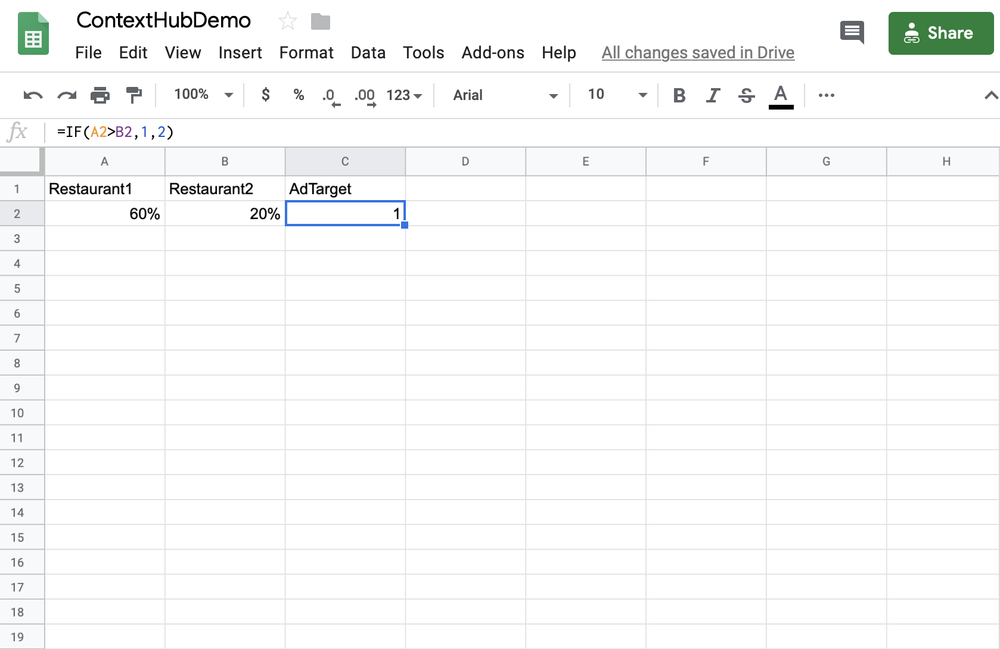

# Activación de reserva de hospitalidad {#hospitality-reservation-activation}

En el siguiente caso de uso se muestra el uso de la activación de reserva de hospital en función de los valores rellenados en las Hojas de cálculo de Google.

## Descripción {#description}

En este caso de uso, la hoja Google Sheet se rellena con un porcentaje de reservas en dos restaurantes **`Restaurant1`** y **`Restaurant2`**. Se aplica una fórmula basada en los valores de `Restaurant1` y `Restaurant2` y, según la fórmula, el valor 1 o 2 se asigna a la columna **AdTarget**.

Si el valor de **`Restaurant1`** > **`Restaurant2`**, entonces **AdTarget** tiene asignado el valor **1**; de lo contrario, **AdTarget** tiene asignado el valor **2**. El valor 1 genera una opción de *Alimento para carne* y el valor dos da como resultado una visualización de la opción *Alimento tailandés* en la pantalla.

## Condiciones previas {#preconditions}

Antes de comenzar a implementar la activación de la reserva, aprende a configurar ***Almacén de datos***, ***Segmentación de audiencia*** y ***Habilitar la segmentación para canales*** en un proyecto de AEM Screens.

Consulte [Configuración de ContextHub en AEM Screens](configuring-context-hub.md) para obtener información detallada.

## Flujo básico {#basic-flow}

Siga los pasos del caso de uso a continuación para implementar la activación de la reserva de hospitalidad para su proyecto de AEM Screens:

1. **Rellenando las hojas de Google y agregando la fórmula**.

   Por ejemplo, aplique la fórmula a la tercera columna **AdTarget**, como se muestra en la figura siguiente.

   

1. **Configuración de los segmentos en Audiences según los requisitos**

   1. Vaya a los segmentos de su audiencia (consulte ***Paso 2: Configuración de la segmentación de audiencia*** en la página **[Configuración de ContextHub en AEM Screens](configuring-context-hub.md)** para obtener más información).
   1. Haga clic en **Hojas A1 1** y luego en **Editar**.
   1. Haga clic en la propiedad de comparación y luego en el icono **Configuración**.
   1. Haga clic en **googlesheets/value/1/2** en la lista desplegable de **Nombre de propiedad**.
   1. Haga clic en el **Operador** como **igual** en el menú desplegable.
   1. Escriba **Value** como **1**.
   1. Del mismo modo, haga clic en **Hojas A1 2** y luego en **Editar**.
   1. Haga clic en la propiedad de comparación y luego en el icono **Configuración**.
   1. Haga clic en **googlesheets/value/1/2** en la lista desplegable de **Nombre de propiedad**.
   1. Haga clic en el **Operador** como **2**.

1. Navegue y haga clic en el canal () y luego haga clic en **Editar** en la barra de acciones. En el ejemplo siguiente, **DataDrivenRestaurant**, se usa un canal secuencial para mostrar la funcionalidad.

   >[!NOTE]
   >
   >El canal ya debería tener una imagen predeterminada y las audiencias deberían preconfigurarse como se describe en [Configuración de ContextHub en AEM Screens](configuring-context-hub.md).

   

   >[!CAUTION]
   >
   >Tu **ContextHub** **configuraciones** con el canal **Propiedades** > pestaña **Personalization** ya debería haberse configurado en este momento.

   

1. Haga clic en **Segmentación** en el editor, luego haga clic en **Marca** y en la **Actividad** en el menú desplegable y luego haga clic en **Iniciar segmentación**.
1. **Comprobando la vista previa**

   1. Haga clic en **Vista previa.** Además, abra las Hojas de cálculo de Google y actualice su valor.
   1. Actualice el valor en las columnas **`Restaurant1`** y **`Restaurant2`**. Si **`Restaurant1`** > **`Restaurant2`,**, deberías poder ver una imagen de la comida de *Steak*; de lo contrario, la imagen de la comida de *Thai* se mostrará en tu pantalla.

   
