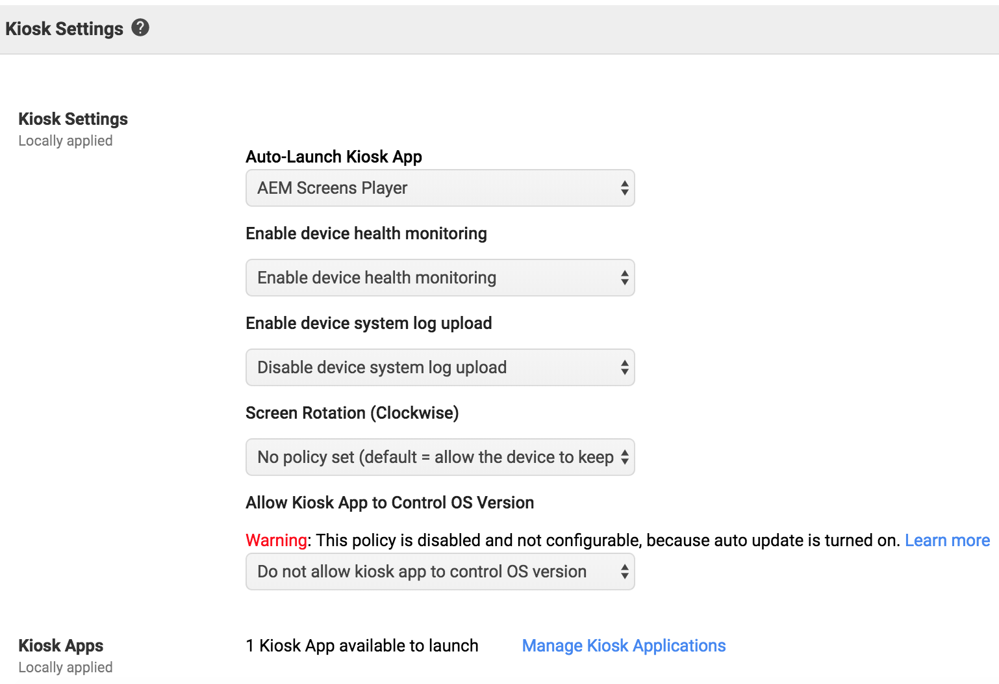

# Implementación del reproductor del sistema operativo Chrome {#implementing-chrome-os-player}

En esta sección se describe cómo implementar el reproductor del sistema operativo Chrome mediante la consola de administración de Chrome.

## Uso de la consola de administración de Chrome {#using-chrome-management-console}

Siga los pasos a continuación para configurar la consola de administración de Chrome:

1. Regístrese en la consola de administración de Chrome. Debe obtener una licencia para la consola de administración de Chrome. Póngase en contacto con [Soporte técnico de Google](https://support.google.com/chrome/a/answer/1375678?hl=en&amp;ref_topic=2935995) para administrar la configuración del dispositivo Chrome para obtener más información.
1. Inscríbase el dispositivo operativo Chrome en el dominio y espere 15 minutos para que el dispositivo se sincronice con la consola de administración de Chrome. Para obtener más información sobre cómo inscribirse en un dispositivo Chrome, haga clic [aquí](https://support.google.com/chrome/a/answer/1360534?hl=en).
1. Chrome Player estará disponible en la tienda web de Chrome.

>[!NOTE]
>
>Se recomienda una solución de administración de dispositivos como la Consola de administración de Chrome para la implementación y administración de dispositivos del sistema operativo Chrome. Aunque este documento proporciona implementación para la Consola de administración de Chrome, hay otros proveedores que afirman proporcionar una funcionalidad similar. Póngase en contacto con el proveedor del software de administración de dispositivos.

### Activación del modo de quiosco {#enabling-kiosk-mode}

Siga los pasos a continuación para habilitar el modo Kiosk:

1. Inicie sesión en Chrome Developer Console.

   

1. Vaya a **Administración de dispositivos** > **Administración de Chrome** > **Configuración de dispositivos**.
1. Desplácese hacia abajo hasta **Configuración de quiosco** y haga clic en **Administrar aplicaciones de quiosco**.

   

1. Seleccione AEM Screens Player en Chrome Web Store.

   >[!NOTE]
   >
   >Una aplicación publicada recientemente puede tardar unos 15 minutos en aparecer en esta lista.

1. Seleccione **Reproductor de AEM Screens** en la lista desplegable **Aplicación de kiosco de inicio automático**.

   Los cambios pueden tardar unos minutos dependiendo de la red. Se recomienda reiniciar.

#### Comprobación del estado del dispositivo remoto {#checking-remote-device-status}

1. Inicie sesión en Chrome Developer Console.
1. Vaya a **Device management** > **Chrome Devices** y seleccione el dispositivo que desea controlar.
1. Haga clic en **Actividad del sistema y solución de problemas**.
1. Compruebe las propiedades **Reboot Device** y **Screen Capture** del dispositivo. También puede comprobar el estado del dispositivo y la información de estado.

>[!NOTE]
>
>Tenga en cuenta que esta configuración puede habilitarse varios minutos después de inscribirse el dispositivo. Cada opción puede habilitarse con el tiempo.

### Configuración remota de reproductores del sistema operativo Chrome {#configuring-remote-configuration-of-chrome-os-players}

AEM Screens Player es una aplicación habilitada para quioscos que también habilita la Configuración de directivas remotas para reproductores de sistemas operativos Chrome.

Siga los pasos a continuación para configurar las distintas opciones del reproductor:

1. Inicie sesión en la consola de administración de Chrome.
1. Haga clic en **Administración de dispositivos** > **Administración de Chrome** > **Administración de aplicaciones**. El Reproductor de AEM Screens se muestra en la lista.
1. Haga clic en la aplicación **AEM Screens Player**.
1. Haga clic en **Configuración de quiosco** y seleccione la organización (*si utiliza un entorno de prueba*).
1. Haga clic en **cargar archivo de configuración** y cargue la directiva de configuración (*Json file*).
1. Haga clic en **Guardar**. Debe reiniciar el dispositivo para sincronizar la directiva.

>[!NOTE]
>
>Reinicie el dispositivo para sincronizar los cambios de la directiva.

#### Archivo JSON de directiva de ejemplo {#example-policy-json-file}

```java
{
  "server": {
    "Value": "https://aemscreensdemo.adobeitc.com"
  },
  "resolution": {
    "Value": "auto"
  },
  "rebootSchedule": {
    "Value": "at 4:00am"
  },
  "enableAdminUI": {
    "Value": true
  },
  "enableOSD": {
    "Value": true
  },
  "enableActivityUI": {
    "Value": true
  }
}
```

### Atributos de política y propósito {#policy-attributes-and-purpose}

La siguiente tabla resume las políticas con sus funciones.

| **Nombre de la directiva** | **Función** |
|---|---|
| *server* | Dirección URL del servidor de Adobe Experience Manager |
| *resolución* | La resolución del dispositivo operativo Chrome |
| *restartSchedule* | La programación para reiniciar el reproductor Chrome |
| *enableAdminUI* | Active la IU de administración para que los técnicos configuren el dispositivo en el sitio. Configúrelo en false una vez que esté completamente configurado y en producción. |
| *enableOSD* | Habilite la interfaz de usuario del conmutador de canales para que los usuarios cambien de canal en el dispositivo. Considere la posibilidad de establecer en false una vez que esté completamente configurado y en producción. |
| *enableActivityUI* | Habilita para mostrar el progreso de actividades como descarga y sincronización. Habilite para solucionar problemas y deshabilite una vez que esté completamente configurado y en producción. |

>[!NOTE]
>
>Las configuraciones de directiva se aplican estrictamente y no se anulan manualmente en la IU de administración del reproductor. Para permitir la configuración manual del reproductor para una directiva en particular, no especifique la directiva en la ***configuración de directiva,*** por ejemplo, si desea permitir la configuración manual para la programación de reinicio, no especifique la clave ***restartSchedule*** en la configuración de directiva.
