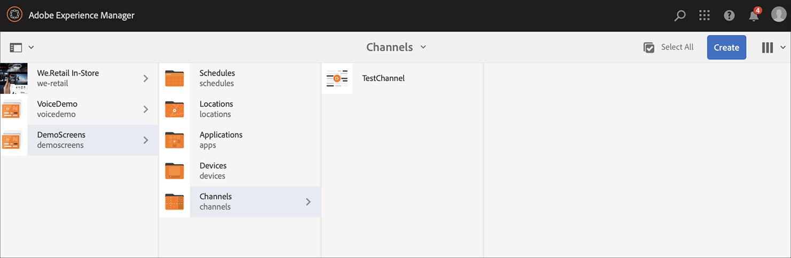

# Guía de inicio rápido {#kickstart-guide}

El inicio rápido de AEM Screens muestra cómo configurar y ejecutar un proyecto de AEM Screens. Le guiará a través de la configuración de una experiencia de señalización digital básica y la adición de contenido como recursos y/o vídeos a cada canal, y la posterior publicación del contenido en un reproductor de AEM Screens.

>[!NOTE]
>Antes de comenzar a trabajar con los detalles del proyecto, asegúrese de haber instalado el último Feature Pack para AEM Screens. Puede descargar el paquete de funciones más reciente desde [Software Distribution Portal](https://experience.adobe.com/#/downloads/content/software-distribution/en/aem.html) mediante su Adobe ID.

## Requisitos previos {#prerequisites}

Siga los pasos a continuación para crear un proyecto de muestra para AEM Screens y publicar contenido en Screens Player.

>[!NOTE]
>El siguiente tutorial muestra cómo reproducir el contenido del canal en el reproductor de Chrome OS.

>[!IMPORTANT]
>**Configuración de OSGi**
>Debe habilitar el remitente del reenvío vacío para permitir que el dispositivo publique datos en el servidor. Por ejemplo, si la propiedad de remitente del reenvío vacía está deshabilitada, el dispositivo no puede publicar una captura de pantalla de nuevo. Actualmente, algunas de estas funciones solo están disponibles si el filtro Remitente del reenvío Sling de Apache Permitir vacío está habilitado en la configuración OSGi. El panel puede mostrar una advertencia de que la configuración de seguridad puede impedir que algunas de estas funciones funcionen.
>Siga los pasos a continuación para habilitar el filtro de Remitente del reenvío Sling de ***Apache para permitir que esté vacío***:

## Permitir solicitudes de Remitente del reenvío vacías {#allow-empty-referrer-requests}

1. Vaya a Configuración **de la consola web de** Adobe Experience Manager mediante AEM instancia —> icono de martillo —> **Operaciones** —> Consola **** web.

   

1. **Se abre la Configuración** de Adobe Experience Manager Web Console. Buscar remitente del reenvío sling.

   Para buscar la propiedad de remitente del reenvío sling, pulse **Comando+F** para **Mac** y **Control+F** para **Windows**.

1. Marque la opción **Permitir vacío** , como se muestra en la figura siguiente.

   

1. Haga clic en **Guardar** para activar el filtro de Remitente del reenvío Sling de Apache Permitir vacío.

## Creación de una experiencia de señalización digital en 5 minutos {#creating-a-digital-signage-experience-in-minutes}

### Creating an AEM Screens Project {#creating-project}

El primer paso es crear un proyecto de AEM Screens.

1. Vaya a la instancia de Adobe Experience Manager (AEM) y haga clic en **Pantallas**. También puede desplazarse directamente desde `https://localhost:4502/screens.html/content/screens](https://localhost:4502/screens.html/content/screens`.

1. Click **Create Screens Project** to create a new Screens project. Enter the title as **DemoScreens** and click **Save**.

   

   >[!NOTE]
   >Una vez creado el proyecto, vuelve a la página de inicio del proyecto Screens. Puede seleccionar el proyecto. En un proyecto, hay cinco carpetas diferentes tituladas **Aplicaciones**, **Canales**, **Dispositivos**, **Ubicaciones** y **Programaciones**.

### Crear un canal{#creating-channel} 

Una vez creado el proyecto de AEM Screens, debe crear un nuevo canal en el que administrar el contenido.

Siga los pasos a continuación para crear un nuevo canal para su proyecto:

1. Una vez creado un proyecto, seleccione el proyecto **DemoScreens** y seleccione la carpeta **Canales** , como se muestra en la figura siguiente. Click **+ Create** from the action bar.

   

1. Elija el Canal **** Secuencia en el asistente y haga clic en **Siguiente**.
   

1. Enter the **Title** as **TestChannel** and click **Create**.

   

   Ahora, **TestChannel** se agrega a la carpeta de canales, como se muestra en la figura siguiente.

   

### Adding Content to a Channel {#adding-content}

Una vez que haya colocado el canal, debe agregar contenido al canal que mostrará AEM Screens Player.

Siga los pasos a continuación para agregar contenido al canal (**TestChannel**) de su proyecto:

1. Navigate to the **DemoProject** you created and select the **TestChannel** from the **Channels** folder.

1. Click **Edit** from the action bar (see the figure below). The editor for the **TestChannel** opens.

   

1. Haga clic en el icono que alterna el panel lateral del lado izquierdo de la barra de acciones para abrir los recursos y componentes.

1. Arrastre los componentes que quiera añadir y colóquelos en el canal.

   

### Creación de una ubicación{#creating-location} 

Una vez que haya colocado el canal, debe crear una ubicación.

>[!NOTE]
>***Las ubicaciones*** compartimentan las distintas experiencias de señalización digital y contienen las configuraciones de las pantallas según dónde estén las distintas pantallas.

Siga los pasos a continuación para crear una nueva ubicación para el proyecto:

1. Navigate to the **DemoProject** you created and select the **Locations** folder.

1. Click **+ Create** from the action bar.

1. Select **Location** from the wizard and click **Next**.

1. Enter the **Name** for your location (enter the title as **TestLocation**) and click **Create**.

Se crea **TestLocation** y se agrega a la carpeta **Locations** .

### Creación de una visualización para una ubicación {#creating-display}

Una vez que haya creado una ubicación, deberá crear una nueva pantalla para la ubicación.

>[!NOTE]
>***La visualización*** representa la experiencia digital que se ejecuta en una o varias pantallas.

1. Vaya a **TestLocation** y selecciónelo.

1. Haga clic en **Crear** en la barra de acciones.

   

1. Select **Display** from the **Create** wizard and click **Next**.

   

1. Enter the **Title** as **LobbyDisplay** and click **Create**.

   

   Ahora se agrega una nueva pantalla titulada **TestDisplay** a su ubicación **TestLocation**, como se muestra en la figura siguiente.

   

### Assigning a Channel {#assigning-channel}

Una vez que se haya completado la configuración del proyecto, debe asignar el canal a una pantalla para vista del contenido.

1. Vaya a la pantalla requerida desde **DemoScreens** —> **Locations** —> **TestLocation** —> **LobbyDisplay**.

1. Tap/click **Assign Channel** from the action bar.

   

   O bien,

   Toque o haga clic en **Panel** en la barra de acciones y haga clic en **+Asignar Canal** en el panel CANALES y PROGRAMAS **ASIGNADOS** .

   

1. The **Channel Assignment** dialog box opens.

1. En la opción **Configuración** , elija el canal **por ruta** y los Eventos **** admitidos como Carga **** inicial y Pantalla **inactiva**.

   >[!NOTE]
   >
   >Los métodos **Función de** Canal, **Prioridad** e **** Interrupción se rellenan de forma predeterminada. Consulte la sección Propiedades del [Canal](/help/user-guide/channel-assignment-latest-fp.md#channel-properties) para obtener más información sobre las propiedades de asignación de canales.

   

   Además, también puede seleccionar la Ventana **de** Activación y la Programación **de** periodicidad.

   >[!NOTE]
   >La programación *de* periodicidad le permite establecer una programación recurrente para su canal. Puede configurar varios programas de periodicidad para un canal.
   >Consulte Programación [de periodicidad](/help/user-guide/channel-assignment-latest-fp.md#recurrence-schedule) para obtener más detalles.

1. Haga clic en **Guardar** una vez que haya configurado las preferencias.

### Registro de un dispositivo y asignación de un dispositivo a una pantalla {#registering-device}

Debe registrar el dispositivo mediante el panel de AEM.

>[!IMPORTANT]
>El reproductor de Chrome OS se puede instalar como complemento del navegador Chrome en el modo de desarrollador sin necesidad de un dispositivo de reproductor de Chrome. Para la instalación, siga los pasos a continuación:
>
>1. Haga clic [aquí](https://download.macromedia.com/screens/) para descargar la versión más reciente de Chrome Player.
>1. Descomprima y guárdelo en el disco.
>1. Abra el navegador Chrome y seleccione **Extensiones** en el menú o navegue directamente a ***chrome://extensions***.
>1. Encienda el modo **de** desarrollador desde la esquina superior derecha.
>1. Haga clic en **Cargar sin empaquetar** desde la esquina superior izquierda y cargue el reproductor Chrome sin comprimir.
>1. Compruebe **AEM Screens Chrome Player** plugin si está disponible en la lista de extensiones.
>1. Abra una nueva ficha y haga clic en el icono **Aplicaciones** en la esquina superior izquierda o navegue directamente a ***chrome://apps***.
>1. Haga clic en **AEM Screens** Plugin para iniciar Chrome Player. De forma predeterminada, el reproductor se inicia en modo de pantalla completa. Pulse **esc** para salir del modo de pantalla completa.

Una vez que el reproductor de Chrome OS esté activado, siga los pasos a continuación para registrar un dispositivo Chrome.

1. Vaya a la carpeta **Dispositivos** del proyecto desde la instancia de AEM.

1. Tap/click the **Device Manager** from the action bar.

   

1. Toque o haga clic en el Registro **del** dispositivo desde la parte superior derecha.

1. Seleccione el dispositivo requerido y toque o haga clic en **Registrar dispositivo**.

   

1. Espere a que el dispositivo envíe su código de registro y compruebe simultáneamente el código **de** registro en el dispositivo Chrome.
   

1. Si el código **de** registro es el mismo en ambos equipos, toque o haga clic en **Validar** en AEM.

1. Defina el nombre que desee como **ChromeDeviceForDemo** para el dispositivo y haga clic en **Registrar**.

   

1. Haga clic en **Asignar visualización** en el cuadro de diálogo Registro correcto **del** dispositivo.

   

1. Seleccione la ruta de la pantalla como **DemoScreens** —> **Ubicaciones** —> **TestLocation** —> **Pantalla** del vestíbulo y haga clic en **Asignar**.

   

1. Una vez que el dispositivo se haya asignado correctamente, verá la siguiente confirmación.

   

1. Tap/click **Finish** to complete the registration process. Debería poder realizar la vista del dispositivo registrado desde el panel de visualización.

   

### Visualización del contenido en Chrome Player {#viewing-content-output}

Todos los recursos del canal se reproducen ahora en el reproductor de Chrome OS.

¡Felicitaciones ahora está reproduciendo contenido en un canal de AEM Screens!

