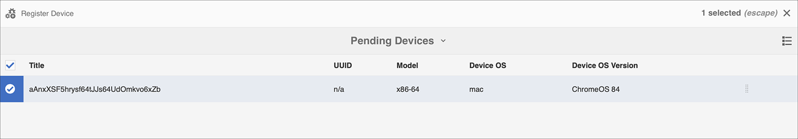

# Guía de KickStart {#kickstart-guide}

La introducción a AEM Screens muestra cómo configurar y ejecutar un proyecto de AEM Screens. Le guiará a través de la configuración de una experiencia de señalización digital básica y la adición de contenido como recursos o vídeos a cada canal, así como la publicación de contenido en un reproductor de AEM Screens.

>[!NOTE]
>Antes de trabajar en los detalles del proyecto, asegúrese de que ha instalado el último paquete de funciones para AEM Screens. Puede descargar el paquete de funciones más reciente de la [Portal de distribución de software](https://experience.adobe.com/#/downloads/content/software-distribution/es/aem.html) con su Adobe ID.

## Requisitos previos {#prerequisites}

Siga los pasos a continuación para crear un proyecto de muestra para AEM Screens y publicar contenido en el reproductor de Screens.

>[!NOTE]
>El siguiente tutorial muestra la reproducción del contenido del canal en el reproductor Chrome OS.

>[!IMPORTANT]
>**Ajustes de configuración de OSGi**
>Debe habilitar el referente vacío para permitir que el dispositivo publique datos en el servidor. Por ejemplo, si la propiedad referrer vacía está deshabilitada, el dispositivo no podrá devolver una captura de pantalla. Actualmente, algunas de estas funciones solo están disponibles si el Filtro de referente de Apache Sling Permitir vacío está habilitado en la configuración de OSGi. Es posible que el tablero muestre una advertencia indicando que la configuración de seguridad puede impedir que funcionen algunas de estas características.
>Siga los pasos a continuación para habilitar el ***Filtro de referente de Apache Sling permitir vacío***:

## Permitir solicitudes de referente vacías {#allow-empty-referrer-requests}

1. Vaya a **Configuración de la consola web Adobe Experience Manager** AEM a través de instancia > icono de martillo > **Operaciones** > **Consola web**.

   

1. **Configuración de la consola web Adobe Experience Manager** abre. Busque el referente de sling.

   Para buscar en la propiedad sling referrer, pulse **Comando + F** para **Mac** y **Control + F** para **Windows**.

1. Compruebe la **Permitir vaciado** , como se muestra en la figura siguiente.

   

1. Seleccionar **Guardar** para habilitar el Filtro de referente de Apache Sling Permitir vacío.

## Creación de una experiencia de señalización digital en 5 minutos {#creating-a-digital-signage-experience-in-minutes}

### Creación de un proyecto de AEM Screens {#creating-project}

El primer paso es crear un proyecto de AEM Screens.

1. Vaya a la instancia de Adobe Experience Manager AEM () y seleccione **Screens**. También puede navegar directamente desde `https://localhost:4502/screens.html/content/screens](https://localhost:4502/screens.html/content/screens`.

1. Seleccionar **Crear proyecto de Screens** para poder crear un proyecto de Screens.
1. Escriba el título como **Demostraciones**, luego seleccione **Guardar**.

   

   >[!NOTE]
   >Después de crear el proyecto, vuelve a la página principal del proyecto de AEM Screens. Ahora puede seleccionar el proyecto. En un proyecto, hay cinco carpetas diferentes tituladas **Aplicaciones**, **Canales**, **Dispositivos**, **Ubicaciones**, y **Horarios**.

### Creación de un canal {#creating-channel}

Una vez creado el proyecto de AEM Screens, cree un canal donde administre el contenido.

Siga los pasos a continuación para crear un canal para su proyecto:

1. Después de crear un proyecto, seleccione la **Demostraciones** proyecto y seleccione la **Canales** , como se muestra en la figura siguiente. Seleccionar **+ Crear** de la barra de acciones.

   

1. Elija la **Canal de secuencia** en el asistente y seleccione **Siguiente**.
   

1. Introduzca el **Título** as **TestChannel** y seleccione **Crear**.

   

   El **TestChannel** ahora se agrega a la carpeta de canales, como se muestra en la figura siguiente.

   

### Adición de contenido a un canal {#adding-content}

Cuando tenga el canal configurado, añada contenido al canal que el reproductor de AEM Screens pueda mostrar.

Siga los pasos a continuación para añadir contenido al canal (**TestChannel**) en su proyecto:

1. Vaya a **DemoProject** ha creado y seleccionado el **TestChannel** desde el **Canales** carpeta.

1. Seleccionar **Editar** de la barra de acciones (consulte la figura siguiente). El editor de **TestChannel** abre.

   

1. Seleccione el icono que conmuta el panel lateral del lado izquierdo de la barra de acciones para abrir los recursos y componentes.

1. Arrastre y suelte los componentes que desee añadir al canal.

   

### Creación de una ubicación {#creating-location}

Cuando tenga el canal configurado, cree una ubicación.

>[!NOTE]
>***Ubicaciones*** compartimente las distintas experiencias de señalización digital e incluya las configuraciones de las pantallas según la ubicación de las mismas.

Siga los pasos a continuación para crear una ubicación para su proyecto:

1. Vaya a **DemoProject** ha creado y seleccionado el **Ubicaciones** carpeta.
1. Seleccionar **+ Crear** de la barra de acciones.
1. Seleccionar **Ubicación** en el asistente y seleccione **Siguiente**.
1. Introduzca el **Nombre** para su ubicación (escriba el título como **TestLocation**) y seleccione **Crear**.

El **TestLocation** se crea y se añade a su **Ubicaciones** carpeta.

### Creación de una visualización para la ubicación {#creating-display}

Cuando haya creado una ubicación, cree una pantalla para la ubicación.

>[!NOTE]
>***Mostrar*** representa la experiencia digital que se ejecuta en una o varias pantallas.

1. Vaya a **TestLocation** y selecciónelo.
1. Seleccionar **Crear** de la barra de acciones.

   

1. Seleccionar **Mostrar** desde el **Crear** asistente y seleccione **Siguiente**.

   

1. Introduzca el **Título** as **LobbyDisplay** y seleccione **Crear**.

   

   Se muestra una nueva pantalla titulada **TestDisplay** ahora se agrega a su ubicación **TestLocation**, como se muestra en la figura siguiente.

   

### Asignación de un canal {#assigning-channel}

Cuando finalice la configuración del proyecto, asigne el canal a una pantalla para ver el contenido.

1. Vaya a la pantalla requerida desde **Demostraciones** > **Ubicaciones** > **TestLocation** > **LobbyDisplay**.

1. Seleccionar **Asignar canal** de la barra de acciones.

   

   O bien,

   Seleccionar **Tablero** en la barra de acciones y seleccione **+Asignar canal** desde el **CANALES Y PROGRAMACIONES ASIGNADOS** panel.

   

1. El **Asignación de canales** se abre el cuadro de diálogo.

1. Desde el **Configuración** opción, elija el canal **por ruta**  y **Eventos admitidos** as **Carga inicial** y **Pantalla inactiva**.

   >[!NOTE]
   >
   >El **Función del canal**, **Prioridad**, y **Métodos de interrupción** se rellenan de forma predeterminada. Consulte [Propiedades de canal](/help/user-guide/channel-assignment-latest-fp.md#channel-properties) para obtener más información sobre las propiedades de asignación de canal.

   

   Además, puede seleccionar la variable **Ventana de activación** y **Horario de periodicidad**.

   >[!NOTE]
   >El *Horario de periodicidad* permite establecer una programación recurrente para el canal. Puede configurar varias programaciones de periodicidad para un canal.
   >Consulte [Horario de periodicidad](/help/user-guide/channel-assignment-latest-fp.md#recurrence-schedule) para obtener más información.

1. Seleccionar **Guardar** una vez configuradas las preferencias.

### Registro de un dispositivo y asignación de un dispositivo a una pantalla {#registering-device}

AEM Registre el dispositivo mediante el panel de control de.

>[!IMPORTANT]
>El reproductor Chrome OS se puede instalar como complemento del navegador Chrome en el modo de desarrollador sin necesidad del dispositivo reproductor Chrome. Para la instalación, siga los pasos a continuación:
>
>1. Seleccionar [aquí](https://download.macromedia.com/screens/) para descargar el último reproductor de Chrome.
>1. Descomprima y guárdelo en el disco.
>1. Abra el navegador Chrome y seleccione **Extensiones** en el menú o vaya directamente a ***chrome://extensions***.
>1. Encienda el **Modo de desarrollador** desde la esquina superior derecha.
>1. Seleccionar **Cargar desempaquetado** desde la esquina superior izquierda y cargue el reproductor Chrome descomprimido.
>1. Marque **Reproductor de AEM Screens Chrome** complemento si está disponible en la lista de extensiones.
>1. Abra una nueva pestaña y seleccione **Aplicaciones** desde la esquina superior izquierda o navegue directamente a ***chrome://apps***.
>1. Seleccionar **AEM Screens** Complemento para que pueda iniciar el reproductor Chrome. De forma predeterminada, el reproductor se inicia en modo de pantalla completa. Prensa **Esc** para salir del modo de pantalla completa.

Cuando el reproductor Chrome OS esté encendido, sigue los pasos a continuación para registrar un dispositivo Chrome.

1. Vaya a **Dispositivos** AEM de su proyecto desde la instancia de la.

1. Seleccione el **Administrador de dispositivos** de la barra de acciones.

   

1. Seleccione el **Registro de dispositivos** desde la parte superior derecha.

1. Seleccione el dispositivo requerido y seleccione **Registrar dispositivo**.

   

1. Espere a que el dispositivo envíe su código de registro y compruebe simultáneamente la **Código de registro** desde el dispositivo Chrome.
   

1. Si la variable **Código de registro** es el mismo en ambos equipos, seleccione **Validate** AEM en la.

1. Defina el nombre deseado como **ChromeDeviceForDemo** para el dispositivo y seleccione **Registrar**.

   

1. Seleccionar **Asignar visualización** desde el **Registro del dispositivo correcto** Cuadro de diálogo.

   

1. Seleccione la ruta a la visualización como **Demostraciones** > **Ubicaciones** > **TestLocation** > **LobbyDisplay** y seleccione **Asignar**.

   

1. Cuando el dispositivo se asigne correctamente, verá la siguiente confirmación.

   

1. Seleccionar **Finalizar** para completar el proceso de registro. Ahora puede ver el dispositivo registrado en el panel de visualización.

   

### Visualización del contenido en Chrome Player {#viewing-content-output}

Todos los recursos del canal se están reproduciendo en el reproductor Chrome OS.

¡Felicidades por reproducir contenido en un canal de AEM Screens!

