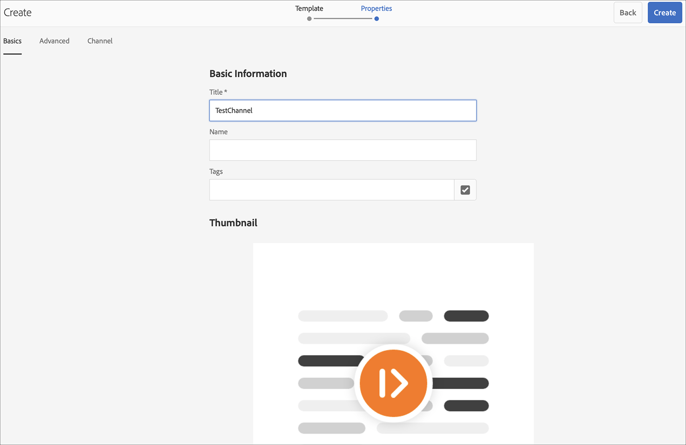

# Guía de inicio rápido {#kickstart-guide}

El inicio de AEM Screens muestra cómo configurar y ejecutar un proyecto de AEM Screens. Le guiará a través de la configuración de una experiencia de señalización digital básica, la adición de contenido como recursos o vídeos a cada canal y la posterior publicación del contenido en un reproductor de AEM Screens.

>[!NOTE]
>Antes de comenzar a trabajar en los detalles del proyecto, asegúrese de que ha instalado el último Feature Pack para AEM Screens. Puede descargar el último paquete de funciones desde el [Portal de distribución de software](https://experience.adobe.com/#/downloads/content/software-distribution/en/aem.html) con su Adobe ID.

## Requisitos previos {#prerequisites}

Siga los pasos a continuación para crear un proyecto de ejemplo para AEM Screens y publicar más contenido en el reproductor Screens.

>[!NOTE]
>El siguiente tutorial muestra la reproducción del contenido del canal en el reproductor Chrome OS.

>[!IMPORTANT]
>**Configuración de OSGi**
>Debe habilitar el referente vacío para permitir que el dispositivo publique datos en el servidor. Por ejemplo, si la propiedad de referente vacía está deshabilitada, el dispositivo no puede publicar una captura de pantalla. Actualmente, algunas de estas funciones solo están disponibles si el filtro de referente Apache Sling Allow Empty está habilitado en la configuración OSGi. El panel puede mostrar una advertencia de que la configuración de seguridad puede impedir que algunas de estas funciones funcionen.
>Siga los pasos a continuación para habilitar el ***Filtro de referente Apache Sling Permitir vacío***:

## Permitir solicitudes de referente vacías {#allow-empty-referrer-requests}

1. Vaya a **Configuración de la consola web de Adobe Experience Manager** mediante AEM instancia —> icono de martillo —> **Operaciones** —> **Consola web**.

   

1. **Se abre la** configuración de la consola web de Adobe Experience Manager. Busque el referente de sling.

   Para buscar la propiedad del referente de sling, presione **Command+F** para **Mac** y **Control+F** para **Windows**.

1. Marque la opción **Permitir vacío**, como se muestra en la figura siguiente.

   

1. Haga clic en **Guardar** para habilitar el filtro de referente Apache Sling Allow Empty.

## Creación de una experiencia de señalización digital en 5 minutos {#creating-a-digital-signage-experience-in-minutes}

### Creación de un proyecto de AEM Screens {#creating-project}

El primer paso es crear un proyecto de AEM Screens.

1. Vaya a la instancia de Adobe Experience Manager (AEM) y haga clic en **Screens**. Alternativamente, puede navegar directamente desde `https://localhost:4502/screens.html/content/screens](https://localhost:4502/screens.html/content/screens`.

1. Haga clic en **Crear proyecto de Screens** para crear un nuevo proyecto de Screens. Introduzca el título como **DemoScreens** y haga clic en **Guardar**.

   

   >[!NOTE]
   >Una vez creado el proyecto, vuelve a la página de inicio del proyecto Screens. Puede seleccionar el proyecto. En un proyecto, hay cinco carpetas diferentes tituladas **Applications**, **Channels**, **Devices**, **Locations** y **Schedules**.

### Crear un canal  {#creating-channel}

Una vez creado el proyecto de AEM Screens, debe crear un nuevo canal en el que administrar el contenido.

Siga los pasos a continuación para crear un nuevo canal para el proyecto:

1. Una vez creado un proyecto, seleccione el proyecto **DemoScreens** y seleccione la carpeta **Channels**, como se muestra en la figura siguiente. Haga clic en **+ Crear** en la barra de acciones.

   

1. Elija **Canal de secuencia** en el asistente y haga clic en **Siguiente**.
   

1. Introduzca **Title** como **TestChannel** y haga clic en **Create**.

   

   El **TestChannel** ahora se agrega a la carpeta de canales, como se muestra en la figura siguiente.

   

### Adición de contenido a un canal {#adding-content}

Una vez que haya colocado el canal, debe añadir contenido al canal que mostrará el reproductor AEM Screens.

Siga los pasos a continuación para agregar contenido al canal (**TestChannel**) de su proyecto:

1. Vaya al **DemoProject** que ha creado y seleccione el **TestChannel** en la carpeta **Channels**.

1. Haga clic **Editar** en la barra de acciones (consulte la figura siguiente). Se abre el editor del **TestChannel**.

   

1. Haga clic en el icono que alterna el panel lateral del lado izquierdo de la barra de acciones para abrir los recursos y componentes.

1. Arrastre los componentes que quiera añadir y colóquelos en el canal.

   

### Creación de una ubicación  {#creating-location}

Una vez que haya configurado el canal, debe crear una ubicación.

>[!NOTE]
>***Las ubicaciones*** compartimentan sus distintas experiencias de señalización digital y contienen las configuraciones de las pantallas según dónde estén las distintas pantallas.

Siga los pasos a continuación para crear una nueva ubicación para el proyecto:

1. Vaya al **DemoProject** que ha creado y seleccione la carpeta **Ubicaciones**.

1. Haga clic en **+ Crear** en la barra de acciones.

1. Seleccione **Ubicación** en el asistente y haga clic en **Siguiente**.

1. Introduzca el **Name** de su ubicación (introduzca el título como **TestLocation**) y haga clic en **Create**.

Se crea **TestLocation** y se agrega a la carpeta **Ubicaciones**.

### Creación de una visualización para una ubicación {#creating-display}

Una vez creada una ubicación, debe crear una nueva visualización para la ubicación.

>[!NOTE]
>***Display*** representa la experiencia digital que se ejecuta en una o varias pantallas.

1. Vaya a **TestLocation** y selecciónelo.

1. Haga clic en **Crear** en la barra de acciones.

   

1. Seleccione **Display** en el asistente **Create** y haga clic en **Next**.

   

1. Introduzca **Title** como **LobbyDisplay** y haga clic en **Create**.

   

   Ahora se agrega una nueva visualización titulada **TestDisplay** a su ubicación **TestLocation**, como se muestra en la figura siguiente.

   

### Asignación de un canal {#assigning-channel}

Una vez completada la configuración del proyecto, debe asignar el canal a una pantalla para ver el contenido.

1. Vaya a la visualización requerida desde **DemoScreens** —> **Ubicaciones** —> **TestLocation** —> **LobbyDisplay**.

1. Toque o haga clic **Asignar canal** en la barra de acciones.

   

   O bien,

   Pulse o haga clic en **Panel** en la barra de acciones y haga clic en **+Asignar canal** en el panel **CANALES Y PROGRAMAS ASIGNADOS**.

   

1. Se abre el cuadro de diálogo **Asignación de canales**.

1. En la opción **Settings**, elija el canal **por ruta** y **Eventos admitidos** como **Carga inicial** y **Pantalla inactiva**.

   >[!NOTE]
   >
   >El **Rol del canal**, **Prioridad** y **Métodos de interrupción** se rellenan de forma predeterminada. Consulte la sección [Propiedades del canal](/help/user-guide/channel-assignment-latest-fp.md#channel-properties) para obtener más información sobre las propiedades de asignación de canales.

   

   Además, también puede seleccionar **Ventana de activación** y **Programación de periodicidad**.

   >[!NOTE]
   >La *programación de periodicidad* le permite establecer una programación recurrente para su canal. Puede configurar varias programaciones de recurrencias para un canal.
   >Consulte [Programación de periodicidad](/help/user-guide/channel-assignment-latest-fp.md#recurrence-schedule) para obtener más información.

1. Haga clic en **Guardar** una vez que haya configurado las preferencias.

### Registro de un dispositivo y asignación de un dispositivo a una pantalla {#registering-device}

Debe registrar el dispositivo mediante el panel de AEM.

>[!IMPORTANT]
>El reproductor Chrome OS se puede instalar como complemento del navegador Chrome en el modo de desarrollador sin necesidad de un dispositivo de reproducción Chrome. Para la instalación, siga los pasos a continuación:
>
>1. Haga clic [aquí](https://download.macromedia.com/screens/) para descargar la última versión de Chrome Player.
>1. Descomprima y guárdelo en el disco.
>1. Abra el explorador Chrome y seleccione **Extensiones** en el menú o navegue directamente a ***chrome://extensions***.
>1. Active el **Developer mode** desde la esquina superior derecha.
>1. Haga clic en **Cargar desempaquetado** desde la esquina superior izquierda y cargue el reproductor Chrome descomprimido.
>1. Compruebe el complemento **AEM Screens Chrome Player** si está disponible en la lista de extensiones.
>1. Abra una nueva pestaña y haga clic en el icono **Aplicaciones** en la esquina superior izquierda o navegue directamente a ***chrome://apps***.
>1. Haga clic en **AEM Screens** Plugin para iniciar Chrome Player. De forma predeterminada, el reproductor se inicia en modo de pantalla completa. Pulse **esc** para salir del modo de pantalla completa.

Una vez que el reproductor Chrome OS esté activado, siga los pasos a continuación para registrar un dispositivo Chrome.

1. Vaya a la carpeta **Devices** del proyecto desde la instancia de AEM.

1. Toque o haga clic en el **Administrador de dispositivos** de la barra de acciones.

   

1. Toque o haga clic en **Device Registration** en la parte superior derecha.

1. Seleccione el dispositivo requerido y pulse o haga clic en **Registrar dispositivo**.

   

1. Espere a que el dispositivo envíe su código de registro y compruebe simultáneamente el **Código de registro** desde el dispositivo Chrome.
   

1. Si el **Código de registro** es el mismo en ambos equipos, pulse o haga clic en **Validar** en AEM.

1. Establezca el nombre deseado como **ChromeDevice forDemo** para el dispositivo y haga clic en **Registrar**.

   

1. Haga clic en **Asignar visualización** en el cuadro de diálogo **Registro de dispositivos correcta**.

   

1. Seleccione la ruta de acceso a la pantalla como **DemoScreens** —> **Ubicaciones** —> **TestLocation** —> **Pantalla de vestíbulo** y haga clic en **Asignar**.

   

1. Una vez que el dispositivo se haya asignado correctamente, verá la siguiente confirmación.

   

1. Toque o haga clic en **Finish** para completar el proceso de registro. Debe poder ver el dispositivo registrado desde el panel de visualización.

   

### Visualización del contenido en el reproductor Chrome {#viewing-content-output}

Todos los recursos del canal se están reproduciendo en el reproductor Chrome OS.

¡Felicidades por haber reproducido contenido en un canal de AEM Screens!

