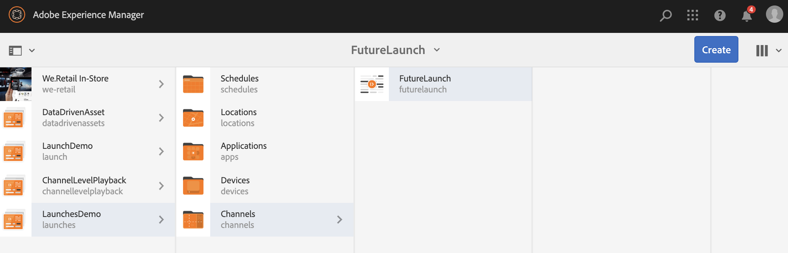

# Lanzamientos {#launches}

Los autores de contenido pueden crear versiones futuras de los canales, conocidas como **Launch** , y una fecha de lanzamiento posterior para este lanzamiento permite que el contenido esté activo en dispositivos o reproductores.

Con la ayuda de lanzamientos, los autores pueden obtener una vista previa de cada canal en el lanzamiento y deben poder iniciar una solicitud de revisión. El grupo Aprobadores recibirá una notificación y puede aprobar o rechazar la solicitud. Cuando se alcanza la fecha de lanzamiento, el contenido se reproduce en los dispositivos.

Por ejemplo, si el autor desea crear versiones futuras de c1, c2 (canales), se crea un lanzamiento y se establece una fecha de lanzamiento (por ejemplo, 10 de noviembre a las 8:00 a.m.). Cualquier otra actualización del contenido se envía para su revisión. Una vez aprobado y en fecha de lanzamiento (10 de noviembre, 8:00 AM), este lanzamiento reproduce el contenido en los dispositivos o reproductores.

## Requisitos {#requirements}

Antes de iniciar la implementación de lanzamientos en un proyecto de AEM Screens, asegúrese de comprender el concepto de período de gracia y su relevancia.

En la siguiente sección se explica el período de gracia y cómo configurarlo de forma predeterminada. También puede descargar una configuración de prueba de muestra para comprender su uso.

### Explicación del período de gracia {#understanding-grace-period}

La siguiente configuración permite al administrador configurar el período ***de ***gracia, necesario en los inicios.

**Período** de gracia, incluye:

* promoción del lanzamiento
* publicación de los recursos para publicar instancias
* tiempo que tardan los dispositivos en descargar el contenido de la instancia de publicación y en cualquier diferencia de tiempo entre el servidor y el reproductor

Por ejemplo: supongamos que el servidor está en PST y que los dispositivos están en EST, la diferencia máxima de tiempo es de 3 horas en este caso y supongamos que la promoción tardará 1 minuto y que la publicación del autor tarda 10 minutos y que el reproductor puede descargar los recursos normalmente en 10-15 minutos. Entonces período de gracia = diferencia de tiempo (3 horas) + tiempo para promocionar el lanzamiento (1 min) + tiempo para publicar el lanzamiento (10 min) + tiempo para descargar en el reproductor (10-15 min) + buffer (para ser seguro, digamos 30 min) = 3 horas 56 min = 14160 segundos. Así que, cuando programemos cualquier lanzamiento en directo, la promoción comenzará pronto con este desplazamiento. En la ecuación anterior, la mayoría de los elementos no toma mucho tiempo, podemos usar una estimación decente para este desplazamiento una vez que sepamos la diferencia de tiempo máxima por parte del servidor y de cualquier reproductor.

### Configuración del período de gracia listo para usar {#configuring-out-of-the-box-grace-period}

De forma predeterminada, el período de gracia para un lanzamiento se establece en 24 horas, lo que significa que cuando se establece la fecha de lanzamiento para cualquier lanzamiento de los recursos en */contenido/pantallas*, la promoción comenzará con este desplazamiento. Por ejemplo, si liveDate se establece como 24 de noviembre, 9:00 a.m. y el período de gracia es de 24 horas, el trabajo de promoción comenzará el 23 de noviembre a las 09:00 a.m.

### Descarga de configuraciones {#downloading-configurations}

Descargue las siguientes configuraciones de prueba:

[Obtener archivo](assets/launches_event_handlerconfig-10.zip)

>[!NOTE]
>
>La configuración mencionada anteriormente tiene 600 segundos como período de gracia en esta configuración de prueba.

#### Actualización de las configuraciones {#updating-the-configurations}

Si desea cambiar la configuración anterior, siga las siguientes instrucciones:

* cree el ***archivo sling:OsgiConfig/ nt:en /apps/system/config ***con el nombre**com.adobe.cq.wcm.launches.impl.LaunchesEventHandler.config **y contenido

   *launches.eventhandler.updatelastmodified=B&quot;false&quot;launches.eventhandler.launch.promoationperiod=[&quot;/content/screen(/.*):600&quot;]launches.eventhandler.threadpool.maxsize=I&quot;5&quot;launches.eventhandler.threadpool.priority=&quot;MIN&quot;*

* `launches.eventhandler.launch.promotion.graceperiod=["/content/screens(/.&#42;):600"`, le permite establecer un período de gracia de 600 segundos en la ruta */contenido/pantallas*.

Esto significa que cuando se establece la fecha de lanzamiento para cualquier inicio de los recursos en */contenido/pantallas*, la promoción comenzará con este desplazamiento. Por ejemplo, si la fecha de lanzamiento se establece como 24 de noviembre, 9:00 AM y el período de gracia es de 600 segundos, el trabajo de promoción comenzará el 24 de noviembre, a las 8:50 AM.

## Uso de inicios {#using-launches}

Siga la sección siguiente para implementar inicios en su proyecto de AEM Screens. Esta sección cubre estos temas:

1. **Creación de un lanzamiento**
1. **Edición de un lanzamiento para establecer la fecha y el ámbito de lanzamiento**

### Creación de un lanzamiento {#creating-a-launch}

Siga los pasos a continuación para implementar la futura funcionalidad de publicación en su proyecto de AEM Screens:

1. Vaya al canal de su proyecto de AEM Screens, por ejemplo, **LaunchesDemo** —> **Channels** —> **FutureLaunch**, como se muestra a continuación.

   >[!CAUTION]
   >
   >Debe crear un lanzamiento a partir de un canal preexistente en el proyecto de AEM Screens.

   

1. Seleccione el canal **FutureLaunch** y haga clic en **Crear**. Seleccione **Iniciar** en el menú desplegable.

   

1. Se abre el asistente **Crear inicio** . Haga clic en **+ Agregar páginas** para seleccionar los canales de AEM Screens para los que desea crear el lanzamiento.

   

1. Vaya al canal y haga clic en **Seleccionar**.

   

1. Una vez seleccionada la página, haga clic en **Siguiente** para ir un paso más allá en el asistente **Crear inicio** .

   

1. Introduzca el título **de** lanzamiento como **promociones** de verano y no necesita establecer la fecha **de** lanzamiento, como se muestra en la figura siguiente. Haga clic en **Crear**.

   >[!NOTE]
   >
   >*Al habilitar o comprobar* la opción **Heredar datos** activos de la página de origen, los canales se pueden crear como copias en directo en el lanzamiento. Si se realizan cambios en el canal original, dichos cambios se aplican automáticamente a los canales de inicio.
   >
   >
   >*Al deshabilitar o desmarcar* **Heredar datos** activos de la página de origen, los canales se pueden copiar sin ninguna relación activa durante el lanzamiento. Por lo tanto, si se realizan cambios en el canal original, dichos cambios no se aplican a los canales de inicio.

   

   >[!NOTE]
   >
   >Puede establecer la fecha de lanzamiento activo en este paso o puede configurarla más tarde mientras edita las propiedades del lanzamiento una vez que ya se ha creado.

1. Verá que se ha creado el lanzamiento. Puede hacer clic en **Abrir** para ver las páginas en el editor o en **Hecho** para volver al proyecto.

   

   Al hacer clic en **Listo** , podrá volver al proyecto **LaunchesDemo** .

   

### Edición de las propiedades de inicio para establecer la fecha de lanzamiento y el ámbito {#editing-the-launch-properties-to-set-the-live-date-and-scope}

Una vez creado el lanzamiento, debe editar las propiedades de inicio para establecer la fecha de lanzamiento como el ámbito del lanzamiento.

Siga los pasos a continuación para editar las propiedades de inicio:

1. Vaya al canal (**FutureLaunch**) y seleccione el canal, como se muestra en la figura siguiente. Abra el carril **Referencias** desde el carril lateral izquierdo.

   >[!NOTE]
   >
   >Seleccione la opción Árbol **de** contenido en el carril izquierdo para abrir el lanzamiento que ha creado.

   

1. Vaya a **Lanzamientos** y seleccione el lanzamiento (**VeranoPromociones**) que ha creado. Haga clic en **Editar propiedades**.

   

1. Se abre el cuadro de diálogo **Promociones** de verano de lanzamiento. Rellene los campos siguientes:

   * Seleccione la fecha de **inicio**
   * Comprobar **producción lista**
   * Seleccione **Promocionar páginas** aprobadas desde el **ámbito**
   >[!NOTE]
   >
   >Explicación de las entradas Lanzamientos en Promoción **automática**:

   >    * **Fecha** de lanzamiento, hace referencia a la fecha de lanzamiento, es decir, la fecha y hora en que el contenido se reproducirá en el reproductor de pantallas según la zona horaria del reproductor.
   >    * **Preparado** para la producción, permite promocionar los canales y significa que el lanzamiento está listo para usarse.
   >    * **Ámbito**, hace referencia a los canales que se pueden promocionar durante un lanzamiento.

   Existen las tres opciones siguientes para configurar el ámbito:
   1. **Promocione el lanzamiento** completo: Todos los canales del lanzamiento se promocionan en la fecha de lanzamiento establecida.
   1. **Promocione las páginas** modificadas: Solo se promocionarán los recursos de lanzamiento editados. Se recomienda utilizar esta opción cuando no se requiera la revisión del inicio. Permite promocionar las modificaciones en los canales de lanzamiento.
   1. **Promocione las páginas** aprobadas: Solo se promocionan las páginas aprobadas en la fecha de lanzamiento establecida.
   

   >[!CAUTION]
   >
   >La promoción de inicio respeta la zona horaria del reproductor/dispositivo en lugar de la del servidor.

1. Haga clic en **Guardar y cerrar** para volver al canal **FutureLaunch** .

   

