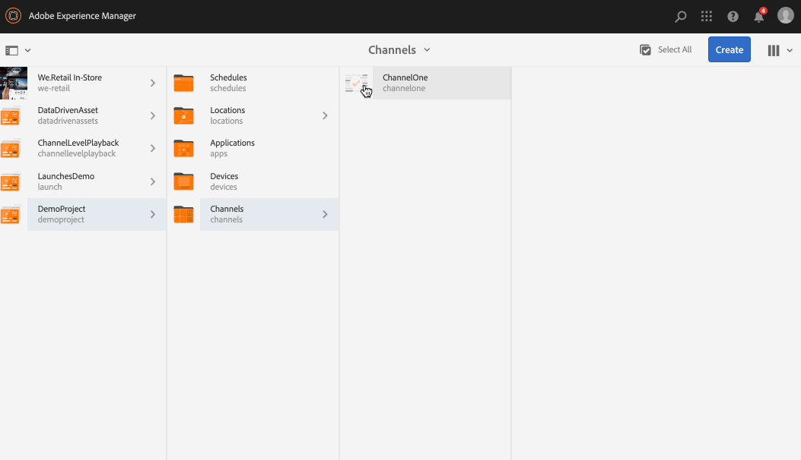

# Crear y administrar canales {#creating-and-managing-channels}

Un Canal muestra una secuencia de contenido (imágenes y vídeos) y también un sitio web o una aplicación de una sola página.

Esta página muestra cómo crear y administrar canales para AEM Screens.

**Requisitos previos**:

* [Configurar e implementar Screens](configuring-screens-introduction.md)
* [Crear y gestionar proyecto de pantallas](creating-a-screens-project.md)

## Crear un nuevo canal {#creating-a-new-channel}

Una vez creado el proyecto para AEM Screens, siga los pasos a continuación para crear un nuevo Canal para el proyecto:

1. Seleccione el vínculo de Adobe Experience Manager (parte superior izquierda) y luego seleccione Screens. También puede desplazarse directamente a `https://localhost:4502/screens.html/content/screens`.

1. Vaya al proyecto Pantallas y seleccione la carpeta **Canales**.

1. Haga clic en **Crear** en la barra de acciones.

   

1. Seleccione la plantilla **Canal de secuencia** en el asistente **Crear** y haga clic en **Siguiente**.

   

1. Introduzca el Título como **ScreensChannel** y haga clic en **Crear**.

   

1. Ahora se agrega un canal de secuencia a la carpeta **Canales**.

### Tipos de canales {#channel-types}

Las opciones de plantilla siguientes están disponibles mientras utiliza el asistente, por ejemplo:

| **Opción de plantilla** | **Descripción** |
|---|---|
| Carpeta de canales | Permite crear una carpeta para almacenar la colección de canales. |
| Canal de secuencia | Permite crear un canal que reproduce los componentes de forma secuencial (uno por uno en una presentación con diapositivas). |
| Canal de aplicaciones | Permite mostrar la aplicación web personalizada en el reproductor Screens. |
| Canal de pantalla dividida 1x1 | Permite la vista del componente en una sola zona. |
| Canal de pantalla dividida 1x2 | Permite la vista de los recursos en dos zonas (divididos horizontalmente). |
| canal de pantalla dividida 2X1 | Permite la vista de los recursos en dos zonas (divididos verticalmente). |
| Canal de pantalla dividida 2x2 | Permite la vista de los recursos en cuatro zonas (divididos horizontal y verticalmente en una matriz). |
| Canal de pantalla dividida 2 a 3 | Permite la vista de los recursos en dos zonas (divididas horizontalmente), siendo una de ellas más grande que la otra. |
| Canal de pantalla dividida en barras L izquierda o derecha | Permite a los autores de contenido vista diferentes tipos de recursos en zonas de tamaño adecuado. |

>[!NOTE]
>
>Los canales Dividir pantalla dividen la visualización en varias zonas para que pueda reproducir varias experiencias al mismo tiempo, una junto a la otra. Las experiencias pueden ser elementos estáticos o de texto o secuencias incrustadas.

>[!IMPORTANT]
>
> Una vez que cree y añada contenido al canal, el siguiente paso es crear una ubicación seguida de una visualización. Además, debe asignar ese canal a una pantalla. Consulte los siguientes recursos que se encuentran al final de la sección para obtener más información.

## Uso de canales {#working-with-channels}

Puede editar, ver las propiedades y el panel, y copiar, acceder a la vista previa y eliminar un canal.

### Añadir/editar el contenido de un canal {#adding-editing-content-to-a-channel}

Para añadir o editar contenido en un canal, siga los pasos que se indican a continuación:

1. Seleccione el canal que desee editar (como se muestra en la figura anterior).
1. Haga clic en **Editar** desde la esquina superior izquierda de la barra de acciones para editar las propiedades del canal. El editor que se abra le permitirá añadir recursos o componentes al canal que quiera publicar.

>[!NOTE]
>Puede agregar componentes al canal. Consulte **[Añadir componentes a un Canal](adding-components-to-a-channel.md)** para obtener más información.

**Cargar vídeos al canal**

Siga los pasos a continuación para cargar los vídeos en el canal:

1. Seleccione el canal en el que desee cargar el vídeo.
1. Haga clic en **Editar** en la barra de acciones para abrir el editor.
1. Seleccione los **vídeos** en la opción Recursos y arrastre y suelte los vídeos necesarios.

>[!NOTE]
>Si tiene problemas al cargar vídeos en el canal, consulte [Resolución de problemas de vídeos](troubleshoot-videos.md).

### Visualizar propiedades {#viewing-properties}

Para ver o editar las propiedades de un canal, siga los pasos que se indican a continuación:

1. Haga clic en el Canal que desee editar.
1. Haga clic en **Propiedades** en la barra de acciones para realizar la vista o edición de las propiedades de canal. Las fichas siguientes le permiten cambiar las opciones.

### Visualización del tablero {#viewing-dashboard}

Para ver el panel de un canal, siga los pasos que se indican a continuación:

1. Seleccione el canal que desee editar.
1. Haga clic en **Panel** en la barra de acciones para realizar la vista del panel. Se abre el panel **INFORMACIÓN DE CANAL**,**VISUALIZACIONES ASIGNADAS** y **INICIOS PENDIENTES**, como se muestra en la figura siguiente:

### Información del canal {#channel-information}

El panel Información de Canal describe las propiedades de Canal, junto con la previsualización al canal. Asimismo, proporciona información sobre si el canal está en línea o sin conexión.

Haga clic en (**...**) de la barra de acciones **INFORMACIÓN DE CANAL** a las propiedades de vista, edite el contenido o actualice la caché (contenido sin conexión) para el canal.

#### Visualización del manifiesto {#view-manifest}

Puede vista del manifiesto desde el panel de canal.

>[!IMPORTANT]
>Esta opción solo está disponible con AEM 6.4 Feature Pack 8 o AEM 6.5 Feature Pack 4.

Siga estos pasos para activar esta opción desde el panel de canal:

1. **Definir el Canal como sin conexión**
   1. Seleccione el canal y seleccione **Propiedades** en la barra de acciones
   1. Vaya a la ficha **Canal** y asegúrese de desmarcar la opción **Modo de desarrollador (forzar el canal para que esté en línea)**
   1. Haga clic en **Guardar y cerrar**
1. **Actualizar contenido sin conexión**
   1. Seleccione el canal y seleccione **Panel** en la barra de acciones
   1. Vaya al panel **INFORMACIÓN DE CANAL** y haga clic en *...*
   1. Haga clic en **Actualizar contenido sin conexión**

Debe ver la opción **Manifiesto de Vista** del panel **INFORMACIÓN DE CANAL** en el panel de Canal.

### Canales en línea y sin conexión {#online-and-offline-channels}

>[!NOTE]
>De forma predeterminada, cuando se crea un canal, está sin conexión.

Cuando cree un canal, podrá definirlo como un canal en línea o sin conexión.

Un ***canal en línea*** mostrará el contenido actualizado en el entorno en tiempo real, mientras que ***un canal sin conexión*** muestra el contenido almacenado en caché.

Siga los pasos que se describen para crear el canal en línea:

1. Desplácese al canal denominado **TestProject** --> **Canales** --> **TestChannel**.

   Seleccione el canal.

   

   Haga clic en **Panel** en la barra de acciones para vista del estado del reproductor. El panel **INFORMACIÓN DE CANAL** proporciona información sobre si el canal está en línea o sin conexión.

   

1. Haga clic en **Propiedades** en la barra de acciones y desplácese a la ficha **Canal** tal como se muestra a continuación:

   

1. Compruebe el modo **Desarrollador** **(forzar el canal a estar en línea)** para que el canal se convierta en línea.

   Haga clic en **Guardar y cerrar** para guardar su elección.

   

   Vuelva al panel de canal y ahora el panel **INFORMACIÓN DE CANAL** muestra el estado en línea del reproductor.

   

>[!NOTE]
>Si desea volver a configurar el canal como sin conexión, desmarque la opción Modo de desarrollador de la ficha **Propiedades** (como se muestra en el paso (3)) y, a continuación, en el panel **INFORMACIÓN DEL CANAL** haga clic en **Actualizar contenido sin conexión**, como se muestra en la figura siguiente.

#### Actualizaciones automáticas frente a manuales del panel del dispositivo {#automatic-versus-manual-updates-from-the-device-dashboard}

En la tabla siguiente se resumen los eventos asociados a las actualizaciones automáticas y manuales del panel del dispositivo.

<table>
 <tbody>
  <tr>
   <td><strong>Evento</strong></td>
   <td><strong>Actualización automática del dispositivo</strong></td>
   <td><strong>Actualización manual del dispositivo</strong></td>
  </tr>
  <tr>
   <td>Cambio en el Canal en línea</td>
   <td>Contenido actualizado automáticamente</td>
   <td>
Contenido actualizado en "Dispositivo: Config push"
 
O bien,
 
Contenido actualizado en <strong><i>Dispositivo: Restart</i></strong>
 </td>
  </tr>
  <tr>
   <td>Cambio en el canal sin conexión pero el Canal "Contenido push" NO se activa (no se vuelve a crear el paquete sin conexión)</td>
   <td>Sin actualización de contenido</td>
   <td>Sin actualización de contenido</td>
  </tr>
  <tr>
   <td>Se activa el cambio en el Canal sin conexión y el Canal "Contenido push" (nuevo paquete sin conexión)</td>
   <td>Contenido actualizado automáticamente</td>
   <td>
Contenido actualizado en <strong><i>Dispositivo: Insertar configuración</i></strong>
 
O bien,
 
Contenido actualizado en <strong><i>Dispositivo: Restart</i></strong>
 </td>
  </tr>
  <tr>
   <td>
Cambio en la configuración

    <ul>
     <li>Visualización (canal forzado)</li>
     <li>Dispositivo</li>
     <li>Asignaciones de canales (nuevo canal, canal eliminado)</li>
     <li>Asignación de canal (función, evento, programación)</li>
    </ul> </td>
   <td>Configuración actualizada automáticamente</td>
   <td>
Configuración actualizada en <strong><i>Dispositivo: Insertar configuración</i></strong>
 
O bien,
 
Configuración actualizada en <strong><i>Dispositivo: Restart</i></strong>
 </td>
  </tr>
 </tbody>
</table>

### Visualizaciones asignadas {#assigned-displays}

El panel de visualizaciones asignado muestra la visualización asociada al canal. Proporciona una instantánea de la visualización asignada junto con la resolución.

Las visualizaciones asociadas se incluirán en el panel **Visualizaciones asignadas**, tal como se muestra a continuación:

>[!NOTE]
>Para obtener información sobre la creación de una visualización en una ubicación, consulte:
>
>* [Crear y administrar ubicaciones](managing-locations.md)
>* [Crear y administrar pantallas](managing-displays.md)

>

Además, haga clic en la visualización del panel **VISUALIZACIONES ASIGNADAS**, para ver la información que se visualizará, tal y como se muestra a continuación:

### Pasos siguientes {#the-next-steps}

El siguiente paso después de crear un canal y añadir o editar el contenido del canal es aprender a crear una ubicación y una visualización. Además, debe asignar un canal a esa pantalla. 

Consulte los recursos siguientes para ver los pasos siguientes:

* [Crear y administrar Canales](managing-channels.md)
* [Crear y administrar ubicaciones](managing-locations.md)
* [Crear y administrar pantallas](managing-displays.md)

