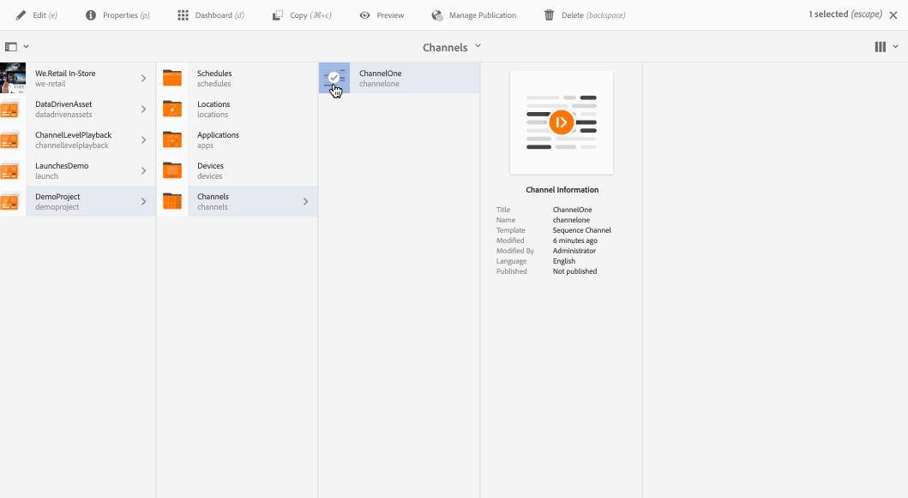

# Crear y administrar canales {#creating-and-managing-channels}

Un canal muestra una secuencia de contenido y muestra imágenes y vídeos, pero también puede mostrar un sitio web o una aplicación de una sola página.

En esta página se muestra la forma de crear y administrar canales para Screens.

**Requisitos previos**:

* [Configurar e implementar Screens](configuring-screens-introduction.md)
* [Crear y gestionar proyecto de pantallas](creating-a-screens-project.md)

## Crear un nuevo canal {#creating-a-new-channel}

Una vez que cree el proyecto de Screens, siga los pasos que se indican a continuación para crear un nuevo canal para un proyecto de Screens:

1. Seleccione el vínculo de Adobe Experience Manager (parte superior izquierda) y luego seleccione Screens. Alternatively, you can go directly to: `https://localhost:4502/screens.html/content/screens`.
1. Vaya al proyecto Screens y haga clic en **Canales**.
1. Click **Create** next to the plus icon in the action bar. Se abrirá un asistente (*consulte los tipos de canal para obtener más información*).

1. Select the template from the wizard and click **Next**.
1. Enter the properties for **Title and Tags**, **More Titles and Description**, **On/Off Time**, and **Vanity URL**.

1. Haga clic en **Crear** y el canal se creará y se añadirá a la carpeta de los canales.

### Tipos de canales {#channel-types}

Las opciones de plantilla siguientes están disponibles mientras utiliza el asistente, por ejemplo:

| **Opción de plantilla** | **Descripción** |
|---|---|
| Carpeta de canales | Permite crear una carpeta para almacenar la colección de canales. |
| Canal de secuencia | Permite crear un canal que reproduce los componentes de forma secuencial (uno por uno en una presentación con diapositivas). |
| Canal de aplicaciones | Permite mostrar la aplicación web personalizada en el reproductor Screens. |
| Canal de pantalla dividida 1x1 | Permite ver el componente en una sola zona. |
| Canal de pantalla dividida 1x2 | Permite ver los recursos en dos zonas (divididos horizontalmente). |
| Canal de pantalla dividida 2X1 | Permite ver los recursos en dos zonas (divididos verticalmente). |
| Canal de pantalla dividida 2x2 | Permite ver los recursos en cuatro zonas (divididos horizontal y verticalmente en una matriz). |
| Canal de pantalla dividida 2 a 3 | Permite ver los recursos en dos zonas (divididos horizontalmente), siendo una de ellas más grande que la otra. |
| Canal de pantalla dividida en barras L izquierda o derecha | Permite a los autores de contenido ver diferentes tipos de recursos en zonas de tamaño adecuado. |

>[!NOTE]
>
>Los canales Dividir pantalla dividen la visualización en varias zonas para que pueda reproducir varias experiencias al mismo tiempo, una junto a la otra. Las experiencias pueden ser elementos estáticos o de texto o secuencias incrustadas.

The following example shows the creation of a Sequence Channel (C *hannelOne*) for a Screens project (*DemoProject*).

>[!NOTE]
>
>Puede crear distintas zonas mediante las opciones de plantilla como 1x2, 2x2, o 2 a 3, para dividir los canales de la pantalla, tal como se mencionó con anterioridad.

***Importante***:

Una vez que cree y añada contenido al canal, el siguiente paso es crear una ubicación seguida de una visualización. Además, debe asignar ese canal a una pantalla. Consulte los siguientes recursos que se encuentran al final de la sección para obtener más información.

## Uso de canales {#working-with-channels}

Puede editar, ver las propiedades y el panel, y copiar, acceder a la vista previa y eliminar un canal.

>[!NOTE]
>
>Haga clic en el icono de la izquierda para seleccionar un elemento. Por ejemplo, haga clic en el icono del canal y realice las acciones siguientes, tal y como se muestra en la figura siguiente.

### Añadir/editar el contenido de un canal {#adding-editing-content-to-a-channel}

Para añadir o editar contenido en un canal, siga los pasos que se indican a continuación:

1. Haga clic en el canal que desee editar (como se muestra en la figura anterior).
1. Click **Edit** from the top left corner of the action bar to edit the channel properties. El editor que se abra le permitirá añadir recursos o componentes al canal que quiera publicar.

>[!NOTE]
>
>Puede agregar componentes al canal. Consulte **[Adición de componentes a un canal](adding-components-to-a-channel.md)** para obtener más información.

**Carga de vídeos en el canal** Siga los pasos a continuación para cargar vídeos en el canal:

1. Seleccione el canal en el que desee cargar el vídeo.
1. Haga clic en **Editar** en la barra de acciones para abrir el editor.
1. Seleccione los **vídeos** en la opción Recursos y arrastre y suelte los vídeos necesarios.

>[!NOTE]
>
>If you encounter issues uploading videos in your channel, see [Troubleshooting Videos](troubleshoot-videos.md).

### Visualizar propiedades {#viewing-properties}

Para ver o editar las propiedades de un canal, siga los pasos que se indican a continuación:

1. Haga clic en el canal que desee editar.
1. Click **Properties** from the action bar to view/edit the channel properties. Las fichas siguientes le permiten cambiar las opciones.

### Visualización del tablero {#viewing-dashboard}

Para ver el panel de un canal, siga los pasos que se indican a continuación:

1. Haga clic en el canal que desee editar.
1. Click **Dashboard** from the action bar to view the dashobard. The **CHANNEL INFORMATION**,**ASSIGNED DISPLAYS**, and **PENDING LAUNCHES** panel opens, as shown in the figure below:

### Información del canal {#channel-information}

El panel Información del canal describe las propiedades del canal, junto con la vista previa del canal. Asimismo, proporciona información sobre si el canal está en línea o sin conexión.

Haga clic en (**...**) en la barra de acciones de **información de canal** para ver las propiedades, editar el contenido o actualizar el caché (contenido sin conexión) del canal.

### Canales en línea y sin conexión {#online-and-offline-channels}

>[!NOTE]
>
>De forma predeterminada, al crear un canal, éste se encuentra sin conexión.

Cuando cree un canal, podrá definirlo como un canal en línea o sin conexión.

An ***Online Channel***, will show the updated content in the real time environment whereas an ***Offline Channel***, shows the cached content.

Siga los pasos que se describen para crear el canal en línea:

1. Desplácese al canal denominado **TestProject** --&gt; **Canales** --&gt; **TestChannel**.

   Seleccione el canal.

   

   Click **Dashboard** from the action bar to view the status of the player. El panel **INFORMACIÓN DEL CANAL **proporciona información sobre si el canal está en línea o sin conexión.

   

1. Haga clic en **Propiedades** en la barra de acciones y desplácese a la ficha **Canal** tal como se muestra a continuación:

   

1. Compruebe el **modo** Desarrollador **(forzar a que el canal esté en línea)** para que el canal esté en línea.

   Haga clic en **Guardar y cerrar** para guardar su elección.

   

   Navigate back to the channel dashboard and now the **CHANNEL INFORMATION** panel shows the online status of the player.

   

>[!NOTE]
>
>Si desea volver a configurar el canal como sin conexión, desmarque la opción Modo de desarrollador de la ficha **Propiedades** (como se muestra en el paso (3)) y, a continuación, en el panel INFORMACIÓN **DE** CANAL, haga clic en **Actualizar contenido** sin conexión, como se muestra en la figura siguiente.

#### Actualizaciones automáticas frente a manuales del panel del dispositivo {#automatic-versus-manual-updates-from-the-device-dashboard}

En la tabla siguiente se resumen los eventos asociados a las actualizaciones automáticas y manuales del panel del dispositivo.

<table>
 <tbody>
  <tr>
   <td><strong>Evento</strong></td>
   <td><strong>Actualización automática del dispositivo</strong></td>
   <td><strong>Actualización manual del dispositivo</strong></td>
  </tr>
  <tr>
   <td>Cambio en el canal en línea</td>
   <td>Contenido actualizado automáticamente</td>
   <td>
Contenido actualizado en "Dispositivo: Config push"
 
O bien,
 
Contenido actualizado en el <strong><i>dispositivo: Reiniciar</i></strong>
 </td>
  </tr>
  <tr>
   <td>Cambio en el canal sin conexión, pero el "contenido push" del canal NO se activa (no se vuelve a crear el paquete sin conexión)</td>
   <td>Sin actualización de contenido</td>
   <td>Sin actualización de contenido</td>
  </tr>
  <tr>
   <td>Se activa el cambio en el canal sin conexión y el "contenido push" del canal (nuevo paquete sin conexión)</td>
   <td>Contenido actualizado automáticamente</td>
   <td>
Contenido actualizado en el <strong><i>dispositivo: Configuración push</i></strong>
 
O bien,
 
Contenido actualizado en el <strong><i>dispositivo: Reiniciar</i></strong>
 </td>
  </tr>
  <tr>
   <td>
Cambio en la configuración

    <ul>
     <li>Mostrar (canal forzado)</li>
     <li>Dispositivo</li>
     <li>Asignaciones de canal (canal nuevo, canal eliminado)</li>
     <li>Asignación de canal (función, evento, programación)</li>
    </ul> </td>
   <td>Configuración actualizada automáticamente</td>
   <td>
Configuración actualizada en el <strong><i>dispositivo: Configuración push</i></strong>
 
O bien,
 
Configuración actualizada en el <strong><i>dispositivo: Reiniciar</i></strong>
 </td>
  </tr>
 </tbody>
</table>

### Visualizaciones asignadas {#assigned-displays}

El panel de visualizaciones asignado muestra la visualización asociada al canal. Proporciona una instantánea de la visualización asignada junto con la resolución.

Las visualizaciones asociadas se incluirán en el panel **Visualizaciones asignadas**, tal como se muestra a continuación:

>[!NOTE]
>
>Para obtener información sobre cómo crear una visualización en una ubicación, consulte:
>
>* [Crear y administrar ubicaciones](managing-locations.md)
>* [Crear y administrar pantallas](managing-displays.md)
>

Además, haga clic en la visualización del panel **VISUALIZACIONES ASIGNADAS**, para ver la información que se visualizará, tal y como se muestra a continuación:

### Pasos siguientes {#the-next-steps}

El siguiente paso después de crear un canal y añadir o editar el contenido del canal es aprender a crear una ubicación y una visualización. Además, debe asignar un canal a esa pantalla. 

Consulte los recursos siguientes para ver los pasos siguientes:

* [Crear y administrar canales](managing-channels.md)
* [Crear y administrar ubicaciones](managing-locations.md)
* [Crear y administrar pantallas](managing-displays.md)

