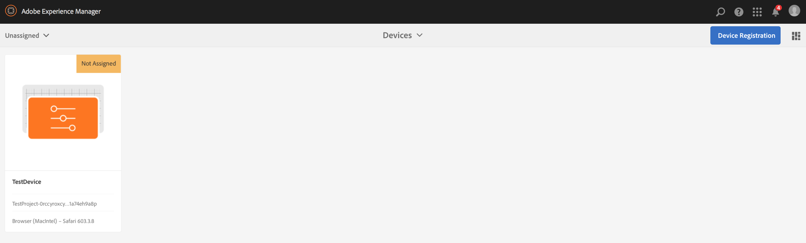

# Administrar dispositivos {#managing-devices}

Esta página describe la asignación de dispositivos.

La consola Dispositivos permite acceder al administrador de dispositivos para asignar el dispositivo a una pantalla.

>[!CAUTION]
>
>Antes de asignar el dispositivo, regístrelo. Consulte [Registro de dispositivos](device-registration.md).

## Asignación de dispositivos {#device-assignment}

Siga los pasos a continuación para asignar un dispositivo a una pantalla:

1. Vaya a la carpeta Dispositivos de su proyecto, por ejemplo

   `http://localhost:4502/screens.html/content/screens/TestProject`

   

1. Haga clic en la carpeta **Dispositivos** y luego en **Administrador de dispositivos** en la barra de acciones. Se muestran los dispositivos asignados y no asignados.

   

1. Haga clic en un dispositivo sin asignar de la lista y, a continuación, en la barra de acciones, haga clic en **Asignar dispositivo**.

   

1. Haga clic en la pantalla a la que desee asignar el dispositivo desde la lista y, a continuación, haga clic en **Asignar**.

   

1. Haga clic en **Finalizar** para completar el proceso de asignación.

   El panel de visualización muestra el dispositivo asignado en el panel **DISPOSITIVOS**.

   

   Haga clic en (**...**) en la esquina superior derecha del panel **DISPOSITIVOS** para agregar o actualizar los dispositivos.

   

>[!NOTE]
>
>Cada vez que se agrega el primer dispositivo a un nuevo proyecto de Screens, se crea un grupo de usuarios.
>Por ejemplo, si el nombre del nodo del proyecto es *we-retail*, el nombre del grupo de usuarios es *screens-we-retail-devices*.
>Este grupo se agrega como miembro del grupo **Colaboradores**, como se muestra en la figura siguiente:

### Pasos siguientes {#the-next-steps}

Después de familiarizarse con la asignación de canales a una pantalla, consulte t[Monitorizar y solucionar problemas](monitoring-screens.md).
