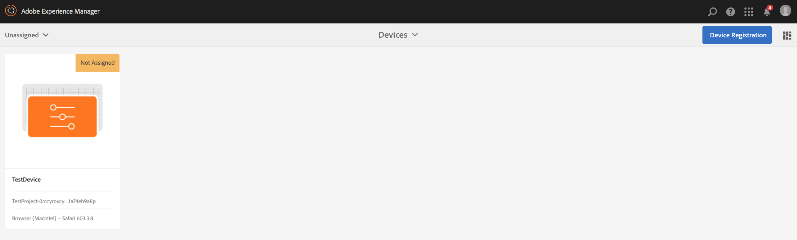

# Administración de dispositivos {#managing-devices}

Esta página describe la asignación de dispositivos.

La consola Dispositivos permite acceder al administrador de dispositivos para asignar el dispositivo a una pantalla.

>[!CAUTION]
>
>Antes de asignar el dispositivo, debe registrarlo. Para obtener más información, consulte [Registro de dispositivos](device-registration.md).

## Asignación de dispositivos {#device-assignment}

Siga los pasos a continuación para asignar un dispositivo a una pantalla:

1. Vaya a la carpeta Dispositivos de su proyecto, por ejemplo

   `http://localhost:4502/screens.html/content/screens/TestProject`

   

1. Seleccione su **Dispositivos** y pulse o haga clic en **Administrador de dispositivos** en la barra de acciones. Se muestran los dispositivos asignados y no asignados.

   

1. Seleccione un dispositivo no asignado de la lista y pulse o haga clic en el botón **Asignar dispositivo** en la barra de acciones.

   

1. Seleccione la pantalla a la que desee asignar el dispositivo en la lista y pulse o haga clic en el botón **Asignar**.

   

1. Pulse o haga clic en **Finalizar** para completar el proceso de asignación.

   El panel de visualización muestra el dispositivo asignado en la **DISPOSITIVOS** panel.

   

   Haga clic en el botón (**...**), en la esquina superior derecha de la **DISPOSITIVOS** panel para añadir la configuración del dispositivo o actualizar los dispositivos.

   

>[!NOTE]
>
>Cada vez que se añade el primer dispositivo a un nuevo proyecto de Pantallas, se crea un grupo de usuarios.
>Por ejemplo, si el nombre del nodo del proyecto es *we-retail*, el nombre del grupo de usuarios es *screens-we-retail-devices*.
>Este grupo se agregará como miembro del **Colaboradores** , como se muestra en la figura siguiente:

### Pasos siguientes {#the-next-steps}

Una vez que esté familiarizado con la asignación de canales a una pantalla, consulte los siguientes recursos:

* [Monitorización y solución de problemas](monitoring-screens.md)
