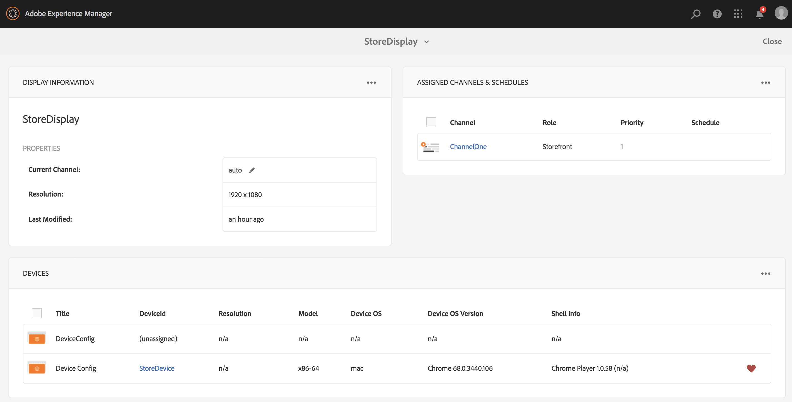

# Crear y administrar visualizaciones {#creating-and-managing-displays}

Una pantalla es una agrupación virtual de pantallas que normalmente se colocan una junto a la otra. La pantalla suele ser permanente con relación a una instalación. Este será el objeto con que los autores de contenido trabajarán y tomarán siempre como referencia como pantalla lógica en lugar de las equivalentes físicas.

Una vez que haya creado una ubicación, deberá crear una nueva visualización de la ubicación.

En esta página se muestra cómo crear y administrar pantallas para Screens.

**Requisitos previos**:

* [Configurar e implementar Screens](configuring-screens-introduction.md)
* [Crear y administrar proyecto de Screens](creating-a-screens-project.md)
* [Crear y administrar canales](managing-channels.md)
* [Crear y administrar ubicaciones](managing-locations.md)

## Creación de una pantalla nueva {#creating-a-new-display}

>[!NOTE]
>
>Debe crear una ubicación antes de crear una pantalla. Para ver cómo crear una ubicación, consulte [Crear y administrar ubicaciones](managing-locations.md) para obtener más información.

Para crear una pantalla nueva en su ubicación, siga los pasos que se describen a continuación:

1. Vaya a la ubicación adecuada, por ejemplo `http://localhost:4502/screens.html/content/screens/TestProject`.
1. Seleccione la carpeta de la ubicación y pulse o haga clic en **Crear** junto al icono del signo más en la barra de acciones. Se abrirá un asistente.
1. Seleccione **Display** en el asistente **Create** y haga clic en **Next**.

1. Introduzca **Name** y **Title** en la ubicación de visualización.

1. En la pestaña **Display**, elija los detalles del diseño. Elija la **Resolución** deseada (por ejemplo, **Full HD**). Además, puede elegir el número de dispositivos horizontal y verticalmente.

1. Haga clic en **Crear**.

La visualización (*StoreDisplay*) se crea y se agrega a la ubicación (*SanJosé*).

Una vez que tenga colocada la pantalla en su sitio, el paso siguiente es crear una configuración del dispositivo para esa pantalla concreta. Siga esta sección para crear una nueva configuración del dispositivo.

>[!NOTE]
>
>**El paso siguiente**:
>
>Una vez que haya creado una pantalla para su ubicación, debe asignar un canal a la pantalla para utilizar el contenido.
>
>Consulte la sección [Asignar canales](channel-assignment.md) para obtener información sobre cómo asignar un canal a la pantalla.

## Creación de una nueva configuración del dispositivo {#creating-a-new-device-config}

Una configuración del dispositivo actúa como marcador de posición para un dispositivo de señalización digital real que aún no está instalado.

Siga los pasos que se indican a continuación para crear una nueva configuración del dispositivo:

1. Vaya a la visualización adecuada, por ejemplo, `http://localhost:4502/screens.html/content/screens/TestProject/locations/newlocation`.
1. Seleccione la carpeta de visualización y pulse o haga clic en **Ver panel** en la barra de acciones.
1. Toque o haga clic en **+ Agregar configuración del dispositivo** en la parte superior derecha del panel **Dispositivos**.

1. Seleccione **Device Config** como plantilla requerida y pulse o haga clic en **Next**.

1. Introduzca las propiedades según sea necesario y pulse o haga clic en **Crear**.

La configuración del dispositivo se crea y se añade a la pantalla actual (en la demostración siguiente, la nueva configuración del dispositivo es *DeviceConfig*).

Una vez que se ha establecido una configuración del dispositivo en la pantalla de la ubicación, el paso siguiente consiste en asignar un canal a la pantalla.

>[!NOTE]
>
>Una vez que se ha establecido una configuración del dispositivo en la pantalla de la ubicación, el paso siguiente consiste en asignar un canal a la pantalla.
>
>Como se muestra en la figura siguiente, si la configuración del dispositivo se muestra como sin asignar en el panel **DISPOSITIVOS**, si no hay ningún canal asignado a esa configuración del dispositivo en particular.
>
>Antes de esto, debe haber entendido cómo crear y administrar canales. Consulte [Crear y administrar canales](managing-channels.md) para obtener más información.

## Tablero de la pantalla {#display-dashboard}

El tablero de la pantalla le proporciona distintos paneles para administrar dispositivos de visualización y configuraciones de dispositivo para su dispositivo.

>[!NOTE]
>
>Puede seleccionar las listas del tablero y activar acciones masivas en elementos, en lugar de hacerlo a través de cada elemento individualmente.
>
>Por ejemplo, en la imagen siguiente se muestra cómo puede seleccionar varios canales en el tablero de la pantalla.

### Panel de información de la pantalla {#display-information-panel}

El panel **INFORMACIÓN DE LA PANTALLA** proporciona las propiedades de la pantalla.

Haga clic en (**…**) en la esquina superior derecha del panel **INFORMACIÓN DE LA PANTALLA** para ver las propiedades y obtener una vista previa de la pantalla.

#### Visualizar propiedades {#viewing-properties}

Haga clic en **Propiedades** para ver o cambiar las propiedades de la pantalla.

Además, puede ajustar el valor del temporizador de evento para el canal interactivo en la propiedad **Tiempo de espera inactivo** en la pestaña **Mostrar**. El valor predeterminado es *300 segundos*.

Utilice **CRXDE Lite** para acceder a la propiedad **idleTimeout**, es decir, `http://localhost:4502/crx/de/index.jsp#/content/screens/we-retail/locations/demo/flagship/single/jcr%3Acontent/channels` .

### Panel Canales asignados {#assigned-channels-panel}

En el panel **CANALES ASIGNADOS** se muestran los canales asignados a este dispositivo.

### Panel Dispositivos {#devices-panel}

En el panel **DISPOSITIVOS** se proporciona información sobre las configuraciones del dispositivo.

Haga clic en (**...**) en la esquina superior derecha del panel **DISPOSITIVOS** para agregar configuraciones de dispositivo y actualizar dispositivos.

Además, haga clic en la configuración del dispositivo para ver las propiedades, asignar un dispositivo o eliminarlo por completo.

#### Pasos siguientes {#the-next-steps}

Una vez que haya completado la creación de una pantalla para la ubicación, debe asignar un canal para la pantalla.

Consulte [Asignar canales](channel-assignment.md) para obtener más información.
