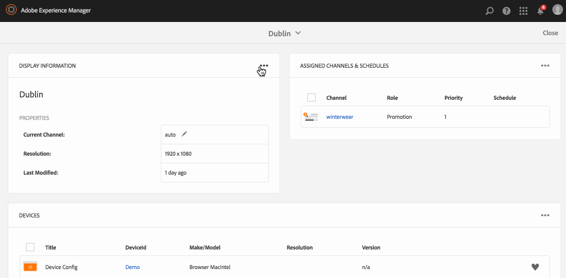

# Crear y administrar visualizaciones {#creating-and-managing-displays}

Una pantalla es una agrupación virtual de pantallas que normalmente se colocan una junto a la otra. La pantalla suele ser permanente con relación a una instalación. Este será el objeto con que los autores de contenido trabajarán y tomarán siempre como referencia como pantalla lógica en lugar de las equivalentes físicas.

Una vez que haya creado una ubicación, deberá crear una nueva visualización de la ubicación.

En esta página se muestra cómo crear y administrar pantallas para Screens.

**Requisitos previos**:

* [Configurar e implementar Screens](configuring-screens-introduction.md)
* [Crear y gestionar proyecto de pantallas](creating-a-screens-project.md)
* [Crear y administrar canales](managing-channels.md)
* [Crear y administrar ubicaciones](managing-locations.md)

## Creación de una pantalla nueva {#creating-a-new-display}

>[!NOTE]
>
>Debe crear una ubicación antes de crear una pantalla. To see how to create a location, see [Create and Manage Locations](managing-locations.md) for more information.

Para crear una pantalla nueva en su ubicación, siga los pasos que se describen a continuación:

1. Navigate to the appropriate location, for example `http://localhost:4502/screens.html/content/screens/TestProject`.
1. Select your location folder and tap/click **Create** next to the plus icon in the action bar. Se abrirá un asistente.
1. Select **Display** from the **Create** wizard and click **Next**.

1. Enter **Name** and **Title** for your display location.

1. Under the **Display** tab, choose the details of the Layout. Choose the desired **Resolution** (example as, as **Full HD**). Además, puede elegir el número de dispositivos horizontal y verticalmente.

1. Haga clic en **Crear**.

The display (*StoreDisplay*) is created and added to the location (*SanJose*).

Una vez que tenga colocada la pantalla en su sitio, el paso siguiente es crear una configuración del dispositivo para esa pantalla concreta. Siga esta sección para crear una nueva configuración del dispositivo.

>[!NOTE]
>
>**El paso siguiente**:
>
>Una vez que haya creado una pantalla para su ubicación, debe asignar un canal a la pantalla para utilizar el contenido.
>
>See [Assign Channels](channel-assignment.md) section to learn how to assign a channel to the display.

## Creación de una nueva configuración del dispositivo {#creating-a-new-device-config}

Una configuración del dispositivo actúa como marcador de posición para un dispositivo de señalización digital real que aún no está instalado.

Siga los pasos que se indican a continuación para crear una nueva configuración del dispositivo:

1. Vaya a la pantalla adecuada, por ejemplo, `http://localhost:4502/screens.html/content/screens/TestProject/locations/newlocation`.
1. Select your display folder and tap/click **View Dashboard** in the action bar.
1. Tap/click the **+ Add Device Config** on the top right of the **Devices** panel.

1. Select the **Device Config** as the required template as and tap/click **Next**.

1. Enter the properties as required and tap/click **Create**.

The device config is created and added to the current display (in the following demonstration, the new device config is *DeviceConfig*).

Una vez que se ha establecido una configuración del dispositivo en la pantalla de la ubicación, el paso siguiente consiste en asignar un canal a la pantalla.

>[!NOTE]
>
>Una vez que se ha establecido una configuración del dispositivo en la pantalla de la ubicación, el paso siguiente consiste en asignar un canal a la pantalla.
>
>As shown in the figure below, if the device config is displayed as unassigned in the **DEVICES** pannel, if no channel is assigned to that particular device config.
>
>Antes de esto, debe haber entendido cómo crear y administrar canales. Consulte [Crear y administrar canales](managing-channels.md) para obtener más información.

## Tablero de la pantalla {#display-dashboard}

El tablero de la pantalla le proporciona distintos paneles para administrar dispositivos de visualización y configuraciones de dispositivo para su dispositivo.

>[!NOTE]
>
>Puede seleccionar las listas del tablero y activar acciones masivas en elementos, en lugar de hacerlo a través de cada elemento individualmente.
>
>Por ejemplo, en la imagen siguiente se muestra cómo puede seleccionar varios canales en el tablero de la pantalla.

### Panel de información de la pantalla {#display-information-panel}

El panel **INFORMACIÓN DE LA PANTALLA** proporciona las propiedades de la pantalla.

Click on the (**...**) in the top right corner in the **DISPLAY INFORMATION **panel to view the properties and preview the display.

#### Visualizar propiedades {#viewing-properties}

Haga clic en **Propiedades** para ver o cambiar las propiedades de la pantalla.

Additionally, you can adjust the event timer value for your interactive channel in **Idle timeout **property under **Display** tab. El valor predeterminado es *300 segundos*.

Use **CRXDE Lite**, to access the **idleTimeout** property, that is, `http://localhost:4502/crx/de/index.jsp#/content/screens/we-retail/locations/demo/flagship/single/jcr%3Acontent/channels` .

### Panel Canales asignados {#assigned-channels-panel}

En el panel **CANALES ASIGNADOS** se muestran los canales asignados a este dispositivo.

### Panel Dispositivos {#devices-panel}

En el panel **DISPOSITIVOS** se proporciona información sobre las configuraciones del dispositivo.

Click on the (**...**) in the top right corner in the **DEVICES **panel to add device configs and update devices.

Además, haga clic en la configuración del dispositivo para ver las propiedades, asignar un dispositivo o eliminarlo por completo.

#### Pasos siguientes {#the-next-steps}

Una vez que haya completado la creación de una pantalla para la ubicación, debe asignar un canal para la pantalla.

See [Assign Channels](channel-assignment.md) for more details.
