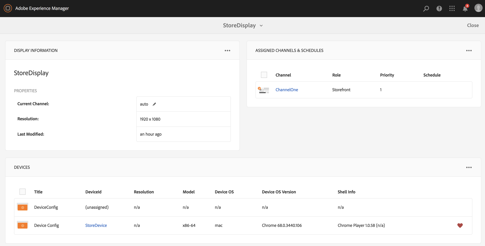
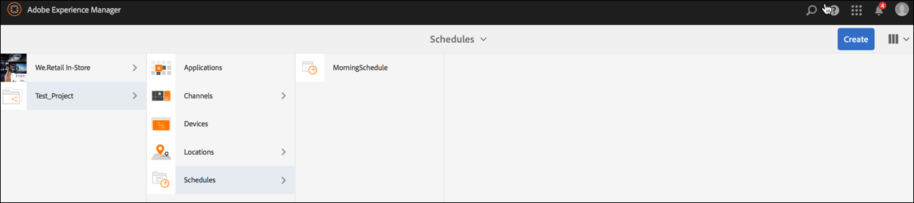

# Creación y administración de pantallas {#creating-and-managing-displays}

>[!IMPORTANT]
>Este contenido es válido para AEM on-premise/AMS (AEM 6.5LTS y AEM 6.5). Para el contenido de AEM as a Cloud Service Screens, consulte la [guía de AEM as a Cloud Service](https://experienceleague.adobe.com/en/docs/experience-manager-cloud-service/content/screens-as-cloud-service/overview/introduction).

Una visualización es una agrupación virtual de pantallas que se colocan una al lado de la otra. La pantalla es permanente con respecto a una instalación. Es el objeto con el que los autores de contenido trabajan y siempre se refieren como visualización lógica en lugar de sus partes de contador físicas.

Al crear una ubicación, debe crear una pantalla para la ubicación.

Esta página muestra la creación y administración de pantallas para Screens.

**Requisitos previos**:

* [Configuración e implementación de Screens](configuring-screens-introduction.md)
* [Crear y administrar un proyecto de Screens](creating-a-screens-project.md)
* [Crear y administrar canales](managing-channels.md)
* [Crear y administrar ubicaciones](managing-locations.md)

## Creación de una nueva pantalla {#creating-a-new-display}

>[!NOTE]
>
>Cree una ubicación antes de crear una visualización. Consulte [Crear y administrar ubicaciones](managing-locations.md) para obtener más información.

1. Vaya a la ubicación adecuada; por ejemplo, `http://localhost:4502/screens.html/content/screens/TestProject`.
1. Haga clic en la carpeta de ubicación y luego en **Crear**, que se encuentra al lado del icono de signo más en la barra de acciones.
1. Haga clic en **Mostrar** en el asistente de **Crear** y, a continuación, haga clic en **Siguiente**.
1. Escriba su **Nombre** y **Título** para la ubicación de visualización.
1. En la ficha **Pantalla**, elija los detalles del diseño. Elija la **resolución** que desee, como **Full HD**. Elija el número de dispositivos horizontal y verticalmente.
1. Haga clic en **Crear**.

Se crea la pantalla (*StoreDisplay*) y se agrega a la ubicación (*SanJose*).

Cuando tenga una visualización en posición, el siguiente paso es crear una configuración de dispositivo para esa visualización en particular.

>[!NOTE]
>
>**El siguiente paso**:
>
>Cuando cree una pantalla para su ubicación, asigne un canal a la pantalla para utilizar el contenido.
>
>Consulte la sección [Asignar canales](channel-assignment.md) para obtener información sobre cómo asignar un canal a la pantalla.

## Creación de una nueva configuración de dispositivo {#creating-a-new-device-config}

Una configuración de dispositivo actúa como marcador de posición para un dispositivo de señalización digital real que aún no está instalado.

1. Vaya a la pantalla adecuada, por ejemplo, `http://localhost:4502/screens.html/content/screens/TestProject/locations/newlocation`.
1. Haga clic en la carpeta para mostrar y luego en **Ver panel** en la barra de acciones.
1. Haga clic en **+ Agregar configuración de dispositivo** en la parte superior derecha del panel **Dispositivos**.

1. Haga clic en **Configuración del dispositivo** como plantilla requerida y haga clic en **Siguiente**.

1. Escriba las propiedades según sea necesario y haga clic en **Crear**.

La configuración del dispositivo se crea y se agrega a la pantalla actual (en la siguiente demostración, la nueva configuración del dispositivo es *DeviceConfig*).

>[!NOTE]
>
>Cuando se establece una configuración de dispositivo en la pantalla en la ubicación, el siguiente paso será asignar un canal a la pantalla.
>
>Como se muestra en la figura siguiente, si la configuración del dispositivo se muestra como sin asignar en el panel **DISPOSITIVOS**, si no se ha asignado ningún canal a esa configuración del dispositivo en particular.
>
>Debe tener conocimientos previos sobre la creación y administración de canales. Consulte [Crear y administrar canales](managing-channels.md) para obtener más información.

## Tablero de visualización {#display-dashboard}

El panel de visualización le proporciona diferentes paneles para administrar los dispositivos de visualización. También le permite configurar su dispositivo.

>[!NOTE]
>
>Puede hacer clic en las listas de tableros y almacenar en déclencheur las acciones masivas en los elementos, en lugar de pasar por cada elemento individualmente.
>
>Por ejemplo, la siguiente imagen muestra cómo puede hacer clic en varios canales desde el panel de visualización.

### Mostrar panel de información {#display-information-panel}

El panel **INFORMACIÓN DE PANTALLA** proporciona las propiedades de visualización.

Haga clic en (**...**) en la esquina superior derecha del panel **INFORMACIÓN DE PANTALLA** para que pueda ver las propiedades y obtener una vista previa de la pantalla.

#### Visualización de propiedades {#viewing-properties}

Haga clic en **Propiedades** para ver o cambiar las propiedades de la pantalla.

Además, puedes ajustar el valor del temporizador de eventos para tu canal interactivo en la pestaña **Pantalla**. El valor predeterminado es *300 segundos*.

Use **CRXDE Lite** para obtener acceso a la propiedad **inactiveTimeout**, es decir, `http://localhost:4502/crx/de/index.jsp#/content/screens/we-retail/locations/demo/flagship/single/jcr%3Acontent/channels`.

### Panel de canales asignados {#assigned-channels-panel}

El panel **CANALES ASIGNADOS** muestra los canales asignados a este dispositivo.

### Panel Dispositivos {#devices-panel}

El panel **DISPOSITIVOS** proporciona información sobre las configuraciones de los dispositivos.

Haga clic en (**...**) en la esquina superior derecha del panel **DISPOSITIVOS** para que pueda agregar configuraciones de dispositivos y actualizar los dispositivos.

Además, haga clic en la configuración del dispositivo para ver las propiedades, asignar un dispositivo o eliminarlo por completo.

#### Pasos siguientes {#the-next-steps}

Cuando termine de crear una pantalla para su ubicación, asigne un canal para la pantalla.

Consulte [Asignar canales](channel-assignment.md) para obtener más información.
