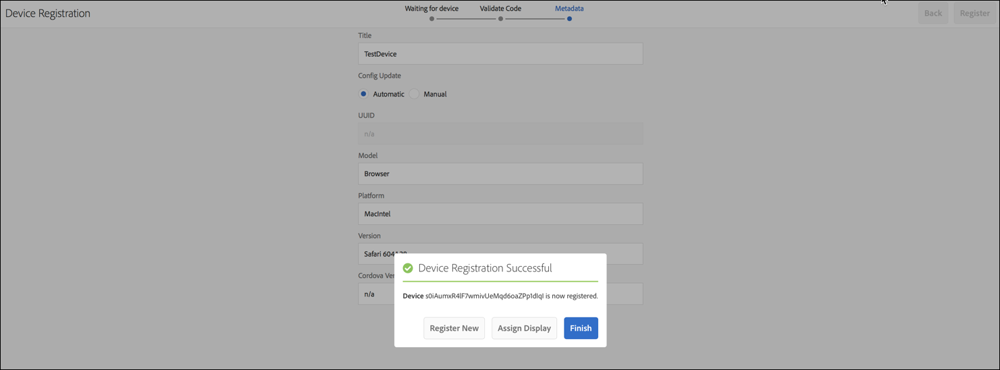

# Creación y administración de una Live Copy {#creating-and-managing-a-live-copy}

En esta página se describe la creación y administración de Live Copies de canales.

Una ***Live Copy*** es una copia de contenido específico del sitio para el cual se mantiene una relación activa con el origen. Esta relación activa permite que la Live Copy herede el contenido y las propiedades de página del origen.

En esta página se describe la creación de una Live Copy de un canal, la visualización de propiedades, la comprobación de estado y la propagación de cambios de un canal a su Live Copy.

## Creación de una Live Copy {#creating-a-live-copy}

Siga los pasos a continuación para crear una Live Copy de un canal en la carpeta del proyecto.

1. Haga clic en el vínculo Adobe Experience Manager (parte superior izquierda) y, a continuación, **Screens**. También puede ir directamente a: `http://localhost:4502/screens.html/content/screens`.

1. Vaya al proyecto de Screens y haga clic en **Canales**.
1. Haga clic en **Crear** y luego en **Live Copy** para crear una Live Copy del canal.
1. Haga clic en el destino y luego en **Siguiente**.
1. Haga clic en la ubicación donde puede residir la Live Copy.
1. Escriba **Title** y **Name** en la página **Crear Live Copy**.

1. Haga clic en **Abrir** para ver el contenido de la nueva Live Copy o en **Listo** para regresar a la página principal.

Alternativamente, consulte los pasos siguientes para obtener una representación visual para crear una nueva Live Copy de un canal.

El siguiente ejemplo muestra la creación de una Live Copy (***IdleLiveCopy***) para ***Canal inactivo*** con la carpeta de destino como ***Canales***.

## Visualización del contenido del canal de Live Copy {#viewing-content-of-the-live-copy-channel}

Una Live Copy es una copia de un canal que existe.

Para ver el contenido de su Live Copy, consulte los pasos a continuación:

1. Vaya al proyecto de Screens y haga clic en la ubicación en la que creó originalmente una Live Copy, como se muestra en la sección anterior. (En este caso, la ubicación se eligió como la carpeta **Channels**)

   

1. Haga clic en **Editar** en la barra de acciones.

   

   >[!NOTE]
   >
   >Cuando visualiza contenido para un canal de Live Copy, ve un elemento adicional en el menú como **Estado de Live Copy**. Consulte la sección siguiente para obtener más información.

### Visualización de propiedades de una Live Copy {#viewing-properties-of-a-live-copy}

Además, puede ver las propiedades del canal de Live Copy.

1. Vaya al canal de Live Copy y haga clic en **Propiedades** desde la barra de acciones.

   

1. Haz clic en la pestaña **Live Copy** para poder ver los detalles de tu canal.

   

### Estado de Live Copy   {#live-copy-status}

El modo **Estado de Live Copy**, como se muestra en la figura siguiente, le permite ver el estado de relación de todos los recursos del canal.

1. Haz clic en **Editar** para poder elegir el **estado de Live Copy**. También puede ver la asociación del contenido del canal con el canal original desde el que se genera la Live Copy.

   

1. Haga clic en **Estado de Live Copy** para mostrar la página de vista previa.

   Todos los recursos con borde verde muestran que el contenido se hereda del canal original.

   

### Romper la herencia {#breaking-the-inheritance}

También puede cancelar la herencia de la Live Copy, por lo que el contenido se vuelve independiente de la rama original.

En el siguiente ejemplo se muestra cómo hacer clic en la imagen en el modo de edición y hacer clic en el símbolo de herencia cancel de la parte superior derecha.

### Propagación de cambios en el canal de Live Copy {#propagating-changes-to-the-live-copy-channel}

Si realiza cambios o actualizaciones en el canal original, propague esos cambios al canal de Live Copy también.

Siga los pasos a continuación para asegurarse de que los cambios se propagan del canal original al canal de Live Copy:

1. Haga clic en el canal original (***Canal inactivo***) y luego haga clic en **Editar** en la barra de acciones.

   

1. Edite el contenido de este canal. Por ejemplo, elimine una imagen de este canal.

   

1. Haga clic en la Live Copy del canal (***IdleLiveCopy***) y, a continuación, haga clic en **Editar** en la barra de acciones. Observe que la imagen que ha eliminado sigue visible en la Live Copy.

   Para propagar los cambios, sincronice el canal.

   

1. AEM Para propagar los cambios al canal de Live Copy, vaya al panel de, haga clic en el canal de Live Copy y, a continuación, haga clic en **Propiedades** desde la barra de acciones.

   

1. Haga clic en la pestaña **Live Copy** y luego en **Sincronizar** en la barra de acciones.

   

1. AEM Haga clic en **Sincronizar** y, a continuación, haga clic en **Guardar y cerrar** para volver al panel de control de.

   

   Observe que la imagen ahora también se elimina del canal de Live Copy.
