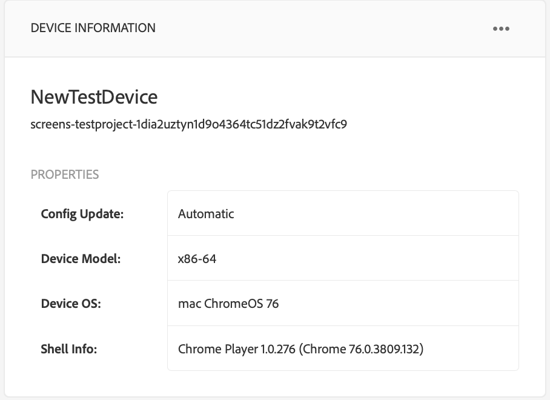
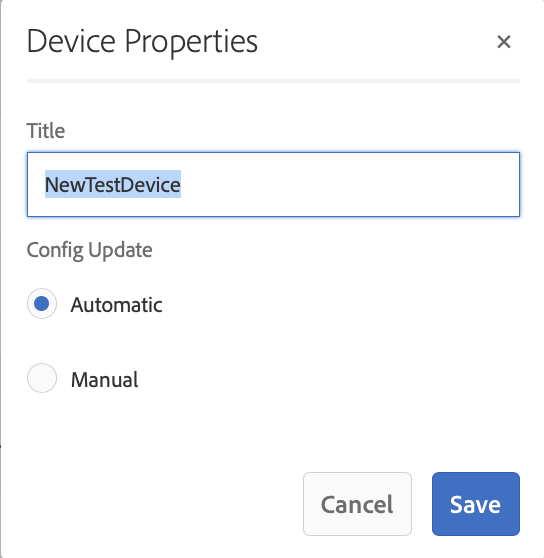

# Solución de problemas del centro de control de dispositivos {#troubleshooting-device-control-center}

Puede supervisar y solucionar problemas de rendimiento para la actividad y el dispositivo del reproductor Screens mediante el panel del dispositivo. Esta página proporciona información sobre cómo monitorizar y solucionar problemas de rendimiento percibidos para el reproductor Screens y los dispositivos asignados.

## Monitorización y resolución de problemas desde el Centro de control de dispositivos {#monitor-and-troubleshoot-from-device-control-center}

Puede supervisar la actividad y, por lo tanto, solucionar problemas del reproductor Screens mediante el panel de dispositivos.

### Panel de dispositivos {#device-dashboard}

Siga los pasos a continuación para ir al panel del dispositivo:

1. Vaya al panel del dispositivo desde el proyecto; por ejemplo, ***Probar proyecto*** —> ***Dispositivos***.

   Seleccione **Dispositivos** y **Administrador de dispositivos** en la barra de acciones.

   

1. La lista muestra los dispositivos asignados y no asignados, como se muestra en la figura siguiente.

   

1. Seleccione el dispositivo (**NewTestDevice**) y haga clic en **Dashboard** en la barra de acciones.

   

1. La página muestra la información, la actividad y los detalles del dispositivo que le permiten supervisar las actividades y funciones del dispositivo.

   

### Monitorizar la actividad del dispositivo {#monitor-device-activity}

El panel **Actividad** muestra el último ping del reproductor de pantallas con la marca de tiempo. El último ping corresponde a la última vez que el dispositivo contactó con el servidor.

Además, haga clic en **Recopilar registros** en la esquina superior derecha del panel **Actividad** para ver los registros del reproductor.

### Actualizar detalles del dispositivo {#update-device-details}

Consulte el panel **Detalles del dispositivo** para ver la IP del dispositivo, el uso del almacenamiento, la versión del firmware y el tiempo de actividad del reproductor del dispositivo.

Además, haga clic en **Borrar caché** y **Actualizar** para borrar la caché del dispositivo y actualizar la versión [firmware](screens-glossary.md) respectivamente desde este panel.

Además, haga clic en **...** desde la esquina superior derecha del panel **Detalles del dispositivo** para reiniciar o actualizar el estado del reproductor.

### Actualizar información del dispositivo {#update-device-information}

Consulte el panel **DEVICE INFORMATION** para ver la actualización de configuración, el modelo de dispositivo, el sistema operativo del dispositivo y la información del shell.

Además, haga clic en (**...**) desde la esquina superior derecha del panel Información del dispositivo para ver las propiedades o actualizar el dispositivo.

Haga clic en **Propiedades** para ver el cuadro de diálogo **Propiedades del dispositivo**. Puede editar el título del dispositivo o elegir la opción para las actualizaciones de configuración como **Manual** o **Automático**.

>[!NOTE]
>
>Para obtener más información sobre los eventos asociados con las actualizaciones automáticas o manuales del dispositivo, consulte la sección ***Actualizaciones automáticas frente a manuales del panel del dispositivo*** en [Administración de canales](managing-channels.md).

### Ver captura de pantalla del reproductor {#view-player-screenshot}

Puede ver la captura de pantalla del reproductor desde el dispositivo desde el panel **PLAYER SCREENSHOT**.

Haga clic (**...**) en la esquina superior derecha del panel Captura de pantalla del reproductor y seleccione **Actualizar captura de pantalla** para ver la instantánea del reproductor en ejecución.

### Administrar preferencias {#manage-preferences}

El panel **PREFERENCIAS** permite al usuario cambiar las preferencias para **Admin UI**, **Channel Switcher** y **Remote Debugging** para el dispositivo.

>[!NOTE]
>Para obtener más información sobre estas opciones, consulte [Reproductor de AEM Screens](working-with-screens-player.md).

Además, haga clic en **Configuración** en la esquina superior derecha para actualizar las preferencias del dispositivo. Puede actualizar las siguientes preferencias:

* **URL del servidor**
* **Resolución**
* **Reiniciar programa**
* **Nº máximo de archivos de registro para mantener**
* **Nivel de registro**

>[!NOTE]
>Puede seleccionar cualquiera de los siguientes niveles de registro:
>* **Desactivar**
>* **Depurar**
>* **Información**
>* **Advertencia**
>* **Error**

## Solución de problemas de la configuración de OSGi {#troubleshoot-osgi-settings}

Debe habilitar el referente vacío para permitir que el dispositivo publique datos en el servidor. Por ejemplo, si la propiedad de referente vacía está deshabilitada, el dispositivo no puede publicar una captura de pantalla.

Actualmente, algunas de estas funciones solo están disponibles si el *Filtro de referente de Apache Sling Allow Empty* está habilitado en la configuración OSGi. El panel puede mostrar una advertencia de que la configuración de seguridad puede impedir que algunas de estas funciones funcionen.

Siga los pasos a continuación para habilitar el filtro Apache Sling Referrer Allow Empty

1. Vaya a **Adobe Experience Manager Web Console Configuration**, es decir, `https://localhost:4502/system/console/configMgr/org.apache.sling.security.impl.ReferrerFilter`.
1. Marque la opción **allow.empty** .
1. Haga clic en **Guardar**.

### Recomendaciones {#recommendations}

En la siguiente sección se recomienda monitorizar los vínculos de red, el servidor y los reproductores para comprender el estado y reaccionar a los problemas.

AEM proporciona monitorización integrada para:

* ** Heartbeat cada 5 segundos para indicar que el Reproductor de AEM Screens está en funcionamiento.
* ** Captura de pantalla del Reproductor que muestra lo que se muestra actualmente en el Reproductor.
* La versión del *Firmware del reproductor de AEM Screens* instalada en el reproductor.
* *Espacio de almacenamiento gratuito* en el reproductor.

Recommendations para monitorización remota con software de terceros:

* Uso de CPU en reproductores.
* Compruebe si se está ejecutando el proceso de AEM Screens Player.
* Reinicio/reinicio remoto del reproductor.
* Notificaciones en tiempo real.

Se recomienda implementar el hardware y el sistema operativo del reproductor de forma que permita el inicio de sesión remoto para diagnosticar problemas y reiniciar el reproductor.

#### Recursos adicionales {#additional-resources}

Consulte [Configuración y solución de problemas de reproducción de vídeo](troubleshoot-videos.md) para depurar y solucionar problemas de los vídeos que se reproducen en el canal.
