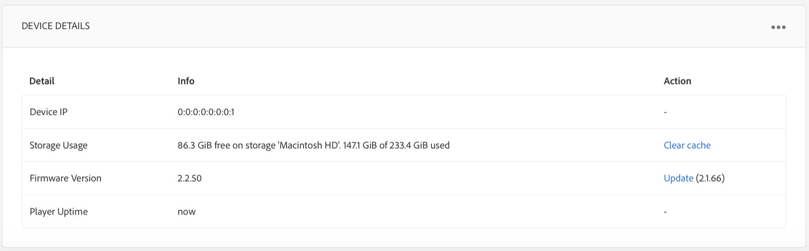
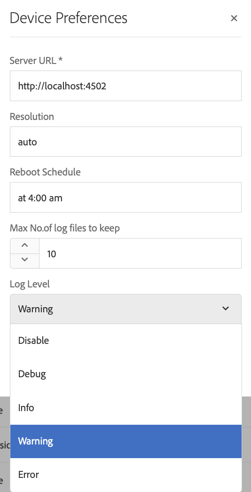

# Resolución de problemas del Centro de control de dispositivos {#troubleshooting-device-control-center}

Puede supervisar y solucionar problemas de rendimiento para la actividad y el dispositivo del reproductor de pantallas mediante el panel del dispositivo. Esta página proporciona información sobre cómo supervisar y solucionar problemas de rendimiento percibidos para el reproductor de pantallas y los dispositivos asignados.

## Monitorear y solucionar problemas desde el Centro de control de dispositivos {#monitor-and-troubleshoot-from-device-control-center}

Puede supervisar la actividad y, por lo tanto, solucionar problemas del reproductor de pantallas, mediante el Panel Device.

### Panel del dispositivo {#device-dashboard}

Siga los pasos a continuación para navegar hasta el panel del dispositivo:

1. Vaya al panel del dispositivo desde su proyecto, por ejemplo, ***Probar proyecto*** —> ***Dispositivos***.

   Seleccione **Dispositivos** y **Administrador de dispositivos** en la barra de acciones.

   

1. La lista muestra los dispositivos asignados y no asignados, como se muestra en la figura siguiente.

   

1. Seleccione el dispositivo (**NewTestDevice**) y haga clic en **Panel** en la barra de acciones.

   

1. La página muestra la información, la actividad y los detalles del dispositivo que le permiten supervisar las actividades y funciones del dispositivo.

   

### Actividad del dispositivo de monitor {#monitor-device-activity}

El panel **Actividad** muestra el último ping del reproductor de pantallas con la marca de tiempo. El último ping corresponde a la última vez que el dispositivo se puso en contacto con el servidor.

Además, haga clic en **Recopilar registros** en la esquina superior derecha del panel **Actividad** para vista de los registros del reproductor.

### Actualizar detalles del dispositivo {#update-device-details}

Compruebe el panel **Detalles del dispositivo** para vista de la IP del dispositivo, el uso del Almacenamiento, la versión del firmware y el tiempo de actividad del reproductor para el dispositivo.

Además, haga clic en **Borrar caché** y **Actualizar** para borrar la caché del dispositivo y actualizar la versión [firmware](screens-glossary.md) respectivamente desde este panel.

Además, haga clic en **...** desde la esquina superior derecha del panel **Detalles del dispositivo** para reiniciar o actualizar el estado del reproductor.

### Actualizar información del dispositivo {#update-device-information}

Consulte el panel **INFORMACIÓN DEL DISPOSITIVO** para vista de la actualización de configuración, el modelo de dispositivo, el sistema operativo del dispositivo y la información del shell.

Además, haga clic en (**...**) desde la esquina superior derecha del panel Información del dispositivo hasta las propiedades de vista o actualización del dispositivo.

Haga clic en **Propiedades** para vista del cuadro de diálogo **Propiedades del dispositivo**. Puede editar el título del dispositivo o elegir la opción para las actualizaciones de configuración como **Manual** o **Automático**.

>[!NOTE]
>
>Para obtener más información sobre los eventos asociados con las actualizaciones automáticas o manuales del dispositivo, consulte la sección ***Actualizaciones automáticas frente a manuales del Panel de dispositivos*** en [Administración de Canales](managing-channels.md).

### Captura de pantalla de vista Player {#view-player-screenshot}

Puede vista de la captura de pantalla del reproductor desde el dispositivo desde el panel **PLAYER SCREENSHOT**.

Haga clic en (**...**) en la esquina superior derecha del panel Captura de pantalla del reproductor y seleccione **Actualizar captura de pantalla** para vista de la instantánea del reproductor en ejecución.

### Administrar preferencias {#manage-preferences}

El panel **PREFERENCIAS** permite al usuario cambiar las preferencias de **IU de administración**, **Conmutador de Canal** y **Depuración remota** para el dispositivo.

>[!NOTE]
>Para obtener más información sobre esta opción, consulte [AEM Screens Player](working-with-screens-player.md).

Además, haga clic en **Configuración** en la esquina superior derecha para actualizar las preferencias del dispositivo. Puede actualizar las siguientes preferencias:

* **URL del servidor**
* **Resolución**
* **Reiniciar programa**
* **Nº máximo de archivos de registro para mantener**
* **Nivel de registro**

>[!NOTE]
>Puede seleccionar cualquiera de los siguientes niveles de registro:
>* **Desactivar**
>* **Depurar**
>* **Información**
>* **Advertencia**
>* **Error**

## Resolución de problemas de la configuración de OSGi {#troubleshoot-osgi-settings}

Debe habilitar el remitente del reenvío vacío para permitir que el dispositivo publique datos en el servidor. Por ejemplo, si la propiedad de remitente del reenvío vacía está deshabilitada, el dispositivo no puede publicar una captura de pantalla de nuevo.

Actualmente, algunas de estas funciones solo están disponibles si el *Filtro de Remitente del reenvío Sling de Apache Permitir vacío* está habilitado en la configuración OSGi. El panel puede mostrar una advertencia de que la configuración de seguridad puede impedir que algunas de estas funciones funcionen.

Siga los pasos a continuación para habilitar el filtro Remitente del reenvío Sling de Apache para permitir que esté vacío

1. Vaya a **Configuración de la consola web de Adobe Experience Manager**, es decir, `https://localhost:4502/system/console/configMgr/org.apache.sling.security.impl.ReferrerFilter`.
1. Marque la opción **allow.empty**.
1. Haga clic en **Guardar**.

### Recomendaciones {#recommendations}

En la siguiente sección se recomienda supervisar los vínculos de red, el servidor y los reproductores para comprender el estado y reaccionar a los problemas.

AEM proporciona monitoreo integrado para:

* ** Latido cada 5 segundos para indicar que AEM Screens Player está en funcionamiento.
* ** Captura de pantalla del Reproductor que muestra lo que se muestra actualmente en el Reproductor.
* La versión *del firmware del reproductor de AEM Screens* instalada en el reproductor.
* *Espacio libre* de almacenamiento en el reproductor.

Recommendations para monitorado remoto con software de terceros:

* Uso de CPU en Reproductores.
* Compruebe si se está ejecutando el proceso de AEM Screens Player.
* Reinicio/reinicio remoto del reproductor.
* Notificaciones en tiempo real.

Se recomienda implementar el hardware y el sistema operativo del reproductor de forma que permita el inicio de sesión remoto para diagnosticar problemas y reiniciar el reproductor.

#### Recursos adicionales {#additional-resources}

Consulte [Configuración y solución de problemas de la reproducción de vídeo](troubleshoot-videos.md) para depurar y solucionar problemas de los vídeos que se reproducen en el canal.
