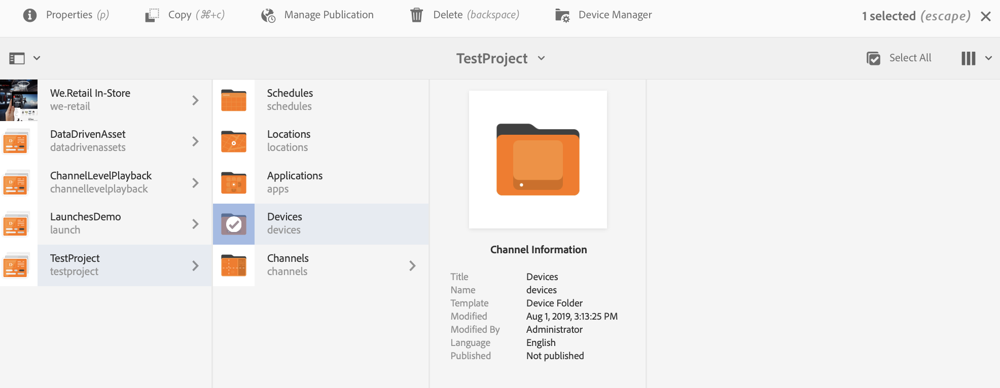

# Solución de problemas del Centro de control de dispositivos {#troubleshooting-device-control-center}

Puede supervisar y solucionar problemas de rendimiento de la actividad y el dispositivo del Reproductor de AEM Screens mediante el panel de dispositivos. Esta página proporciona información sobre cómo monitorizar y solucionar problemas de rendimiento percibidos para el reproductor de Screens y los dispositivos asignados.

## Monitorización y solución de problemas desde el Centro de control de dispositivos {#monitor-and-troubleshoot-from-device-control-center}

Puede monitorizar la actividad y, por lo tanto, solucionar problemas del reproductor de AEM Screens mediante el panel del dispositivo.

### Tablero de dispositivo {#device-dashboard}

Siga los pasos a continuación para navegar al panel de dispositivos:

1. Vaya al panel de dispositivos desde el proyecto, por ejemplo, ***Proyecto de prueba*** > ***Dispositivos***.

   Haga clic en **Dispositivos** y **Administrador de dispositivos** en la barra de acciones.

   

1. La lista muestra los dispositivos asignados y no asignados, como se muestra en la figura siguiente.

   

1. Haga clic en el dispositivo (**NuevoDispositivoDePrueba**) y, a continuación, haga clic en **Tablero** en la barra de acciones.

   

1. La página muestra la información del dispositivo, la actividad y los detalles del dispositivo que le permiten supervisar sus actividades y funciones.

   

### Monitorizar actividad del dispositivo {#monitor-device-activity}

El panel **Actividad** muestra el último ping del reproductor AEM Screens con la marca de tiempo. El último ping corresponde a la última vez que el dispositivo contactó con el servidor.

Además, haga clic en **Recopilar registros** en la esquina superior derecha del panel **Actividad** para ver los registros de su reproductor.

### Actualizar detalles del dispositivo {#update-device-details}

Compruebe el panel **Detalles del dispositivo** para poder ver la IP del dispositivo, el uso del almacenamiento, la versión del firmware y el tiempo de actividad del reproductor de su dispositivo.

Además, haga clic en **Borrar caché** y **Actualizar** para borrar la caché de su dispositivo y actualizar la versión de [firmware](screens-glossary.md) respectivamente desde este panel.

Además, haga clic en **...** en la esquina superior derecha del panel **Detalles del dispositivo** para reiniciar o actualizar el estado del reproductor.

### Actualizar información del dispositivo {#update-device-information}

Compruebe el panel **INFORMACIÓN DEL DISPOSITIVO**. Aquí puede ver la actualización de la configuración, el modelo del dispositivo, el sistema operativo del dispositivo y la información del shell.

Además, haga clic en (**...**) en la esquina superior derecha del panel Información del dispositivo para ver las propiedades o actualizar el dispositivo.

Haga clic en **Propiedades** para poder ver el cuadro de diálogo **Propiedades del dispositivo**. Puede editar el título del dispositivo o elegir la opción para las actualizaciones de configuración como **Manual** o **Automático**.

>[!NOTE]
>
>Para obtener más información acerca de los eventos asociados con las actualizaciones automáticas o manuales del dispositivo, consulte la sección ***Actualizaciones automáticas frente a Actualizaciones manuales desde el panel de dispositivos*** en [Administración de canales](managing-channels.md).

### Ver captura de pantalla del reproductor {#view-player-screenshot}

Puede ver la captura de pantalla del reproductor desde el dispositivo desde el panel **CAPTURA DE PANTALLA DEL REPRODUCTOR**.

Haga clic en (**...**) en la esquina superior derecha del panel Captura de pantalla del reproductor y haga clic en **Actualizar captura de pantalla** para ver la instantánea del reproductor en ejecución.

### Administrar preferencias {#manage-preferences}

El panel **PREFERENCIAS** permite al usuario cambiar las preferencias de **IU de administración**, **conmutador de canal** y **depuración remota** para el dispositivo.

>[!NOTE]
>Para obtener más información sobre estas opciones, consulte [Reproductor de AEM Screens](working-with-screens-player.md).

Además, haz clic en **Configuración** en la esquina superior derecha para actualizar las preferencias del dispositivo. Puede actualizar las siguientes preferencias:

* **URL del servidor**
* **Resolución**
* **Programación de reinicio**
* **Número máximo de archivos de registro para conservar**
* **Nivel de registro**

>[!NOTE]
>Puede hacer clic en cualquiera de los siguientes niveles de registro:
>* **Disable**
>* **Depurar**
>* **Información**
>* **Advertencia**
>* **Error**

## Solucionar problemas de configuración de OSGi {#troubleshoot-osgi-settings}

Active el referente vacío para permitir que el dispositivo publique datos en el servidor. Por ejemplo, si la propiedad referrer vacía está deshabilitada, el dispositivo no podrá devolver una captura de pantalla.

Actualmente, algunas de estas características solo están disponibles si el *Filtro de referente de Apache Sling Permitir vacío* está habilitado en la configuración de OSGi. Es posible que el tablero muestre una advertencia indicando que la configuración de seguridad puede impedir que funcionen algunas de estas características.

Siga los pasos a continuación para habilitar el Filtro de referente de Apache Sling Permitir vacío

1. Vaya a **Configuración de la consola web de Adobe Experience Manager**, es decir, `https://localhost:4502/system/console/configMgr/org.apache.sling.security.impl.ReferrerFilter`.
1. Marque la opción **allow.empty**.
1. Haga clic en **Guardar**.

### Recomendaciones {#recommendations}

En la siguiente sección se recomienda monitorizar los vínculos de red, los servidores y los reproductores para comprender el estado y reaccionar ante los problemas.

AEM proporciona una monitorización integrada para:

* *Heartbeat* cada 5 segundos para indicar que el Reproductor de AEM Screens está en funcionamiento.
* *Captura de pantalla* del reproductor que muestra lo que se muestra en el reproductor.
* La versión *Firmware del reproductor AEM Screens* está instalada en el reproductor.
* *Espacio de almacenamiento gratuito* en el reproductor.

Recommendations para monitorado remoto con software de terceros:

* Uso de CPU en reproductores.
* Compruebe si el proceso del Reproductor de AEM Screens se está ejecutando.
* Reinicio o reinicio remoto del Reproductor.
* Notificaciones en tiempo real.

Se recomienda implementar el hardware y el sistema operativo del Reproductor de forma que permita el inicio de sesión remoto para diagnosticar problemas y reiniciar el Reproductor.

#### Otros recursos {#additional-resources}

Consulte [Configuración y solución de problemas de la reproducción de vídeo](troubleshoot-videos.md) si desea depurar y solucionar problemas con la reproducción de vídeos en su canal.
