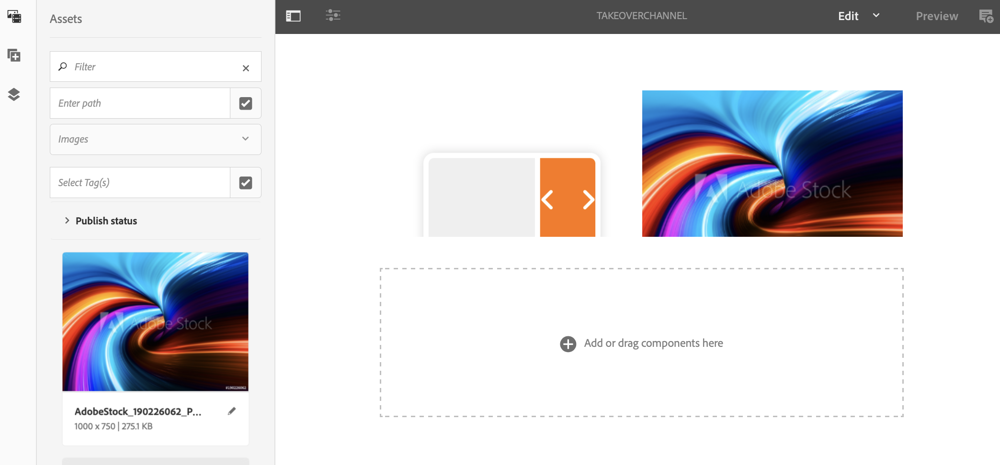
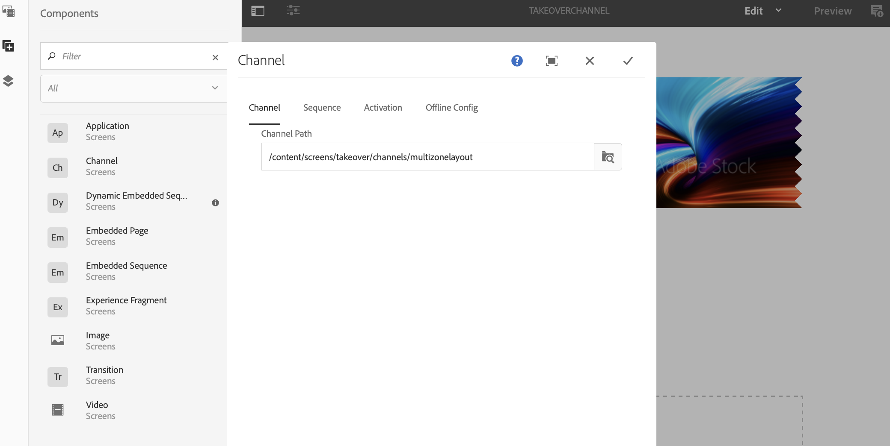

# Transición de varias zonas a una sola zona {#multizone-to-singlezone-use-case}

## Descripción de caso de uso {#use-case-description}

En esta sección se describe un ejemplo de uso que hace hincapié en cómo configurar un canal de diseño de varias zonas que alterne con un canal de diseño de una sola zona. El canal de varias zonas tiene una secuenciación de recursos de imagen/vídeo y muestra cómo se puede configurar un proyecto que alterne de varias zonas a una sola zona y viceversa.

### Condiciones previas {#preconditions}

Antes de comenzar este caso de uso, asegúrese de comprender cómo:

* **[Crear y administrar canales](managing-channels.md)**
* **[Crear y administrar ubicaciones](managing-locations.md)**
* **[Crear y administrar programaciones](managing-schedules.md)**
* **[Registro de dispositivos](device-registration.md)**

### Actores principales {#primary-actors}

Autores de contenido

## Configuración del proyecto {#setting-up-the-project}

Siga los pasos a continuación para configurar un proyecto:

1. Cree un proyecto de AEM Screens con el nombre **TakoverLoop**, como se muestra a continuación.

   

1. **Creación de un canal de pantallas de varias zonas**

   1. Seleccione la carpeta **Channels** y haga clic en **Create** en la barra de acciones para abrir el asistente y crear un canal.
   1. Seleccione **Canal de pantalla dividida de barras izquierda-L** en el asistente y cree el canal denominado **MultiZoneLayout**.
   1. Añada contenido al canal. Arrastre y suelte los recursos en cada una de las zonas. El siguiente ejemplo muestra un canal **MultiZoneLayout** que consta de un vídeo, una imagen y un banner de texto (en una secuencia integrada), como se muestra a continuación.

   

   >[!NOTE]
   >
   >Para obtener más información sobre la creación de un diseño de varias zonas en el canal, consulte [Diseño de varias zonas](multi-zone-layout-aem-screens.md).

1. Cree otro canal denominado **TakoverChannel** en la carpeta **Channels**.

   

1. Haga clic en **Editar** en la barra de acciones para agregar contenido a este canal. Agregue a este canal un componente **Canal** y un recurso de imagen al que desee cambiar, como se muestra en la figura siguiente:

   

1. Abra la configuración del componente Canal y señale al canal **MultiZoneLayout** que ha creado en *paso 2*.

   

1. Establezca la duración del campo **Secuencia** en **10000 ms**.

   

1. Del mismo modo, abra la configuración de la imagen (recurso que ha agregado) y establezca su duración desde el campo **Secuencia** a **3000 ms**.

   

## Comprobación de la vista previa {#checking-the-preview}

Puede ver el resultado deseado desde el reproductor o simplemente haciendo clic en **Preview** desde el editor.

El resultado demostrará cómo se reproduce un diseño de varias zonas para *1000 ms* y luego cambia al diseño de una sola zona que tiene una duración de reproducción de *3000 ms* y luego vuelve al diseño de varias zonas.

>[!VIDEO](https://video.tv.adobe.com/v/30366)

>[!NOTE]
>
>Puede personalizar la transición de canal (de multizona a diseño de una sola zona o viceversa) según sus necesidades.