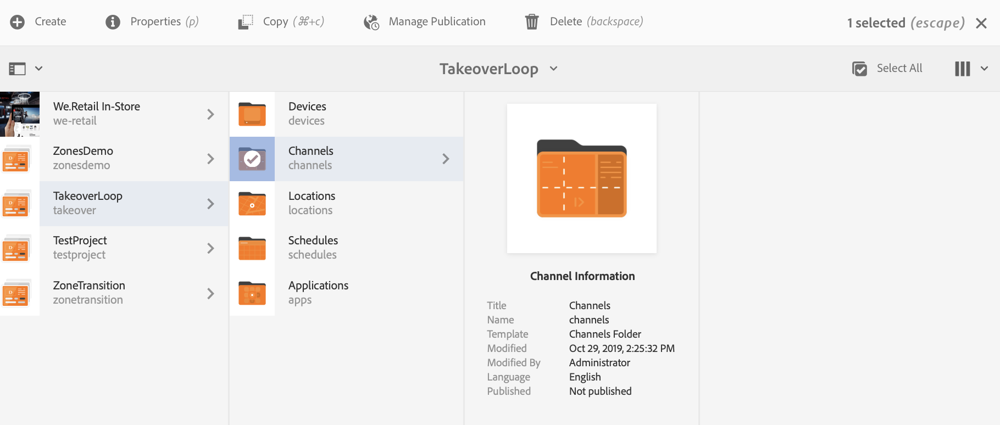
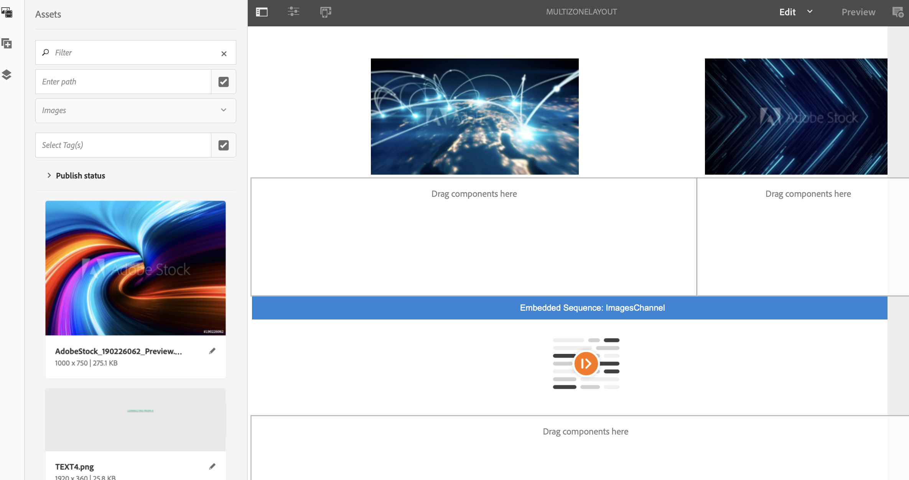
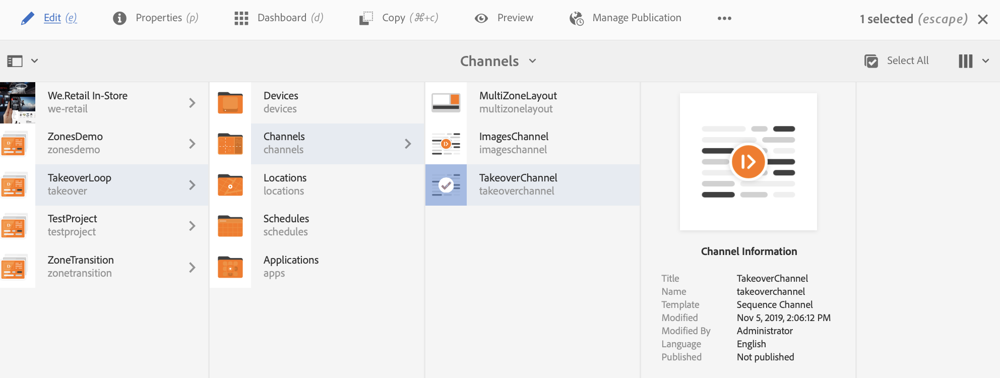
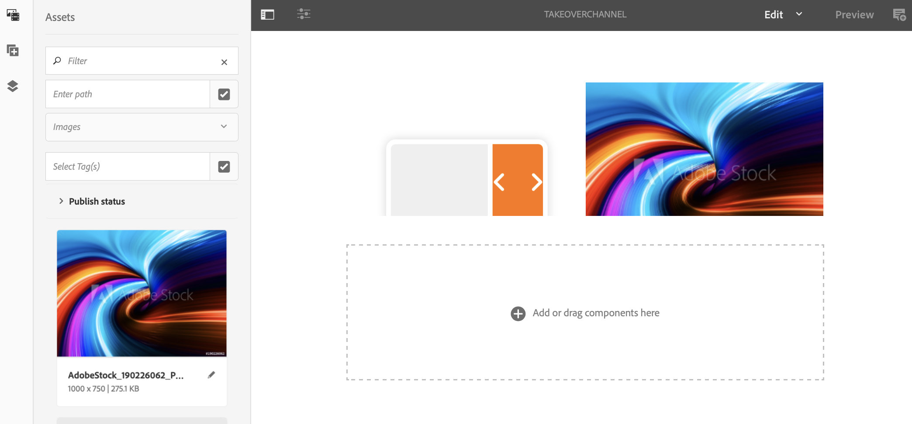
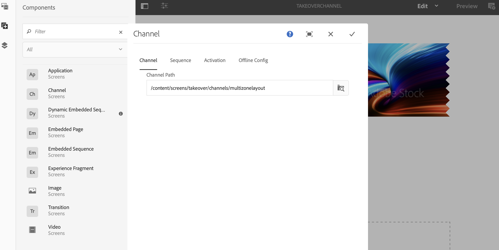
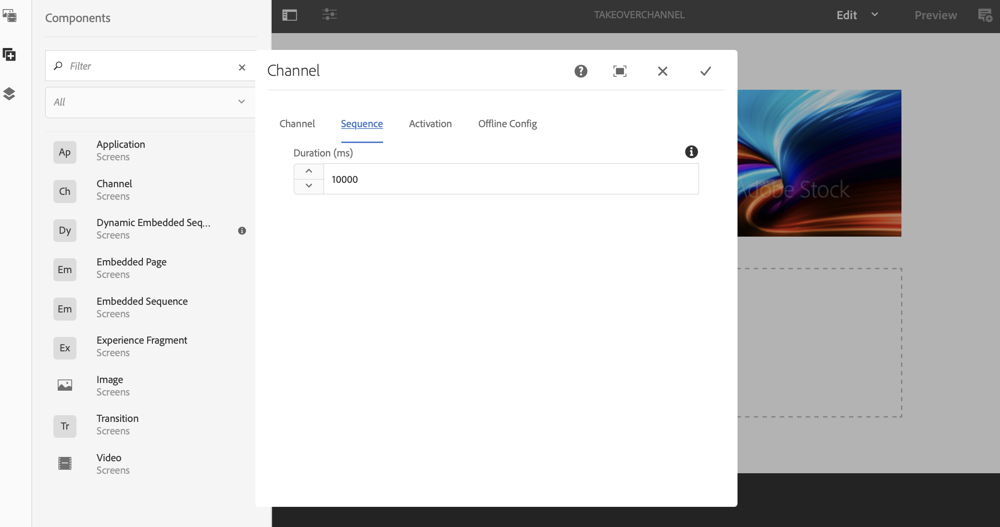
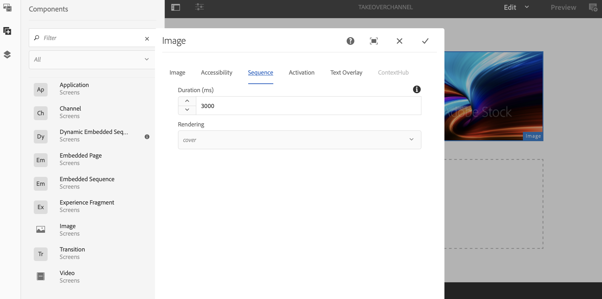

# Transición de varias zonas a una sola zona {#multizone-to-singlezone-use-case}

## Descripción del caso de uso {#use-case-description}

>[!IMPORTANT]
>Este contenido es válido para AEM on-premise/AMS (AEM 6.5LTS y AEM 6.5). Para el contenido de AEM as a Cloud Service Screens, consulte la [guía de AEM as a Cloud Service](https://experienceleague.adobe.com/en/docs/experience-manager-cloud-service/content/screens-as-cloud-service/overview/introduction).

En esta sección se describe un ejemplo de uso que hace hincapié en cómo configurar un canal de diseño de varias zonas que alterna con un canal de diseño de una sola zona. El canal de varias zonas tiene recursos de imagen/vídeo de secuenciación y muestra cómo puede configurar un proyecto que alterna entre varias zonas y una sola zona, y a la inversa.

### Condiciones previas {#preconditions}

Antes de comenzar este caso de uso, asegúrese de comprender cómo:

* **[Crear y administrar canales](managing-channels.md)**
* **[Crear y administrar ubicaciones](managing-locations.md)**
* **[Crear y administrar horarios](managing-schedules.md)**
* **[Registro de dispositivo](device-registration.md)**

### Actores principales {#primary-actors}

Autores de contenido

## Configuración del proyecto {#setting-up-the-project}

Siga los pasos a continuación para configurar un proyecto:

1. Cree un proyecto de AEM Screens llamado **TakeoverLoop**, como se muestra a continuación.

   

1. **Creación de un canal de Screens de varias zonas**

   1. Haga clic en la carpeta **Canales**, luego en **Crear** en la barra de acciones y abra el asistente para crear un canal.
   1. Haga clic en **Canal de pantalla dividida de barra izquierda** en el asistente y cree el canal con el título **MultiZoneLayout**.
   1. Añada contenido al canal. Arrastre y suelte los recursos en cada una de las zonas. El ejemplo siguiente muestra un canal **MultiZoneLayout** que consta de un vídeo, una imagen y un titular de texto (en una secuencia incrustada), como se muestra a continuación.

   

   >[!NOTE]
   >
   >Para obtener más información sobre cómo crear un diseño de varias zonas en el canal, consulte [Diseño de varias zonas](multi-zone-layout-aem-screens.md).

1. Cree otro canal con el título **TakeoverChannel** en su carpeta **Channels**.

   

1. Haz clic en **Editar** en la barra de acciones para agregar contenido a este canal. Agregue un componente **Canal** y un recurso de imagen a los que desee cambiar para este canal, como se muestra en la figura siguiente:

   

1. Abra la configuración del componente Canal y diríjala al canal **MultiZoneLayout** que creó en el *paso 2*.

   

1. Establezca la duración del campo **Secuencia** en **10000 milisegundos**.

   

1. Del mismo modo, abra la configuración de la imagen (recurso que agregó) y establezca su duración del campo **Secuencia** en **3000 milisegundos**.

   

## Comprobación de la previsualización {#checking-the-preview}

Puedes ver la salida deseada desde el reproductor o simplemente seleccionando **Vista previa** en el editor.

El resultado muestra cómo se reproduce un diseño de varias zonas durante *10000 milisegundos*. A continuación, cambia a un diseño de zona única que tiene una duración de reproducción de *3000 milisegundos*. Y finalmente, vuelve al diseño de varias zonas.

>[!VIDEO](https://video.tv.adobe.com/v/30366)

>[!NOTE]
>
>Puede personalizar la transición de canal (del diseño de varias zonas a una sola zona o a la inversa) según sus necesidades.
