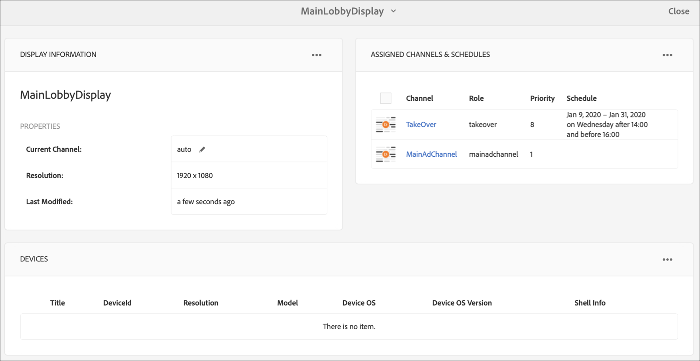

# Canal de captura permanente {#perpetual-takeover-channel}

En la página siguiente se muestra un caso de uso que hace hincapié en la configuración de un proyecto para crear un canal TakeOver perpetuo que se reproduce para un día y hora específicos de forma continua.

## Descripción de caso de uso {#use-case-description}

Este caso de uso explica cómo crear un canal que *toma el control* del canal de reproducción normal para una visualización o un grupo de pantallas. La toma de control tendrá lugar perpetuamente durante un día y hora específicos.
Por ejemplo, hay un canal TakeOver perpetuo que se reproduce todos los viernes de 9:00 a 10:00. Durante este tiempo, no debería reproducirse ningún otro canal. En el siguiente ejemplo se muestra la creación de un canal de adquisición perpetua que se reproduce y permite que el contenido se reproduzca cada miércoles durante 2 horas desde las 14:00 hasta las 16:00.

### Condiciones previas {#preconditions}

Antes de comenzar este caso de uso, asegúrese de comprender cómo:

* **[Crear y administrar canales](managing-channels.md)**
* **[Crear y administrar ubicaciones](managing-locations.md)**
* **[Crear y administrar programaciones](managing-schedules.md)**
* **[Registro de dispositivos](device-registration.md)**

### Actores principales {#primary-actors}

Autores de contenido

## Configuración del proyecto {#setting-up-the-project}

Siga los pasos a continuación para configurar un proyecto:

**Configuración de los canales y visualización**

1. Cree un proyecto de AEM Screens titulado como **PerpetualTake**, como se muestra a continuación.

   

1. Cree un **MainAdChannel** en la carpeta **Canales** .

   

1. Seleccione **MainAdChannel** y haga clic en **Editar** en la barra de acciones. Arrastre y suelte algunos recursos (imágenes, vídeos, secuencias incrustadas) en el canal.

   

   >[!NOTE]
   >En este ejemplo, **MainAdChannel** muestra un canal de secuencia que reproduce el contenido de forma continua.

1. Cree un canal **TakeOver** que se haga cargo del contenido en **MainAdChannel** y se reproducirá todos los miércoles de 2:00 a 16:00.

1. Seleccione la opción **Realizar** y haga clic en **Editar** en la barra de acciones. Arrastre y suelte algunos recursos en el canal. El siguiente ejemplo muestra una imagen de zona única agregada a este canal.

   

1. Configure una ubicación y una visualización para los canales. Por ejemplo, la siguiente ubicación **MainLobby** y mostrar **MainLobbyDisplay** está configurada para este proyecto.

   

**Asignación de canales a una visualización**

1. Seleccione **MainLobbyDisplay** en la carpeta **Ubicaciones** . Haga clic en **Asignar canal** en la barra de acciones para abrir el cuadro de diálogo Asignación **de canal** .

   >[!NOTE]
   >Para obtener información sobre cómo asignar un canal a una pantalla, consulte Asignación **[de canal](channel-assignment.md)**.

1. Rellene los campos (Ruta **de** canal, **Prioridad** y Eventos **** admitidos) desde el cuadro de diálogo Asignación **de** canal y haga clic en **Guardar** **** para asignar laPrincipalAdChannel a la pantalla.

   * **Ruta** de canal: Seleccione la ruta al canal **MainAdChannel**
   * **Prioridad**: Establezca la prioridad de este canal como 1.
   * **Eventos** admitidos: Seleccione la **carga** inicial y la pantalla **de inactividad**.
   

1. Seleccione la pantalla **Realizar** en la carpeta **Ubicaciones** . Haga clic en **Asignar canal** en la barra de acciones para asignar el canal de adquisición.

1. Para asignar el canal **Toma** del control a la pantalla en un momento programado y completar los siguientes campos desde el cuadro de diálogo Asignación **de** canal y hacer clic en **Guardar**:

   * **Ruta** de canal: Seleccione la ruta del canal **TakeOver**
   * **Prioridad**: Establezca la prioridad de este canal mayor que **MainAdChannel**. Por ejemplo, la prioridad establecida en este ejemplo es 8.
   * **Eventos** admitidos: Seleccione la **Pantalla** inactiva y el **Temporizador**.
   * **Programar**: Introduzca el texto de la programación en la que desea que este canal ejecute la visualización. El texto de la **programación** mencionada en este ejemplo es *miércoles después de las 14:00 y antes de las 16:00*.
      >[!NOTE]
      >Para obtener más información sobre las expresiones que puede agregar a la **programación**, consulte la sección Expresiones [de](#example-expressions) ejemplo que aparece a continuación
   * **activo desde**: Fecha y hora de inicio.
   * **activa hasta**: Fecha y hora de finalización.
   Por ejemplo, el texto de **Programar** y **activo desde** y **activo hasta** la fecha y la hora aquí permite que el contenido se reproduzca cada miércoles de 14:00 a 16:00.

   

   Vaya a la pantalla desde **Realizar** —> **Ubicaciones** —> **MainLobby** —> **MainLobbyDisplay** y haga clic en **Tablero** desde la barra de acciones para ver los canales asignados con sus prioridades, como se muestra a continuación.

   >[!NOTE]
   >Es obligatorio establecer la prioridad del canal de adquisición como la más alta.

   Ahora, el canal **TakeOver** se hará cargo del **MainAdChannel** a las 2:00 pm durante dos horas hasta las 4:00 pm de cada miércoles y reproducirá su contenido desde el 9 de enero de 2020 hasta el 31 de enero de 2020.

### Expresiones de ejemplo {#example-expressions}

En la tabla siguiente se resumen algunas expresiones de ejemplo que se pueden agregar a la programación al asignar un canal a una visualización.

| **Expresión** | **Interpretación** |
|---|---|
| antes de las 8:00 am | el canal se reproduce antes de las 8:00 am todos los días |
| después de las 2:00 pm | el canal se reproduce después de las 2:00 pm todos los días |
| después de las 12:15 y antes de las 12:45 | el canal se reproduce después de las 12:15 todos los días durante 30 minutos |
| antes de las 12:15 también después de las 12:45 | el canal se reproduce antes de las 12:15 todos los días y después de las 12:45 |
| el 1 de enero después de las 14:00 también el 2 de enero también el 3 de enero antes de las 3:00 am | el canal empieza a reproducirse después de las 12:45 del 1 de enero, continúa reproduciéndose todo el día el 2 de enero hasta las 3:00 am del 3 de enero |
| del 1 al 2 de enero después de las 2:00 pm también del 2 al 3 de enero antes de las 3:00 am | el canal comienza el reproductor después de las 12:45 pm del 1 de enero, continúa reproduciéndose hasta las 3:00 am del 2 de enero, luego comienza nuevamente el 2 de enero a las 12:45 pm y continúa reproduciéndose hasta las 3:00 am del 3 de enero |

>[!NOTE]
>También se puede usar notación de hora __ militar (es decir, 14:00) en lugar de notación de am/pm (es decir, 2:00 pm).
