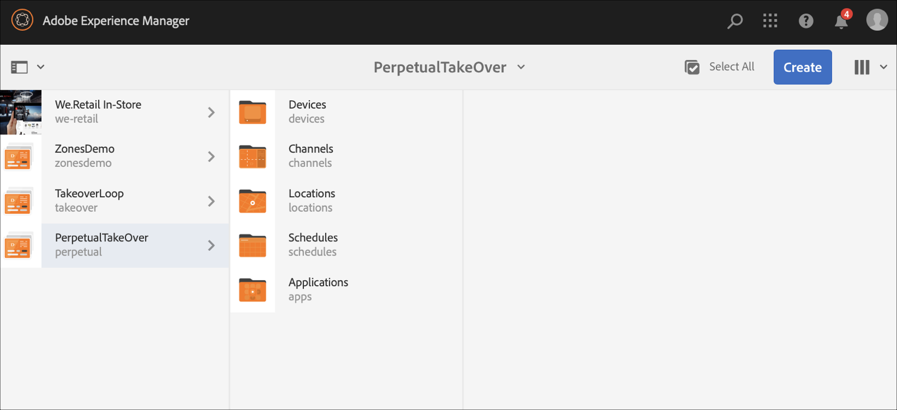
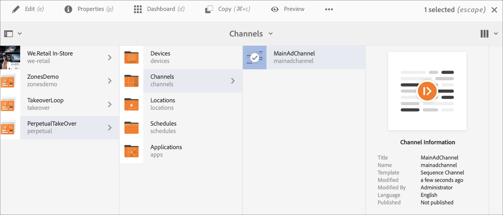
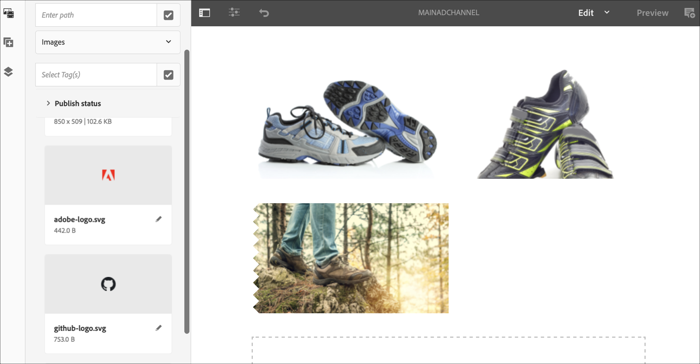
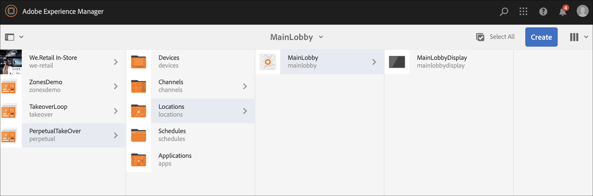

# Canal de adquisición perpetua {#perpetual-takeover-channel}

>[!IMPORTANT]
>Este contenido es válido para AEM on-premise/AMS (AEM 6.5LTS y AEM 6.5). Para el contenido de AEM as a Cloud Service Screens, consulte la [guía de AEM as a Cloud Service](https://experienceleague.adobe.com/en/docs/experience-manager-cloud-service/content/screens-as-cloud-service/overview/introduction).

La siguiente página muestra un caso de uso que hace hincapié en la configuración de un proyecto sobre cómo crear un canal de aceptación perpetua que se reproduzca para una hora específica día y hora continuamente.

## Descripción del caso de uso {#use-case-description}

Este caso de uso explica cómo crear un canal que *tome el control de* del canal de reproducción normal para una pantalla o un grupo de pantallas. La adquisición se produce para un día y hora específicos de forma perpetua.Por ejemplo, hay un canal TakeOver perpetuo que se reproduce todos los viernes de 9:00 a.m. a 10:00 a.m. Durante este tiempo, no se debe reproducir ningún otro canal. El siguiente ejemplo muestra la creación de un canal de adquisición perpetuo que permite que el contenido se reproduzca todos los miércoles durante dos horas, de 2:00 p.m. a 4:00 p.m.

### Condiciones previas {#preconditions}

Antes de comenzar este caso de uso, asegúrese de comprender cómo:

* **[Crear y administrar canales](managing-channels.md)**
* **[Crear y administrar ubicaciones](managing-locations.md)**
* **[Crear y administrar horarios](managing-schedules.md)**
* **[Registro de dispositivo](device-registration.md)**

### Actores principales {#primary-actors}

Autores de contenido

## Configuración del proyecto {#setting-up-the-project}

Siga los pasos a continuación para configurar un proyecto:

**Configurando los canales y la pantalla**

1. Cree un proyecto de AEM Screens con el título **PerpetualTakeOver**, como se muestra a continuación.

   

1. Cree un **MainAdChannel** en la carpeta **Channels**.

   

1. Haga clic en **MainAdChannel** y luego en **Editar** en la barra de acciones. Arrastre y suelte algunos recursos (imágenes, vídeos, secuencias incrustadas) en su canal.

   

   >[!NOTE]
   >El **MainAdChannel** de este ejemplo muestra un canal de secuencia que reproduce contenido continuamente.

1. Cree un canal **TakeOver** que se haga cargo del contenido de **MainAdChannel** y se reproduzca todos los miércoles de las 2:00 a las 4:00 de la tarde.

1. Haga clic en **TakeOver** y luego en **Editar** en la barra de acciones. Arrastre y suelte algunos recursos en su canal. El siguiente ejemplo muestra una imagen de zona única agregada a este canal.

   

1. Configure una ubicación y una visualización para sus canales. Por ejemplo, la siguiente ubicación **MainLobby** y la pantalla **MainLobbyDisplay** están configuradas para este proyecto.

   

**Asignación de canales a una pantalla**

1. Haga clic en la pantalla **MainLobbyDisplay** de la carpeta **Ubicaciones**. Haga clic en **Asignar canal** en la barra de acciones para abrir el cuadro de diálogo **Asignación de canal**.

   >[!NOTE]
   >Para obtener información sobre cómo asignar un canal a una pantalla, consulte **[Asignación de canales](channel-assignment.md)**.

1. Rellene los campos (**Ruta de canal**, **Prioridad** y **Eventos admitidos**) del cuadro de diálogo **Asignación de canal** y haga clic en **Guardar** para asignar **MainAdChannel** a la pantalla.

   * **Ruta del canal**: haga clic en la ruta al canal **MainAdChannel**
   * **Prioridad**: establezca la prioridad de este canal como 1.
   * **Eventos admitidos**: haga clic en **Carga inicial** y en **Pantalla inactiva**.

   

1. Haga clic en la pantalla **TakeOver** de la carpeta **Ubicaciones**. Haga clic en **Asignar canal** en la barra de acciones para que pueda asignar el canal de adquisición.

1. Asignando el canal **TakeOver** a la pantalla a una hora programada. A continuación, rellene los campos siguientes del cuadro de diálogo **Asignación de canal** y seleccione **Guardar**:

   * **Ruta de canal**: haga clic en la ruta al canal **TakeOver**
   * **Prioridad**: establezca una prioridad de este canal mayor que **MainAdChannel**. Por ejemplo, la prioridad establecida en este ejemplo es 8.
   * **Eventos admitidos**: haga clic en **Pantalla inactiva** y **Temporizador**.
   * **Programación**: escriba el texto de la programación que desea que este canal ejecute en la pantalla. El texto de **Horario** mencionado en este ejemplo es *el miércoles después de las 14:00 y antes de las 16:00*.

     >[!NOTE]
     >Para obtener más información sobre las expresiones que puede agregar a **Horario**, consulte la sección [Expresiones de ejemplo](#example-expressions) a continuación.
   * **activo desde**: Fecha y hora de inicio.
   * **activo hasta el**: fecha y hora de finalización.

     Por ejemplo, el texto de **Horario** y **activo desde** y **activo hasta** aquí permite que el contenido se reproduzca todos los miércoles desde las 2:00 p.m. hasta las 4:00 p.m..

     

     Vaya a la pantalla de **TakeOver** > **Locations** > **MainLobby** > **MainLobbyDisplay** y, a continuación, haga clic en **Tablero** en la barra de acciones para poder ver los canales asignados con sus prioridades, como se muestra a continuación.

     >[!NOTE]
     >Es obligatorio establecer la prioridad del canal de adquisición como la más alta.

     
Ahora, el canal **TakeOver** se hace cargo del canal **MainAdChannel** a las 2:00 p.m. durante dos horas hasta las 4:00 p.m. todos los miércoles y reproduce su contenido desde el 09 de enero de 2020 hasta el 31 de enero de 2020.

## Expresiones de ejemplo {#example-expressions}

En la tabla siguiente se resumen algunas expresiones de ejemplo que se pueden añadir a la programación al asignar un canal a una visualización.

| **Expresión** | **Interpretación** |
|---|---|
| antes de las 8:00 a.m. | el canal se reproduce antes de las 8:00 a.m. todos los días |
| después de las 2:00 p.m. | el canal se reproduce después de las 2:00 p.m. todos los días |
| después de 12:15 y antes de 12:45 | el canal se reproduce después de las 12:15 p.m. todos los días durante 30 minutos |
| antes de 12:15 también después de 12:45 | el canal se reproduce antes de las 12:15 p.m. todos los días y después de las 12:45 p.m. |
| el primer día de enero después de las 2:00 p.m., también el segundo día de enero y también el tercer día de enero antes de las 3:00 a.m. | el canal comienza a reproducirse después de las 2:00 p.m. del 1 de enero y continúa reproduciendo durante todo el día del 2 de enero hasta las 3:00 a.m. del 3 de enero |
| del 1 al 2 de enero después de las 2:00 de la tarde, también del 2 al 3 de enero antes de las 3:00 de la mañana. | el canal inicia el reproductor después de las 2:00 p.m. del 01 de enero, continúa reproduciendo hasta las 3:00 a.m. del 02 de enero, luego comienza nuevamente el 02 de enero a las 2:00 p.m. y continúa reproduciendo hasta las 3:00 a.m. del 03 de enero |

>[!NOTE]
>
>También puede usar la notación _tiempo militar_ (14:00) en lugar de *A.M./P.M.* (2:00 P.M.).

