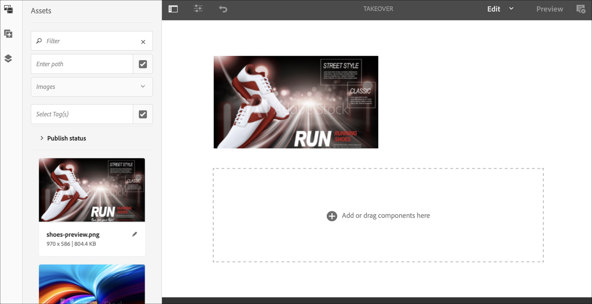

# Canal de adquisición perpetua {#perpetual-takeover-channel}

La siguiente página muestra un caso de uso que hace hincapié en la configuración de un proyecto sobre cómo crear un canal de aceptación perpetua que se reproduzca para una hora específica día y hora continuamente.

## Descripción del caso de uso {#use-case-description}

Este caso de uso explica cómo crear un canal que *toma el control* del canal de reproducción normal para una pantalla o grupo de pantallas. La adquisición se produce para un día y hora específicos de forma perpetua.
Por ejemplo, hay un canal de adquisición perpetua que se reproduce todos los viernes de 9:00 a.m. a 10:00 a.m. Durante este tiempo, no se debe reproducir ningún otro canal. El siguiente ejemplo muestra la creación de un canal de adquisición perpetuo que permite que el contenido se reproduzca todos los miércoles durante dos horas, de 2:00 p. m. a 4:00 p. m.

### Condiciones previas {#preconditions}

Antes de comenzar este caso de uso, asegúrese de comprender cómo:

* **[Crear y administrar canales](managing-channels.md)**
* **[Crear y administrar ubicaciones](managing-locations.md)**
* **[Crear y administrar horarios](managing-schedules.md)**
* **[Registro de dispositivos](device-registration.md)**

### Actores principales {#primary-actors}

Autores de contenido

## Configuración del proyecto {#setting-up-the-project}

Siga los pasos a continuación para configurar un proyecto:

**Configuración de los canales y la visualización**

1. Cree un proyecto de AEM Screens con el título **PerpetualTakeOver**, como se muestra a continuación.

   

1. Crear un **MainAdChannel** en el **Canales** carpeta.

   

1. Haga clic en **MainAdChannel** y haga clic en **Editar** de la barra de acciones. Arrastre y suelte algunos recursos (imágenes, vídeos, secuencias incrustadas) en su canal.

   

   >[!NOTE]
   >El **MainAdChannel** en este ejemplo se muestra un canal de secuencia que reproduce contenido de forma continua.

1. Crear un **TakeOver** canal que se hace cargo del contenido en **MainAdChannel** y toca todos los miércoles de 2:00 p.m. a 4:00 p.m.

1. Haga clic en **TakeOver** y haga clic en **Editar** de la barra de acciones. Arrastre y suelte algunos recursos en su canal. El siguiente ejemplo muestra una imagen de zona única agregada a este canal.

   

1. Configure una ubicación y una visualización para sus canales. Por ejemplo, la siguiente ubicación **MainLobby** y visualización **MainLobbyDisplay** están configurados para este proyecto.

   

**Asignación de canales a una pantalla**

1. Haga clic en la pantalla **MainLobbyDisplay** desde el **Ubicaciones** carpeta. Clic **Asignar canal** de la barra de acciones para poder abrir **Asignación de canales** Cuadro de diálogo.

   >[!NOTE]
   >Para obtener información sobre cómo asignar un canal a una pantalla, consulte **[Asignación de canales](channel-assignment.md)**.

1. Rellene los campos (**Ruta de canal**, **Prioridad**, y **Eventos admitidos**) desde el **Asignación de canales** y haga clic en **Guardar** para asignar el **MainAdChannel** a la pantalla.

   * **Ruta de canal**: haga clic en la ruta al **MainAdChannel** canal
   * **Prioridad**: establezca la prioridad de este canal como 1.
   * **Eventos admitidos**: haga clic en **Carga inicial** y **Pantalla inactiva**.

   

1. Haga clic en la pantalla **TakeOver** desde el **Ubicaciones** carpeta. Clic **Asignar canal** desde la barra de acciones para poder asignar el canal de adquisición.

1. Asignación de los **TakeOver** canal a la pantalla a una hora programada. A continuación, rellene los campos siguientes desde la variable **Asignación de canales** y seleccionar. **Guardar**:

   * **Ruta de canal**: haga clic en la ruta al **TakeOver** canal
   * **Prioridad**: establezca la prioridad de este canal en mayor que **MainAdChannel**. Por ejemplo, la prioridad establecida en este ejemplo es 8.
   * **Eventos admitidos**: haga clic en **Pantalla inactiva** y **Temporizador**.
   * **Programación**: introduzca el texto de la programación que desea que este canal se ejecute en la pantalla. El texto de la **Programación** mencionado en este ejemplo es *el miércoles después de las 14:00 y antes de las 16:00*.

     >[!NOTE]
     >Para obtener más información sobre las expresiones que puede agregar al **Programación**, consulte la [Expresiones de ejemplo](#example-expressions) más abajo.
   * **activo desde**: Fecha y hora de inicio.
   * **activo hasta**: Fecha y hora de finalización.

     Por ejemplo, el texto de **Programación** y **activo desde** y **activo hasta** La fecha y la hora permiten que el contenido se reproduzca todos los miércoles de 2:00 p.m. a 4:00 p.m..

     

     Navegue hasta la pantalla desde **TakeOver** > **Ubicaciones** > **MainLobby** > **MainLobbyDisplay** A continuación, haga clic en **Tablero** en la barra de acciones, para poder ver los canales asignados con sus prioridades, como se muestra a continuación.

     >[!NOTE]
     >Es obligatorio establecer la prioridad del canal de adquisición como la más alta.

     
Ahora, la **TakeOver** El canal se hace cargo de **MainAdChannel** a las 2:00 p. m. durante dos horas hasta las 4:00 p. m. todos los miércoles y reproduce su contenido desde el 9 de enero de 2020 hasta el 31 de enero de 2020.

## Expresiones de ejemplo {#example-expressions}

En la tabla siguiente se resumen algunas expresiones de ejemplo que se pueden añadir a la programación al asignar un canal a una visualización.

| **Expresión** | **Interpretación** |
|---|---|
| antes de las 8:00 a.m. | el canal se reproduce antes de las 8:00 a.m. todos los días |
| después de las 2:00 p.m. | el canal se reproduce después de las 2:00 p.m. todos los días |
| después de las 12:15 y antes de las 12:45 | el canal se reproduce después de las 12:15 todos los días durante 30 minutos |
| antes de las 12:15 también después de las 12:45 | el canal suena todos los días antes de las 12:15 p.m. y luego también después de las 12:45 p.m. |
| el primer día de enero después de las 2:00 p.m., también el segundo día de enero y también el tercer día de enero antes de las 3:00 a.m. | el canal comienza a reproducirse después de las 2:00 p.m. del 1 de enero, continúa reproduciendo durante todo el día del 2 de enero hasta las 3:00 a.m. del 3 de enero |
| los días 1-2 de enero después de las 2:00 p.m. también los días 2-3 de enero antes de las 3:00 a.m. | el canal inicia el reproductor después de las 2:00 p.m. del 1 de enero, continúa reproduciendo hasta las 3:00 a.m. del 2 de enero, luego comienza nuevamente el 2 de enero a las 2:00 p.m. y continúa reproduciendo hasta las 3:00 a.m. del 3 de enero |

>[!NOTE]
>
>También puede utilizar _hora militar_ notación (14:00) en lugar de *A.M./P.M.* (2:00 P.M.).
